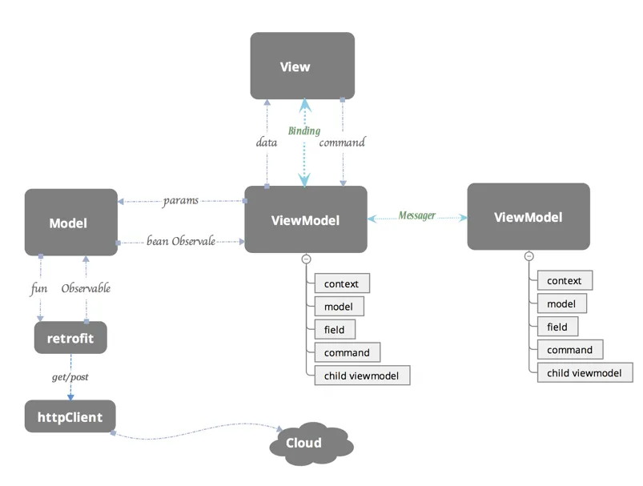
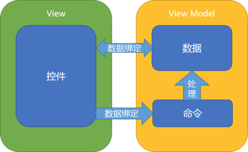
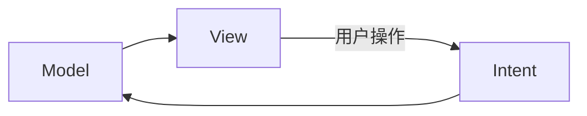

[如何构建Android MVVM 应用框架](https://tech.meituan.com/2016/11/11/android-mvvm.html)

[Android 架构漫谈-从 MVC 到 MVI (chenhe.me)](https://chenhe.me/post/android-architecture-from-mvc-to-mvi/)

[通俗易懂 Android 架构组件发展史 | KunMinX 博客](https://www.kunminx.com/2022/06/06/通俗易懂 Android 架构组件发展史/)


# MVC

MVC 由三部分组成：

- Model：对业务的建模，业务代码主要在这
- View：视图
- Controller：控制器，负责接收 UI 事件，调用 Model 并更新 UI

> 到底是 Controller 更新 View 还是 Model 更新 View 没有绝对说法。Android 上一般是 Controller 更新 View。

MVC 起源于(http)后端开发，后端的程序是比较清晰的三步走策略：接收请求、处理数据、返回结果（网页或结构化数据）。但在 Android 上业务模型显然没有那么简单，相比后端一个个独立的请求来说，应用的生命周期更是复杂，所以 MVC 模型自然也无法严格照搬，也就造成了 MVC 具体实现百花齐放（乱七八糟）的场面。

普遍认同的观点是 xml 布局文件是 View，`Activity` 之流属于 Controller。按照这个模型，我们回想一下八股文般的写法：

``` kotlin
class MainActivity: Activity() {
  override fun onCreate(savedInstanceState: Bundle?) {
    super.onCreate(savedInstanceState)
    setContentView(R.layout.activity_main)
    val data: String = model.getData()
    text.setText(data)
  }
}
```

尽管名义上 Controller 与 View 分开了：

- Activity 不负责布局，而只是加载一个布局文件。
- Activity 只负责要求 View 显示某数据，而不负责具体的渲染。

不要太理论派，事实已经证明，**在 Android 中 View 与 Controller 耦合太重**。`Activity` 中经常充斥着各种 View 的代码，这些代码又和 xml 布局文件息息相关。毫无疑问，布局文件的变更势必引发 `Activity` 的变更。

哪怕退一步，理想中如何展示数据是 View 层的工作，也就是说 Controller 只需要把数据整体丢给 View 就好，而不必指明哪里显示标题，哪里显示图片等等这些细节。随着应用复杂度的上升，几乎整个 `Activity` 都在处理 UI 的细节，远超 Controller 的职责。

**总的来说，Android 中的 Controller 对 View 的控制太细节了，从而导致耦合**。这一切的根源是 xml 布局文件作为 View 层功能太少，不足以履行所有职责。

> 后来的 View Binding 一定程度上加强了 View 层的能力，但仍然没有彻底释放 Controller 层。比如复杂的 `RecyclerView` 或 `ViewPager` 等依然需要在 Controller 层面编写大量代码。另外数据绑定本身是 MVVM 的核心思想，因此不再归为 MVC。


# MVP

如果祭出祖传的结构图，大部分人可能都难以看出 MVP (Model-View-Presenter) 与 MVC 的本质区别。


注意：究竟是 Model 还是 Presenter 来更新 View 并不属于 MVC 与 MVP 的本质区别。因为在实践上，即使采用 MVC 模型通常也是 Activity 更新 UI，而不是把 View 对象传递到 Model 层。换句话说，图中多了或少了几个箭头不重要。

除了箭头…似乎唯一的区别就是把 `Controller` 改成了 `Persenter`？果然科技以换壳为本。**MVP 与 MVC 的思想是一样的，它的目的是改进 Controller 在 Android 上的实现。因此相比 MVC，MVP 是代码结构上的变化，而不是思想。**

Android 中 MVC 的问题主要是 Controller 与 View 耦合过重，职责模糊不清。既然打不过，那就加入呗。在 MVP 中，`Activity` 正式归入 View 层，我们单独建一个类履行 Controller 的职责，为了区分，这一层叫做 `Presenter`。

现在，`Activity` 可以名正言顺地负责 View 的细节（因为它就是 View 层），而 Persenter 为了控制 View，自然需要 `Activity` 的实例。这下又开始耦合了：如果 View 层有变动，Presenter 就需要对应地更改。如果一组数据有不同的呈现方式，就得写多个 Presenter。**因此 Presenter 与 View 的通讯应该通过接口来实现**。其核心理念是通过一个抽象的View接口（不是真正的View层）将Presenter与真正的View层进行解耦。Persenter持有该View接口，对该接口进行操作，而不是直接操作View层。这样就可以把视图操作和业务逻辑解耦，从而让Activity成为真正的View层。

典型的 Presenter 实现如下（如有必要，Presenter 本身也可以定义为接口）：

~~~kotlin
class Presenter(private val iView: IView) {
  interface IView {
    fun showData(data: List<String>)
  }

  fun init() {
    val data = model.getData()
    iView.showData(data)
  }
}
~~~

这看似简单的一步让 MVP 转向了面向接口编程，自然获得了不少好处：

- 便于扩展：一组数据可以有不同的界面来显示，只需实现 `IView` 接口即可。
- 便于测试：可以创建假的 View 而不必真正部署到设备。

**个人理解，MVP 才是 Android 上真正的 MVC 实现，而所谓的 Android MVC 是在 sdk 有限、架构不发达的年代，邯郸学步强行搞出的东西。基于这个结论，Android MVC 该淘汰了，至少也得用到 MVP 才行。**

> MVP 通过把 `Activity` 合入 View 层，抽出 Controller 层来实现更明确的区分。倒过来，我们也可以把 `Activity` 变成真正的 Controller，把 View 层抽出来。这种模式也可视为 MVC 在 Android 上的更严格的实现。
>
> 例如可以创建一个根布局的子类，把 xml 中的根布局换成这个子类。子类中接收整体数据，在内部控制具体显示。大概是因为我们都尽量不想碰 `View` 吧，所以 MVP 才是更常见的选择。

但MVP也存在一些弊端：

- Presenter（以下简称P）层与View（以下简称V）层是通过接口进行交互的，接口粒度不好控制。粒度太小，就会存在大量接口的情况，使代码太过碎版化；粒度太大，解耦效果不好。同时对于UI的输入和数据的变化，需要手动调用V层或者P层相关的接口，相对来说缺乏自动性、监听性。如果数据的变化能自动响应到UI、UI的输入能自动更新到数据，那该多好！
- MVP是以UI为驱动的模型，更新UI都需要保证能获取到控件的引用，同时更新UI的时候要考虑当前是否是UI线程，也要考虑Activity的生命周期（是否已经销毁等）。
- MVP是以UI和事件为驱动的传统模型，数据都是被动地通过UI控件做展示，但是由于数据的时变性，我们更希望数据能转被动为主动，希望数据能更有活性，由数据来驱动UI。
- V层与P层还是有一定的耦合度。一旦V层某个UI元素更改，那么对应的接口就必须得改，数据如何映射到UI上、事件监听接口这些都需要转变，牵一发而动全身。如果这一层也能解耦就更好了。
- 复杂的业务同时也可能会导致P层太大，代码臃肿的问题依然不能解决。


# MVVM

细聊 MVVM (Model-View-ViewModel) 之前需要先明确一下逻辑与状态。逻辑分为业务逻辑与界面逻辑：

- 业务逻辑：例如插入数据库等与业务有关的操作。
- 界面逻辑：点击了按钮、滚动列表等。

虽然界面逻辑通常会触发业务逻辑，但这两个应该有明确的边界，这个边界往往区分开了业务状态与界面状态：

- 业务状态：需要持久化保存，至少其存在的生命的周期比较长。
- 界面状态：与界面生命周期一致。

界面状态与业务状态经常不一致。例如有一个姓名编辑框，当用户修改内容但还没保存时，界面状态就没有持久化为业务状态。反之，如果其他地方修改了数据库里的姓名，但 UI 没有及时刷新，则是更严重的不一致（可称为 bug）。

更具体来说，在传统的 Android View 体系中，界面状态分为外部与内部。例如我们从数据库读取了姓名到一个变量中，再显示到编辑框。当用户修改后，不仅界面状态与业务状态不一致，甚至外部界面状态（姓名变量）与内部界面状态（`TextView` 内部保存/显示的字符串）都不一样。

手动维护三种状态，很难确保它们的一致性，如下图所示，必须维护好 4 个事件：

~~~mermaid
graph LR
持久化存储--1-->内存--2-->界面--3-->内存--4-->持久化存储
~~~

1. 数据库改变时刷新变量。
2. 变量改变时刷新 UI。
3. UI 改变时更新变量。
4. 修改后的变量记得同步到数据库。

MVC/MVP 都没有解决这个麻烦。**MVVM 与其说是一个架构，不妨说是框架。它延续了 MVP 的分层思想，额外引入数据绑定，把上图中的 23 自动化**。

> 「架构」是一个指导思想，其具体代码通常由各位开发者自己实现。而「框架」则是写好的代码，实现了具体功能。

需要注意的是，MVVM 中的 VM 表示 ViewModel，而 Jetpack 中恰好也有一个组件叫 `ViewModel`，这俩不是一个东西。MVVM 中的 ViewModel 核心目的是实现数据绑定，其次是履行 MVP 中的 Presenter，也是标准 MVC 中 Controller 的职责。而 Jetpack 中提供的 `ViewModel` 主要实现了「在 Activity 旋转重建等场景下保留状态」的能力。**只通过自己写的 Presenter + DataBinding 就足以实现 MVVM，至于 `ViewModel` 库，因为的确实用因此普遍也会用上，但与 MVVM 没啥关系**。


MVVM是一种架构模式，而DataBinding是一个实现数据和UI绑定的框架，是构建MVVM模式的一个工具。

**View: **对应于Activity和XML，负责View的绘制以及与用户交互。 **Model: **实体模型。 **ViewModel: **负责完成View与Model间的交互，负责业务逻辑。

MVVM的目标和思想与MVP类似，利用数据绑定(Data Binding)、依赖属性(Dependency Property)、命令(Command)、路由事件(Routed Event)等新特性，打造了一个更加灵活高效的架构。

### 数据驱动

在常规的开发模式中，数据变化需要更新UI的时候，需要先获取UI控件的引用，然后再更新UI。获取用户的输入和操作也需要通过UI控件的引用。在MVVM中，这些都是通过数据驱动来自动完成的，数据变化后会自动更新UI，UI的改变也能自动反馈到数据层，数据成为主导因素。这样MVVM层在业务逻辑处理中只要关心数据，不需要直接和UI打交道，在业务处理过程中简单方便很多。

### 低耦合度

MVVM模式中，数据是独立于UI的。

数据和业务逻辑处于一个独立的ViewModel中，ViewModel只需要关注数据和业务逻辑，不需要和UI或者控件打交道。UI想怎么处理数据都由UI自己决定，ViewModel不涉及任何和UI相关的事，也不持有UI控件的引用。即便是控件改变了（比如：TextView换成EditText），ViewModel也几乎不需要更改任何代码。它非常完美的解耦了View层和ViewModel，解决了上面我们所说的MVP的痛点。

### 更新UI

在MVVM中，数据发生变化后，我们在工作线程直接修改（在数据是线程安全的情况下）ViewModel的数据即可，不用再考虑要切到主线程更新UI了，这些事情相关框架都帮我们做了。

### 团队协作

MVVM的分工是非常明显的，由于View和ViewModel之间是松散耦合的：一个是处理业务和数据、一个是专门的UI处理。所以，完全由两个人分工来做，一个做UI（XML和Activity）一个写ViewModel，效率更高。

### 可复用性

一个ViewModel可以复用到多个View中。同样的一份数据，可以提供给不同的UI去做展示。对于版本迭代中频繁的UI改动，更新或新增一套View即可。如果想在UI上做A/B Testing，那MVVM是你不二选择。

### 单元测试

有些同学一看到单元测试，可能脑袋都大。是啊，写成一团浆糊的代码怎么可能做单元测试？如果你们以代码太烂无法写单元测试而逃避，那可真是不好的消息了。这时候，你需要MVVM来拯救。

我们前面说过了，ViewModel层做的事是数据处理和业务逻辑，View层中关注的是UI，两者完全没有依赖。不管是UI的单元测试还是业务逻辑的单元测试，都是低耦合的。在MVVM中数据是直接绑定到UI控件上的（部分数据是可以直接反映出UI上的内容），那么我们就可以直接通过修改绑定的数据源来间接做一些Android UI上的测试。

通过上面的简述以及模式的对比，我们可以发现MVVM的优势还是非常明显的。虽然目前Android开发中可能真正在使用MVVM的很少，但是值得我们去做一些探讨和调研。

# 如何构建MVVM应用框架

## 如何分工

构建MVVM框架首先要具体了解各个模块的分工。接下来我们来讲解View、ViewModel、Model它们各自的职责所在。

### View

View层做的就是和UI相关的工作，我们只在XML、Activity和Fragment写View层的代码，View层不做和业务相关的事，也就是我们在Activity不写业务逻辑和业务数据相关的代码，更新UI通过数据绑定实现，尽量在ViewModel里面做（更新绑定的数据源即可），Activity要做的事就是初始化一些控件（如控件的颜色，添加RecyclerView的分割线），View层可以提供更新UI的接口（但是我们更倾向所有的UI元素都是通过数据来驱动更改UI），View层可以处理事件（但是我们更希望UI事件通过Command来绑定）。**简单地说：View层不做任何业务逻辑、不涉及操作数据、不处理数据，UI和数据严格的分开。**

### ViewModel

ViewModel层做的事情刚好和View层相反，ViewModel只做和业务逻辑和业务数据相关的事，不做任何和UI相关的事情，ViewModel 层不会持有任何控件的引用，更不会在ViewModel中通过UI控件的引用去做更新UI的事情。ViewModel就是专注于业务的逻辑处理，做的事情也都只是对数据的操作（这些数据绑定在相应的控件上会自动去更改UI）。同时DataBinding框架已经支持双向绑定，让我们可以通过双向绑定获取View层反馈给ViewModel层的数据，并对这些数据上进行操作。关于对UI控件事件的处理，我们也希望能把这些事件处理绑定到控件上，并把这些事件的处理统一化，为此我们通过BindingAdapter对一些常用的事件做了封装，把一个个事件封装成一个个Command，对于每个事件我们用一个ReplyCommand去处理就行了，ReplyCommand会把你可能需要的数据带给你，这使得我们在ViewModel层处理事件的时候只需要关心处理数据就行了，具体见**[MVVM Light Toolkit 使用指南](https://link.zhihu.com/?target=http%3A//www.jianshu.com/p/43ea7a531700)**的Command部分。再强调一遍：ViewModel 不做和UI相关的事。

### Model

Model层最大的特点是被赋予了数据获取的职责，与我们平常Model层只定义实体对象的行为截然不同。实例中，数据的获取、存储、数据状态变化都是Model层的任务。Model包括实体模型（Bean）、Retrofit的Service ，获取网络数据接口，本地存储（增删改查）接口，数据变化监听等。Model提供数据获取接口供ViewModel调用，经数据转换和操作并最终映射绑定到View层某个UI元素的属性上。

## 如何协作

关于协作，我们先来看下面的一张图：



上图反映了MVVM框架中各个模块的联系和数据流的走向，我们从每个模块一一拆分来看。那么我们重点就是下面的三个协作。

> - **ViewModel与View的协作**。
> - **ViewModel与Model的协作**。
> - **ViewModel与ViewModel的协作**。

### ViewModel与View的协作



图2中ViewModel和View是通过绑定的方式连接在一起的，绑定分成两种：一种是数据绑定，一种是命令绑定。数据的绑定DataBinding已经提供好了，简单地定义一些ObservableField就能把数据和控件绑定在一起了（如TextView的text属性），但是DataBinding框架提供的不够全面，比如说如何让一个URL绑定到一个ImageView，让这个ImageView能自动去加载url指定的图片，如何把数据源和布局模板绑定到一个ListView，让ListView可以不需要去写Adapter和ViewHolder相关的东西？这些就需要我们做一些工作和简单的封装。MVVM Light Toolkit 已经帮我们做了一部分的工作，详情可以查看**[MVVM Light Toolkit 使用指南](https://link.zhihu.com/?target=http%3A//www.jianshu.com/p/43ea7a531700)**。关于事件绑定也是一样，MVVM Light Toolkit 做了简单的封装，对于每个事件我们用一个ReplyCommand去处理就行了，ReplyCommand会把可能需要的数据带给你，这样我们处理事件的时候也只关心处理数据就行了。

由 **图 1** 中ViewModel的模块中我们可以看出ViewModel类下面一般包含下面5个部分：

> - Context （上下文）
> - Model (数据源 Java Bean)
> - Data Field （数据绑定）
> - Command （命令绑定）
> - Child ViewModel （子ViewModel）

我们先来看下示例代码，然后再一一讲解5个部分是干嘛用的：

```
//context
private Activity context;

//model（数据源 Java Bean）
private NewsService.News news;
private TopNewsService.News topNews;

//数据绑定，绑定到UI的字段（data field）
public final ObservableField<String> imageUrl = new ObservableField<>();
public final ObservableField<String> html = new ObservableField<>();
public final ObservableField<String> title = new ObservableField<>();
// 一个变量包含了所有关于View Style 相关的字段
public final ViewStyle viewStyle = new ViewStyle();


//命令绑定（command）
public final ReplyCommand onRefreshCommand = new ReplyCommand<>(() -> {    

})
public final ReplyCommand<Integer> onLoadMoreCommand = new ReplyCommand<>((itemCount) -> { 

});


//Child ViewModel
public final ObservableList<NewItemViewModel> itemViewModel = new ObservableArrayList<>();

/** * ViewStyle 关于控件的一些属性和业务数据无关的Style 可以做一个包裹，这样代码比较美观，
ViewModel 页面也不会有太多太杂的字段。 **/
public static class ViewStyle {    
   public final ObservableBoolean isRefreshing = new ObservableBoolean(true);    
   public final ObservableBoolean progressRefreshing = new ObservableBoolean(true);
}
```

### Context

Context是干嘛用的呢，为什么每个ViewModel都最好需要持了一个Context的引用呢？ViewModel不处理和UI相关的事也不操作控件，更不更新UI，那为什么要有Context呢？原因主要有以下两点：

1. 通过图1中，然后得到一个Observable，其实这就是网络请求部分。其实这就是网络请求部分，做网络请求我们必须把Retrofit Service返回的Observable绑定到Context的生命周期上，防止在请求回来时Activity已经销毁等异常，其实这个Context的目的就是把网络请求绑定到当前页面的生命周期中。
2. 在图1中，我们可以看到两个ViewModel之间的联系是通过Messenger来做，这个Messenger是需要用到Context，这个我们后续会讲解。

当然，除此以外，调用工具类、帮助类有时候需要Context做为参数等也是原因之一。

### Model （数据源）

Model是什么呢？其实就是数据源，可以简单理解是我们用JSON转过来的Bean。ViewModel要把数据映射到UI中可能需要大量对Model的数据拷贝和操作，拿Model的字段去生成对应的ObservableField然后绑定到UI（我们不会直接拿Model的数据去做绑定展示），这里是有必要在一个ViewModel保留原始的Model引用，这对于我们是非常有用的，因为可能用户的某些操作和输入需要我们去改变数据源，可能我们需要把一个Bean在列表页点击后传给详情页，可能我们需要把这个Model当做表单提交到服务器。这些都需要我们的ViewModel持有相应的Model（数据源）。

### Data Field（数据绑定）

Data Field就是需要绑定到控件上的ObservableField字段，这是ViewModel的必需品，这个没有什么好说。但是这边有一个建议：
这些字段是可以稍微做一下分类和包裹的。比如说可能一些字段是绑定到控件的一些Style属性上（如长度、颜色、大小），对于这类针对View Style的的字段可以声明一个ViewStyle类包裹起来，这样整个代码逻辑会更清晰一些，不然ViewModel里面可能字段泛滥，不易管理和阅读性较差。而对于其他一些字段，比如说title、imageUrl、name这些属于数据源类型的字段，这些字段也叫数据字段，是和业务数据和逻辑息息相关的，这些字段可以放在一块。

### Command（命令绑定）

Command（命令绑定）简言之就是对事件的处理（下拉刷新、加载更多、点击、滑动等事件处理）。我们之前处理事件是拿到UI控件的引用，然后设置Listener，这些Listener其实就是Command。但是考虑到在一个ViewModel写各种Listener并不美观，可能实现一个Listener就需要实现多个方法，但是我们可能只想要其中一个有用的方法实现就好了。更重要一点是实现一个Listener可能需要写一些UI逻辑才能最终获取我们想要的。简单举个例子，比如你想要监听ListView滑到最底部然后触发加载更多的事件，这时候就要在ViewModel里面写一个OnScrollListener，然后在里面的onScroll方法中做计算，计算什么时候ListView滑动底部了。其实ViewModel的工作并不想去处理这些事件，它专注做的应该是业务逻辑和数据处理，如果有一个东西不需要你自己去计算是否滑到底部，而是在滑动底部自动触发一个Command，同时把当前列表的总共的item数量返回给你，方便你通过 page=itemCount/LIMIT+1去计算出应该请求服务器哪一页的数据那该多好啊。MVVM Light Toolkit 帮你实现了这一点：

```
public final ReplyCommand<Integer> onLoadMoreCommand =  new ReplyCommand<>((itemCount) -> { 
   int page=itemCount/LIMIT+1; 
   loadData(page.LIMIT)
});
```

接着在XML布局文件中通过bind:onLoadMoreCommand绑定上去就行了。

```
<android.support.v7.widget.RecyclerView 
 android:layout_width="match_parent"  
 android:layout_height="match_parent"  
 bind:onLoadMoreCommand="@{viewModel.loadMoreCommand}"/>
```

具体想了解更多请查看 **[MVVM Light Toolkit 使用指南](https://link.zhihu.com/?target=http%3A//www.jianshu.com/p/43ea7a531700)**，里面有比较详细地讲解Command的使用。当然Command并不是必须的，你完全可以依照自己的习惯和喜好在ViewModel写Listener，不过使用Command可以使ViewModel更简洁易读。你也可以自己定义更多的、其他功能的Command，那么ViewModel的事件处理都是托管ReplyCommand来处理，这样的代码看起来会比较美观和清晰。Command只是对UI事件的一层隔离UI层的封装，在事件触发时把ViewModel层可能需要的数据传给ViewModel层，对事件的处理做了统一化，是否使用的话，还是看你个人喜好了。

### Child ViewModel（子ViewModel）

子ViewModel的概念就是在ViewModel里面嵌套其他的ViewModel，这种场景还是很常见的。比如说你一个Activity里面有两个Fragment，ViewModel是以业务划分的，两个Fragment做的业务不一样，自然是由两个ViewModel来处理，这时候Activity对应的ViewModel里面可能包含了两个Fragment各自的ViewModel，这就是嵌套的子ViewModel。还有另外一种就是对于AdapterView，如ListView RecyclerView、ViewPager等。

```text
  //Child ViewModelpublic final 
   ObservableList<ItemViewModel> itemViewModel = new ObservableArrayList<>();
```

它们的每个Item其实就对应于一个ViewModel，然后在当前的ViewModel通过ObservableList持有引用（如上述代码），这也是很常见的嵌套的子ViewModel。我们其实还建议，如果一个页面业务非常复杂，不要把所有逻辑都写在一个ViewModel，可以把页面做业务划分，把不同的业务放到不同的ViewModel，然后整合到一个总的ViewModel，这样做起来可以使我们的代码业务清晰、简短意赅，也方便后人的维护。

总的来说，ViewModel和View之前仅仅只有绑定的关系，View层需要的属性和事件处理都是在XML里面绑定好了，ViewModel层不会去操作UI，只是根据业务要求处理数据，这些数据自动映射到View层控件的属性上。关于ViewModel类中包含哪些模块和字段，这个需要开发者自己去衡量，我们建议ViewModel不要引入太多的成员变量，成员变量最好只有上面的提到的5种（context、model……），能不引入其他类型的变量就尽量不要引进来，太多的成员变量对于整个代码结构破坏很大，后面维护的人要时刻关心成员变量什么时候被初始化、什么时候被清掉、什么时候被赋值或者改变，一个细节不小心可能就出现潜在的Bug。太多不清晰定义的成员变量又没有注释的代码是很难维护的。

另外，我们会把UI控件的属性和事件都通过XML（如bind：text=@{...}）绑定。如果一个业务逻辑要弹一个Dialog，但是你又不想在ViewModel里面做弹窗的事（ViewModel不希望做UI相关的事）或者说改变ActionBar上面的图标的颜色，改变ActionBar按钮是否可点击，这些都不是写在XML里面（都是用Java代码初始化的），如何对这些控件的属性做绑定呢？我们先来看下代码：

```
public class MainViewModel implements ViewModel {
....
//true的时候弹出Dialog，false的时候关掉dialog
public final ObservableBoolean isShowDialog = new ObservableBoolean();
....
.....
}
// 在View层做一个对isShowDialog改变的监听
public class MainActivity extends RxBasePmsActivity {

private MainViewModel mainViewModel;

@Override
protected void onCreate(Bundle savedInstanceState) {
..... 
mainViewModel.isShowDialog.addOnPropertyChangedCallback(new android.databinding.Observable.OnPropertyChangedCallback() {
      @Override
      public void onPropertyChanged(android.databinding.Observable sender, int propertyId) {
          if (mainViewModel.isShowDialog.get()) {
               dialog.show();
          } else {
               dialog.dismiss();
          }
       }
    });
 }
 ...
}
```

简单地说你可以对任意的ObservableField做监听，然后根据数据的变化做相应UI的改变，业务层ViewModel只要根据业务处理数据就行，以数据来驱动UI。

## ViewModel与Model的协作 　

从图1中，ViewModel通过传参数到Model层获取网络数据（数据库同理），然后把Model的部分数据映射到ViewModel的一些字段（ObservableField），并在ViewModel保留这个Model的引用，我们来看下这一块的大致代码（代码涉及简单的RxJava，如看不懂可以查阅入门一下）：

```text
 //Model
 private NewsDetail newsDetail;

 private void loadData(long id) {  
   //  Observable<Bean> 用来获取网络数据
   Observable<Notification<NewsDetailService.NewsDetail>>   newsDetailOb =   
   RetrofitProvider.getInstance()
                  .create(NewsDetailService.class)   
                  .getNewsDetail(id)                   
                  .subscribeOn(Schedulers.io())      
                  .observeOn(AndroidSchedulers.mainThread())
                 // 将网络请求绑定到Activity 的生命周期
                  .compose(((ActivityLifecycleProvider) context).bindToLifecycle()) 
                 //变成 Notification<Bean> 使我们更方便处理数据和错误
                  .materialize().share();  

 // 处理返回的数据
   newsDetailOb.filter(Notification::isOnNext)         
               .map(n -> n.getValue())    
               // 给成员变量newsDetail 赋值，之前提到的5种变量类型中的一种（model类型）        
               .doOnNext(m -> newsDetail = m)   
               .subscribe(m -> initViewModelField(m));

 // 网络请求错误处理
    NewsListHelper.dealWithResponseError(
      newsDetailOb.filter(Notification::isOnError)        
                  .map(n -> n.getThrowable()));
}
//Model -->ViewModel
private void initViewModelField(NewsDetail newsDetail) {  
     viewStyle.isRefreshing.set(false);   
     imageUrl.set(newsDetail.getImage());    
     Observable.just(newsDetail.getBody())
            .map(s -> s + "<style type=\"text/css\">" + newsDetail.getCssStr())           
            .map(s -> s + "</style>")            
            .subscribe(s -> html.set(s));   
     title.set(newsDetail.getTitle());
 }
```

> 注1：我们推荐MVVM和RxJava一块儿使用，虽然两者皆有观察者模式的概念，但是RxJava不使用在针对View的监听，更多是业务数据流的转换和处理。DataBinding框架其实是专用于View-ViewModel的动态绑定的，它使得我们的ViewModel只需要关注数据，而RxJava提供的强大数据流转换函数刚好可以用来处理ViewModel中的种种数据，得到很好的用武之地，同时加上Lambda表达式结合的链式编程，使ViewModel的代码非常简洁同时易读易懂。
>
> 注2：因为本文样例Model层只涉及到网络数据的获取，并没有数据库、存储、数据状态变化等其他业务，所以本文涉及的源码并没有单独把Model层抽出来，我们是建议把Model层单独抽出来放一个类中，然后以面向接口编程方式提供外界获取和存储数据的接口。

## ViewModel与ViewModel的协作

在图1中我们看到两个ViewModel之间用一条虚线连接着，中间写着Messenger。Messenger可以理解是一个全局消息通道，引入Messenger最主要的目的是实现ViewModel和ViewModel的通信，虽然也可以用于View和ViewModel的通信，但并不推荐。ViewModel主要是用来处理业务和数据的，每个ViewModel都有相应的业务职责，但是在业务复杂的情况下，可能存在交叉业务，这时候就需要ViewModel和ViewModel交换数据和通信，这时候一个全局的消息通道就很重要。

关于Messenger的详细使用方法可以参照 **[MVVM Light Toolkit 使用指南的 Messenger 部分](https://link.zhihu.com/?target=http%3A//www.jianshu.com/p/43ea7a531700)**。这里给出一个简单的例子仅供参考：场景是这样的，你的MainActivity对应一个MainViewModel，MainActivity 里面除了自己的内容还包含一个Fragment，这个Fragment 的业务处理对应于一个FragmentViewModel，FragmentViewModel请求服务器并获取数据。**刚好这个数据MainViewModel也需要用到**，我们不可能在MainViewModel重新请求数据，这样不太合理，这时候就需要把数据传给MainViewModel，那应该怎么传呢，如果彼此没有引用或者回调？那么只能通过全局的消息通道Messenger。

FragmentViewModel获取消息后通知MainViewModel并把数据传给它：

```text
combineRequestOb.filter(Notification::isOnNext)        
.map(n -> n.getValue())        
.map(p -> p.first)        
.filter(m -> !m.getTop_stories().isEmpty())        
.doOnNext(m ->Observable.just(NewsListHelper.isTomorrow(date)).filter(b -> b).subscribe(b -> itemViewModel.clear())) 
// 上面的代码可以不看，就是获取网络数据 ，通过send把数据传过去
.subscribe(m -> Messenger.getDefault().send(m, TOKEN_TOP_NEWS_FINISH));
```

MainViewModel接收消息并处理：

```text
 Messenger.getDefault().register(activity, NewsViewModel.TOKEN_TOP_NEWS_FINISH, TopNewsService.News.class, (news) -> {
// to something....
}
```

在MainActivity onDestroy取消注册就行了（不然导致内存泄露）：

```text
 @Override
 protected void onDestroy() {    
      super.onDestroy();      
      Messenger.getDefault().unregister(this);
 }
```

上面的例子只是简单地说明，Messenger可以用在很多场景，通知、广播都可以，不一定要传数据，在一定条件下也可以用在View层和ViewModel上的通信和广播，运用范围特别广，需要开发者结合实际的业务中去做更深层次的挖掘。

# 总结和源码

本文主要讲解了一些个人开发过程中总结的Android MVVM构建思想，更多是理论上各个模块如何分工、代码如何设计。虽然现在业界使用Android MVVM模式开发还比较少，但是随着DataBinding 1.0的发布，相信在Android MVVM 这一领域会更多的人来尝试。刚好我最近用MVVM开发了一段时间，有点心得，写出来仅供参考。

本文和源码都没有涉及到单元测试，如果需要写单元测试，可以结合[Google开源的MVP框架](https://link.zhihu.com/?target=https%3A//github.com/googlesamples/android-architecture)添加Contract类实现面向接口编程，可以帮助你更好地编写单测。同时MVP和MVVM并没孰好孰坏，适合业务、适合自己的才是最有价值的，建议结合Google开源的MVP框架和本文介绍的MVVM相关的知识去探索适合自己业务发展的框架。

MVVM Light Toolkit只是一个工具库，主要目的是更快捷方便地构建Android MVVM应用程序，在里面添加了一些控件额外属性和做了一些事件的封装，同时引进了全局消息通道Messenger，个人觉得用起来会比较方便，你也可以尝试一下。当然这个库还有不少地方需要完善和优化（后续会持续改进），如果不能达到你的业务需求，可以clone下来自己做一些相关的扩展。如果想更深入了解MVVM Light Toolkit，请看我这篇博文 **《[MVVM Light Toolkit 使用指南](https://link.zhihu.com/?target=http%3A//www.jianshu.com/p/43ea7a531700)》**。

项目的源码地址 [https://github.com/Kelin-Hong/MVVMLight](https://link.zhihu.com/?target=https%3A//github.com/Kelin-Hong/MVVMLight) 。 其中：

library是MVVM Light Toolkit的源码，源码很简单，感兴趣的同学可以看看，没什么技术难度，可以根据自己的需求，添加更多的控件属性和事件绑定。

sample是一个实现知乎日报首页样式的Demo，本文的代码实例均出自这个Demo，代码包含了一大部分MVVM Light Toolkit的使用场景（Data、Command、Messenger均有涉及），同时sample严格按照本文阐述的MVVM的设计思想开发，对理解本文会有比较大的帮助。

本文和源码涉及RxJava+Retrofit+Lambda如有不懂或没接触过，花点时间入门一下，用到的都是比较简单的东西。


# MVI

MVI (Model-View-Intent) 是近些日子（2022）才提出来的概念，如果说 MVVM 强调的是数据绑定，那么 MVI 强调的就是单向数据流，其次是对 View 与 ViewModel 层交互的优化。

MVVM 中的数据绑定严格来讲是双向绑定，即变量的更新自动反映到 UI，而 UI 的更改也自动更新变量。但实际操作中，更多项目喜欢只通过 `LiveData` 实现单向绑定。就我个人而言，不喜欢双向绑定原因有下：

- 不够直观。双向绑定隐藏了太多细节，就像 Java 的注解一样，一旦滥用，往往不知道某些操作到底是谁执行的（一些人对 Spring 后端开发中 Lombok 插件的异议也源于此）。
- 不够灵活。例如希望实时校验 `EditText` 的输入，拒绝不合法的字符，这个需求难以完美实现。

于是单向数据流（配合着单一可信数据源）的概念应运而生，也是现在 Google 主推的思想。



这个模型下，原本的 ViewModel/Presenter/Controller 不再被动地接受 UI 更新，而是只接受 UI 更新请求，内部计算后给出新的 UI 状态。换句话说，UI 自己不应该刷新，而只能根据状态来显示。例如，编辑框永远只能显示变量中的字符串，当用户键入新字符时，不会立即显示在编辑框中，而且向中间层发送一个请求(Intent)，中间层经过计算，把新值更新到变量中，此时 View 才能根据变量来刷新。

现在双向绑定的缺点得到了解决：

- 直观。每一个 UI 事件都显式地发送请求(Intent)。
- 灵活。收到 Intent 完全可以拒绝更新，或更新成其他值。

不过鉴于 Android View 系统的设计，严格执行单向数据流不太容易。因为大多数 View 内部维护了一个状态，内部状态的更改不受外部控制。**因此私以为在 Compose 中 MVI 最能体现优势**。基于此，MVI 也顺道解决了 Compose 中的其他小问题：

- 状态变量太多。Compose 组件不存在内部状态，因此业务状态与 UI 状态都要开发者自己保存，变量越来越多。而 MVI 把所有状态打包进了一个 ViewState 对象，不仅简化了传递，也解决了多个状态同时更新的并发问题。
- 回调函数太多。MVVM 中需要写很多函数，对应不同的 UI 事件。在 Compose 中每一层组件都要传一堆 lambda 表达式参数，非常麻烦。MVI 把这些 UI 事件抽象成 Intent，配合 Kotlin `sealed class` 特性，减少回调函数个数的同时也能实现类型安全地传递不同参数。

当然，MVI 也引入了一些问题。例如把所有状态打包进一个 ViewState 对象，就意味着某一个小状态变动就要刷新整个界面。Compose 的特性可以天然解决这个问题，传统的 View 体系中还需另费功夫。另外单向数据流的确解决了状态不一致的问题，但某些场景下也大大增加了模板代码的数量。比如「退出确认」这个常见需求现在需要建模成「请求退出/等待确认/退出/已退出」四个状态，以及各种 Intent，光是想想就恶心。


# 总结

MVC 是分层思想的基础，MVP/MVVM 都是在 Android 上对 MVC 的实现。所谓「Android MVC」是特定时代与技术背景下，Android 开发行业对后端 MVC 不成熟的模仿与生搬硬套，应该淘汰。

MVP 则是 Android 上更标准的 MVC 实现，它更合理地映射了 Android 组件与 MVC 分层的关系。

MVVM 通过 DataBinding 解决了 MVP 中内存数据与 UI 不一致的问题，建议使用。

MVI 在特定环境下（Jetpack Compose）减少了模板代码，也使程序逻辑更直观灵活。但不是每个项目是适合。

MVC/MVP/MVVM/MVI 背后的分层思想都是 MVC，这一点没有改变。

最后，不要盲目跟随 Google 的指导，事实证明，Google 很喜欢一拍脑袋做决定，一些复杂甚至常见的业务逻辑在最佳实践的模型下不好实现。我们更应该记录那些难以实现的需求，尝试在大的架构思想下给出自己的解决方案，方能培养出自己的架构思路。


