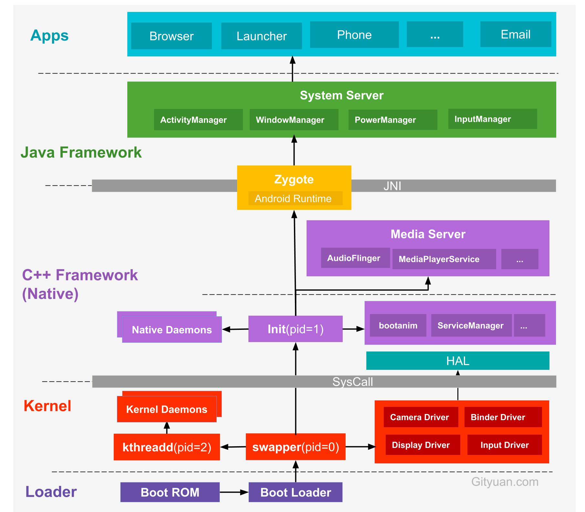

优化

- 内存
  - [Android内存优化之OOM - 胡凯 (kesenhoo.github.io)](https://kesenhoo.github.io/android-performance-oom/)

# 

Language

Java

Kotlin

C++

动画

多线程和进程

调试

性能

稳定性

编码规范

[Android Developer Roadmap: Learn to become an Android developer](https://roadmap.sh/android)

[如何自学Android - Gityuan博客 | 袁辉辉的技术博客](https://gityuan.com/2016/04/24/how-to-study-android/)

[App Navigation and Jetpack: The 2022 Android Developer Roadmap — Part3 | by Jaewoong Eum | ProAndroidDev](https://proandroiddev.com/the-2022-android-developer-roadmap-part-3-89ba329898d0)

Android 架构

[Architecture overview  | Android Open Source Project](https://source.android.com/docs/core/architecture)

Blog

[Gracker/Rss-IT: 这个项目记录了个人订阅的一些科技人的Blog地址,欢迎大家推荐,一起来完善! 欢迎自荐...... (github.com)](https://github.com/Gracker/Rss-IT)

[kesenhoo (HuKai) (github.com)](https://github.com/kesenhoo)

源码

[Downloading the source  | Android Open Source Project](https://source.android.com/docs/setup/download/downloading#initializing-a-repo-client)

[Codenames, tags, and build numbers  | Android Open Source Project](https://source.android.com/docs/setup/about/build-numbers#source-code-tags-and-builds)

[Android 系统开发源码环境搭建 · Android Performance](https://androidperformance.com/2018/11/01/android-system-develop-0/#/安装-Ubuntu-系统)