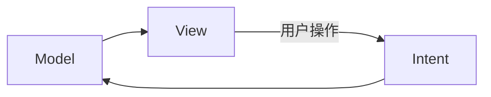

[Android 架构漫谈-从 MVC 到 MVI (chenhe.me)](https://chenhe.me/post/android-architecture-from-mvc-to-mvi/)


# MVC

MVC 由三部分组成：

- Model：对业务的建模，业务代码主要在这
- View：视图
- Controller：控制器，负责接收 UI 事件，调用 Model 并更新 UI

> 到底是 Controller 更新 View 还是 Model 更新 View 没有绝对说法。Android 上一般是 Controller 更新 View。

MVC 起源于(http)后端开发，后端的程序是比较清晰的三步走策略：接收请求、处理数据、返回结果（网页或结构化数据）。但在 Android 上业务模型显然没有那么简单，相比后端一个个独立的请求来说，应用的生命周期更是复杂，所以 MVC 模型自然也无法严格照搬，也就造成了 MVC 具体实现百花齐放（乱七八糟）的场面。

普遍认同的观点是 xml 布局文件是 View，`Activity` 之流属于 Controller。按照这个模型，我们回想一下八股文般的写法：

``` kotlin
class MainActivity: Activity() {
  override fun onCreate(savedInstanceState: Bundle?) {
    super.onCreate(savedInstanceState)
    setContentView(R.layout.activity_main)
    val data: String = model.getData()
    text.setText(data)
  }
}
```

尽管名义上 Controller 与 View 分开了：

- Activity 不负责布局，而只是加载一个布局文件。
- Activity 只负责要求 View 显示某数据，而不负责具体的渲染。

不要太理论派，事实已经证明，**在 Android 中 View 与 Controller 耦合太重**。`Activity` 中经常充斥着各种 View 的代码，这些代码又和 xml 布局文件息息相关。毫无疑问，布局文件的变更势必引发 `Activity` 的变更。

哪怕退一步，理想中如何展示数据是 View 层的工作，也就是说 Controller 只需要把数据整体丢给 View 就好，而不必指明哪里显示标题，哪里显示图片等等这些细节。随着应用复杂度的上升，几乎整个 `Activity` 都在处理 UI 的细节，远超 Controller 的职责。

**总的来说，Android 中的 Controller 对 View 的控制太细节了，从而导致耦合**。这一切的根源是 xml 布局文件作为 View 层功能太少，不足以履行所有职责。

> 后来的 View Binding 一定程度上加强了 View 层的能力，但仍然没有彻底释放 Controller 层。比如复杂的 `RecyclerView` 或 `ViewPager` 等依然需要在 Controller 层面编写大量代码。另外数据绑定本身是 MVVM 的核心思想，因此不再归为 MVC。


# MVP

如果祭出祖传的结构图，大部分人可能都难以看出 MVP (Model-View-Presenter) 与 MVC 的本质区别。


注意：究竟是 Model 还是 Presenter 来更新 View 并不属于 MVC 与 MVP 的本质区别。因为在实践上，即使采用 MVC 模型通常也是 Activity 更新 UI，而不是把 View 对象传递到 Model 层。换句话说，图中多了或少了几个箭头不重要。

除了箭头…似乎唯一的区别就是把 `Controller` 改成了 `Persenter`？果然科技以换壳为本。**MVP 与 MVC 的思想是一样的，它的目的是改进 Controller 在 Android 上的实现。因此相比 MVC，MVP 是代码结构上的变化，而不是思想。**

Android 中 MVC 的问题主要是 Controller 与 View 耦合过重，职责模糊不清。既然打不过，那就加入呗。在 MVP 中，`Activity` 正式归入 View 层，我们单独建一个类履行 Controller 的职责，为了区分，这一层叫做 `Presenter`。

现在，`Activity` 可以名正言顺地负责 View 的细节（因为它就是 View 层），而 Persenter 为了控制 View，自然需要 `Activity` 的实例。这下又开始耦合了：如果 View 层有变动，Presenter 就需要对应地更改。如果一组数据有不同的呈现方式，就得写多个 Presenter。**因此 Presenter 与 View 的通讯应该通过接口来实现**。

典型的 Presenter 实现如下（如有必要，Presenter 本身也可以定义为接口）：

~~~kotlin
class Presenter(private val iView: IView) {
  interface IView {
    fun showData(data: List<String>)
  }

  fun init() {
    val data = model.getData()
    iView.showData(data)
  }
}
~~~

这看似简单的一步让 MVP 转向了面向接口编程，自然获得了不少好处：

- 便于扩展：一组数据可以有不同的界面来显示，只需实现 `IView` 接口即可。
- 便于测试：可以创建假的 View 而不必真正部署到设备。

**个人理解，MVP 才是 Android 上真正的 MVC 实现，而所谓的 Android MVC 是在 sdk 有限、架构不发达的年代，邯郸学步强行搞出的东西。基于这个结论，Android MVC 该淘汰了，至少也得用到 MVP 才行。**

> MVP 通过把 `Activity` 合入 View 层，抽出 Controller 层来实现更明确的区分。倒过来，我们也可以把 `Activity` 变成真正的 Controller，把 View 层抽出来。这种模式也可视为 MVC 在 Android 上的更严格的实现。
>
> 例如可以创建一个根布局的子类，把 xml 中的根布局换成这个子类。子类中接收整体数据，在内部控制具体显示。大概是因为我们都尽量不想碰 `View` 吧，所以 MVP 才是更常见的选择。


# MVVM

细聊 MVVM (Model-View-ViewModel) 之前需要先明确一下逻辑与状态。逻辑分为业务逻辑与界面逻辑：

- 业务逻辑：例如插入数据库等与业务有关的操作。
- 界面逻辑：点击了按钮、滚动列表等。

虽然界面逻辑通常会触发业务逻辑，但这两个应该有明确的边界，这个边界往往区分开了业务状态与界面状态：

- 业务状态：需要持久化保存，至少其存在的生命的周期比较长。
- 界面状态：与界面生命周期一致。

界面状态与业务状态经常不一致。例如有一个姓名编辑框，当用户修改内容但还没保存时，界面状态就没有持久化为业务状态。反之，如果其他地方修改了数据库里的姓名，但 UI 没有及时刷新，则是更严重的不一致（可称为 bug）。

更具体来说，在传统的 Android View 体系中，界面状态分为外部与内部。例如我们从数据库读取了姓名到一个变量中，再显示到编辑框。当用户修改后，不仅界面状态与业务状态不一致，甚至外部界面状态（姓名变量）与内部界面状态（`TextView` 内部保存/显示的字符串）都不一样。

手动维护三种状态，很难确保它们的一致性，如下图所示，必须维护好 4 个事件：

~~~mermaid
graph LR
持久化存储--1-->内存--2-->界面--3-->内存--4-->持久化存储
~~~

1. 数据库改变时刷新变量。
2. 变量改变时刷新 UI。
3. UI 改变时更新变量。
4. 修改后的变量记得同步到数据库。

MVC/MVP 都没有解决这个麻烦。**MVVM 与其说是一个架构，不妨说是框架。它延续了 MVP 的分层思想，额外引入数据绑定，把上图中的 23 自动化**。

> 「架构」是一个指导思想，其具体代码通常由各位开发者自己实现。而「框架」则是写好的代码，实现了具体功能。

需要注意的是，MVVM 中的 VM 表示 ViewModel，而 Jetpack 中恰好也有一个组件叫 `ViewModel`，这俩不是一个东西。MVVM 中的 ViewModel 核心目的是实现数据绑定，其次是履行 MVP 中的 Presenter，也是标准 MVC 中 Controller 的职责。而 Jetpack 中提供的 `ViewModel` 主要实现了「在 Activity 旋转重建等场景下保留状态」的能力。**只通过自己写的 Presenter + DataBinding 就足以实现 MVVM，至于 `ViewModel` 库，因为的确实用因此普遍也会用上，但与 MVVM 没啥关系**。


# MVI

MVI (Model-View-Intent) 是近些日子（2022）才提出来的概念，如果说 MVVM 强调的是数据绑定，那么 MVI 强调的就是单向数据流，其次是对 View 与 ViewModel 层交互的优化。

MVVM 中的数据绑定严格来讲是双向绑定，即变量的更新自动反映到 UI，而 UI 的更改也自动更新变量。但实际操作中，更多项目喜欢只通过 `LiveData` 实现单向绑定。就我个人而言，不喜欢双向绑定原因有下：

- 不够直观。双向绑定隐藏了太多细节，就像 Java 的注解一样，一旦滥用，往往不知道某些操作到底是谁执行的（一些人对 Spring 后端开发中 Lombok 插件的异议也源于此）。
- 不够灵活。例如希望实时校验 `EditText` 的输入，拒绝不合法的字符，这个需求难以完美实现。

于是单向数据流（配合着单一可信数据源）的概念应运而生，也是现在 Google 主推的思想。



这个模型下，原本的 ViewModel/Presenter/Controller 不再被动地接受 UI 更新，而是只接受 UI 更新请求，内部计算后给出新的 UI 状态。换句话说，UI 自己不应该刷新，而只能根据状态来显示。例如，编辑框永远只能显示变量中的字符串，当用户键入新字符时，不会立即显示在编辑框中，而且向中间层发送一个请求(Intent)，中间层经过计算，把新值更新到变量中，此时 View 才能根据变量来刷新。

现在双向绑定的缺点得到了解决：

- 直观。每一个 UI 事件都显式地发送请求(Intent)。
- 灵活。收到 Intent 完全可以拒绝更新，或更新成其他值。

不过鉴于 Android View 系统的设计，严格执行单向数据流不太容易。因为大多数 View 内部维护了一个状态，内部状态的更改不受外部控制。**因此私以为在 Compose 中 MVI 最能体现优势**。基于此，MVI 也顺道解决了 Compose 中的其他小问题：

- 状态变量太多。Compose 组件不存在内部状态，因此业务状态与 UI 状态都要开发者自己保存，变量越来越多。而 MVI 把所有状态打包进了一个 ViewState 对象，不仅简化了传递，也解决了多个状态同时更新的并发问题。
- 回调函数太多。MVVM 中需要写很多函数，对应不同的 UI 事件。在 Compose 中每一层组件都要传一堆 lambda 表达式参数，非常麻烦。MVI 把这些 UI 事件抽象成 Intent，配合 Kotlin `sealed class` 特性，减少回调函数个数的同时也能实现类型安全地传递不同参数。

当然，MVI 也引入了一些问题。例如把所有状态打包进一个 ViewState 对象，就意味着某一个小状态变动就要刷新整个界面。Compose 的特性可以天然解决这个问题，传统的 View 体系中还需另费功夫。另外单向数据流的确解决了状态不一致的问题，但某些场景下也大大增加了模板代码的数量。比如「退出确认」这个常见需求现在需要建模成「请求退出/等待确认/退出/已退出」四个状态，以及各种 Intent，光是想想就恶心。


# 总结

MVC 是分层思想的基础，MVP/MVVM 都是在 Android 上对 MVC 的实现。所谓「Android MVC」是特定时代与技术背景下，Android 开发行业对后端 MVC 不成熟的模仿与生搬硬套，应该淘汰。

MVP 则是 Android 上更标准的 MVC 实现，它更合理地映射了 Android 组件与 MVC 分层的关系。

MVVM 通过 DataBinding 解决了 MVP 中内存数据与 UI 不一致的问题，建议使用。

MVI 在特定环境下（Jetpack Compose）减少了模板代码，也使程序逻辑更直观灵活。但不是每个项目是适合。

MVC/MVP/MVVM/MVI 背后的分层思想都是 MVC，这一点没有改变。

最后，不要盲目跟随 Google 的指导，事实证明，Google 很喜欢一拍脑袋做决定，一些复杂甚至常见的业务逻辑在最佳实践的模型下不好实现。我们更应该记录那些难以实现的需求，尝试在大的架构思想下给出自己的解决方案，方能培养出自己的架构思路。


