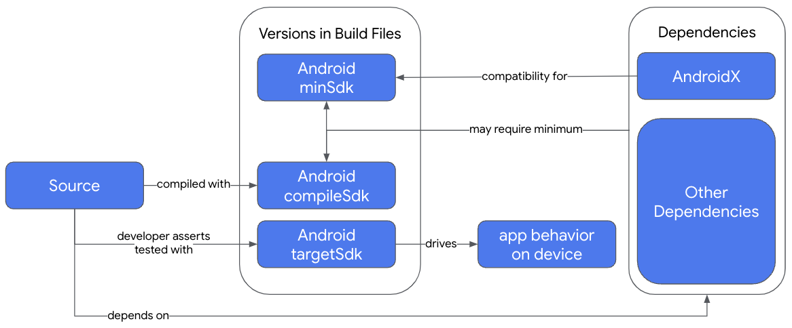

[KOGE (2bab.me)](https://koge.2bab.me/#/zh-cn/)

[Configure your build](https://developer.android.com/build)

[Gradle 系列 （二）、Gradle 技术探索 - 掘金 (juejin.cn)](https://juejin.cn/post/6986191903888769032)

# Config Your Build

## Android build glossary

Build types

生成类型通常针对开发生命周期的不同阶段进行配置。Debug build type 启用调试选项并使用调试密钥对应用进行签名，而 Release 生成类型可能会使用发布密钥对应用进行压缩、混淆和对应用进行签名以进行分发。

Product flavors

Build variants

Manifest entries

Dependencies

Signing

Code and resource shrinking

Multiple APK support


## Build configuration files

```
└── MyApp/  # Project
    ├── gradle/
    │   └── wrapper/
    │       └── gradle-wrapper.properties
    ├── build.gradle(.kts)
    ├── settings.gradle(.kts)
    └── app/  # Module
        ├── build.gradle(.kts)
        └── build/
            ├── libs/
            └── src/
                └── main/  # Source set
                    ├── java/
                    │   └── com.example.myapp
                    ├── res/
                    │   ├── drawable/
                    │   ├── values/
                    │   └── ...
                    └── AndroidManifest.xml
```

有一些 Gradle 构建配置文件是 Android 应用标准项目结构的一部分。在开始配置生成之前，请务必了解每个文件的范围和用途以及它们定义的基本 DSL 元素。


### The Gradle Wrapper file

Gradle wrapper (`gradlew`) 是源代码中包含的一个小应用程序，用于下载和启动 Gradle 本身。

`gradle/wrapper/gradle-wrapper.properties` 包含一个属性 ， `distributionUrl` 用于描述用于运行构建的 Gradle 版本。

如果同时处理多个项目，请尽可能确保所有项目都使用相同的 Gradle 版本。

```
distributionBase=GRADLE_USER_HOME
distributionPath=wrapper/dists
distributionUrl=https\://services.gradle.org/distributions/gradle-8.0-bin.zip
zipStoreBase=GRADLE_USER_HOME
zipStorePath=wrapper/dists
```


### The Gradle settings file

`settings.gradle.kts` file (for the Kotlin DSL) or `settings.gradle` file (for the Groovy DSL) 位于根项目目录中。此设置文件定义了项目级代码库设置，并告知 Gradle 在构建应用时应包含哪些模块。多模块项目需要指定应进入最终构建的每个模块。


### The top-level build file

top-level `build.gradle.kts` or `build.gradle ` 位于根项目目录中。它通常定义项目中模块使用的插件的常见版本。


### The module-level build file

module-level `build.gradle.kts` or `build.gradle` 位于每个 `project/module/` 目录中。它允许您为其所在的特定模块配置构建设置。通过配置这些生成设置，可以提供自定义打包选项，例如其他生成类型和产品变种，并替代 `main/` 应用清单或 top-level  脚本中的设置。

Android SDK Settings 

 module-level build file 包含一些设置，这些设置表明在编译、选择平台行为和指定运行应用程序的最低版本时使用的 Android SDK 版本。



*`compileSdk`*

确定 `compileSdk` 在编译源代码时哪些 Android 和 Java API 可用。要使用最新的 Android 功能，请在编译时使用最新的 Android SDK。`compileSdk` 允许您访问新的 API

*`minSdk`*

指定 `minSdk` 您希望应用支持的最低 Android 版本。设置 `minSdk` 会限制哪些设备可以安装您的应用。

*`targetSdk`*

1. 设置应用程序的运行时行为
2. 证明您测试过哪个版本的 Android

`targetSdk` 必须小于或等于 `compileSdk` 的值。


### Sample app-module build script

```kotlin
/**
 * The first section in the build configuration applies the Android Gradle plugin
 * to this build and makes the android block available to specify
 * Android-specific build options.
 */

plugins {
    id("com.android.application")
}

/**
 * Locate (and possibly download) a JDK used to build your kotlin
 * source code. This also acts as a default for sourceCompatibility,
 * targetCompatibility and jvmTarget. Note that this does not affect which JDK
 * is used to run the Gradle build itself, and does not need to take into
 * account the JDK version required by Gradle plugins (such as the
 * Android Gradle Plugin)
 */
kotlin {
    jvmToolchain(11)
}

/**
 * The android block is where you configure all your Android-specific
 * build options.
 */

android {

    /**
     * The app's namespace. Used primarily to access app resources.
     */

    namespace = "com.example.myapp"

    /**
     * compileSdk specifies the Android API level Gradle should use to
     * compile your app. This means your app can use the API features included in
     * this API level and lower.
     */

    compileSdk = 33

    /**
     * The defaultConfig block encapsulates default settings and entries for all
     * build variants and can override some attributes in main/AndroidManifest.xml
     * dynamically from the build system. You can configure product flavors to override
     * these values for different versions of your app.
     */

    defaultConfig {

        // Uniquely identifies the package for publishing.
        applicationId = "com.example.myapp"

        // Defines the minimum API level required to run the app.
        minSdk = 21

        // Specifies the API level used to test the app.
        targetSdk = 33

        // Defines the version number of your app.
        versionCode = 1

        // Defines a user-friendly version name for your app.
        versionName = "1.0"
    }

    /**
     * The buildTypes block is where you can configure multiple build types.
     * By default, the build system defines two build types: debug and release. The
     * debug build type is not explicitly shown in the default build configuration,
     * but it includes debugging tools and is signed with the debug key. The release
     * build type applies ProGuard settings and is not signed by default.
     */

    buildTypes {

        /**
         * By default, Android Studio configures the release build type to enable code
         * shrinking, using minifyEnabled, and specifies the default ProGuard rules file.
         */

        getByName("release") {
            isMinifyEnabled = true // Enables code shrinking for the release build type.
            proguardFiles(
                getDefaultProguardFile("proguard-android.txt"),
                "proguard-rules.pro"
            )
        }
    }

    /**
     * The productFlavors block is where you can configure multiple product flavors.
     * This lets you create different versions of your app that can
     * override the defaultConfig block with their own settings. Product flavors
     * are optional, and the build system does not create them by default.
     *
     * This example creates a free and paid product flavor. Each product flavor
     * then specifies its own application ID, so that they can exist on the Google
     * Play Store, or an Android device, simultaneously.
     *
     * If you declare product flavors, you must also declare flavor dimensions
     * and assign each flavor to a flavor dimension.
     */

    flavorDimensions += "tier"
    productFlavors {
        create("free") {
            dimension = "tier"
            applicationId = "com.example.myapp.free"
        }

        create("paid") {
            dimension = "tier"
            applicationId = "com.example.myapp.paid"
        }
    }

    /**
     * To override source and target compatibility (if different from the
     * toolchain JDK version), add the following. All of these
     * default to the same value as kotlin.jvmToolchain. If you're using the
     * same version for these values and kotlin.jvmToolchain, you can
     * remove these blocks.
     */
    //compileOptions {
    //    sourceCompatibility = JavaVersion.VERSION_11
    //    targetCompatibility = JavaVersion.VERSION_11
    //}
    //kotlinOptions {
    //    jvmTarget = "11"
    //}
}

/**
 * The dependencies block in the module-level build configuration file
 * specifies dependencies required to build only the module itself.
 * To learn more, go to Add build dependencies.
 */

dependencies {
    implementation(project(":lib"))
    implementation("androidx.appcompat:appcompat:1.6.1")
    implementation(fileTree(mapOf("dir" to "libs", "include" to listOf("*.jar"))))
}
```


### Gradle properties files

Gradle 包含两个属性文件，位于您的根项目目录中，可以使用它们来指定 Gradle 构建工具包本身的设置：

- `gradle.properties`

可以在此处配置项目范围的 Gradle 设置，例如 Gradle 守护程序的最大堆大小。

- `local.properties`

配置生成系统的本地环境属性，包括以下内容：

`sdk.dir` - Android SDK 的路径。

`cmake.dir` - CMake 的路径。

`local.properties` 是为特定于 Android Gradle 插件的属性保留的。将您自己的值放入此文件中可能会导致问题。如果需要定义自己的本地属性，请创建一个单独的属性文件并手动加载它。


### Source sets


## Java versions in Android builds

无论您的源代码是用 Java、Kotlin 还是两者编写，您都必须在多个地方为构建选择 JDK 或 Java 语言版本。


### Glossary 

*Java Development Kit (JDK)*

- Tools, such as a compiler, profiler, and archive creator. These are used behind the scenes during your build to create your application.
- Libraries containing APIs that you can call from your Kotlin or Java source code. Note that not all functions are available on Android.
- The Java Virtual Machine (JVM), an interpreter that executes Java applications. You use the JVM to run the Android Studio IDE and the Gradle build tool. The JVM is not used on Android devices or emulators.


*JetBrains Runtime (JBR)*

The [JetBrains Runtime (JBR) ](https://github.com/JetBrains/JetBrainsRuntime) is an enhanced JDK, distributed with Android Studio. 


### Choose a JDK to run Android Studio

建议您使用 JBR 运行 Android Studio。它与 Android Studio 一起部署并用于测试 Android Studio，并包含针对最佳 Android Studio 使用情况的增强功能。为确保这一点，请不要设置 `STUDIO_JDK` 环境变量。

Android Studio 的启动脚本按以下顺序查找 JVM：

1. `STUDIO_JDK` 环境变量
2. `studio.jdk` 目录（在 Android Studio 发行版中）
3. `jbr` 目录 （JetBrains Runtime），在 Android Studio 发行版中。推荐。
4. `JDK_HOME` 环境变量
5. `JAVA_HOME` 环境变量
6. `java` `PATH` 环境变量中的可执行文件


### Choose a JDK to run Gradle builds

如果使用 Android Studio 中的按钮运行 Gradle，则 Android Studio 设置中设置的 JDK 将用于运行 Gradle。如果您在 Android Studio 内部或外部的终端中运行 Gradle， `JAVA_HOME` 则环境变量（如果已设置）会确定哪个 JDK 运行 Gradle 脚本。如果 `JAVA_HOME` 未设置，则对环境变量使用 `java` `PATH` 命令

为了获得最一致的结果，请务必设置环境 `JAVA_HOME` 变量，并将 Android Studio 中的 Gradle JDK 设置为相同的 JDK。

运行构建时，Gradle 会创建一个称为守护程序的进程来执行实际构建。只要构建使用相同的 JDK 和 Gradle 版本，就可以重复使用此过程。重用守护程序可以减少启动新 JVM 和初始化构建系统的时间。同时处理多个项目时，如果可能，请在其 `gradle-wrapper.properties` 文件中指定相同的 Gradle 版本，以减少创建的 Gradle 守护进程的数量。


### Set the Gradle JDK in Android Studio

**Settings > Build, Execution, Deployment > Build Tools > Gradle**

请确保选择的 JDK 版本应高于或等于您在 Gradle build 中使用的插件使用的 JDK 版本。see the compatibility table in the [release notes](https://developer.android.com/build/releases/gradle-plugin).


`sourceCompatibility` 属性确定在编译 Java 源代码期间可用的 Java 语言功能。它不会影响 Kotlin 源代码。如果未指定，则默认为用于运行 Gradle 的 Java 工具链或 JDK。

指定 `targetCompatibility` 并 `jvmTarget` 确定分别为已编译的 Java 和 Kotlin 源代码生成字节码时使用的 Java 类格式版本。


## Configure the app module

`build.gradle.kts` 

- 更改不同生成配置的应用程序 ID
- 调整命名空间，而不受应用程序 ID 的影响

### Set the application ID

应用程序 ID 由模块 `build.gradle.kts` 文件中的 `applicationId` 属性定义

```kotlin
android {
    defaultConfig {
        applicationId = "com.example.myapp"
        minSdk = 15
        targetSdk = 24
        versionCode = 1
        versionName = "1.0"
    }
    ...
}
```


### Set the namespace 

每个 Android 模块都有一个命名空间，该命名空间用作其生成的 `R` Kotlin 或 Java 包名称和 `BuildConfig` 类。

```kotlin
android {
    namespace = "com.example.myapp"
    ...
}
```


## Add build dependencies

[Learning the Basics (gradle.org)](https://docs.gradle.org/current/userguide/dependency_management.html)

指定依赖关系时，不应使用动态版本号，例如 `'com.android.tools.build:gradle:3.+'` .使用此功能可能会导致意外的版本更新，并且难以解决版本差异。


### Dependency types

若要向项目添加依赖项，请指定依赖项配置，例如 `implementation` 在模块 `build.gradle.kts` 文件的 `dependencies` 块中。

例如，应用模块的以下 `build.gradle.kts` 文件包含三种不同类型的依赖项：

```kotlin
plugins {
    id("com.android.application")
}

android { ... }

dependencies {
    // Dependency on a local library module
    implementation(project(":mylibrary"))

    // Dependency on local binaries
    implementation(fileTree(mapOf("dir" to "libs", "include" to listOf("*.jar"))))

    // Dependency on a remote binary
    implementation("com.example.android:app-magic:12.3")
}
```

**Local library module dependency**

这会声明对名为“mylibrary”的 Android 库模块的依赖关系（此名称必须与 `settings.gradle.kts` 文件中用 定义的 `include:` 库名称匹配）。构建应用时，构建系统会编译库模块，并将生成的编译内容打包到应用中。


**Local binary dependency** 

Gradle 声明对项目 `module_name/libs/` 目录中的 JAR 文件的依赖关系（因为 Gradle 会读取 `build.gradle.kts` 相对于文件的路径）。

或者，可以按如下方式指定单个文件：

```kotlin
  implementation(files("libs/foo.jar", "libs/bar.jar"))
```


**Remote binary dependency**

这实际上是以下内容的简写：

```kotlin
  implementation(group = "com.example.android", name = "app-magic", version = "12.3")
```


### Dependency configurations

在 `dependencies` 块中，您可以使用几种不同的依赖项配置之一（如上 `implementation` 所示）声明库依赖项。

| Configuration       | Behavior                                                     |
| ------------------- | ------------------------------------------------------------ |
| implementation      | 当您的模块配置 `implementation` 依赖项时，它会让 Gradle 知道您不希望该模块在编译时将依赖项泄露给其他模块。也就是说，依赖项仅在运行时可供其他模块使用。如果依赖 `implementation` 项更改了其 API，Gradle 只会重新编译该依赖项以及直接依赖该依赖项的模块。大多数应用和测试模块都应使用此配置。 |
| api                 | 当一个模块包含依赖项 `api` ，它会让 Gradle 知道该模块希望以传递方式将该依赖项导出到其他模块，以便它们在运行时和编译时都可以使用它。但应谨慎使用它，并且仅将其用于需要传递导出到其他上游使用者的依赖项。如果依赖 `api` 项更改了其外部 API，Gradle 会在编译时重新编译有权访问该依赖项的所有模块。因此，拥有大量 `api` 依赖项会显著增加构建时间。除非您想将依赖项的 API 公开给单独的模块，否则库模块应改用 `implementation` 依赖项。 |
| compileOnly         | Gradle 仅将依赖项添加到编译类路径中（也就是说，它不会添加到构建输出中）。当您创建 Android 模块并在编译期间需要依赖项时，这很有用，但可以选择在运行时提供依赖项。如果使用此配置，则库模块必须包含运行时条件，以检查依赖项是否可用，然后正常更改其行为，以便在未提供依赖项时仍可运行。这有助于减少最终应用的大小，因为它不会添加不重要的暂时性依赖项。不能将 `compileOnly` 配置与 AAR 依赖项一起使用。不能将 `compileOnly` 配置与 AAR 依赖项一起使用。 |
| runtimeOnly         | Gradle 仅将依赖项添加到构建输出中，以便在运行时使用。也就是说，它不会添加到编译类路径中。 |
| annotationProcessor |                                                              |
| lintChecks          |                                                              |

如果您只想为特定的 [build variant](https://developer.android.com/studio/build/build-variants) source set 或 [testing source set](https://developer.android.com/studio/test#sourcesets),声明依赖项，则必须将配置名称大写，并在其前缀为 [build variant](https://developer.android.com/studio/build/build-variants) source set 或 [testing source set](https://developer.android.com/studio/test#sourcesets) 的名称。

要为本地测试和插桩测试添加 `implementation` 依赖项，如下所示：

```Kotlin
dependencies {
    // Adds a remote binary dependency only for local tests.
    testImplementation("junit:junit:4.12")

    // Adds a remote binary dependency only for the instrumented test APK.
    androidTestImplementation("androidx.test.espresso:espresso-core:3.5.1")
}
```


### Exclude transitive dependencies

随着应用范围的扩大，它可以包含许多依赖项，包括直接依赖项和传递依赖项（应用的导入库所依赖的库）。要排除不再需要的传递依赖项，可以使用如下所示的 `exclude` 关键字：

```Kotlin
dependencies {
    implementation("some-library") {
        exclude(group = "com.example.imgtools", module = "native")
    }
}
```


### Remote repositories

...


# Optimize build

## Optimize your build configuration

### update tools

[Android Studio and SDK tools](https://developer.android.com/studio/intro/update)

[The Android Gradle plugin](https://developer.android.com/studio/releases/gradle-plugin)


### Use KSP instead of kapt

Kotlin Symbol Processor (KSP) is faster than Kotlin Annotation Processing Tool (kapt).


### Avoid compiling unnecessary resources

Avoid compiling and packaging resources that you aren't testing, such as additional language localizations and screen-density resources.Instead, only specify one language resource and screen density for your "dev" flavor, as shown in the following sample:

```kotlin
android {
    ...
    productFlavors {
        create("dev") {
            ...
            // The following configuration limits the "dev" flavor to using
            // English stringresources and xxhdpi screen-density resources.
            resourceConfigurations("en", "xxhdpi")
        }
        ...
    }
}
```


### putting the Gradle Plugin Portal last

在 Android 中，所有插件都位于 `google()` 和 `mavenCentral()` 存储库中。但是，您的构建可能需要使用该 `gradlePluginPortal()` 服务解析的第三方插件。

Gradle 会按照声明的顺序搜索代码库，因此，如果首先列出的代码库包含大多数插件，则构建性能会提高。因此，请尝试将该 `gradlePluginPortal()` 条目放在 `settings.gradle` 文件的存储库块的最后。在大多数情况下，这可以最大限度地减少冗余插件搜索的数量并提高您的构建速度。


### Use static build config values with your debug build 

对调试生成类型的清单文件或资源文件中的属性使用静态值。

使用动态版本代码、版本名称、资源或任何其他更改清单文件的构建逻辑，每次要运行更改时都需要进行完整的应用构建，即使实际更改可能只需要热插拔也是如此。如果生成配置需要此类动态属性，请将这些属性隔离到release build type，并使debug build的值保持静态，如以下示例所示：

```kotlin
  ...
  // Use a filter to apply onVariants() to a subset of the variants.
  onVariants(selector().withBuildType("release")) { variant ->
      // Because an app module can have multiple outputs when using multi-APK, versionCode
      // is only available on the variant output.
      // Gather the output when we are in single mode and there is no multi-APK.
      val mainOutput = variant.outputs.single { it.outputType == OutputType.SINGLE }

      // Create the version code generating task.
      val versionCodeTask = project.tasks.register("computeVersionCodeFor${variant.name}", VersionCodeTask::class.java) {
          it.outputFile.set(project.layout.buildDirectory.file("versionCode${variant.name}.txt"))
      }

      // Wire the version code from the task output.
      // map will create a lazy Provider that:
      // 1. Runs just before the consumer(s), ensuring that the producer (VersionCodeTask) has run
      //    and therefore the file is created.
      // 2. Contains task dependency information so that the consumer(s) run after the producer.
      mainOutput.versionCode.set(versionCodeTask.flatMap { it.outputFile.map { it.asFile.readText().toInt() } })
  }
  ...

  abstract class VersionCodeTask : DefaultTask() {

    @get:OutputFile
    abstract val outputFile: RegularFileProperty

    @TaskAction
    fun action() {
        outputFile.get().asFile.writeText("1.1.1")
    }
  }

```


### Use static dependency versions 

在 `build.gradle` 文件中声明依赖项时，请避免使用动态版本号（末尾带有加号的版本号，例如 `'com.android.tools.build:gradle:2.+'` ）。使用动态版本号可能会导致意外的版本更新、难以解决版本差异，以及 Gradle 检查更新导致构建速度变慢。请改用静态版本号。


### Create library modules

在应用中查找可转换为 Android 库模块的代码。以这种方式模块化代码允许生成系统仅编译您修改的模块，并缓存这些输出以供将来生成。当您启用该优化时，模块化还可以使并行项目执行更加有效。


### Create tasks for custom build logic 

创建构建配置文件后，如果构建配置文件显示有较长的构建时间花费在**配置项目**阶段，请查看 build.gradle 脚本并查找代码，将其纳入自定义的 Gradle 任务中。将某些构建逻辑移到任务中，有助于确保任务只在需要时运行，并为后续构建缓存结果，而且如果启用并行项目执行，构建逻辑还可以并行运行。[Authoring Tasks (gradle.org)](https://docs.gradle.org/current/userguide/more_about_tasks.html)


### Convert images to WebP


### Disable PNG crunching 

通过在每次构建应用时禁用自动图像压缩来加快构建速度


### Experiment with the JVM parallel garbage collector


### Increase the JVM heap size

如果发现构建速度很慢，特别是垃圾回收在构建分析器结果中占用了超过 15% 的构建时间，那么应该增加 Java 虚拟机 （JVM） 堆大小。在 `gradle.properties` 文件中，将限制设置为 4、6 或 8 GB，如以下示例所示：

```kotlin
org.gradle.jvmargs=-Xmx6g
```


### Use non-transitive R classes

使用非传递 `R` 类可以更快地生成具有多个模块的应用。这样做有助于防止资源重复，方法是确保每个模块的 `R` 类仅包含对其自身资源的引用，而不从其依赖项中提取引用。这样可以加快构建速度，并带来避免编译的相应好处。这是 Android Gradle 插件 8.0.0 及更高版本中的默认行为。

### Use non-constant R classes

Android Gradle 插件 8.0.0 及更高版本中的默认行为。

### Disable the Jetifier flag

### Use the configuration cache


## Troubleshoot build performance with Build Analyzer


## Profile your build


[Shrink, obfuscate, and optimize your app  | Android Studio  | Android Developers --- 缩小、混淆和优化您的应用 | Android Studio |安卓开发者](https://developer.android.com/build/shrink-code)

[深入 Android 混淆实践：ProGuard 通关秘籍_-keep class_罗昭成-csdn的博客-CSDN博客](https://blog.csdn.net/lovecluo/article/details/127020150)

[【Android性能优化】：ProGuard，混淆，R8优化 - 掘金 (juejin.cn)](https://juejin.cn/post/7225511164120891453#heading-0)


# Shrink your app

Shrinking in release build to remove unused code and resources.

## Code shrinking

removes unused classes, fields, methods, and attributes from your app and its library dependencies

### Customize which code to keep

However, some situations are difficult for R8 to analyze correctly and it might remove code your app actually needs. Some examples of when it might incorrectly remove code include:

- When your app calls a method from the Java Native Interface (JNI)

- When your app looks up code at runtime (such as with reflection)

To fix errors and force R8 to keep certain code, add a [`-keep`](https://www.guardsquare.com/en/products/proguard/manual/usage#keepoptions) line in the ProGuard rules file. For example:

```
-keep public class MyClass
```


## Resource shrinking

removes unused resources from your packaged app, including unused resources in your app’s library dependencies.

## Obfuscation

shortens the name of classes and members, which results in reduced DEX file sizes. 

## Optimization

inspects and rewrites your code to further reduce the size of your app’s DEX files. 