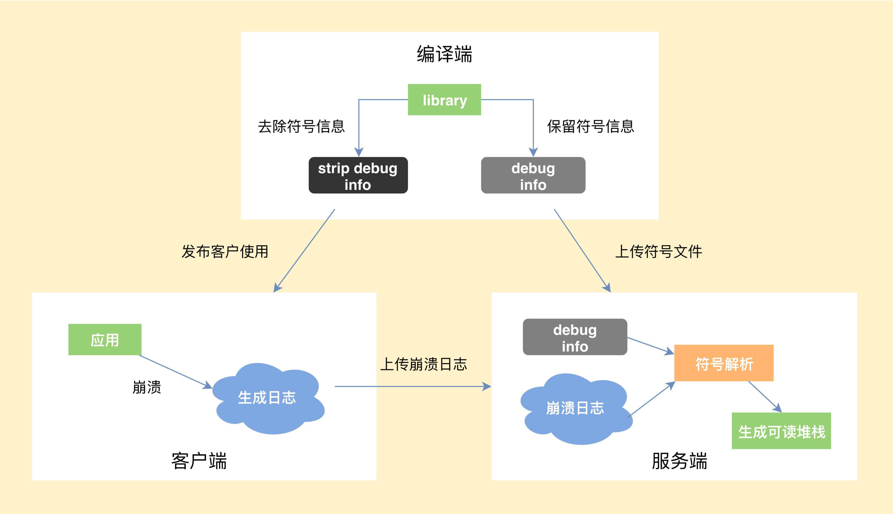

# 崩溃优化

Android 崩溃分为 Java 崩溃和 Native 崩溃。

**Java 崩溃就是在 Java 代码中，出现了未捕获异常，导致程序异常退出**。Native 崩溃又是怎么产生的呢？**一般都是因为在 Native 代码中访问非法地址，也可能是地址对齐出现了问题，或者发生了程序主动 abort，这些都会产生相应的 signal 信号，导致程序异常退出**。


1.Native 崩溃的捕获流程

一个完整的 Native 崩溃从捕获到解析要经历哪些流程。

- 编译端。编译 C/C++ 代码时，需要将带符号信息的文件保留下来。
- 客户端。捕获到崩溃时候，将收集到尽可能多的有用信息写入日志文件，然后选择合适的时机上传到服务器。
- 服务端。读取客户端上报的日志文件，寻找适合的符号文件，生成可读的 C/C++ 调用栈。



2.Native 崩溃捕获的难点

Chromium 的[Breakpad](http://chromium.googlesource.com/breakpad/breakpad/+/master)是目前 Native 崩溃捕获中最成熟的方案。

上面的三个流程中，**最核心的是怎么样保证客户端在各种极端情况下依然可以生成崩溃日志**。因为在崩溃时，程序会处于一个不安全的状态，如果处理不当，非常容易发生二次崩溃。

那么，生成崩溃日志时会有哪些比较棘手的情况呢？

**情况一：文件句柄泄漏，导致创建日志文件失败，怎么办？**

应对方式：我们需要提前申请文件句柄 fd 预留，防止出现这种情况。

**情况二：因为栈溢出了，导致日志生成失败，怎么办？**

应对方式：为了防止栈溢出导致进程没有空间创建调用栈执行处理函数，我们通常会使用常见的 signalstack。在一些特殊情况，我们可能还需要直接替换当前栈，所以这里也需要在堆中预留部分空间。

**情况三：整个堆的内存都耗尽了，导致日志生成失败，怎么办？**

应对方式：这个时候我们无法安全地分配内存，也不敢使用 stl 或者 libc 的函数，因为它们内部实现会分配堆内存。这个时候如果继续分配内存，会导致出现堆破坏或者二次崩溃的情况。Breakpad 做的比较彻底，重新封装了[Linux Syscall Support](https://chromium.googlesource.com/linux-syscall-support/)，来避免直接调用 libc。

**情况四：堆破坏或二次崩溃导致日志生成失败，怎么办？**

应对方式：Breakpad 会从原进程 fork 出子进程去收集崩溃现场，此外涉及与 Java 相关的，一般也会用子进程去操作。这样即使出现二次崩溃，只是这部分的信息丢失，我们的父进程后面还可以继续获取其他的信息。在一些特殊的情况，我们还可能需要从子进程 fork 出孙进程。

当然 Breakpad 也存在着一些问题，例如生成的 minidump 文件是二进制格式的，包含了太多不重要的信息，导致文件很容易达到几 MB。但是 minidump 也不是毫无用处，它有一些比较高级的特性，比如[使用 gdb 调试](https://www.chromium.org/chromium-os/packages/crash-reporting/debugging-a-minidump)、可以看到传入参数等。Chromium 未来计划使用 Crashpad 全面替代 Breakpad，但目前来说还是 “too early to mobile”。

想遵循 Android 的文本格式，并且添加更多我们认为重要的信息，这个时候就要去改造 Breakpad 的实现。**比较常见的例如增加 Logcat 信息、Java 调用栈信息以及崩溃时的其他一些有用信息**。

想彻底弄清楚 Native 崩溃捕获，需要我们对虚拟机运行、汇编这些内功有一定造诣。做一个高可用的崩溃收集 SDK 真的不是那么容易，它需要经过多年的技术积累，要考虑的细节也非常多，每一个失败路径或者二次崩溃场景都要有应对措施或备用方案。

3.选择合适的崩溃服务

对于很多中小型公司来说，我并不建议自己去实现一套如此复杂的系统，可以选择一些第三方的服务。目前各种平台也是百花齐放，包括腾讯的[Bugly](https://bugly.qq.com/v2/)、阿里的[啄木鸟平台](http://wpk.uc.cn/)、网易云捕、Google 的 Firebase 等等。


## 如何客观地衡量崩溃

想评估崩溃造成的用户影响范围，我们会先去看**UV 崩溃率**。

```
UV 崩溃率 = 发生崩溃的 UV / 登录 UV
```

启动崩溃对用户带来的伤害最大，应用无法启动往往通过热修复也无法拯救。闪屏广告、运营活动，很多应用启动过程异常复杂，又涉及各种资源、配置下发，极其容易出现问题。微信读书、蘑菇街、淘宝、天猫这些“重运营”的应用都有使用一种叫作[“安全模式”](https://mp.weixin.qq.com/s?__biz=MzUxMzcxMzE5Ng==&mid=2247488429&idx=1&sn=448b414a0424d06855359b3eb2ba8569&source=41#wechat_redirect)的技术来保障客户端的启动流程，在监控到客户端启动失败后，给用户自救的机会。


## 如何客观地衡量稳定性

那崩溃率是不是就能完全等价于应用的稳定性呢？答案是肯定不行。处理了崩溃，我们还会经常遇到 ANR（Application Not Responding，程序没有响应）这个问题。

怎么去发现应用中的 ANR 异常呢？总结一下，通常有两种做法。

**1. 使用 FileObserver 监听 /data/anr/traces.txt 的变化**。非常不幸的是，很多高版本的 ROM，已经没有读取这个文件的权限了。这个时候你可能只能思考其他路径，海外可以使用 Google Play 服务，而国内微信利用[Hardcoder](https://mp.weixin.qq.com/s/9Z8j3Dv_5jgf7LDQHKA0NQ?)框架（HC 框架是一套独立于安卓系统实现的通信框架，它让 App 和厂商 ROM 能够实时“对话”了，目标就是充分调度系统资源来提升 App 的运行速度和画质，切实提高大家的手机使用体验）向厂商获取了更大的权限。

**2. 监控消息队列的运行时间**。这个方案无法准确地判断是否真正出现了 ANR 异常，也无法得到完整的 ANR 日志。在我看来，更应该放到卡顿的性能范畴。

讨论什么是异常退出之前，我们先看看都有哪些应用退出的情形。

- 主动自杀。`Process.killProcess()`、`exit()` 等。
- 崩溃。出现了 Java 或 Native 崩溃。
- 系统重启；系统出现异常、断电、用户主动重启等，我们可以通过比较应用开机运行时间是否比之前记录的值更小。
- 被系统杀死。被 low memory killer 杀掉、从系统的任务管理器中划掉等。
- ANR。

可以在应用启动的时候设定一个标志，在主动自杀或崩溃后更新标志，这样下次启动时通过检测这个标志就能确认运行期间是否发生过异常退出。对应上面的五种退出场景，我们排除掉主动自杀和崩溃**（崩溃会单独的统计）**这两种场景，希望可以监控到剩下三种的异常退出，理论上这个异常捕获机制是可以达到 100% 覆盖的。

通过这个异常退出的检测，可以反映如 ANR、low memory killer、系统强杀、死机、断电等其他无法正常捕获到的问题。当然异常率会存在一些误报，比如用户从系统的任务管理器中划掉应用。对于线上的大数据来说，还是可以帮助我们发现代码中的一些隐藏问题。

所以就得到了一个新的指标来衡量应用的稳定性，即**异常率**。

```
UV 异常率 = 发生异常退出或崩溃的 UV / 登录 UV
```

前不久我们的一个应用灰度版本发现异常退出的比例增长不少，最后排查发现由于视频播放存在一个巨大 bug，会导致可能有用户手机卡死甚至重启，这是传统崩溃收集很难发现的问题。

根据应用的前后台状态，我们可以把异常退出分为前台异常退出和后台异常退出。“被系统杀死”是后台异常退出的主要原因，当然我们会**更关注前台的异常退出**的情况，这会跟 ANR、OOM 等异常情况有更大的关联。

通过异常率我们可以比较全面的评估应用的稳定性，对于线上监控还需要完善崩溃的报警机制。在微信我们可以做到 5 分钟级别的崩溃预警，确保能在第一时间发现线上重大问题，尽快决定是通过发版还是动态热修复解决问题。

## 总结

讲了 Android 的两种崩溃，重点介绍了 Native 崩溃的捕获流程和一些难点。做一个高可用的崩溃收集 SDK 并不容易，它背后涉及 Linux 信号处理以及内存分配、汇编等知识，当你内功修炼得越深厚，学习这些底层知识就越得心应手。

接着，我们讨论了崩溃率应该如何去计算，崩溃率的高低跟应用时长、复杂度、收集 SDK 有关。不仅仅是崩溃率，我们还学习了目前 ANR 采集的方式以及遇到的问题，最后提出了异常率这一个新的稳定性监控指标。


# 崩溃分析流程

## 崩溃现场

崩溃现场应该采集哪些信息。

1. 崩溃信息

   从崩溃的基本信息，我们可以对崩溃有初步的判断。

   - 进程名、线程名。崩溃的进程是前台进程还是后台进程，崩溃是不是发生在 UI 线程。
   - 崩溃堆栈和类型。崩溃是属于 Java 崩溃、Native 崩溃，还是 ANR，对于不同类型的崩溃我们关注的点也不太一样。特别需要看崩溃堆栈的栈顶，看具体崩溃在系统的代码，还是我们自己的代码里面。

   ```
   Process Name: 'com.sample.crash'
   Thread Name: 'MyThread'
    
   java.lang.NullPointerException
       at ...TestsActivity.crashInJava(TestsActivity.java:275)
   ```

   有时候我们除了崩溃的线程，还希望拿到其他关键的线程的日志。就像上面的例子，虽然是 MyThread 线程崩溃，但是我也希望可以知道主线程当前的调用栈。

2. 系统信息

​		系统的信息有时候会带有一些关键的线索，对我们解决问题有非常大的帮助。

- Logcat。这里包括应用、系统的运行日志。由于系统权限问题，获取到的 Logcat 可能只包含与当前 App 相关的。其中系统的 event logcat 会记录 App 运行的一些基本情况，记录在文件 /system/etc/event-log-tags 中。

  ```
  system logcat:
  10-25 17:13:47.788 21430 21430 D dalvikvm: Trying to load lib ... 
  event logcat:
  10-25 17:13:47.788 21430 21430 I am_on_resume_called: 生命周期
  10-25 17:13:47.788 21430 21430 I am_low_memory: 系统内存不足
  10-25 17:13:47.788 21430 21430 I am_destroy_activity: 销毁 Activty
  10-25 17:13:47.888 21430 21430 I am_anr: ANR 以及原因
  10-25 17:13:47.888 21430 21430 I am_kill: APP 被杀以及原因
  ```

- 机型、系统、厂商、CPU、ABI、Linux 版本等。我们会采集多达几十个维度，这对后面讲到寻找共性问题会很有帮助。
- 设备状态：是否 root、是否是模拟器。一些问题是由 Xposed 或多开软件造成，对这部分问题我们要区别对待。

3. 内存信息

   OOM、ANR、虚拟内存耗尽等，很多崩溃都跟内存有直接关系。如果我们把用户的手机内存分为“2GB 以下”和“2GB 以上”两个桶，会发现“2GB 以下”用户的崩溃率是“2GB 以上”用户的几倍。

- 系统剩余内存。关于系统内存状态，可以直接读取文件 /proc/meminfo。当系统可用内存很小（低于 MemTotal 的 10%）时，OOM、大量 GC、系统频繁自杀拉起等问题都非常容易出现。

- 应用使用内存。包括 Java 内存、RSS（Resident Set Size）、PSS（Proportional Set Size），我们可以得出应用本身内存的占用大小和分布。PSS 和 RSS 通过 /proc/self/smap 计算，可以进一步得到例如 apk、dex、so 等更加详细的分类统计。

- 虚拟内存。虚拟内存可以通过 /proc/self/status 得到，通过 /proc/self/maps 文件可以得到具体的分布情况。有时候我们一般不太重视虚拟内存，但是很多类似 OOM、tgkill 等问题都是虚拟内存不足导致的。

  ```
  Name:     com.sample.name   // 进程名
  FDSize:   800               // 当前进程申请的文件句柄个数
  VmPeak:   3004628 kB        // 当前进程的虚拟内存峰值大小
  VmSize:   2997032 kB        // 当前进程的虚拟内存大小
  Threads:  600               // 当前进程包含的线程个数
  ```

4. 资源信息

   有的时候我们会发现应用堆内存和设备内存都非常充足，还是会出现内存分配失败的情况，这跟资源泄漏可能有比较大的关系。

- 文件句柄 fd。文件句柄的限制可以通过 /proc/self/limits 获得，一般单个进程允许打开的最大文件句柄个数为 1024。但是如果文件句柄超过 800 个就比较危险，需要将所有的 fd 以及对应的文件名输出到日志中，进一步排查是否出现了有文件或者线程的泄漏。

  ```
  opened files count 812:
  0 -> /dev/null
  1 -> /dev/log/main4 
  2 -> /dev/binder
  3 -> /data/data/com.crash.sample/files/test.config
  ...
  ```

- 线程数。当前线程数大小可以通过上面的 status 文件得到，一个线程可能就占 2MB 的虚拟内存，过多的线程会对虚拟内存和文件句柄带来压力。根据我的经验来说，如果线程数超过 400 个就比较危险。需要将所有的线程 id 以及对应的线程名输出到日志中，进一步排查是否出现了线程相关的问题。

  ```
   threads count 412:               
   1820 com.sample.crashsdk                         
   1844 ReferenceQueueD                                             
   1869 FinalizerDaemon   
   ...  
  ```

- JNI。使用 JNI 时，如果不注意很容易出现引用失效、引用爆表等一些崩溃。我们可以通过 DumpReferenceTables 统计 JNI 的引用表，进一步分析是否出现了 JNI 泄漏等问题。

5. 应用信息

   除了系统，其实我们的应用更懂自己，可以留下很多相关的信息。

- 崩溃场景。崩溃发生在哪个 Activity 或 Fragment，发生在哪个业务中。
- 关键操作路径。不同于开发过程详细的打点日志，我们可以记录关键的用户操作路径，这对我们复现崩溃会有比较大的帮助。
- 其他自定义信息。不同的应用关心的重点可能不太一样，比如网易云音乐会关注当前播放的音乐，QQ 浏览器会关注当前打开的网址或视频。此外例如运行时间、是否加载了补丁、是否是全新安装或升级等信息也非常重要。

除了上面这些通用的信息外，针对特定的一些崩溃，我们可能还需要获取类似磁盘空间、电量、网络使用等特定信息。所以说一个好的崩溃捕获工具，会根据场景为我们采集足够多的信息，让我们有更多的线索去分析和定位问题。当然数据的采集需要注意用户隐私，做到足够强度的加密和脱敏。

## 崩溃分析

不要畏惧问题，经过耐心和细心地分析，总能敏锐地发现一些异常或关键点，并且还要敢于怀疑和验证。重点介绍崩溃分析“三部曲”。

**1. 确认严重程度**。解决崩溃也要看性价比，我们优先解决 Top 崩溃或者对业务有重大影响，例如启动、支付过程的崩溃。我曾经有一次辛苦了几天解决了一个大的崩溃，但下个版本产品就把整个功能都删除了，这令我很崩溃。

**2. 崩溃基本信息**。确定崩溃的类型以及异常描述，对崩溃有大致的判断。一般来说，大部分的简单崩溃经过这一步已经可以得到结论。

- Java 崩溃。Java 崩溃类型比较明显，比如 NullPointerException 是空指针，OutOfMemoryError 是资源不足，这个时候需要去进一步查看日志中的 “内存信息”和“资源信息”。
- Native 崩溃。需要观察 signal、code、fault addr 等内容，以及崩溃时 Java 的堆栈。关于各 signal 含义的介绍，你可以查看[崩溃信号介绍](http://www.mkssoftware.com/docs/man5/siginfo_t.5.asp)。比较常见的是有 SIGSEGV 和 SIGABRT，前者一般是由于空指针、非法指针造成，后者主要因为 ANR 和调用 abort() 退出所导致。
- **ANR**。我的经验是，先看看主线程的堆栈，是否是因为锁等待导致。接着看看 ANR 日志中 iowait、CPU、GC、system server 等信息，进一步确定是 I/O 问题，或是 CPU 竞争问题，还是由于大量 GC 导致卡死。

**3. Logcat**。Logcat 一般会存在一些有价值的线索，日志级别是 Warning、Error 的需要特别注意。从 Logcat 中我们可以看到当时系统的一些行为跟手机的状态，例如出现 ANR 时，会有“am_anr”；App 被杀时，会有“am_kill”。不同的系统、厂商输出的日志有所差别，**当从一条崩溃日志中无法看出问题的原因，或者得不到有用信息时，不要放弃，建议查看相同崩溃点下的更多崩溃日志。**

**4. 各个资源情况**。结合崩溃的基本信息，我们接着看看是不是跟 “内存信息” 有关，是不是跟“资源信息”有关。比如是物理内存不足、虚拟内存不足，还是文件句柄 fd 泄漏了。

无论是资源文件还是 Logcat，内存与线程相关的信息都需要特别注意，很多崩溃都是由于它们使用不当造成的。

第二步：查找共性

如果使用了上面的方法还是不能有效定位问题，我们可以尝试查找这类崩溃有没有什么共性。找到了共性，也就可以进一步找到差异，离解决问题也就更进一步。

机型、系统、ROM、厂商、ABI，这些采集到的系统信息都可以作为维度聚合，共性问题例如是不是因为安装了 Xposed，是不是只出现在 x86 的手机，是不是只有三星这款机型，是不是只在 Android 5.0 的系统上。应用信息也可以作为维度来聚合，比如正在打开的链接、正在播放的视频、国家、地区等。

找到了共性，可以对你下一步复现问题有更明确的指引。

第三步：尝试复现

如果我们已经大概知道了崩溃的原因，为了进一步确认更多信息，就需要尝试复现崩溃。如果我们对崩溃完全没有头绪，也希望通过用户操作路径来尝试重现，然后再去分析崩溃原因。

“只要能本地复现，我就能解”，相信这是很多开发跟测试说过的话。有这样的底气主要是因为在稳定的复现路径上面，我们可以采用增加日志或使用 Debugger、GDB 等各种各样的手段或工具做进一步分析。

回想当时在开发 Tinker 的时候，我们遇到了各种各样的奇葩问题。比如某个厂商改了底层实现、新的 Android 系统实现有所更改，都需要去 Google、翻源码，有时候还需要去抠厂商的 ROM 或手动刷 ROM。这个痛苦的经历告诉我，很多疑难问题需要我们耐得住寂寞，反复猜测、反复发灰度、反复验证。

疑难问题：系统崩溃

系统崩溃常常令我们感到非常无助，它可能是某个 Android 版本的 bug，也可能是某个厂商修改 ROM 导致。这种情况下的崩溃堆栈可能完全没有我们自己的代码，很难直接定位问题。针对这种疑难问题，我来谈谈我的解决思路。

**1. 查找可能的原因**。通过上面的共性归类，我们先看看是某个系统版本的问题，还是某个厂商特定 ROM 的问题。虽然崩溃日志可能没有我们自己的代码，但通过操作路径和日志，我们可以找到一些怀疑的点。

**2. 尝试规避**。查看可疑的代码调用，是否使用了不恰当的 API，是否可以更换其他的实现方式规避。

**3. Hook 解决**。这里分为 Java Hook 和 Native Hook。以我最近解决的一个系统崩溃为例，我们发现线上出现一个 Toast 相关的系统崩溃，它只出现在 Android 7.0 的系统中，看起来是在 Toast 显示的时候窗口的 token 已经无效了。这有可能出现在 Toast 需要显示时，窗口已经销毁了。

```
android.view.WindowManager$BadTokenException: 
	at android.view.ViewRootImpl.setView(ViewRootImpl.java)
	at android.view.WindowManagerGlobal.addView(WindowManagerGlobal.java)
	at android.view.WindowManagerImpl.addView(WindowManagerImpl.java4)
	at android.widget.Toast$TN.handleShow(Toast.java)
```

为什么 Android 8.0 的系统不会有这个问题？在查看 Android 8.0 的源码后我们发现有以下修改：

```
try {
  mWM.addView(mView, mParams);
  trySendAccessibilityEvent();
} catch (WindowManager.BadTokenException e) {
  /* ignore */
}
```

考虑再三，我们决定参考 Android 8.0 的做法，直接 catch 住这个异常。这里的关键在于寻找 Hook 点，这个案例算是相对比较简单的。Toast 里面有一个变量叫 mTN，它的类型为 handler，我们只需要代理它就可以实现捕获。

如果你做到了我上面说的这些，**95% 以上的崩溃都能解决或者规避，大部分的系统崩溃也是如此**。当然总有一些疑难问题需要依赖到用户的真实环境，我们希望具备类似动态跟踪和调试的能力。专栏后面还会讲到 xlog 日志、远程诊断、动态分析等高级手段，可以帮助我们进一步调试线上疑难问题，敬请期待。

崩溃攻防是一个长期的过程，我们希望尽可能地提前预防崩溃的发生，将它消灭在萌芽阶段。这可能涉及我们应用的整个流程，包括人员的培训、编译检查、静态扫描工作，还有规范的测试、灰度、发布流程等。

而崩溃优化也不是孤立的，它跟我们后面讲到的内存、卡顿、I/O 等内容都有关。


[Sample](http://github.com/AndroidAdvanceWithGeektime/Chapter02)提供了一种“完全解决”TimeoutException 的方法，主要是希望你可以更好地学习解决系统崩溃的套路。

1. 通过源码分析。我们发现 TimeoutException 是由系统的 FinalizerWatchdogDaemon 抛出来的。
2. 寻找可以规避的方法。尝试调用了它的 Stop() 方法，但是线上发现在 Android 6.0 之前会有线程同步问题。
3. 寻找其他可以 Hook 的点。通过代码的依赖关系，发现一个取巧的 Hook 点。

最终代码你可以参考 Sample 的实现，但是建议只在灰度中使用。这里需要提的是，虽然有一些黑科技可以帮助我们解决某些问题，但对于黑科技的使用我们需要慎重，比如有的黑科技对保活进程频率没有做限制，可能会导致系统卡死。


# 参考文章

[Android 平台 Native 代码的崩溃捕获机制及实现 (qq.com)](https://mp.weixin.qq.com/s/g-WzYF3wWAljok1XjPoo7w)