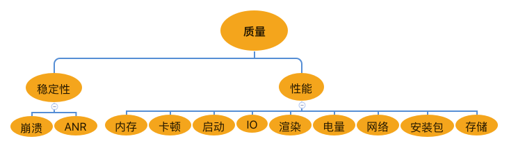
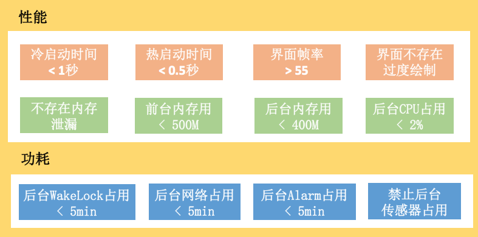

# 整体概述

**1. 高质量开发**。产品的基础用户体验，APM 性能监控系统。崩溃、内存、卡顿、启动、I/O、存储、网络、耗电、渲染、安装包体积等常见的关键点，性能优化的经验技巧与方向，如何解决已知的存量问题，同时及时发现增量问题。

**2. 高效开发**。持续交付、DevOps 近年在国内非常火热，我们都在寻找内部突破，提升效率。一个应用从想法到成品，需要经历开发、编译 CI、测试、灰度、发布等多个阶段，那怎样提升各个阶段的效率，也是你我比较关心的话题。**跨平台开发可能是解决开发阶段的一个答案，动态部署可能是发布阶段的一个答案**。

**3. 架构演进**。“君有疾在腠理，不治将恐深”，对于一个应用来说，架构一定是核心中的核心。在这个模块，我会讲到 Google 的一些架构演进，例如 Android P、App Bundle、虚拟机、耗电等，也会讲到移动网络架构的一些选择，跨平台开发、动态化实践等热点知识。

**高质量应用**

内存优化、弱网络优化、屏幕适配、双卡、语种

# 应用交付流程

开发、编译 CI、测试、灰度、发布

1. 开发阶段。熟练掌握各种开发工具，比如耗时分析工具 Traceview，它背后的实现原理是什么？能不能做一个完全没有性能损耗的 Traceview？或者怎么样将它移植到线上使用？
2. 编译 CI 阶段。如何防止代码不断地恶化？怎样进一步优化性能？d8 与 ReDex 有什么神奇的黑科技？如何利用好 Coverity、Infer 这些静态分析工具？这部分可能需要一些编译原理的知识，你会发现移动开发也有很多值得深入研究的东西。
3. 测试阶段。我们常说敏捷开发，用户是最好的测试。遇到问题在线上反复试错，对自己、对用户都十分痛苦。我们希望可以做到测试“左移”，尽可能早地发现问题。但是很多时候我们不是不想测试，而是发现测不出什么问题。那么怎样提升实验室发现问题的能力呢？如何尽可能地模拟用户的操作路径？做好测试并不容易，自动化测试结合 AI 或许可以帮助我们解决一些痛点。
4. 灰度和发布阶段。动态部署流行起来之后，很多开发变得松懈起来。有问题发补丁，一个不行就两个，两个不行就十个。怎样去保证产品质量？很多线上问题概率很低，基本很难复现，比如对于一个印度的用户，我们希望有一个远程的听诊器，而不需要把用户拉到我们的手术台上。

# 移动 APM 质量平台

APM，“Application Performance Management”，即应用性能管理。

1. 统一管理
2. 统一三端。一个公司可能有多个应用，一个应用也可能有 H5、iOS、Android 多个端。我们希望它们只是采集数据方式有所不同，上报、后台分析、展示、报警都是共用的。随着技术的发展，我们可能会增加 React Native、Flutter 这些新模块的监控，这个平台应该是统一演进的。希望业界有一套开源的方案，大家可以一起优化。

质量平台需要关注哪些问题呢？这需要看我们用户关心什么问题。有的问题可能是致命的，像崩溃、卡死、白屏。另一大类问题就是性能问题，安装包大小、启动、耗时、内存、耗电、流量都是这一个范畴。

Android 绿色联盟开发者大会上推出的应用体验标准，有对应用的兼容性、稳定性、性能、功能和安全做了详细的定义。

