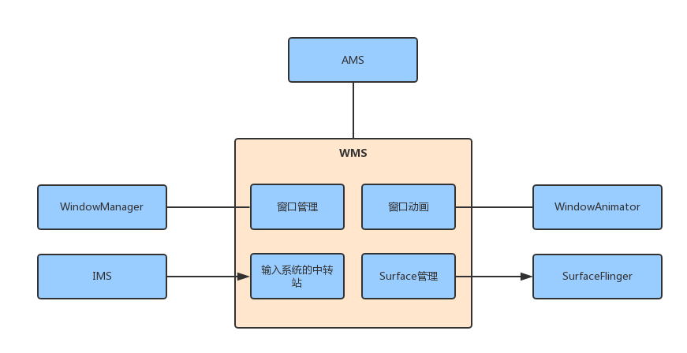
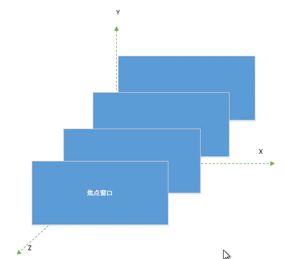
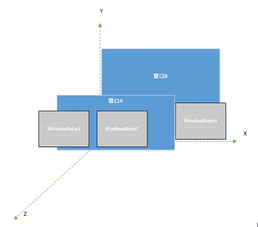
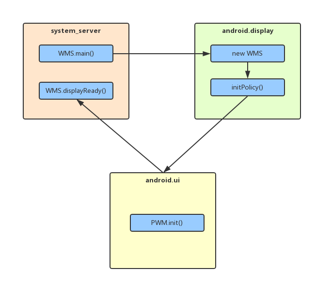

[Android WMS和View基本理解 - WIZZIE BLOG](https://wizzie.top/android/android-wms-view-cpp/)


# Android WMS和View基本理解

> Window 可以看做是 Surface 的一个包装，本质上，Window的本体就是一片 Surface。将操作对象Surface，对象关联属性集以及操作方法等组合在一起便是 Window。Surface 其实是一块画布，应用可以随心所欲地通过 Canvas 或者 OpenGL 在其上作画，然后通过 SurfaceFlinger 将多块 Surface 的内容按照特定的顺序(ZOrder)进行混合并输出到 FrameBuffer，从而将 Android 漂亮的脸蛋显示给用户。既然每个窗口都有一块 Surface 供自己涂鸦，所以必然需要一个角色对所有窗口的 Surface 进行协调管理。于是,WMS 应运而生。


# WMS 概述

[Android P WMS(1) -- wms简介_wms z-order-CSDN博客](https://blog.csdn.net/wd229047557/article/details/89855208)

窗口管理
WMS是窗口的管理者，它负责窗口的启动、添加和删除，另外窗口的大小和层级也是由WMS进行管理的。窗口管理的核心成员有DisplayContent、WindowToken和WindowState。

窗口动画
窗口间进行切换时，使用窗口动画可以显得更炫一些，窗口动画由WMS的动画子系统来负责，动画子系统的管理者为WindowAnimator。

输入系统的中转站
通过对窗口的触摸从而产生触摸事件，InputManagerService（IMS）会对触摸事件进行处理，它会寻找一个最合适的窗口来处理触摸反馈信息，WMS是窗口的管理者，因此，WMS“理所应当”的成为了输入系统的中转站。

Surface管理
窗口并不具备有绘制的功能，因此每个窗口都需要有一块Surface来供自己绘制。为每个窗口分配Surface是由WMS来完成的。




# 2.windowState

windowState就是window，每个window都有一个surface来绘画，window本身是没法画的。

## Window的类型

Android系统的Window有很多，大体上来说，Framework定义了三种窗口类型；

### 应用程序Window

所谓应用窗口指的就是该窗口对应一个Activity，因此，要创建应用窗口就必须在Activity中完成了。本节后面会分析Activity对应的Window的创建过程。

每一种窗口类型定义了一种对应的type，应用类型的窗口的type范围是１~99

| WindowType 值                                                | 窗口类型                                                     |
| ------------------------------------------------------------ | ------------------------------------------------------------ |
| [FIRST_APPLICATION_WINDOW](https://cs.android.com/android/platform/superproject/main/+/main:frameworks/base/core/java/android/view/WindowManager.java;drc=d4035b6eb1192f71af7adae47bf17d22c7356fa1;bpv=1;bpt=1;l=1816?gsn=FIRST_APPLICATION_WINDOW&gs=KYTHE%3A%2F%2Fkythe%3A%2F%2Fandroid.googlesource.com%2Fplatform%2Fsuperproject%2Fmain%2F%2Fmain%3Flang%3Djava%3Fpath%3Dandroid.view.WindowManager.LayoutParams%23c068d78867f243a58bd916c74a84a98947aa6a449c2dec54b7523157045a424c) = 1 | 开始应用程序                                                 |
| [TYPE_BASE_APPLICATION](https://cs.android.com/android/platform/superproject/main/+/main:frameworks/base/core/java/android/view/WindowManager.java;drc=d4035b6eb1192f71af7adae47bf17d22c7356fa1;bpv=1;bpt=1;l=1824?gsn=TYPE_BASE_APPLICATION&gs=KYTHE%3A%2F%2Fkythe%3A%2F%2Fandroid.googlesource.com%2Fplatform%2Fsuperproject%2Fmain%2F%2Fmain%3Flang%3Djava%3Fpath%3Dandroid.view.WindowManager.LayoutParams%23146748476b901493d369b444cdd8ac62394f0a215f37d6b8a07fdf111f17e05d)   = 1 | 所有程序窗口的 Base 窗口，其他应用程序窗口显示在它上面       |
| [TYPE_APPLICATION](https://cs.android.com/android/platform/superproject/main/+/main:frameworks/base/core/java/android/view/WindowManager.java;drc=d4035b6eb1192f71af7adae47bf17d22c7356fa1;bpv=1;bpt=1;l=1831?gsn=TYPE_APPLICATION&gs=KYTHE%3A%2F%2Fkythe%3A%2F%2Fandroid.googlesource.com%2Fplatform%2Fsuperproject%2Fmain%2F%2Fmain%3Flang%3Djava%3Fpath%3Dandroid.view.WindowManager.LayoutParams%236feff266f58cba98a96a0030843e98746dfead153f43509dab7c5fde0f1a30b4)        = 2 | 普通应用程序窗口，token 必须设置为 Activity 的 token         |
| [TYPE_APPLICATION_STARTING](https://cs.android.com/android/platform/superproject/main/+/main:frameworks/base/core/java/android/view/WindowManager.java;drc=d4035b6eb1192f71af7adae47bf17d22c7356fa1;bpv=1;bpt=1;l=1840?gsn=TYPE_APPLICATION_STARTING&gs=KYTHE%3A%2F%2Fkythe%3A%2F%2Fandroid.googlesource.com%2Fplatform%2Fsuperproject%2Fmain%2F%2Fmain%3Flang%3Djava%3Fpath%3Dandroid.view.WindowManager.LayoutParams%23bac406be73824c1a4abc3158aa76ff6f648d78ce7f4d8ff2a14b0947096a0ea8) = 3 | 应用程序启动时显示的窗口                                     |
| [TYPE_DRAWN_APPLICATION](https://cs.android.com/android/platform/superproject/main/+/main:frameworks/base/core/java/android/view/WindowManager.java;drc=d4035b6eb1192f71af7adae47bf17d22c7356fa1;bpv=1;bpt=1;l=1847?gsn=TYPE_DRAWN_APPLICATION&gs=KYTHE%3A%2F%2Fkythe%3A%2F%2Fandroid.googlesource.com%2Fplatform%2Fsuperproject%2Fmain%2F%2Fmain%3Flang%3Djava%3Fpath%3Dandroid.view.WindowManager.LayoutParams%23a2b080494fdb2a510d0f1a385e87abf79a6d89b2299210092c266cd8157ba7b0) = 4 | a variation on TYPE_APPLICATION that ensures the window manager will wait for this window to be drawn before the app is shown. 确保window manager会等待该窗口绘制完成后再显示应用程序。 |
| [LAST_APPLICATION_WINDOW](https://cs.android.com/android/platform/superproject/main/+/main:frameworks/base/core/java/android/view/WindowManager.java;drc=d4035b6eb1192f71af7adae47bf17d22c7356fa1;bpv=1;bpt=1;l=1852?gsn=LAST_APPLICATION_WINDOW&gs=KYTHE%3A%2F%2Fkythe%3A%2F%2Fandroid.googlesource.com%2Fplatform%2Fsuperproject%2Fmain%2F%2Fmain%3Flang%3Djava%3Fpath%3Dandroid.view.WindowManager.LayoutParams%231ec642fc312419c77a52157da6375dcbe54ef466021a542f623a3ae9d50734f3) = 99 | 结束应用程序窗口                                             |


子Window

所谓的子Window，是说这个Window必须要有一个父窗体，比如PopWindow，Dialog是属于应用程序Window,这个比较特殊。

子窗口的type范围是1000~1999

| [FIRST_SUB_WINDOW](https://cs.android.com/android/platform/superproject/main/+/main:frameworks/base/core/java/android/view/WindowManager.java;drc=d4035b6eb1192f71af7adae47bf17d22c7356fa1;bpv=1;bpt=1;l=1860?gsn=FIRST_SUB_WINDOW&gs=KYTHE%3A%2F%2Fkythe%3A%2F%2Fandroid.googlesource.com%2Fplatform%2Fsuperproject%2Fmain%2F%2Fmain%3Flang%3Djava%3Fpath%3Dandroid.view.WindowManager.LayoutParams%23b67804f3b76c89b514b3e4d615c44a8543ebee37600272865119c8dc0a8ff6d7) = 1000 | SubWindows 子窗口，子窗口的 Z 序和坐标空间都依赖于他们的宿主窗口 |
| ------------------------------------------------------------ | ------------------------------------------------------------ |
| [TYPE_APPLICATION_PANEL](https://cs.android.com/android/platform/superproject/main/+/main:frameworks/base/core/java/android/view/WindowManager.java;drc=d4035b6eb1192f71af7adae47bf17d22c7356fa1;bpv=1;bpt=1;l=1866?gsn=TYPE_APPLICATION_PANEL&gs=KYTHE%3A%2F%2Fkythe%3A%2F%2Fandroid.googlesource.com%2Fplatform%2Fsuperproject%2Fmain%2F%2Fmain%3Flang%3Djava%3Fpath%3Dandroid.view.WindowManager.LayoutParams%23e8ed4a581b022524ee839304161d7b4618204e3793a7ccac95b8f2391486d909) = [FIRST_SUB_WINDOW](https://cs.android.com/android/platform/superproject/main/+/main:frameworks/base/core/java/android/view/WindowManager.java;drc=d4035b6eb1192f71af7adae47bf17d22c7356fa1;bpv=0;bpt=1;l=1860) | 面板窗口，显示于宿主窗口的上层                               |
| [TYPE_APPLICATION_MEDIA](https://cs.android.com/android/platform/superproject/main/+/main:frameworks/base/core/java/android/view/WindowManager.java;drc=d4035b6eb1192f71af7adae47bf17d22c7356fa1;bpv=1;bpt=1;l=1872?gsn=TYPE_APPLICATION_MEDIA&gs=KYTHE%3A%2F%2Fkythe%3A%2F%2Fandroid.googlesource.com%2Fplatform%2Fsuperproject%2Fmain%2F%2Fmain%3Flang%3Djava%3Fpath%3Dandroid.view.WindowManager.LayoutParams%233336ccdd42ee88315a0cf7203364147ad850078b2ad05830149adcfbb3c95f7d) = [FIRST_SUB_WINDOW](https://cs.android.com/android/platform/superproject/main/+/main:frameworks/base/core/java/android/view/WindowManager.java;drc=d4035b6eb1192f71af7adae47bf17d22c7356fa1;bpv=0;bpt=1;l=1860) + 1 | 媒体窗口，例如视频，显示于宿主窗口下层                       |
| [TYPE_APPLICATION_SUB_PANEL](https://cs.android.com/android/platform/superproject/main/+/main:frameworks/base/core/java/android/view/WindowManager.java;drc=d4035b6eb1192f71af7adae47bf17d22c7356fa1;bpv=1;bpt=1;l=1879?gsn=TYPE_APPLICATION_SUB_PANEL&gs=KYTHE%3A%2F%2Fkythe%3A%2F%2Fandroid.googlesource.com%2Fplatform%2Fsuperproject%2Fmain%2F%2Fmain%3Flang%3Djava%3Fpath%3Dandroid.view.WindowManager.LayoutParams%2338adfdafe308d13c80398ba6bf199dfa112f4b18f757aecc5656c28150e85aef) = [FIRST_SUB_WINDOW](https://cs.android.com/android/platform/superproject/main/+/main:frameworks/base/core/java/android/view/WindowManager.java;drc=d4035b6eb1192f71af7adae47bf17d22c7356fa1;bpv=0;bpt=1;l=1860) + 2 | 应用程序窗口的子面板，显示于所有面板窗口的上层               |
| [TYPE_APPLICATION_ATTACHED_DIALOG](https://cs.android.com/android/platform/superproject/main/+/main:frameworks/base/core/java/android/view/WindowManager.java;drc=d4035b6eb1192f71af7adae47bf17d22c7356fa1;bpv=1;bpt=1;l=1885?gsn=TYPE_APPLICATION_ATTACHED_DIALOG&gs=KYTHE%3A%2F%2Fkythe%3A%2F%2Fandroid.googlesource.com%2Fplatform%2Fsuperproject%2Fmain%2F%2Fmain%3Flang%3Djava%3Fpath%3Dandroid.view.WindowManager.LayoutParams%236df36a85ac16e2c187376b4163be1e1b93939eb97ee3f007e18ba4bb02855a5c) = [FIRST_SUB_WINDOW](https://cs.android.com/android/platform/superproject/main/+/main:frameworks/base/core/java/android/view/WindowManager.java;drc=d4035b6eb1192f71af7adae47bf17d22c7356fa1;bpv=0;bpt=1;l=1860) + 3 | 对话框，类似面板窗口，绘制类似于顶层窗口，而不是宿主的子窗口 |
| [TYPE_APPLICATION_MEDIA_OVERLAY](https://cs.android.com/android/platform/superproject/main/+/main:frameworks/base/core/java/android/view/WindowManager.java;drc=d4035b6eb1192f71af7adae47bf17d22c7356fa1;bpv=1;bpt=1;l=1895?gsn=TYPE_APPLICATION_MEDIA_OVERLAY&gs=KYTHE%3A%2F%2Fkythe%3A%2F%2Fandroid.googlesource.com%2Fplatform%2Fsuperproject%2Fmain%2F%2Fmain%3Flang%3Djava%3Fpath%3Dandroid.view.WindowManager.LayoutParams%23ee4dd38cf9bbbcd2823c29add5e8deb76d96b43d215292e777c156afaed7c5d7)  = [FIRST_SUB_WINDOW](https://cs.android.com/android/platform/superproject/main/+/main:frameworks/base/core/java/android/view/WindowManager.java;drc=d4035b6eb1192f71af7adae47bf17d22c7356fa1;bpv=0;bpt=1;l=1860) + 4 | window for showing overlays on top of media windows. 显示在媒体窗口和程序窗口之间，需要实现半透明效果 |
| WindowType 值                                                | 窗口类型                                                     |
| [TYPE_APPLICATION_ABOVE_SUB_PANEL](https://cs.android.com/android/platform/superproject/main/+/main:frameworks/base/core/java/android/view/WindowManager.java;drc=d4035b6eb1192f71af7adae47bf17d22c7356fa1;bpv=1;bpt=1;l=1903?gsn=TYPE_APPLICATION_ABOVE_SUB_PANEL&gs=KYTHE%3A%2F%2Fkythe%3A%2F%2Fandroid.googlesource.com%2Fplatform%2Fsuperproject%2Fmain%2F%2Fmain%3Flang%3Djava%3Fpath%3Dandroid.view.WindowManager.LayoutParams%237686c944af1b03c917601c5ff33c77a99c383e8d1a47dff050f7001ebd91f166) = [FIRST_SUB_WINDOW](https://cs.android.com/android/platform/superproject/main/+/main:frameworks/base/core/java/android/view/WindowManager.java;drc=d4035b6eb1192f71af7adae47bf17d22c7356fa1;bpv=0;bpt=1;l=1860) + 5 | a above sub-panel on top of an application window and it's sub-panel windows. These windows are displayed on top of their attached window and any {@link [#TYPE_APPLICATION_SUB_PANEL](https://cs.android.com/android/platform/superproject/main/+/main:frameworks/base/core/java/android/view/WindowManager.java;drc=d4035b6eb1192f71af7adae47bf17d22c7356fa1;bpv=0;bpt=1;l=1879)} panels. |
| [LAST_SUB_WINDOW](https://cs.android.com/android/platform/superproject/main/+/main:frameworks/base/core/java/android/view/WindowManager.java;drc=d4035b6eb1192f71af7adae47bf17d22c7356fa1;bpv=1;bpt=1;l=1908?gsn=LAST_SUB_WINDOW&gs=KYTHE%3A%2F%2Fkythe%3A%2F%2Fandroid.googlesource.com%2Fplatform%2Fsuperproject%2Fmain%2F%2Fmain%3Flang%3Djava%3Fpath%3Dandroid.view.WindowManager.LayoutParams%235825b23bed565532c570b4f1248b63e150136ce83299ca23d4a908d69581ec9e) = 1999 | 结束子窗口                                                   |


#### 系统Window

常见的系统Window有哪些呢？比如在手机电量低的时候，会有一个提示电量低的Window,我们输入文字的时候，会弹出输入法Window,还有搜索条Window,来电显示Window,Toast对应的Window,可以总结出来，系统Window是独立与我们的应用程序的，对于应用程序而言，我们理论上是无法创建系统Window，因为没有权限，这个权限只有系统进程有。

系统的窗口的type范围是2000以上　

| WindowType 值                                                | 窗口类型                                                     |
| :----------------------------------------------------------- | :----------------------------------------------------------- |
| [FIRST_SYSTEM_WINDOW](https://cs.android.com/android/platform/superproject/main/+/main:frameworks/base/core/java/android/view/WindowManager.java;drc=d4035b6eb1192f71af7adae47bf17d22c7356fa1;bpv=1;bpt=1;l=1914?q=FIRST_SYSTEM_WINDOW&ss=android&gsn=FIRST_SYSTEM_WINDOW&gs=KYTHE%3A%2F%2Fkythe%3A%2F%2Fandroid.googlesource.com%2Fplatform%2Fsuperproject%2Fmain%2F%2Fmain%3Flang%3Djava%3Fpath%3Dandroid.view.WindowManager.LayoutParams%23346d2c19e8e9f563df856313839de1ad36789210e46dfdaac4216c93c405b202) = 2000 | 系统窗口                                                     |
| [TYPE_STATUS_BAR](https://cs.android.com/android/platform/superproject/main/+/main:frameworks/base/core/java/android/view/WindowManager.java;drc=d4035b6eb1192f71af7adae47bf17d22c7356fa1;bpv=1;bpt=1;l=1922?q=FIRST_SYSTEM_WINDOW&ss=android&gsn=TYPE_STATUS_BAR&gs=KYTHE%3A%2F%2Fkythe%3A%2F%2Fandroid.googlesource.com%2Fplatform%2Fsuperproject%2Fmain%2F%2Fmain%3Flang%3Djava%3Fpath%3Dandroid.view.WindowManager.LayoutParams%23c99b9ad8ac82dbf013732a8cbcabc84d989c7849673479f3bf018df32df7c48d)  = [FIRST_SYSTEM_WINDOW](https://cs.android.com/android/platform/superproject/main/+/main:frameworks/base/core/java/android/view/WindowManager.java;drc=d4035b6eb1192f71af7adae47bf17d22c7356fa1;bpv=0;bpt=1;l=1914) | 状态栏                                                       |
| [TYPE_SEARCH_BAR](https://cs.android.com/android/platform/superproject/main/+/main:frameworks/base/core/java/android/view/WindowManager.java;drc=d4035b6eb1192f71af7adae47bf17d22c7356fa1;bpv=1;bpt=1;l=1929?q=FIRST_SYSTEM_WINDOW&ss=android&gsn=TYPE_SEARCH_BAR&gs=KYTHE%3A%2F%2Fkythe%3A%2F%2Fandroid.googlesource.com%2Fplatform%2Fsuperproject%2Fmain%2F%2Fmain%3Flang%3Djava%3Fpath%3Dandroid.view.WindowManager.LayoutParams%23992c223d57fa7416c843d05e5e8ae305b21fa12e0bf6192c8c5007c57b05050a) = [FIRST_SYSTEM_WINDOW](https://cs.android.com/android/platform/superproject/main/+/main:frameworks/base/core/java/android/view/WindowManager.java;drc=d4035b6eb1192f71af7adae47bf17d22c7356fa1;bpv=0;bpt=1;l=1914)+1 | 搜索栏                                                       |
| [TYPE_INPUT_METHOD](https://cs.android.com/android/platform/superproject/main/+/main:frameworks/base/core/java/android/view/WindowManager.java;drc=d4035b6eb1192f71af7adae47bf17d22c7356fa1;bpv=1;bpt=1;l=2013?q=FIRST_SYSTEM_WINDOW&ss=android&gsn=TYPE_INPUT_METHOD&gs=KYTHE%3A%2F%2Fkythe%3A%2F%2Fandroid.googlesource.com%2Fplatform%2Fsuperproject%2Fmain%2F%2Fmain%3Flang%3Djava%3Fpath%3Dandroid.view.WindowManager.LayoutParams%236eb65fbe71c90317ed0066656961436955e82426e5237e01a3b2e8e15b4cb87c) = [FIRST_SYSTEM_WINDOW](https://cs.android.com/android/platform/superproject/main/+/main:frameworks/base/core/java/android/view/WindowManager.java;drc=d4035b6eb1192f71af7adae47bf17d22c7356fa1;bpv=0;bpt=1;l=1914)+11 | 内部输入法窗口，当该窗口显示时应用程序应该调整大小或者平移来保持 input focus 可见 |
| [TYPE_APPLICATION_OVERLAY](https://cs.android.com/android/platform/superproject/main/+/main:frameworks/base/core/java/android/view/WindowManager.java;drc=d4035b6eb1192f71af7adae47bf17d22c7356fa1;bpv=1;bpt=1;l=2204?q=FIRST_SYSTEM_WINDOW&ss=android&gsn=TYPE_APPLICATION_OVERLAY&gs=KYTHE%3A%2F%2Fkythe%3A%2F%2Fandroid.googlesource.com%2Fplatform%2Fsuperproject%2Fmain%2F%2Fmain%3Flang%3Djava%3Fpath%3Dandroid.view.WindowManager.LayoutParams%231a80cbb534d35f8503cac21862b056513de2c2075747e935191cd9e154ed752d) = [FIRST_SYSTEM_WINDOW](https://cs.android.com/android/platform/superproject/main/+/main:frameworks/base/core/java/android/view/WindowManager.java;drc=d4035b6eb1192f71af7adae47bf17d22c7356fa1;bpv=0;bpt=1;l=1914) + 38 | 悬浮窗，可自由调整，需要申请 SYSTEM_ALERT_WINDOW 权限        |

系统窗口的type值>子窗口的type值>应用类型窗口的type值，一般来说，根据type值大小关系，可以推出系统窗口在子窗口的上面，子窗口在应用窗口的上面。


# 3.z-order

手机上采用的是层叠式布局，层叠式布局是一个三维的空间，将手机的水平方向作为Ｘ轴，竖直方向作为Ｙ轴，还有一根垂直与屏幕从里朝外方向的虚拟的Z轴，所有窗口 (WindowState) 按照顺序排列在Ｚ轴上，如下图。z轴坐标就是z-order，越大证明他的windowState越在前面。


**3.1 、 mBaseLayer 主序 确认**



**3.2 、mSubLayer 子序的确认**

SubLayer(称为子序)，SubLayer值是用来描述一个窗口是否属于另外一个窗口的子窗口，或者说SubLayer值是用来确定子窗口和父窗口之间的相对位置的。

一个Activity中有三个子窗口WindowState1、WindowState２、WindowState３，WindowState1WindowState２在窗口Ａ的前面，WindowState３在Ａ的后面，这几个兄弟窗口为什么可以这样排序呢，这就是mSubLayer的作用，子序越大，则相对其他兄弟窗口越靠前，反之，越靠后，如果为负数，就处在父窗口的后面，如窗口Ａ中的WindowState3，子序是根据窗口类型调用subWindowTypeToLayerLw确定的，subWindowTypeToLayerLw同样是在Window的构造方法中调用的。




 **3.3 、窗口Z序的调整**

当WindowState创建完成，并且被添加到WMS维持的数组里面后，就需要调用WindowLayersController的assignLayersLocked(windows)，进行Z序的调整。


# WMS 初始化

```java
//frameworks/base/services/java/com/android/server/SystemServer.java
private void startOtherServices(@NonNull TimingsTraceAndSlog t) {
    WindowManagerService wm = null;
    InputManagerService inputManager = null;
    ...
    try {
        //1.创建了IMS，并赋值给IMS类型的inputManager对象。
        t.traceBegin("StartInputManagerService");
        inputManager = new InputManagerService(context);
        t.traceEnd();

        t.traceBegin("StartWindowManagerService");
        // WMS needs sensor service ready
        mSystemServiceManager.startBootPhase(t, SystemService.PHASE_WAIT_FOR_SENSOR_SERVICE);
        //2.执行了WMS的main方法，其内部会创建WMS，需要注意的是main方法其中一个传入的参数就是1处创建的IMS，WMS是输入事件的中转站，其内部包含了IMS引用并不意外
        wm = WindowManagerService.main(context, inputManager, !mFirstBoot, new PhoneWindowManager(), mActivityManagerService.mActivityTaskManager);
        //3.分别将WMS和IMS注册到ServiceManager中，这样如果某个客户端想要使用WMS，就需要先去ServiceManager中查询信息，然后根据信息与WMS所在的进程建立通信通路，客户端就可以使用WMS了。
        ServiceManager.addService(Context.WINDOW_SERVICE, wm, /* allowIsolated= */ false,
                                  DUMP_FLAG_PRIORITY_CRITICAL | DUMP_FLAG_PROTO);
        ServiceManager.addService(Context.INPUT_SERVICE, inputManager,
                                  /* allowIsolated= */ false, DUMP_FLAG_PRIORITY_CRITICAL);
        t.traceEnd();

        t.traceBegin("SetWindowManagerService");
        mActivityManagerService.setWindowManager(wm);
        t.traceEnd();

        //4.通知WMS，系统的初始化工作已经完成
        t.traceBegin("WindowManagerServiceOnInitReady");
        wm.onInitReady();
        t.traceEnd();
        
    } catch (Throwable e) {
            Slog.e("System", "******************************************");
            Slog.e("System", "************ Failure starting core service");
            throw e;
    }

    

}
```

startOtherServices方法用于启动其他服务，上面的代码只列出了WMS以及和它相关的IMS的启动逻辑，剩余的其他服务的启动逻辑也都大同小异。 
WMS的main方法是运行在SystemServer的run方法中，换句话说就是运行在”system_server”线程”中，后面会再次提到”system_server”线程。 


## 运行线程状态



main运行在DisplayThread(android.display),initPolicy运行在UiThread(android.ui)

```java
public static WindowManagerService main(final Context context, final InputManagerService im,
            final boolean showBootMsgs, WindowManagerPolicy policy, ActivityTaskManagerService atm,
            DisplayWindowSettingsProvider displayWindowSettingsProvider,
            Supplier<SurfaceControl.Transaction> transactionFactory,
            Function<SurfaceSession, SurfaceControl.Builder> surfaceControlFactory) {
        final WindowManagerService[] wms = new WindowManagerService[1];
        DisplayThread.getHandler().runWithScissors(() ->
                wms[0] = new WindowManagerService(context, im, showBootMsgs, policy, atm,
                        displayWindowSettingsProvider, transactionFactory,
                        surfaceControlFactory), 0);
        return wms[0];
    }

private void initPolicy() {
        UiThread.getHandler().runWithScissors(new Runnable() {
            @Override
            public void run() {
                WindowManagerPolicyThread.set(Thread.currentThread(), Looper.myLooper());
                mPolicy.init(mContext, WindowManagerService.this);
            }
        }, 0);
    }
```

“system_server”线程中会调用WMS的main方法，main方法中会创建WMS，创建WMS的过程运行在”android.display”线程中，它的优先级更高一些，因此要等创建WMS完毕后才会唤醒处于等待状态的”system_server”线程。 
WMS初始化时会执行initPolicy方法，initPolicy方法会调用PWM的init方法，这个init方法运行在”android.ui”线程，并且优先级更高，因此要先执行完PWM的init方法后，才会唤醒处于等待状态的”android.display”线程。 
PWM的init方法执行完毕后会接着执行运行在”system_server”线程的代码，比如本文前部分提到WMS的 
systemReady方法。


# addWindow

## 1.APP启动addWindow过程

### 1.1 Activity的添加过程

WindowManager对Window进行管理，说到管理那就离不开对Window的添加、更新和删除的操作，在这里我们把它们统称为Window的操作。对于Window的操作，最终都是交由WMS来进行处理。窗口的操作分为两大部分，一部分是WindowManager处理部分，另一部分是WMS处理部分。我们知道Window分为三大类，分别是：Application Window（应用程序窗口）、Sub Windwow（子窗口）和System Window（系统窗口），对于不同类型的窗口添加过程会有所不同，但是对于WMS处理部分，添加的过程基本上是一样的， WMS对于这三大类的窗口基本是“一视同仁”的。

```java
//frameworks/base/core/java/android/app/ActivityThread.java
public void handleResumeActivity(ActivityClientRecord r, boolean finalStateRequest,
        boolean isForward, boolean shouldSendCompatFakeFocus, String reason) {
    // TODO Push resumeArgs into the activity for consideration
    // skip below steps for double-resume and r.mFinish = true case.
    //1.performResumeActivity方法最终会调用Activity的onResume方法
    if (!performResumeActivity(r, finalStateRequest, reason)) {
        return;
    }

    final Activity a = r.activity;

    if (r.window == null && !a.mFinished && willBeVisible) {
        r.window = r.activity.getWindow();
        View decor = r.window.getDecorView();
        decor.setVisibility(View.INVISIBLE);
        //2.得到ViewManager类型的wm对象
        ViewManager wm = a.getWindowManager();
        WindowManager.LayoutParams l = r.window.getAttributes();
        a.mDecor = decor;
        l.type = WindowManager.LayoutParams.TYPE_BASE_APPLICATION;
        l.softInputMode |= forwardBit;
        if (r.mPreserveWindow) {
            a.mWindowAdded = true;
            r.mPreserveWindow = false;
            // Normally the ViewRoot sets up callbacks with the Activity
            // in addView->ViewRootImpl#setView. If we are instead reusing
            // the decor view we have to notify the view root that the
            // callbacks may have changed.
            ViewRootImpl impl = decor.getViewRootImpl();
            if (impl != null) {
                impl.notifyChildRebuilt();
            }
        }
        if (a.mVisibleFromClient) {
            if (!a.mWindowAdded) {
                a.mWindowAdded = true;
                //3.addView方法的实现是在WindowManagerImpl中，此后过程在上面的系统窗口的添加过程已经讲过，唯一需要注意的是addView的第一个参数是DecorView
                wm.addView(decor, l);
            } else {
                // The activity will get a callback for this {@link LayoutParams} change
                // earlier. However, at that time the decor will not be set (this is set
                // in this method), so no action will be taken. This call ensures the
                // callback occurs with the decor set.
                a.onWindowAttributesChanged(l);
            }
        }
    }

}
```

### 1.2 系统窗口的添加过程


## 2.Window的添加过程（WMS部分）

```java
public int addWindow(Session session, IWindow client, int seq,
            WindowManager.LayoutParams attrs, int viewVisibility, int displayId,
            Rect outContentInsets, Rect outStableInsets, Rect outOutsets,
            InputChannel outInputChannel) {
 
        int[] appOp = new int[1];
        int res = mPolicy.checkAddPermission(attrs, appOp);//1
        if (res != WindowManagerGlobal.ADD_OKAY) {
            return res;
        }
        ...
        synchronized(mWindowMap) {
            if (!mDisplayReady) {
                throw new IllegalStateException("Display has not been initialialized");
            }
            final DisplayContent displayContent = mRoot.getDisplayContentOrCreate(displayId);//2
            if (displayContent == null) {
                Slog.w(TAG_WM, "Attempted to add window to a display that does not exist: "
                        + displayId + ".  Aborting.");
                return WindowManagerGlobal.ADD_INVALID_DISPLAY;
            }
            ...
            if (type >= FIRST_SUB_WINDOW && type <= LAST_SUB_WINDOW) {//3
                parentWindow = windowForClientLocked(null, attrs.token, false);//4
                if (parentWindow == null) {
                    Slog.w(TAG_WM, "Attempted to add window with token that is not a window: "
                          + attrs.token + ".  Aborting.");
                    return WindowManagerGlobal.ADD_BAD_SUBWINDOW_TOKEN;
                }
                if (parentWindow.mAttrs.type >= FIRST_SUB_WINDOW
                        && parentWindow.mAttrs.type <= LAST_SUB_WINDOW) {
                    Slog.w(TAG_WM, "Attempted to add window with token that is a sub-window: "
                            + attrs.token + ".  Aborting.");
                    return WindowManagerGlobal.ADD_BAD_SUBWINDOW_TOKEN;
                }
            }
           ...
}
...
}
```

WMS的addWindow返回的是addWindow的各种状态，比如添加Window成功，无效的display等等，这些状态被定义在WindowManagerGlobal中。 
注释1处根据Window的属性，调用WMP的checkAddPermission方法来检查权限，具体的实现在PhoneWindowManager的checkAddPermission方法中，如果没有权限则不会执行后续的代码逻辑。注释2处通过displayId来获得窗口要添加到哪个DisplayContent上，如果没有找到DisplayContent，则返回WindowManagerGlobal.ADD_INVALID_DISPLAY这一状态，其中DisplayContent用来描述一块屏幕。注释3处，type代表一个窗口的类型，它的数值介于FIRST_SUB_WINDOW和LAST_SUB_WINDOW之间（1000~1999），这个数值定义在WindowManager中，说明这个窗口是一个子窗口，不了解窗口类型取值范围的请阅读Android解析WindowManager（二）Window的属性这篇文章。注释4处，attrs.token是IBinder类型的对象，windowForClientLocked方法内部会根据attrs.token作为key值从mWindowMap中得到该子窗口的父窗口。接着对父窗口进行判断，如果父窗口为null或者type的取值范围不正确则会返回错误的状态。


addWindow方法总结
addWindow方法分了3个部分来进行讲解，主要就是做了下面4件事： 
1. 对所要添加的窗口进行检查，如果窗口不满足一些条件，就不会再执行下面的代码逻辑。 
2. WindowToken相关的处理，比如有的窗口类型需要提供WindowToken，没有提供的话就不会执行下面的代码逻辑，有的窗口类型则需要由WMS隐式创建WindowToken。 
3. WindowState的创建和相关处理，将WindowToken和WindowState相关联。 
4. 创建和配置DisplayContent，完成窗口添加到系统前的准备工作。


# removeWindow

Window的操作分为两大部分，一部分是WindowManager处理部分，另一部分是WMS处理部分，Window的删除过程也不例外。

Window的创建和更新过程类似，要删除Window需要先调用WindowManagerImpl的removeView方法，removeView方法中又会调用WindowManagerGlobal的removeView方法。本文将要删除的Window（View）简称为V。WindowManagerGlobal的removeView方法如下所示。

```java
//frameworks/base/core/java/android/view/WindowManagerGlobal.java
public void removeView(View view, boolean immediate) {
    if (view == null) {
        throw new IllegalArgumentException("view must not be null");
    }

    synchronized (mLock) {
        int index = findViewLocked(view, true);//1
        View curView = mRoots.get(index).getView();
        removeViewLocked(index, immediate);//2
        if (curView == view) {
            return;
        }

        throw new IllegalStateException("Calling with view " + view
                + " but the ViewAncestor is attached to " + curView);
    }
```

1. 找到要V在View列表中的索引
2. 调用了removeViewLocked方法并将这个索引传进去

```java
private void removeViewLocked(int index, boolean immediate) {
    ViewRootImpl root = mRoots.get(index);//1
    View view = root.getView();

    if (root != null) {
        root.getImeFocusController().onWindowDismissed();//2
    }
    boolean deferred = root.die(immediate);//3
    if (view != null) {
        view.assignParent(null);
        if (deferred) {
            mDyingViews.add(view);
        }
    }
}
```

1. 根据传入的索引在ViewRootImpl列表中获得V的ViewRootImpl
2. 调用onWindowDismissed方法来结束V的输入法相关的逻辑
3. 调用ViewRootImpl的die方法

```java
//frameworks/base/core/java/android/view/ViewRootImpl.java
boolean die(boolean immediate) {
    // Make sure we do execute immediately if we are in the middle of a traversal or the damage
    // done by dispatchDetachedFromWindow will cause havoc on return.
    if (immediate && !mIsInTraversal) {//1
        doDie();//2
        return false;
    }

    if (!mIsDrawing) {
        destroyHardwareRenderer();
    } else {
        Log.e(mTag, "Attempting to destroy the window while drawing!\n" +
                "  window=" + this + ", title=" + mWindowAttributes.getTitle());
    }
    mHandler.sendEmptyMessage(MSG_DIE);
    return true;
}
```

1. 如果immediate为ture（需要立即执行），并且mIsInTraversal值为false则执行2处的代码，mIsInTraversal在执行ViewRootImpl的performTraversals方法时会被设置为true，在performTraversals方法执行完时被设置为false，因此1处可以理解为die方法需要立即执行并且此时ViewRootImpl不在执行performTraversals方法。

```java
void doDie() {
    checkThread();//1
    if (LOCAL_LOGV) Log.v(mTag, "DIE in " + this + " of " + mSurface);
    synchronized (this) {
        if (mRemoved) {//2.1
            return;
        }
        mRemoved = true;//2.2
        mOnBackInvokedDispatcher.detachFromWindow();
        if (mAdded) {//3.1
            dispatchDetachedFromWindow();//3.2
        }

        if (mAdded && !mFirst) {//4
            destroyHardwareRenderer();

            if (mView != null) {
                int viewVisibility = mView.getVisibility();
                boolean viewVisibilityChanged = mViewVisibility != viewVisibility;
                if (mWindowAttributesChanged || viewVisibilityChanged) {
                    // If layout params have been changed, first give them
                    // to the window manager to make sure it has the correct
                    // animation info.
                    try {
                        if ((relayoutWindow(mWindowAttributes, viewVisibility, false)
                                & WindowManagerGlobal.RELAYOUT_RES_FIRST_TIME) != 0) {
                            mWindowSession.finishDrawing(
                                mWindow, null /* postDrawTransaction */, Integer.MAX_VALUE);
                        }
                    } catch (RemoteException e) {
                    }
                }

                destroySurface();
            }
        }

        // If our window is removed, we might not get notified about losing control.
        // Invoking this can release the leashes as soon as possible instead of relying on GC.
        mInsetsController.onControlsChanged(null);

        mAdded = false;
        AnimationHandler.removeRequestor(this);
    }
    if (mActiveSurfaceSyncGroup != null) {
        mActiveSurfaceSyncGroup.markSyncReady();
        mActiveSurfaceSyncGroup = null;
    }
    if (mHasPendingTransactions) {
        mPendingTransaction.apply();
    }
    WindowManagerGlobal.getInstance().doRemoveView(this);//5
}
```

1. 检查执行doDie方法的线程的正确性，注释1方法的内部会判断执行doDie方法线程是否是创建V的原始线程，如果不是就会抛出异常，这是因为只有创建V的原始线程才能够操作V。
2. 用于防止doDie方法被重复调用。
3. V有子View就会调用dispatchDetachedFromWindow方法来销毁View。
4. 如果V有子View并且不是第一次被添加，就会执行后面的代码逻辑。
5. WindowManagerGlobal的doRemoveView方法。

```java
//frameworks/base/core/java/android/view/WindowManagerGlobal.java
void doRemoveView(ViewRootImpl root) {
    boolean allViewsRemoved;
    synchronized (mLock) {
        final int index = mRoots.indexOf(root);
        if (index >= 0) {
            mRoots.remove(index);
            mParams.remove(index);
            final View view = mViews.remove(index);
            mDyingViews.remove(view);
        }
        allViewsRemoved = mRoots.isEmpty();
    }

    // If we don't have any views anymore in our process, we no longer need the
    // InsetsAnimationThread to save some resources.
    if (allViewsRemoved) {
        InsetsAnimationThread.release();
    }
}
```

WindowManagerGlobal中维护了和 Window操作相关的三个列表，doRemoveView方法会从这三个列表中清除V对应的元素。注释1处找到V对应的ViewRootImpl在ViewRootImpl列表中的索引，接着根据这个索引从ViewRootImpl列表、布局参数列表和View列表中删除与V对应的元素。


回到ViewRootImpl的doDie方法，查看注释3.1处的dispatchDetachedFromWindow方法里做了什么：

```java
//frameworks/base/core/java/android/view/ViewRootImpl.java
void dispatchDetachedFromWindow() {
    ...
    try {
            mWindowSession.remove(mWindow);
        } catch (RemoteException e) {
        }
    ...
}
```

dispatchDetachedFromWindow方法中主要调用了IWindowSession的remove方法，IWindowSession在Server端的实现为Session，Session的remove方法如下所示。

```java
//frameworks/base/services/core/java/com/android/server/wm/Session.java
public void remove(IWindow window) {
    mService.removeWindow(this, window);
}
```

接着查看WMS的removeWindow方法：

```java
//frameworks/base/services/core/java/com/android/server/wm/WindowManagerService.java
void removeWindow(Session session, IWindow client) {
    synchronized (mGlobalLock) {
        WindowState win = windowForClientLocked(session, client, false);//1
        if (win != null) {
            win.removeIfPossible();//2
            return;
        }

        // Remove embedded window map if the token belongs to an embedded window
        mEmbeddedWindowController.remove(client);
    }
}
```

1. 用于获取Window对应的WindowState，WindowState用于保存窗口的信息，在WMS中它用来描述一个窗口。
2. 调用WindowState的removeIfPossible方法，如下所示。

```java
void removeIfPossible() {
    ...条件判断过滤，满足其中一个条件就会return，推迟删除操作
	removeImmediately();//1
}
```

removeIfPossible方法和它的名字一样，并不是直接执行删除操作，而是进行多个条件判断过滤，满足其中一个条件就会return，推迟删除操作。比如这时V正在运行一个动画，这时就得推迟删除操作，直到动画完成。通过这些条件判断过滤就会执行注释1处的removeImmediately方法：

```java
void removeImmediately() {
    if (mRemoved) {//1.1
        // Nothing to do.
        ProtoLog.v(WM_DEBUG_ADD_REMOVE,
                "WS.removeImmediately: %s Already removed...", this);
        return;
    }

    mRemoved = true;//1.2
    // Destroy surface before super call. The general pattern is that the children need
    // to be removed before the parent (so that the sync-engine tracking works). Since
    // WindowStateAnimator is a "virtual" child, we have to do it manually here.
    mWinAnimator.destroySurfaceLocked(getSyncTransaction());
    if (!mDrawHandlers.isEmpty()) {
        mWmService.mH.removeMessages(WINDOW_STATE_BLAST_SYNC_TIMEOUT, this);
    }
    super.removeImmediately();

    // Remove this window from mTapExcludeProvidingWindows. If it was not registered, this will
    // not do anything.
    dc.mTapExcludeProvidingWindows.remove(this);//2
    dc.getDisplayPolicy().removeWindowLw(this);

    disposeInputChannel();
    mOnBackInvokedCallbackInfo = null;

    mSession.windowRemovedLocked();//3
    try {
        mClient.asBinder().unlinkToDeath(mDeathRecipient, 0);
    } catch (RuntimeException e) {
        // Ignore if it has already been removed (usually because
        // we are doing this as part of processing a death note.)
    }

    mWmService.postWindowRemoveCleanupLocked(this);//4
}
```

removeImmediately方法如同它的名字一样，用于立即进行删除操作。

1. mRemoved为true意味着正在执行删除Window操作，1.1到1.2之间的代码用于防止重复删除操作。
2. 如果当前要删除的Window是StatusBar或者NavigationBar就会将这个Window从对应的控制器中删除
3. 将V对应的Session从WMS的ArraySet<Session> mSessions中删除并清除Session对应的SurfaceSession资源（SurfaceSession是SurfaceFlinger的一个连接，通过这个连接可以创建1个或者多个Surface并渲染到屏幕上 ）。
4. 调用了WMS的postWindowRemoveCleanupLocked方法用于对V进行一些集中的清理工作


Window的删除过程，虽然删除的操作逻辑比较复杂，但是可以简单的总结为以下4点：

1. 检查删除线程的正确性，如果不正确就抛出异常。
2. 从ViewRootImpl列表、布局参数列表和View列表中删除与V对应的元素。
3. 判断是否可以直接执行删除操作，如果不能就推迟删除操作。
4. 执行删除操作，清理和释放与V相关的一切资源。


# windowAnimator

## 1. 动画概述

Android系统中，窗口动画的本质就是对原始窗口施加一个变换（Transformation）。在线性数学中，对物体的形状进行变换是通过乘以一个矩阵（Matrix）来实现，目的就是对物体进行偏移、旋转、缩放、切变、反射和投影等。因此，给窗口设置动画实际上就给窗口设置一个变换矩阵（Transformation Matrix）。

如前所述，一个窗口在打开（关闭）的过程，可能会被设置三个动画，它们分别是窗口本身所设置的进入（退出）动画（Self Transformation）、从被附加窗口传递过来的动画（Attached Transformation），以及宿主Activity组件传递过来的切换动画（App Transformation）。这三个Transformation组合在一起形成一个变换矩阵，以60fps的速度应用在窗口的原始形状之上，完成窗口的动画过程。

窗口的变换矩阵是应用在窗口的原始位置和大小之上的，因此，在显示窗口的动画之前，除了要给窗口设置变换矩阵之外，还要计算好窗口的原始位置和大小，以及布局和绘制好窗口的UI。我们在之前博客已经分析过窗口的位置和大小计算过程以及窗口UI的布局和绘制过程了，本文主要关注窗口动画的设置、合成和显示过程。这三个过程通过以下四个部分的内容来描述：

1. 窗口动画的设置过程
2. 窗口动画的显示框架
3. 窗口动画的推进过程
4. 窗口动画的合成过程

其中，窗口动画的设置过程包括上述三个动画的设置过程，窗口动画的推进过程是指定动画的一步一步地迁移的过程，窗口动画的合成过程是指上述三个动画组合成一个变换矩阵的过程，后两个过程包含在了窗口动画的显示框架中。

**Window动画**

包括dialog显示隐藏，toast显示隐藏，系统window(keyguard navigationbar wallpaper  startwindow)进入或退出
**过渡动画控制**

包括转屏动画，activity切换  fragment切换
**View动画**

关键类对应
AppWindowAnimator.java  设置，管理过渡动画
WindowStateAnimator.java  管理窗口状态和窗口动画
screenRotationAnimation.java  旋转动画
WindowAnimator.java  动画打包，wms只有一个此对象
关键流程
loadAnimation  setAnimation  stepAnimationLocked

## 2. applyEnterAnimationLocked动画资源的加载

1）跟窗口有关的动画WindowStateAnimator，当一个Activity启动时，会调用到WMS的relayoutWindow来申请窗口，这其中就应用到窗口的切换动画，如果窗口进入动画，具体就是调用WindowStateAnimator.java中的函数applyEnterAnimationLocked。

```java
-> RootWindowContainer#performSurfacePlacement{surfacePlacer.handleAppTransitionReadyLocked()}
-> WindowSurfacePlacer#handleAppTransitionReadyLocked {handleOpeningApps()}
-> WindowSurfacePlacer#handleOpeningApps{appAnimator.showAllWindowsLocked()}
-> AppWindowAnimator#showAllWindowsLocked{winAnimator.mWin.performShowLocked()}

//frameworks/base/services/core/java/com/android/server/wm/WindowState.java
boolean performShowLocked() {
    ...
    logPerformShow("Showing ");

    mWmService.enableScreenIfNeededLocked();
    mWinAnimator.applyEnterAnimationLocked();//1 动画资源的加载

    // Force the show in the next prepareSurfaceLocked() call.
    mWinAnimator.mLastAlpha = -1;
    ProtoLog.v(WM_DEBUG_ANIM, "performShowLocked: mDrawState=HAS_DRAWN in %s", this);
    mWinAnimator.mDrawState = HAS_DRAWN;
    mWmService.scheduleAnimationLocked(); //2 很多地方比如hideLW之类都会scheduleAnimationLocked
    ...
	retun true;
}

```

WindowStateAnimator除了处理surface相关的操作，还处理动画流程的跟踪。

```java
void applyEnterAnimationLocked() @WindowStateAnimator.java{
    final int transit;
    if (mEnterAnimationPending) {
        mEnterAnimationPending = false;
        transit = WindowManagerPolicy.TRANSIT_ENTER;
    }else{
        transit = WindowManagerPolicy.TRANSIT_SHOW;
    }
    applyAnimationLocked(transit, true);
}
```

从上面的函数中，进入动画分为TRANSIT_ENTER和TRANSIT_SHOW两种，当mEnterAnimationPending为true时，程序执行TRANSIT_ENTER动画。mEnterAnimationPending的值是在WMS中设置的，一种情况是新添加窗口addWindow时：winAnimator.mEnterAnimationPending= true;还有一种情况是relayoutVisibleWindow时，可见状态从GONE到VISIBLE：

if (oldVisibility ==View.GONE)winAnimator.mEnterAnimationPending = true;

与window相关的动画类型除了TRANSIT_ENTER和TRANSIT_SHOW外，还有：

```java
WindowManagerPolicy.java
    /** Window has been added to the screen. */
    public static final int TRANSIT_ENTER = 1;
    /** Window has been removed from the screen. */
    public static final int TRANSIT_EXIT = 2;
    /** Window has been made visible. */
    public static final int TRANSIT_SHOW = 3;
    /** Window has been made invisible.
     * TODO: Consider removal as this is unused. */
    public static final int TRANSIT_HIDE = 4;
    /** The "application starting" preview window is no longer needed, and will
     * animate away to show the real window. */
    public static final int TRANSIT_PREVIEW_DONE = 5;
```

接着看applyAnimationLocked函数在处理TRANSIT_ENTER和TRANSIT_SHOW上的区别：

```java
boolean applyAnimationLocked(int transit, boolean isEntrance) @WindowStateAnimator.java{
//如果当前正在执行动画跟这个进入动画是同类型的，那么系统不重复执行动画。
    if ((mLocalAnimating && mAnimationIsEntrance == isEntrance)|| mKeyguardGoingAwayAnimation) {
        if (mAnimation != null && mKeyguardGoingAwayAnimation
            && transit == WindowManagerPolicy.TRANSIT_PREVIEW_DONE) {
//如果tranit是 TRANSIT_PREVIEW_DONE，应用窗口已经绘制过了，那么动画类型将是app_starting_exit。
            applyFadeoutDuringKeyguardExitAnimation();
        }
        return true;
    }
//当前屏幕处于可显示状态。
    if (mService.okToDisplay()) {
//特殊窗口如状态栏、导航栏通过phoneWindowManager.java选择匹配的动画资源，这个函数直接返回的是动画资源的ID如：R.anim.dock_top_enter。
        int anim = mPolicy.selectAnimationLw(mWin, transit);
        int attr = -1;
        Animation a = null;
        if (anim != 0) {
//加载指定动画资源ID的动画资源。
            a = anim != -1 ? AnimationUtils.loadAnimation(mContext, anim) : null;
        }else{
//根据transit类型，获取相应的属性ID，如: com.android.internal.R.styleable.WindowAnimation_windowEnterAnimation即是 TRANSIT_ENTER对应的属性id。
            switch (transit) {
                case WindowManagerPolicy.TRANSIT_ENTER:
                attr = com.android.internal.R.styleable.WindowAnimation_windowEnterAnimation;
                break;
                            case WindowManagerPolicy.TRANSIT_EXIT:
                                attr = com.android.internal.R.styleable.WindowAnimation_windowExitAnimation;
                                break;
                            case WindowManagerPolicy.TRANSIT_SHOW:
                               attr = com.android.internal.R.styleable.WindowAnimation_windowShowAnimation;
                                break;
            }
//加载动画资源，先有属性值attr，获取对应的动画id，然后加载指定的资源。
             a = mService.mAppTransition.loadAnimationAttr(mWin.mAttrs, attr);
        }
//设置动画，把这个动画资源a记录到WindowStateAnimator.java中的变量mAnimation中。
        setAnimation(a);
    }else{
//如果当前屏幕不可见，清除动画。
        clearAnimation();
    }
}
```

这个函数可以根据属性id，动态获取动画资源id，这意味着可以通过这些属性自定义动画资源。

```java
Animation loadAnimationAttr(WindowManager.LayoutParams lp, int animAttr) @AppTransition.java{
        int anim = 0;
        Context context = mContext;
        if (animAttr >= 0) {
            AttributeCache.Entry ent = getCachedAnimations(lp);
            if (ent != null) {
                context = ent.context;
//获取动画id。
                anim = ent.array.getResourceId(animAttr, 0);
            }
        }
        if (anim != 0) {
//加载动画资源。
            return AnimationUtils.loadAnimation(context, anim);
        }
        return null;
    }
 
```

## 3.scheduleAnimationLocked开始动画

前面在分析窗口申请的过程中，分析过relayoutWindow中的调用performSurfacePlacement，在这个函数的最后调用了mService.scheduleAnimationLocked()，来安排动画的执行。

```java
void scheduleAnimationLocked() @WindowManagerService.java{
        if (!mAnimationScheduled) {
            mAnimationScheduled = true;
//通过Choreographer设置一个触发源，mChoreographer 是通过ThreadLocal保存的，所以它是一个线程中的单实例。
            mChoreographer.postFrameCallback(mAnimator.mAnimationFrameCallback);
        }
    }    
```

mAnimationScheduled为true，表示当前正在scheduleanimantion，在mAnimationFrameCallback的回调中会把mAnimationScheduled再次置为false。

Choreographer设置的动画的触发源是什么？这样看下Choreographer这个类的主要功能是什么：Choreographer会接从显示系统接收定时脉冲（如Vsync），然后安排渲染下一个显示帧的工作。动画的触发源就是Vsync。

在动画框架或view层次中，应用程序通常使用较高的抽象跟Choreography间接交互，如：使用android.animation.ValueAnimator#start方法，post一个动画与渲染帧同步处理。

使用View#postOnAnimation方法，post一个Runnable，让其在下一个显示帧开始时调用。

有些情况，可能需要直接使用choreography的函数，如：

如果应用程序想在不同的线程里做渲染，可能是用GL，或者不使用animation框架、View层级，又要确保跟显示同步，这时可以使用Choreographer#postFrameCallback。

Choreography一方面接收VSYNC信号，另一方面把这一事件转发给感兴趣的人，所有希望监听VSYNC信号的对象都要在Choreography中注册。

scheduleAnimationLocked中调用的是postFrameCallback，然后直接调用了postFrameCallbackDelayed。

```java
//Choreographer.java
public void postFrameCallbackDelayed(FrameCallback callback, long delayMillis) {
        postCallbackDelayedInternal(CALLBACK_ANIMATION, callback, FRAME_CALLBACK_TOKEN, delayMillis);
}
```

这里的CALLBACK_ANIMATION是回调类型，Choreography将注册者分为三个类型：CALLBACK_INPUT，CALLBACK_ANIMATION，CALLBACK_TRAVERSAL（处理layout和draw）。

注册的回调都放在一个数组mCallbackQueues中。

当Vsync信号产生后，Choreography会通过doCallbacks，进一步调用到相应注册对象的doFrame函数。

这里回调的是WindowAnimator.java中的doFrame。

```java
//WindowAnimator.java
mAnimationFrameCallback = new Choreographer.FrameCallback() {
    public void doFrame(long frameTimeNs) {
        synchronized (mService.mWindowMap) {
            mService.mAnimationScheduled = false;
            animateLocked(frameTimeNs);
        }
    }
};
```

通过animateLocked，各种动画开始单步执行。

```java
private void animateLocked(long frameTimeNs) {
//当前时间。
    mCurrentTime = frameTimeNs / TimeUtils.NANOS_PER_MS;
//记录上一次的动画状态，判断动画是否结束。
    boolean wasAnimating = mAnimating;
//先本地记录对surface的更改，最后统一统计给surfaceflinger。
    SurfaceControl.openTransaction();
    SurfaceControl.setAnimationTransaction();
 
    try {
        final int numDisplays = mDisplayContentsAnimators.size();
//循环处理每个显示屏中的动画。
        for (int i = 0; i < numDisplays; i++) {
            final int displayId = mDisplayContentsAnimators.keyAt(i);
//执行appTransition中设置的appWindow动画，
            updateAppWindowsLocked(displayId);
//执行屏幕旋转动画，比如屏幕的横竖屏。
            final ScreenRotationAnimation screenRotationAnimation 
                =displayAnimator.mScreenRotationAnimation;
            if (screenRotationAnimation != null && screenRotationAnimation.isAnimating()) {
                if (screenRotationAnimation.stepAnimationLocked(mCurrentTime)) {
//动画没有结束，通过setAnimating把mAnimating设置为true。
                    setAnimating(true);
                }else{
//动画结束了。
                    …...
                }
            }
//更新每个所有应用中的动画，包括与退出、移除app相关的。这里会执行WindowStateAnimator动画。
            updateWindowsLocked(displayId);
            updateWallpaperLocked(displayId);
 
 
            final WindowList windows = mService.getWindowListLocked(displayId);
            final int N = windows.size();
            for (int j = 0; j < N; j++) {
//更新surface。
                windows.get(j).mWinAnimator.prepareSurfaceLocked(true);
            }
        }
//动画还没结束，再次调用 scheduleAnimationLocked。
        if (mAnimating) {
            mService.scheduleAnimationLocked();
        }
    }finally{
//统一提交给surfaceflinger处理。
        SurfaceControl.closeTransaction();
    }
 
//在执行动画最后一步step时， mAnimating为false， wasAnimating记录是上一次mAnimating 的值，所以为true，这里将请求一次遍历，计算窗口大小，performsurface等。
    if (!mAnimating && wasAnimating) {
        mWindowPlacerLocked.requestTraversal();
    }
}
```

不管那类动画，要更新动画调用的都是stepAnimationLocked，指定动画的单步，就是每个特定的时间计算动画的最新状态。如果函数true，说明动画还在进行，否则返回false。

```java
boolean stepAnimationLocked(long currentTime) @WindowStateAnimator.java{
//mWasAnimating 保存上一次的状态，通过比较mWasAnimating 和 isAnimationSet()，就知道动画是刚刚开始，还是停止了。    mWasAnimating = mAnimating;
//第一次执行动画，需要做些初始化。
    if (!mLocalAnimating) {
        mAnimation.initialize(mWin.mFrame.width(), mWin.mFrame.height(),
            displayInfo.appWidth, displayInfo.appHeight);
        mAnimDx = displayInfo.appWidth;
        mAnimDy = displayInfo.appHeight;
        mAnimation.setStartTime(mAnimationStartTime != -1
            ? mAnimationStartTime : currentTime);
//已经执行过一次， mLocalAnimating置为true。
        mLocalAnimating = true;
//表示当前正在执行动画。
        mAnimating = true;
    }
 
// mAnimation做非null判断，因为不是每个WindowStateAnimator当前都有动画在执行。
    if ((mAnimation != null) && mLocalAnimating) {
        mLastAnimationTime = currentTime;
//执行一次单步，计算当前的动画状态，返回true，表示动画还没结束。
        if (stepAnimation(currentTime)) {
            return true;
        }
    }
}
```

如何执行一个单步。

```java
//WindowStateAnimator.java
private boolean stepAnimation(long currentTime){
    currentTime = getAnimationFrameTime(mAnimation, currentTime);
    mTransformation.clear();
    final boolean more = mAnimation.getTransformation(currentTime, mTransformation);
    return more;
}
```

上面的函数会根据mAnimation设置的开始时间，结合当前时间，计算出动画的新的变换值，动画的四个要素是平移、缩放、旋转、透明度，在getTransformation()中将会根据设置的属性分别调用相应类型的applyTransformation，计算变换值，保存在mTransformation中

中，其中平移、缩放、旋转由mMatrix表示，透明度由mAlpha表示。

完成动画数据的计算，接着就是真正显示到屏幕上，先由WMS对surface做更新，具体就是prepareSurfaceLocked的调用。

最后通过SurfaceControl.closeTransaction()关闭业务，将surface中的更新信息统一传给SurfaceFlinger，然后写入到framebuffer中，完成显示。
