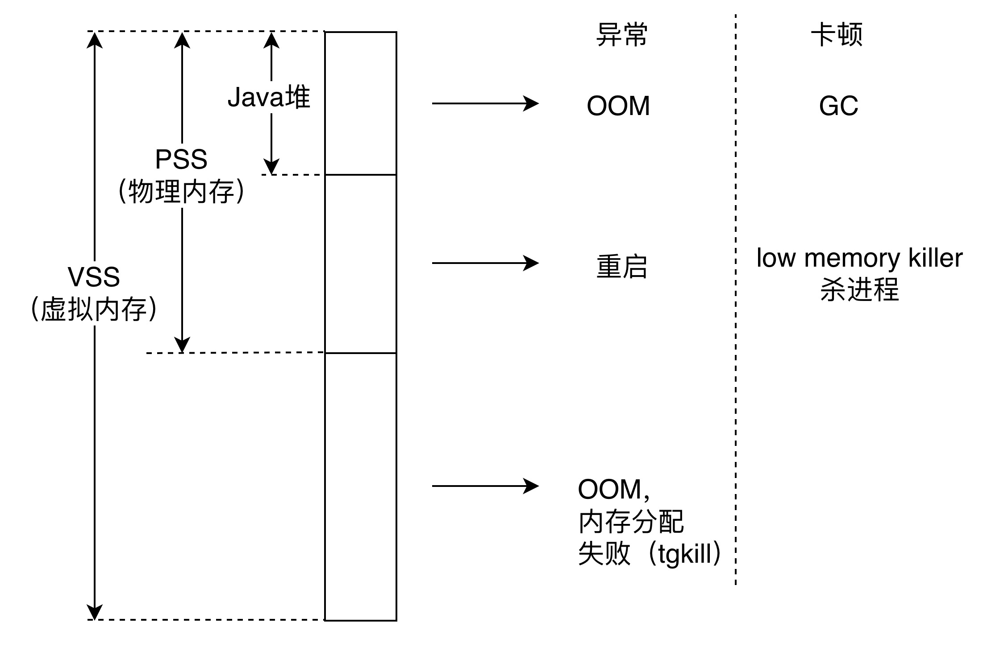
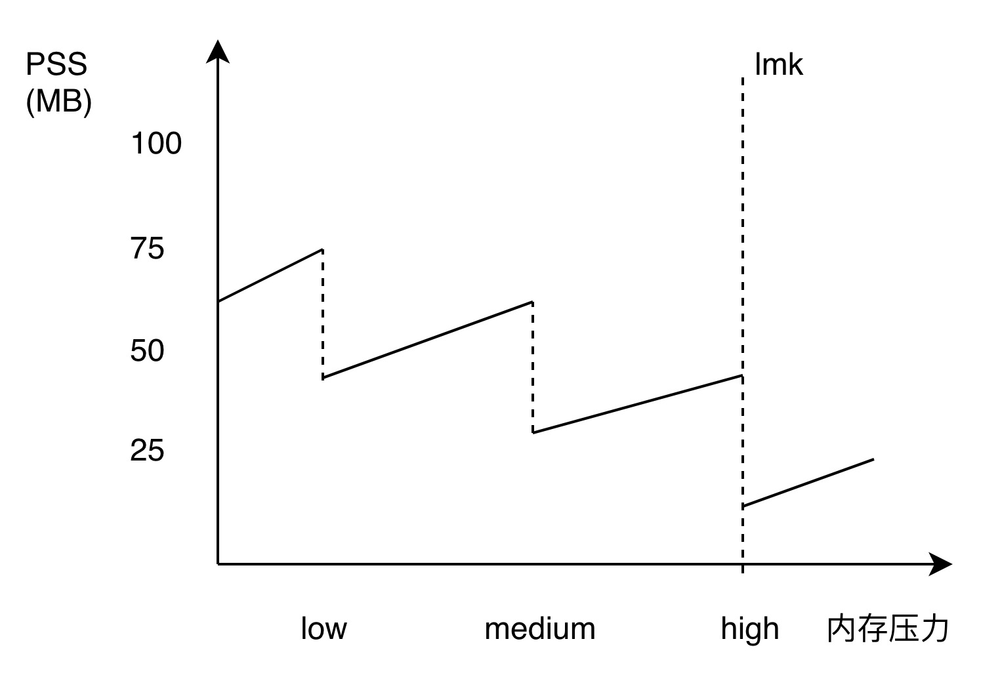
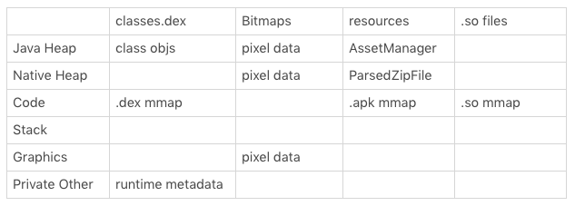

# 内存问题

“内存优化”是崩溃优化工作中非常重要的一部分。类似 OOM，很多的“异常退出”其实都是由内存问题引起。那么内存究竟能引发什么样的问题呢？

1. 两个问题

   内存造成的第一个问题是**异常**。在前面的崩溃分析我提到过“异常率”，异常包括 OOM、内存分配失败这些崩溃，也包括因为整体内存不足导致应用被杀死、设备重启等问题。不知道你平时是否在工作中注意过，如果我们把用户设备的内存分成 2GB 以下和 2GB 以上两部分，你可以试试分别计算他们的异常率或者崩溃率，看看差距会有多大。

   内存造成的第二个问题是**卡顿**。Java 内存不足会导致频繁 GC，这个问题在 Dalvik 虚拟机会更加明显。而 ART 虚拟机在内存管理跟回收策略上都做大量优化，内存分配和 GC 效率相比提升了 5～10 倍。如果想具体测试 GC 的性能，例如暂停挂起时间、总耗时、GC 吞吐量，我们可以通过发送**SIGQUIT 信号获得 ANR 日志**。

   ```
   adb shell kill -S QUIT PID
   adb pull /data/anr/traces.txt
   ```

   它包含一些 ANR 转储信息以及 GC 的详细性能信息。

   ```
   sticky concurrent mark sweep paused:	Sum: 5.491ms 99% C.I. 1.464ms-2.133ms Avg: 1.830ms Max: 2.133ms     // GC 暂停时间
    
   Total time spent in GC: 502.251ms     // GC 总耗时
   Mean GC size throughput: 92MB/s       // GC 吞吐量
   Mean GC object throughput: 1.54702e+06 objects/s 
   ```

   还可以使用 systrace 来观察 GC 的性能耗时，这部分内容在专栏后面会详细讲到。

   除了频繁 GC 造成卡顿之外，物理内存不足时系统会触发 low memory killer 机制，系统负载过高是造成卡顿的另外一个原因。

2. 两个误区

   除了内存引起的异常和卡顿，在日常做内存优化和架构设计时，很多同学还非常容易陷入两个误区之中。

   **误区一：内存占用越少越好**

   VSS、PSS、Java 堆内存不足都可能会引起异常和卡顿。有些同学认为内存是洪水猛兽，占用越少应用的性能越好，这种认识在具体的优化过程中很容易“用力过猛”。

   应用是否占用了过多的内存，跟设备、系统和当时情况有关，而不是 300MB、400MB 这样一个绝对的数值。当系统内存充足的时候，我们可以多用一些获得更好的性能。当系统内存不足的时候，希望可以做到**“用时分配，及时释放”**，就像下面这张图一样，当系统内存出现压力时，能够迅速释放各种缓存来减少系统压力。

   

   简单回顾一下 Android Bitmap 内存分配的变化。

   - 在 Android 3.0 之前，Bitmap 对象放在 Java 堆，而像素数据是放在 Native 内存中。如果不手动调用 recycle，Bitmap Native 内存的回收完全依赖 finalize 函数回调，熟悉 Java 的同学应该知道，这个时机不太可控。
   - Android 3.0～Android 7.0 将 Bitmap 对象和像素数据统一放到 Java 堆中，这样就算我们不调用 recycle，Bitmap 内存也会随着对象一起被回收。不过 Bitmap 是内存消耗的大户，把它的内存放到 Java 堆中似乎不是那么美妙。即使是最新的华为 Mate 20，最大的 Java 堆限制也才到 512MB，可能我的物理内存还有 5GB，但是应用还是会因为 Java 堆内存不足导致 OOM。Bitmap 放到 Java 堆的另外一个问题会引起大量的 GC，对系统内存也没有完全利用起来。
   - 有没有一种实现，可以将 Bitmap 内存放到 Native 中，也可以做到和对象一起快速释放，同时 GC 的时候也能考虑这些内存防止被滥用？NativeAllocationRegistry 可以一次满足你这三个要求，Android 8.0 正是使用这个辅助回收 Native 内存的机制，来实现像素数据放到 Native 内存中。Android 8.0 还新增了硬件位图 Hardware Bitmap，它可以减少图片内存并提升绘制效率。

   **误区二：Native 内存不用管**

   虽然 Android 8.0 重新将 Bitmap 内存放回到 Native 中，那么我们是不是就可以随心所欲地使用图片呢？

   答案当然是否定的。正如前面所说当系统物理内存不足时，lmk 开始杀进程，从后台、桌面、服务、前台，直到手机重启。系统构想的场景就像下面这张图描述的一样，大家有条不絮的按照优先级排队等着被 kill。

   讲到了将图片的内存放到 Native 中，我们比较熟悉的是 Fresco 图片库在 Dalvik 会把图片放到 Native 内存中。事实上在 Android 5.0～Android 7.0，也能做到相同的效果，只是流程相对复杂一些。

   步骤一：通过直接调用 libandroid_runtime.so 中 Bitmap 的构造函数，可以得到一张空的 Bitmap 对象，而它的内存是放到 Native 堆中。但是不同 Android 版本的实现有那么一点差异，这里都需要适配。

   步骤二：通过系统的方法创建一张普通的 Java Bitmap。

   步骤三：将 Java Bitmap 的内容绘制到之前申请的空的 Native Bitmap 中。

   步骤四：将申请的 Java Bitmap 释放，实现图片内存的“偷龙转凤”。

   ```
   // 步骤一：申请一张空的 Native Bitmap
   Bitmap nativeBitmap = nativeCreateBitmap(dstWidth, dstHeight, nativeConfig, 22);
    
   // 步骤二：申请一张普通的 Java Bitmap
   Bitmap srcBitmap = BitmapFactory.decodeResource(res, id);
    
   // 步骤三：使用 Java Bitmap 将内容绘制到 Native Bitmap 中
   mNativeCanvas.setBitmap(nativeBitmap);
   mNativeCanvas.drawBitmap(srcBitmap, mSrcRect, mDstRect, mPaint);
    
   // 步骤四：释放 Java Bitmap 内存
   srcBitmap.recycle();
   srcBitmap = null；
   ```

   虽然最终图片的内存的确是放到 Native 中了，不过这个“黑科技”有两个主要问题，一个是兼容性问题，另外一个是频繁申请释放 Java Bitmap 容易导致内存抖动。

   # 测量方法

   在日常开发中，有时候我们需要去排查应用程序中的内存问题。对于系统内存和应用内存的使用情况，你可以参考 Android Developer 中 [《调查 RAM 使用情况》。](http://developer.android.com/studio/profile/investigate-ram?hl=zh-cn)

   ```
   adb shell dumpsys meminfo <package_name|pid> [-d]
   ```

   **1. Java 内存分配**
   
   有些时候我们希望跟踪 Java 堆内存的使用情况，这个时候最常用的有 Allocation Tracker 和 MAT 这两个工具。
   
   在我曾经写过的[《Android 内存申请分析》](http://mp.weixin.qq.com/s/b_lFfL1mDrNVKj_VAcA2ZA)里，提到过 Allocation Tracker 的三个缺点。
   
   - 获取的信息过于分散，中间夹杂着不少其他的信息，很多信息不是应用申请的，可能需要进行不少查找才能定位到具体的问题。
   - 跟 Traceview 一样，无法做到自动化分析，每次都需要开发者手工开始 / 结束，这对于某些问题的分析可能会造成不便，而且对于批量分析来说也比较困难。
   - 虽然在 Allocation Tracking 的时候，不会对手机本身的运行造成过多的性能影响，但是在停止的时候，直到把数据 dump 出来之前，经常会把手机完全卡死，如果时间过长甚至会直接 ANR。
   
   因此我们希望可以做到脱离 Android Studio，实现一个自定义的“Allocation Tracker”，实现对象内存的自动化分析。通过这个工具可以获取所有对象的申请信息（大小、类型、堆栈等），可以找到一段时间内那些对象占用了大量的内存。
   
   但是这个方法需要考虑的兼容性问题会比较多，在 Dalvik 和 ART 中，Allocation Tracker 的处理流程差异就非常大。下面是在 Dalvik 和 ART 中，Allocation Tacker 的开启方式。
   
   ```
   // dalvik
   bool dvmEnableAllocTracker()
   // art
   void setAllocTrackingEnabled()
   ```
   
   可以用自定义的“Allocation Tracker”来监控 Java 内存的监控，也可以拓展成实时监控 Java 内存泄漏。
   
   **2. Native 内存分配**
   
   Android 的 Native 内存分析是一直做得非常不好，当然 Google 在近几个版本也做了大量努力，让整个过程更加简单。
   
   首先 Google 之前将 Valgrind 弃用，建议我们使用 Chromium 的[AddressSanitize](http://source.android.com/devices/tech/debug/asan.html) 。遵循**“谁最痛，谁最需要，谁优化”**，所以 Chromium 出品了一大堆 Native 相关的工具。Android 之前对 AddressSanitize 支持的不太好，需要 root 和一大堆的操作，但在 Android 8.0 之后，我们可以根据这个[指南](http://github.com/google/sanitizers/wiki/AddressSanitizerOnAndroid)来使用 AddressSanitize。目前 AddressSanitize 内存泄漏检测只支持 x86_64 Linux 和 OS X 系统，不过相信 Google 很快就可以支持直接在 Android 上进行检测了。
   
   那我们有没有类似 Allocation Tracker 那样的 Native 内存分配工具呢？在这方面，Android 目前的支持还不是太好，但 Android Developer 近来也补充了一些相关的文档，你可以参考[《调试本地内存使用》](http://source.android.com/devices/tech/debug/native-memory)。关于 Native 内存的问题，有两种方法，分别是**Malloc 调试**和**Malloc 钩子**。
   
   [Malloc 调试](http://android.googlesource.com/platform/bionic/+/master/libc/malloc_debug/README.md)可以帮助我们去调试 Native 内存的一些使用问题，例如堆破坏、内存泄漏、非法地址等。Android 8.0 之后支持在非 root 的设备做 Native 内存调试，不过跟 AddressSanitize 一样，需要通过[wrap.sh](http://developer.android.com/ndk/guides/wrap-script.html)做包装。
   
   ```
   adb shell setprop wrap.<APP> '"LIBC_DEBUG_MALLOC_OPTIONS=backtrace logwrapper"'
   ```
   
   [Malloc 钩子](http://android.googlesource.com/platform/bionic/+/master/libc/malloc_hooks/README.md)是在 Android P 之后，Android 的 libc 支持拦截在程序执行期间发生的所有分配 / 释放调用，这样我们就可以构建出自定义的内存检测工具。
   
   ```
   adb shell setprop wrap.<APP> '"LIBC_HOOKS_ENABLE=1"'
   ```
   
   但是在使用“Malloc 调试”时，感觉整个 App 都会变卡，有时候还会产生 ANR。


# 内存优化探讨

那要进行内存优化，应该从哪里着手呢？我通常会从设备分级、Bitmap 优化和内存泄漏这三个方面入手。

**1. 设备分级**

相信你肯定遇到过，同一个应用在 4GB 内存的手机运行得非常流畅，但在 1GB 内存的手机就不一定可以做到，而且在系统空闲和繁忙的时候表现也不太一样。

**内存优化首先需要根据设备环境来综合考虑**，专栏上一期我提到过很多同学陷入的一个误区：“内存占用越少越好”。其实我们可以让高端设备使用更多的内存，做到针对设备性能的好坏使用不同的内存分配和回收策略。

当然这需要有一个良好的架构设计支撑，在架构设计时需要做到以下几点。

- 设备分级。使用类似 device-year-class 的策略对设备分级，对于低端机用户可以关闭复杂的动画，或者是某些功能；使用 565 格式的图片，使用更小的缓存内存等。在现实环境下，不是每个用户的设备都跟我们的测试机一样高端，在开发过程我们要学会思考功能要不要对低端机开启、在系统资源吃紧的时候能不能做降级。
- 缓存管理。我们需要有一套统一的缓存管理机制，可以适当地使用内存；当“系统有难”时，也要义不容辞地归还。我们可以使用 OnTrimMemory 回调，根据不同的状态决定释放多少内存。对于大项目来说，可能存在几十上百个模块，统一缓存管理可以更好地监控每个模块的缓存大小。
- **进程模型**。一个空的进程也会占用 10MB 的内存，而有些应用启动就有十几个进程，甚至有些应用已经从双进程保活升级到四进程保活，所以减少应用启动的进程数、减少常驻进程、有节操的保活，对低端机内存优化非常重要。
- 安装包大小。安装包中的代码、资源、图片以及 so 库的体积，跟它们占用的内存有很大的关系。一个 80MB 的应用很难在 512MB 内存的手机上流畅运行。这种情况我们需要考虑针对低端机用户推出 4MB 的轻量版本，例如 Facebook Lite、今日头条极速版都是这个思路。

安装包中的代码、图片、资源以及 so 库的大小跟内存究竟有哪些关系？你可以参考下面的这个表格。

**2. Bitmap 优化**

Bitmap 内存一般占应用总内存很大一部分，所以做内存优化永远无法避开图片内存这个“永恒主题”。

即使把所有的 Bitmap 都放到 Native 内存，并不代表图片内存问题就完全解决了，这样做只是提升了系统内存利用率，减少了 GC 带来的一些问题而已。

那我们回过头来看看，到底该如何优化图片内存呢？我给你介绍两种方法。

**方法一，统一图片库。**

图片内存优化的前提是收拢图片的调用，这样我们可以做整体的控制策略。例如低端机使用 565 格式、更加严格的缩放算法，可以使用 Glide、Fresco 或者采取自研都可以。而且需要进一步将所有 Bitmap.createBitmap、BitmapFactory 相关的接口也一并收拢。

**方法二，统一监控。**

在统一图片库后就非常容易监控 Bitmap 的使用情况了，这里主要有三点需要注意。

- 大图片监控。我们需要注意某张图片内存占用是否过大，例如长宽远远大于 View 甚至是屏幕的长宽。在开发过程中，如果检测到不合规的图片使用，应该立即弹出对话框提示图片所在的 Activity 和堆栈，让开发同学更快发现并解决问题。在灰度和线上环境下可以将异常信息上报到后台，我们可以计算有多少比例的图片会超过屏幕的大小，也就是图片的**“超宽率”**。
- 重复图片监控。重复图片指的是 Bitmap 的像素数据完全一致，但是有多个不同的对象存在。这个监控不需要太多的样本量，一般只在内部使用。**之前我实现过一个内存 Hprof 的分析工具，它可以自动将重复 Bitmap 的图片和引用链输出**。下图是一个简单的例子，你可以看到两张图片的内容完全一样，通过解决这张重复图片可以节省 1MB 内存。
- 图片总内存。通过收拢图片使用，我们还可以统计应用所有图片占用的内存，这样在线上就可以按不同的系统、屏幕分辨率等维度去分析图片内存的占用情况。**在 OOM 崩溃的时候，也可以把图片占用的总内存、Top N 图片的内存都写到崩溃日志中，帮助我们排查问题**。

讲完设备分级和 Bitmap 优化，我们发现架构和监控需要两手抓，一个好的架构可以减少甚至避免我们犯错，而一个好的监控可以帮助我们及时发现问题。

**3. 内存泄漏**

内存泄漏简单来说就是没有回收不再使用的内存，排查和解决内存泄漏也是内存优化无法避开的工作之一。

内存泄漏主要分两种情况，一种是同一个对象泄漏，还有一种情况更加糟糕，就是每次都会泄漏新的对象，可能会出现几百上千个无用的对象。

很多内存泄漏都是框架设计不合理所导致，各种各样的单例满天飞，MVC 中 Controller 的生命周期远远大于 View。优秀的框架设计可以减少甚至避免程序员犯错，当然这不是一件容易的事情，所以我们还需要对内存泄漏建立持续的监控。

- **Java 内存泄漏**。建立类似 LeakCanary 自动化检测方案，至少做到 Activity 和 Fragment 的泄漏检测。在开发过程，我们希望出现泄漏时可以弹出对话框，让开发者更加容易去发现和解决问题。内存泄漏监控放到线上并不容易，我们可以对生成的 Hprof 内存快照文件做一些优化，裁剪大部分图片对应的 byte 数组减少文件大小。**比如一个 100MB 的文件裁剪后一般只剩下 30MB 左右，使用 7zip 压缩最后小于 10MB，增加了文件上传的成功率**。

- **OOM 监控**。美团有一个 Android 内存泄露自动化链路分析组件[Probe](http://ppt.geekbang.org/slide/download/876/593bc30c21689.pdf/19)，它在发生 OOM 的时候生成 Hprof 内存快照，然后通过单独进程对这个文件做进一步的分析。不过在线上使用这个工具风险还是比较大，在崩溃的时候生成内存快照**有可能会导致二次崩溃**，而且部分手机生成 Hprof 快照可能会耗时几分钟，这对用户造成的体验影响会比较大。另外，部分 OOM 是因为虚拟内存不足导致，这块需要具体问题具体分析。
- **Native 内存泄漏监控**。上一期我讲到 Malloc 调试（Malloc Debug）和 Malloc 钩子（Malloc Hook）似乎还不是那么稳定。在 WeMobileDev 最近的一篇文章[《微信 Android 终端内存优化实践》](http://mp.weixin.qq.com/s/KtGfi5th-4YHOZsEmTOsjg)中，微信也做了一些其他方案上面的尝试。
- **针对无法重编 so 的情况**，使用了 PLT Hook 拦截库的内存分配函数，其中 PLT Hook 是 Native Hook 的一种方案，后面我们还会讲到。然后重定向到我们自己的实现后记录分配的内存地址、大小、来源 so 库路径等信息，定期扫描分配与释放是否配对，对于不配对的分配输出我们记录的信息。
- **针对可重编的 so 情况**，通过 GCC 的“-finstrument-functions”参数给所有函数插桩，桩中模拟调用栈入栈出栈操作；通过 ld 的“–wrap”参数拦截内存分配和释放函数，重定向到我们自己的实现后记录分配的内存地址、大小、来源 so 以及插桩记录的调用栈此刻的内容，定期扫描分配与释放是否配对，对于不配对的分配输出我们记录的信息。

开发过程中内存泄漏排查可以使用 Androd Profiler 和 MAT 工具配合使用，而日常监控关键是成体系化，做到及时发现问题。

除了 Java 泄漏检测方案，目前 OOM 监控和 Native 内存泄漏监控都只能做到实验室自动化测试的水平。微信的 Native 监控方案也遇到一些兼容性的问题，如果想达到灰度和线上部署，需要考虑的细节会非常多。Native 内存泄漏检测在 iOS 会简单一些，不过 Google 也在一直优化 Native 内存泄漏检测的性能和易用性，相信在未来的 Android 版本将会有很大改善。

## 内存监控

前面我也提了内存泄漏的监控存在一些性能的问题，一般只会对内部人员和极少部分的用户开启。在线上我们需要通过其他更有效的方式去监控内存相关的问题。

**1. 采集方式**

用户在前台的时候，可以每 5 分钟采集一次 PSS、Java 堆、图片总内存。我建议通过采样只统计部分用户，需要注意的是要按照用户抽样，而不是按次抽样。简单来说一个用户如果命中采集，那么在一天内都要持续采集数据。

**2. 计算指标**

通过上面的数据，我们可以计算下面一些内存指标。

**内存异常率**：可以反映内存占用的异常情况，如果出现新的内存使用不当或内存泄漏的场景，这个指标会有所上涨。其中 PSS 的值可以通过 Debug.MemoryInfo 拿到。

```
内存 UV 异常率 = PSS 超过 400MB 的 UV / 采集 UV
```

**触顶率**：可以反映 Java 内存的使用情况，如果超过 85% 最大堆限制，GC 会变得更加频繁，容易造成 OOM 和卡顿。

```
内存 UV 触顶率 = Java 堆占用超过最大堆限制的 85% 的 UV / 采集 UV
```

一般客户端只上报数据，所有计算都在后台处理，这样可以做到灵活多变。后台还可以计算平均 PSS、平均 Java 内存、**平均图片占用**这些指标，它们可以反映内存的平均情况。通过平均内存和分区间内存占用这些指标，我们可以通过版本对比来监控有没有新增内存相关的问题。

**3. GC 监控**

在实验室或者内部试用环境，我们也可以通过 Debug.startAllocCounting 来监控 Java 内存分配和 GC 的情况，需要注意的是这个选项对性能有一定的影响，虽然目前还可以使用，但已经被 Android 标记为 deprecated。

通过监控，我们可以拿到内存分配的次数和大小，以及 GC 发起次数等信息。

```
long allocCount = Debug.getGlobalAllocCount();
long allocSize = Debug.getGlobalAllocSize();
long gcCount = Debug.getGlobalGcInvocationCount();
```

这些信息似乎不太容易定位问题，在 Android 6.0 之后系统可以拿到更加精准的 GC 信息。

```
// 运行的 GC 次数
Debug.getRuntimeStat("art.gc.gc-count");
// GC 使用的总耗时，单位是毫秒
Debug.getRuntimeStat("art.gc.gc-time");
// 阻塞式 GC 的次数
Debug.getRuntimeStat("art.gc.blocking-gc-count");
// 阻塞式 GC 的总耗时
Debug.getRuntimeStat("art.gc.blocking-gc-time");
```

特别注意阻塞式 GC 的次数和耗时，因为它会暂停应用线程，可能导致应用发生卡顿。我们也可以更加细粒度地分应用场景统计，例如启动、进入朋友圈、进入聊天页面等关键场景。