# 卡顿分析方法

## 基础知识

造成卡顿的原因可能有千百种，不过最终都会反映到**CPU 时间**上。我们可以把 CPU 时间分为两种：用户时间和系统时间。用户时间就是执行用户态应用程序代码所消耗的时间；系统时间就是执行内核态系统调用所消耗的时间，包括 I/O、锁、中断以及其他系统调用的时间。

**1. CPU 性能**

评价一个 CPU 的性能，需要看主频、核心数、缓存等参数，具体表现出来的是计算能力和指令执行能力，也就是每秒执行的浮点计算数和每秒执行的指令数。

```
// 获取 CPU 核心数
cat /sys/devices/system/cpu/possible  
 
// 获取某个 CPU 的频率
cat /sys/devices/system/cpu/cpu0/cpufreq/cpuinfo_max_freq
```

在开发过程中，我们需要根据设备 CPU 性能来“看菜下饭”，例如线程池使用线程数根据 CPU 的核心数，一些高级的 AI 功能只在主频比较高或者带有 NPU 的设备开启。

回到前面我讲的 CPU 时间，也就是用户时间和系统时间。当出现卡顿问题的时候，应该怎么去区分究竟是我们代码的问题，还是系统的问题？用户时间和系统时间可以给我们哪些线索？这里还要集合两个非常重要的指标，可以帮助我们做判断。

**2. 卡顿问题分析指标**

出现卡顿问题后，首先我们应该查看**CPU 的使用率**。怎么查呢？我们可以通过`/proc/stat`得到整个系统的 CPU 使用情况，通过`/proc/[pid]/stat`可以得到某个进程的 CPU 使用情况。

关于 stat 文件各个属性的含义和 CPU 使用率的计算，你可以阅读[《Linux 环境下进程的 CPU 占用率》](http://www.samirchen.com/linux-cpu-performance/)和[Linux 文档](http://man7.org/linux/man-pages/man5/proc.5.html)。其中比较重要的字段有：

```
proc/self/stat:
  utime:       用户时间，反应用户代码执行的耗时  
  stime:       系统时间，反应系统调用执行的耗时
  majorFaults：需要硬盘拷贝的缺页次数
  minorFaults：无需硬盘拷贝的缺页次数
```

如果 CPU 使用率长期大于 60% ，表示系统处于繁忙状态，就需要进一步分析用户时间和系统时间的比例。对于普通应用程序，系统时间不会长期高于 30%，如果超过这个值，我们就应该进一步检查是 I/O 过多，还是其他的系统调用问题。

Android 是站在 Linux 巨人的肩膀上，虽然做了不少修改也砍掉了一些工具，但还是保留了很多有用的工具可以协助我们更容易地排查问题，这里我给你介绍几个常用的命令。例如，**top 命令**可以帮助我们查看哪个进程是 CPU 的消耗大户；**vmstat 命令**可以实时动态监视操作系统的虚拟内存和 CPU 活动；**strace 命令**可以跟踪某个进程中所有的系统调用。

除了 CPU 的使用率，我们还需要查看**CPU 饱和度**。CPU 饱和度反映的是线程排队等待 CPU 的情况，也就是 CPU 的负载情况。

CPU 饱和度首先会跟应用的线程数有关，如果启动的线程过多，容易导致系统不断地切换执行的线程，把大量的时间浪费在上下文切换，我们知道每一次 CPU 上下文切换都需要刷新寄存器和计数器，至少需要几十纳秒的时间。

我们可以通过使用`vmstat`命令或者`/proc/[pid]/schedstat`文件来查看 CPU 上下文切换次数，这里特别需要注意`nr_involuntary_switches`被动切换的次数。

```
proc/self/sched:
  nr_voluntary_switches：     
  主动上下文切换次数，因为线程无法获取所需资源导致上下文切换，最普遍的是 IO。    
  nr_involuntary_switches：   
  被动上下文切换次数，线程被系统强制调度导致上下文切换，例如大量线程在抢占 CPU。
  se.statistics.iowait_count：IO 等待的次数
  se.statistics.iowait_sum：  IO 等待的时间
```

也可以通过 uptime 命令可以检查 CPU 在 1 分钟、5 分钟和 15 分钟内的平均负载。比如一个 4 核的 CPU，如果当前平均负载是 8，这意味着每个 CPU 上有一个线程在运行，还有一个线程在等待。一般平均负载建议控制在“0.7 × 核数”以内。

```
00:02:39 up 7 days, 46 min,  0 users,  
load average: 13.91, 14.70, 14.32
```

另外一个会影响 CPU 饱和度的是线程优先级，线程优先级会影响 Android 系统的调度策略，它主要由 nice 和 cgroup 类型共同决定。nice 值越低，抢占 CPU 时间片的能力越强。当 CPU 空闲时，线程的优先级对执行效率的影响并不会特别明显，但在 CPU 繁忙的时候，线程调度会对执行效率有非常大的影响。

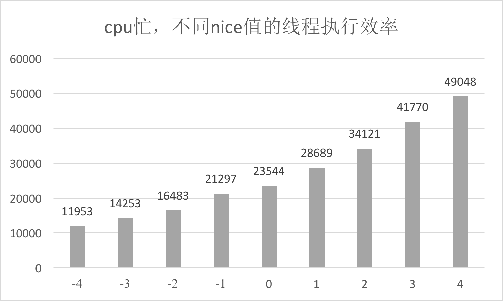

关于线程优先级，你需要注意**是否存在高优先级的线程空等低优先级线程，例如主线程等待某个后台线程的锁**。从应用程序的角度来看，无论是用户时间、系统时间，还是等待 CPU 的调度，都是程序运行花费的时间。

## Android 卡顿排查工具

可能你会觉得按照上面各种 Linux 命令组合来排查问题太麻烦了，有没有更简单的、图形化的操作界面呢？Traceview 和 systrace 都是我们比较熟悉的排查卡顿的工具，从实现上这些工具分为两个流派。

第一个流派是 instrument。获取一段时间内所有函数的调用过程，可以通过分析这段时间内的函数调用流程，再进一步分析待优化的点。

第二个流派是 sample。有选择性或者采用抽样的方式观察某些函数调用过程，可以通过这些有限的信息推测出流程中的可疑点，然后再继续细化分析。

这两种流派有什么差异？我们在什么场景应该选择哪种合适的工具呢？还有没有其他有用的工具可以使用呢？下面我们一一来看。

**1. Traceview**

[Traceview](http://developer.android.com/studio/profile/generate-trace-logs)是我第一个使用的性能分析工具，也是吐槽的比较多的工具。它利用 Android Runtime 函数调用的 event 事件，将函数运行的耗时和调用关系写入 trace 文件中。

由此可见，Traceview 属于 instrument 类型，它可以用来查看整个过程有哪些函数调用，但是工具本身带来的性能开销过大，有时无法反映真实的情况。比如一个函数本身的耗时是 1 秒，开启 Traceview 后可能会变成 5 秒，而且这些函数的耗时变化并不是成比例放大。

**2. Nanoscope**

那在 instrument 类型的性能分析工具里，有没有性能损耗比较小的呢？

答案是有的，Uber 开源的[Nanoscope](http://github.com/uber/nanoscope)就能达到这个效果。它的实现原理是直接修改 Android 虚拟机源码，在`ArtMethod`执行入口和执行结束位置增加埋点代码，将所有的信息先写到内存，等到 trace 结束后才统一生成结果文件。

在使用过程可以明显感觉到应用不会因为开启 Nanoscope 而感到卡顿，但是 trace 结束生成结果文件这一步需要的时间比较长。**另一方面它可以支持分析任意一个应用，可用于做竞品分析。**

但是它也有不少限制：

- 需要自己刷 ROM，并且当前只支持 Nexus 6P，或者采用其提供的 x86 架构的模拟器。
- 默认只支持主线程采集，其他线程需要[代码手动设置](http://github.com/uber/nanoscope/wiki/Architecture%3A-Nanoscope-ROM#java-api)。考虑到内存大小的限制，每个线程的内存数组只能支持大约 20 秒左右的时间段。

Uber 写了一系列自动化脚本协助整个流程，使用起来还算简单。Nanoscope 作为基本没有性能损耗的 instrument 工具，它非常适合做启动耗时的自动化分析。

Nanoscope 生成的是符合 Chrome tracing 规范的 HTML 文件。我们可以通过脚本来实现两个功能：

第一个是反混淆。通过 mapping 自动反混淆结果文件。

第二个是自动化分析。传入相同的起点和终点，实现两个结果文件的 diff，自动分析差异点。

这样我们可以每天定期去跑自动化启动测试，查看是否存在新增的耗时点。**我们有时候为了实现更多定制化功能或者拿到更加丰富的信息，这个时候不得不使用定制 ROM 的方式。而 Nanoscope 恰恰是一个很好的工具，可以让我们更方便地实现定制 ROM，在后面启动和 I/O 优化里我还会提到更多类似的案例。**

**3. systrace**

[systrace](http://source.android.com/devices/tech/debug/systrace?hl=zh-cn)是 Android 4.1 新增的性能分析工具。我通常使用 systrace 跟踪系统的 I/O 操作、CPU 负载、Surface 渲染、GC 等事件。

systrace 利用了 Linux 的[ftrace](http://source.android.com/devices/tech/debug/ftrace)调试工具，相当于在系统各个关键位置都添加了一些性能探针，也就是在代码里加了一些性能监控的埋点。Android 在 ftrace 的基础上封装了[atrace](http://android.googlesource.com/platform/frameworks/native/+/master/cmds/atrace/atrace.cpp)，并增加了更多特有的探针，例如 Graphics、Activity Manager、Dalvik VM、System Server 等。

systrace 工具只能监控特定系统调用的耗时情况，所以它是属于 sample 类型，而且性能开销非常低。但是它不支持应用程序代码的耗时分析，所以在使用时有一些局限性。

由于系统预留了`Trace.beginSection`接口来监听应用程序的调用耗时，那我们有没有办法在 systrace 上面自动增加应用程序的耗时分析呢？

划重点了，我们可以通过**编译时给每个函数插桩**的方式来实现，也就是在重要函数的入口和出口分别增加`Trace.beginSection`和`Trace.endSection`。当然出于性能的考虑，我们会过滤大部分指令数比较少的函数，这样就实现了在 systrace 基础上增加应用程序耗时的监控。通过这样方式的好处有：

- 可以看到整个流程系统和应用程序的调用流程。包括系统关键线程的函数调用，例如渲染耗时、线程锁，GC 耗时等。
- 性能损耗可以接受。由于过滤了大部分的短函数，而且没有放大 I/O，所以整个运行耗时不到原来的两倍，基本可以反映真实情况。

systrace 生成的也是 HTML 格式的结果，我们利用跟 Nanoscope 相似方式实现对反混淆的支持。

**4. Simpleperf**

那如果我们想分析 Native 函数的调用，上面的三个工具都不能满足这个需求。

Android 5.0 新增了[Simpleperf](http://android.googlesource.com/platform/system/extras/+/master/simpleperf/doc/README.md)性能分析工具，它利用 CPU 的性能监控单元（PMU）提供的硬件 perf 事件。使用 Simpleperf 可以看到所有的 Native 代码的耗时，有时候一些 Android 系统库的调用对分析问题有比较大的帮助，例如加载 dex、verify class 的耗时等。

Simpleperf 同时封装了 systrace 的监控功能，通过 Android 几个版本的优化，现在 Simpleperf 比较友好地支持 Java 代码的性能分析。具体来说分几个阶段：

第一个阶段：在 Android M 和以前，Simpleperf 不支持 Java 代码分析。

第二个阶段：在 Android O 和以前，需要手动指定编译 OAT 文件。

第三个阶段：在 Android P 和以后，无需做任何事情，Simpleperf 就可以支持 Java 代码分析。

从这个过程可以看到 Google 还是比较看重这个功能，在 Android Studio 3.2 也在 Profiler 中直接支持 Simpleperf。

顾名思义，从名字就能看出 Simpleperf 是属于 sample 类型，它的性能开销非常低，使用火焰图展示分析结果。

**如果需要分析 Native 代码的耗时，可以选择 Simpleperf；如果想分析系统调用，可以选择 systrace；如果想分析整个程序执行流程的耗时，可以选择 Traceview 或者插桩版本的 systrace。**

## 可视化方法

在 Android Studio 3.2 的 Profiler 中直接集成了几种性能分析工具，其中：

- Sample Java Methods 的功能类似于 Traceview 的 sample 类型。
- Trace Java Methods 的功能类似于 Traceview 的 instrument 类型。
- Trace System Calls 的功能类似于 systrace。
- SampleNative (API Level 26+) 的功能类似于 Simpleperf。

坦白来说，Profiler 界面在某些方面不如这些工具自带的界面，支持配置的参数也不如命令行，不过 Profiler 的确大大降低了开发者的使用门槛。

另外一个比较大的变化是分析结果的展示方式，这些分析工具都支持了 Call Chart 和 Flame Chart 两种展示方式。下面我来讲讲这两种展示方式适合的场景。

**1. Call Chart**

Call Chart 是 Traceview 和 systrace 默认使用的展示方式。它按照应用程序的函数执行顺序来展示，适合用于分析整个流程的调用。举一个最简单的例子，A 函数调用 B 函数，B 函数调用 C 函数，循环三次，就得到了下面的 Call Chart。

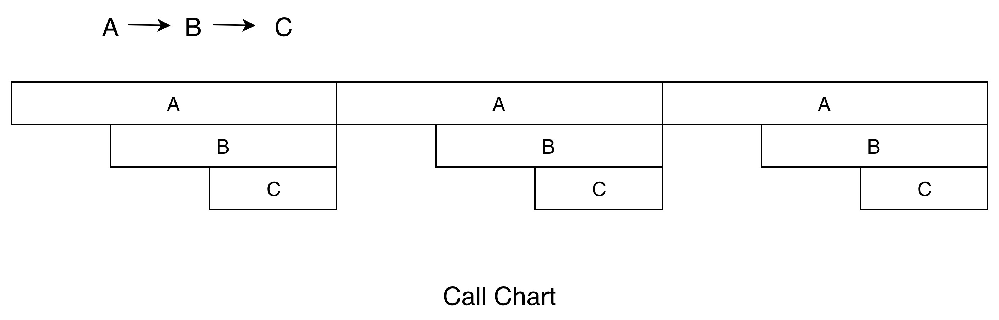

Call Chart 就像给应用程序做一个心电图，我们可以看到在这一段时间内，各个线程的具体工作，比如是否存在线程间的锁、主线程是否存在长时间的 I/O 操作、是否存在空闲等。

**2. Flame Chart**

Flame Chart 也就是大名鼎鼎的[火焰图](http://www.brendangregg.com/flamegraphs.html)。它跟 Call Chart 不同的是，Flame Chart 以一个全局的视野来看待一段时间的调用分布，它就像给应用程序拍 X 光片，可以很自然地把时间和空间两个维度上的信息融合在一张图上。上面函数调用的例子，换成火焰图的展示结果如下。

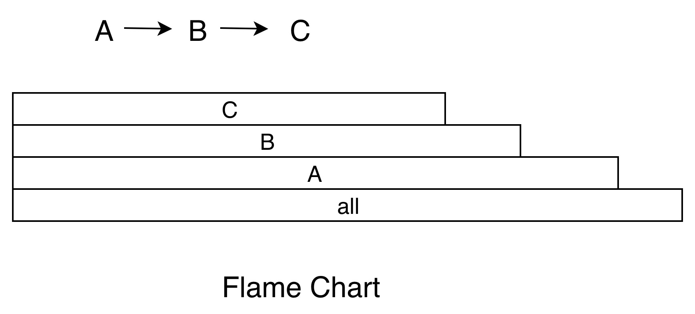

当我们不想知道应用程序的整个调用流程，只想直观看出哪些代码路径花费的 CPU 时间较多时，火焰图就是一个非常好的选择。例如，之前我的一个反序列化实现非常耗时，通过火焰图发现耗时最多的是大量 Java 字符串的创建和拷贝，通过将核心实现转为 Native，最终使性能提升了很多倍。

火焰图还可以使用在各种各样的维度，例如内存、I/O 的分析。有些内存可能非常缓慢地泄漏，通过一个内存的火焰图，我们就知道哪些路径申请的内存最多，有了火焰图我们根本不需要分析源代码，也不需要分析整个流程。

最后我想说，每个工具都可以生成不同的展示方式，我们需要根据不同的使用场景选择合适的方式。

## 总结

在写今天的文章，也就是分析卡顿的基础知识和四种 Android 卡顿排查工具时，我越发觉得底层基础知识的重要性。Android 底层基于 Linux 内核，像 systrace、Simpleperf 也是利用 Linux 提供的机制实现，因此学习一些 Linux 的基础知识，对于理解这些工具的工作原理以及排查性能问题，都有很大帮助。

另一方面，虽然很多大厂有专门的性能优化团队，但我觉得鼓励和培养团队里的每一个人都去关注性能问题更加重要。我们在使用性能工具的同时，要学会思考，应该知道它们的原理和局限性。更进一步来说，你还可以尝试去为这些工具做一些优化，从而实现更加完善的方案。


# 监控应用卡顿

## 卡顿监控

前面我讲过监控 ANR 的方法，不过也提到两个问题：一个是高版本的系统没有权限读取系统的 ANR 日志；另一个是 ANR 太依赖系统实现，我们无法灵活控制参数，例如我觉得主线程卡顿 3 秒用户已经不太能忍受，而默认参数只能监控至少 5 秒以上的卡顿。

所以现实情况就要求我们需要采用其他的方式来监控是否出现卡顿问题，并且针对特定场景还要监控其他特定的指标。

**1. 消息队列**

我设计的第一套监控卡顿的方案是**基于消息队列实现**，通过替换 Looper 的 Printer 实现。在 2013 年的时候，我写过一个名为 WxPerformanceTool 的性能监控工具，其中耗时监控就使用了这个方法。后面这个工具在腾讯公共组件做了内部开源，还获得了 2013 年的年度十佳组件。

还没庆祝完，很快就有同事跟我吐槽一个问题：线上开启了这个监控模块，快速滑动时平均帧率起码降低 5 帧。我通过 Traceview 一看，发现是因为上面图中所示的大量字符串拼接导致性能损耗严重。

后来很快又想到了另外一个方案，可以通过一个监控线程，每隔 1 秒向主线程消息队列的头部插入一条空消息。假设 1 秒后这个消息并没有被主线程消费掉，说明阻塞消息运行的时间在 0～1 秒之间。换句话说，如果我们需要监控 3 秒卡顿，那在第 4 次轮询中头部消息依然没有被消费的话，就可以确定主线程出现了一次 3 秒以上的卡顿。

这个方案也存在一定的误差，那就是发送空消息的间隔时间。但这个间隔时间也不能太小，因为监控线程和主线程处理空消息都会带来一些性能损耗，但基本影响不大。

**2. 插桩**

不过在使用了一段时间之后，我感觉还是有那么一点不爽。基于消息队列的卡顿监控并不准确，正在运行的函数有可能并不是真正耗时的函数。这是为什么呢？

我画张图解释起来就清楚了。我们假设一个消息循环里面顺序执行了 A、B、C 三个函数，当整个消息执行超过 3 秒时，因为函数 A 和 B 已经执行完毕，我们只能得到的正在执行的函数 C 的堆栈，事实上它可能并不耗时。

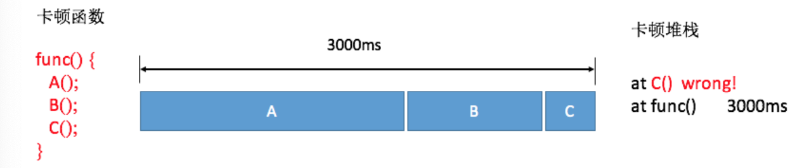

**不过对于线上大数据来说，因为函数 A 和 B 相对比较耗时，所以抓取到它们的概率会更大一些，通过后台聚合后捕获到函数 A 和 B 的卡顿日志会更多一些。**

这也是我们线上目前依然使用基于消息队列的方法，但是肯定希望可以做到跟 Traceview 一样，可以拿到整个卡顿过程所有运行函数的耗时，就像下面图中的结果，可以明确知道其实函数 A 和 B 才是造成卡顿的主要原因。

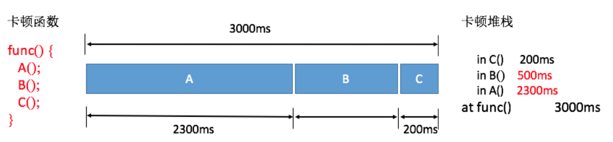

能否直接利用 Android Runtime 函数调用的回调事件，做一个自定义的 Traceview++ 呢？

答案是可以的，但是需要使用 Inline Hook 技术。我们可以实现类似 Nanoscope 先写内存的方案，但考虑到兼容性问题，这套方案并没有用到线上。

对于大体量的应用，稳定性是第一考虑因素。那如果在编译过程插桩，兼容性问题肯定是 OK 的。上一讲讲到 systrace 可以通过插桩自动生成 Trace Tag，我们一样也可以在函数入口和出口加入耗时监控的代码，但是需要考虑的细节有很多。

- **避免方法数暴增**。在函数的入口和出口应该插入相同的函数，在编译时提前给代码中每个方法分配一个独立的 ID 作为参数。
- **过滤简单的函数**。过滤一些类似直接 return、i++ 这样的简单函数，并且支持黑名单配置。对一些调用非常频繁的函数，需要添加到黑名单中来降低整个方案对性能的损耗。

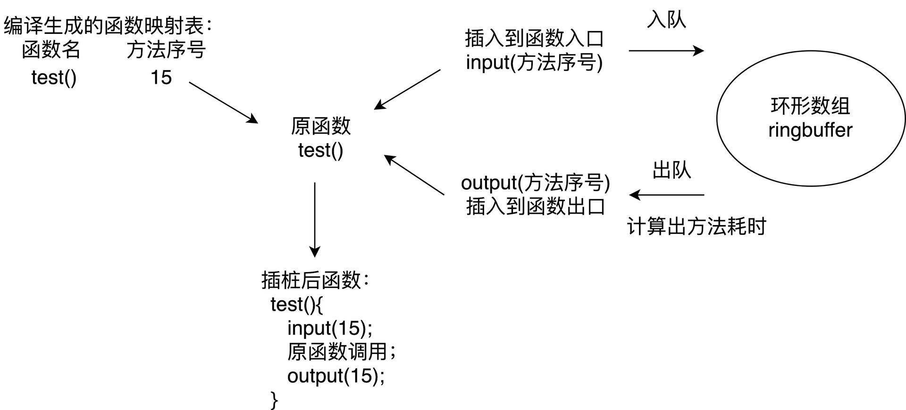

基于性能的考虑，线上只会监控主线程的耗时。微信的 Matrix 使用的就是这个方案，因为做了大量的优化，所以最终安装包体积只增大 1～2%，平均帧率下降也在 2 帧以内。虽然插桩方案对性能的影响总体还可以接受，但只会在灰度包使用。

插桩方案看起来美好，它也有自己的短板，那就是只能监控应用内自身的函数耗时，无法监控系统的函数调用，整个堆栈看起来好像“缺失了”一部分。

**3. Profilo**

2018 年 3 月，Facebook 开源了一个叫[Profilo](http://github.com/facebookincubator/profilo)的库，它收集了各大方案的优点，令我眼前一亮。具体来说有以下几点：

**第一，集成 atrace 功能**。ftrace 所有性能埋点数据都会通过 trace_marker 文件写入内核缓冲区，Profilo 通过 PLT Hook 拦截了写入操作，选择部分关心的事件做分析。这样所有 systrace 的探针我们都可以拿到，例如四大组件生命周期、锁等待时间、类校验、GC 时间等。

**不过大部分的 atrace 事件都比较笼统，从事件“B|pid|activityStart”，我们并不知道具体是哪个 Activity 的创建**。同样我们可以统计 GC 相关事件的耗时，但是也不知道为什么发生了这次 GC。

**第二，快速获取 Java 堆栈**。**很多同学有一个误区，觉得在某个线程不断地获取主线程堆栈是不耗时的。但是事实上获取堆栈的代价是巨大的，它要暂停主线程的运行**。

Profilo 的实现非常精妙，它实现类似 Native 崩溃捕捉的方式快速获取 Java 堆栈，通过间隔发送 SIGPROF 信号，整个过程如下图所示。

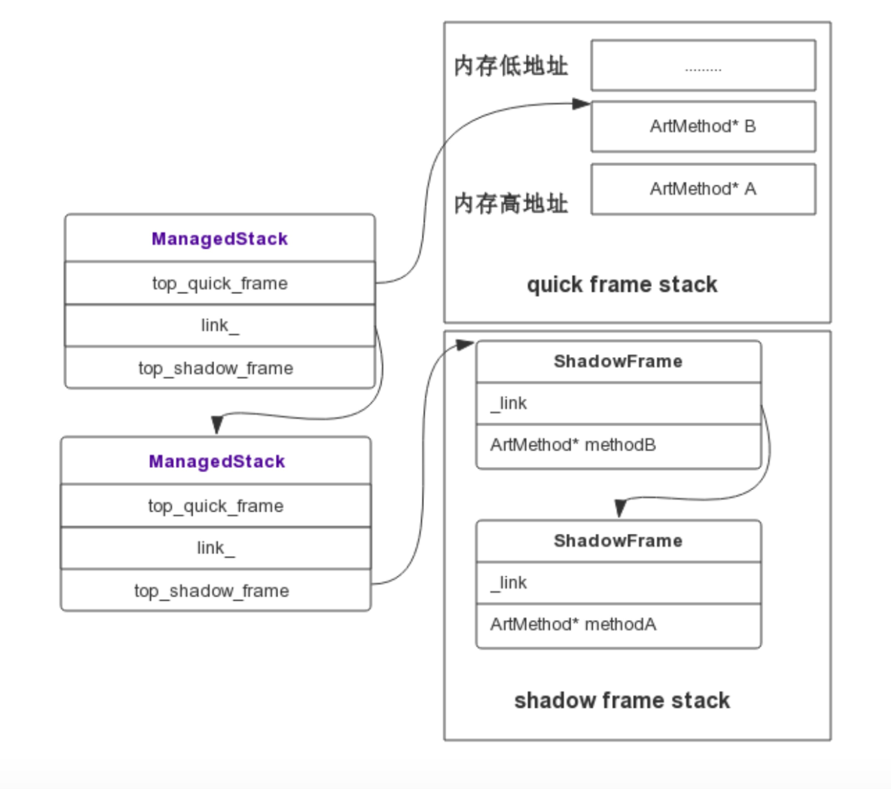

Signal Handler 捕获到信号后，拿取到当前正在执行的 Thread，通过 Thread 对象可以获取当前线程的 ManagedStack，ManagedStack 是一个单链表，它保存了当前的 ShadowFrame 或者 QuickFrame 栈指针，先依次遍历 ManagedStack 链表，然后遍历其内部的 ShadowFrame 或者 QuickFrame 还原一个可读的调用栈，从而 unwind 出当前的 Java 堆栈。通过这种方式，可以实现线程一边继续跑步，我们还可以帮它做检查，而且耗时基本忽略不计。代码可以参照：[Profilo::unwind](http://github.com/facebookincubator/profilo/blob/master/cpp/profiler/unwindc/android_712/arm/unwinder.h)和[StackVisitor::WalkStack](http://androidxref.com/7.1.1_r6/xref/art/runtime/stack.cc#772)。

不用插桩、性能基本没有影响、捕捉信息还全，那 Profilo 不就是完美的化身吗？当然由于它利用了大量的黑科技，兼容性是需要注意的问题。它内部实现有大量函数的 Hook，unwind 也需要强依赖 Android Runtime 实现。Facebook 已经将 Profilo 投入到线上使用，但由于目前 Profilo 快速获取堆栈功能依然不支持 Android 8.0 和 Android 9.0，鉴于稳定性问题，建议采取抽样部分用户的方式来开启该功能。

**先小结一下，不管我们使用哪种卡顿监控方法，最后我们都可以得到卡顿时的堆栈和当时 CPU 运行的一些信息。大部分的卡顿问题都比较好定位，例如主线程执行一个耗时任务、读一个非常大的文件或者是执行网络请求等。**

## 其他监控

除了主线程的耗时过长之外，我们还有哪些卡顿问题需要关注呢？

Android Vitals 是 Google Play 官方的性能监控服务，涉及卡顿相关的监控有 ANR、启动、帧率三个。尤其是 ANR 监控，我们应该经常的来看看，主要是 Google 自己是有权限可以准确监控和上报 ANR。

对于启动和帧率，Android Vitals 只是上报了应用的区间分布，但是不能归纳出问题。这也是我们做性能优化时比较迷惑的一点，即使发现整体的帧率比过去降低了 5 帧，也并不知道是哪里造成的，还是要花很大的力气去做二次排查。

能不能做到跟崩溃、卡顿一样，直接给我一个堆栈，告诉我就是因为这里写的不好导致帧率下降了 5 帧。退一步说，如果做不到直接告诉我堆栈，能不能告诉我是因为聊天这个页面导致的帧率下降，让我缩小二次排查的范围。

**1. 帧率**

业界都使用 Choreographer 来监控应用的帧率。跟卡顿不同的是，需要排除掉页面没有操作的情况，我们应该只在**界面存在绘制**的时候才做统计。

那么如何监听界面是否存在绘制行为呢？可以通过 addOnDrawListener 实现。

```
getWindow().getDecorView().getViewTreeObserver().addOnDrawListener
```

我们经常用平均帧率来衡量界面流畅度，但事实上电影的帧率才 24 帧，用户对于应用的平均帧率是 40 帧还是 50 帧并不一定可以感受出来。对于用户来说，感觉最明显的是连续丢帧情况，Android Vitals 将连续丢帧超过 700 毫秒定义为冻帧，也就是连续丢帧 42 帧以上。

因此，我们可以统计更有价值的冻帧率。**冻帧率就是计算发生冻帧时间在所有时间的占比**。出现丢帧的时候，我们可以获取当前的页面信息、View 信息和操作路径上报后台，降低二次排查的难度。

正如下图一样，我们还可以按照 Activity、Fragment 或者某个操作定义场景，通过细化不同场景的平均帧率和冻帧率，进一步细化问题排查的范围。

**2. 生命周期监控**

Activity、Service、Receiver 组件生命周期的耗时和调用次数也是我们重点关注的性能问题。例如 Activity 的 onCreate() 不应该超过 1 秒，不然会影响用户看到页面的时间。Service 和 Receiver 虽然是后台组件，不过它们生命周期也是占用主线程的，也是我们需要关注的问题。

对于组件生命周期我们应该采用更严格地监控，可以全量上报。在后台我们可以看到各个组件各个生命周期的启动时间和启动次数。

有一次我们发现有两个 Service 的启动次数是其他的 10 倍，经过排查发现是因为频繁的互相拉起导致。Receiver 也是这样，而且它们都需要经过 System Server。曾经有一个日志上报模块通过 Broadcast 来做跨进程通信，每秒发送几千次请求，导致系统 System Server 卡死。所以说每个组件各个生命周期的调用次数也是非常有参考价值的指标。

除了四大组件的生命周期，我们还需要监控各个进程生命周期的启动次数和耗时。通过下面的数据，我们可以看出某些进程是否频繁地拉起。

对于生命周期的监控实现，我们可以利用插件化技术 Hook 的方式。但是 Android P 之后，我还是不太推荐你使用这种方式。我更推荐使用编译时插桩的方式，**后面我会讲到 Aspect、ASM 和 ReDex 三种插桩技术的实现，敬请期待。**

**3. 线程监控**

Java 线程管理是很多应用非常头痛的事情，应用启动过程就已经创建了几十上百个线程。而且大部分的线程都没有经过线程池管理，都在自由自在地狂奔着。

另外一方面某些线程优先级或者活跃度比较高，占用了过多的 CPU。这会降低主线程 UI 响应能力，我们需要特别针对这些线程做重点的优化。

对于 Java 线程，总的来说我会监控以下两点。

- 线程数量。需要监控线程数量的多少，以及创建线程的方式。例如有没有使用我们特有的线程池，这块可以通过 got hook 线程的 nativeCreate() 函数。主要用于进行线程收敛，也就是减少线程数量。

- 线程时间。监控线程的用户时间 utime、系统时间 stime 和优先级。主要是看哪些线程 utime+stime 时间比较多，占用了过多的 CPU。**正如上一期“每课一练”所提到的，可能有一些线程因为生命周期很短导致很难发现，这里我们需要结合线程创建监控。**

  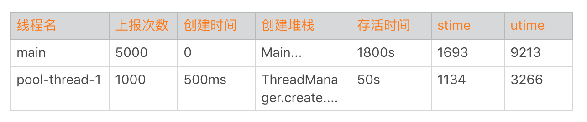

**看到这里可能有同学会比较困惑，卡顿优化的主题就是监控吗？导致卡顿的原因会有很多，比如函数非常耗时、I/O 非常慢、线程间的竞争或者锁等。其实很多时候卡顿问题并不难解决，相较解决来说，更困难的是如何快速发现这些卡顿点，以及通过更多的辅助信息找到真正的卡顿原因。**

就跟在本地使用各种卡顿分析工具一样，卡顿优化的难点在于如何把它们移植到线上，以最少的性能代价获得更加丰富的卡顿信息。当然某些卡顿问题可能是 I/O、存储或者网络引发的，后面会还有专门的内容来讲这些问题的优化方法。

## 总结

今天我们学习了卡顿监控的几种方法。随着技术的深入，我们发现了旧方案的一些缺点，通过不断地迭代和演进，寻找更好的方案。

Facebook 的 Profilo 实现了快速获取 Java 堆栈，其实它参考的是 JVM 的 AsyncGetCallTrace 思路，然后适配 Android Runtime 的实现。systrace 使用的是 Linux 的 ftrace，Simpleperf 参考了 Linux 的 perf 工具。还是熟悉的配方，还是熟悉的味道，我们很多创新性的东西，其实还是基于 Java 和 Linux 十年前的产物。

当然，为了能更好地理解这个 Sample，可能你还需要补充一些 ftrace 和 atrace 相关的背景知识。你会发现这些的确都是 Linux 十年前的一些知识，但时至今日它们依然非常有用。

1.[ftrace 简介](http://www.ibm.com/developerworks/cn/linux/l-cn-ftrace/index.html)、[ftrace 使用（上）](http://www.ibm.com/developerworks/cn/linux/l-cn-ftrace1/index.html)、[frace 使用（下）](http://www.ibm.com/developerworks/cn/linux/l-cn-ftrace2/index.html)。

2.[atrace 介绍](http://source.android.com/devices/tech/debug/ftrace)、[atrace 实现](http://android.googlesource.com/platform/frameworks/native/+/master/cmds/atrace/atrace.cpp)。


# 卡顿现场与卡顿分析

插桩或者 Profilo 的方案，可以得到卡顿过程所有运行函数的耗时。在大部分情况下，这几种方案的确非常好用，可以让我们更加明确真正的卡顿点在哪里。

但是，你肯定还遇到过很多莫名其妙的卡顿，比如读取 1KB 的文件、读取很小的 asset 资源或者只是简单的创建一个目录。

为什么看起来这么简单的操作也会耗费那么长的时间呢？那我们如何通过收集更加丰富的卡顿现场信息，进一步定位并排查问题呢？

## 卡顿现场

我先来举一个线上曾经发现的卡顿例子，下面是它的具体耗时信息。

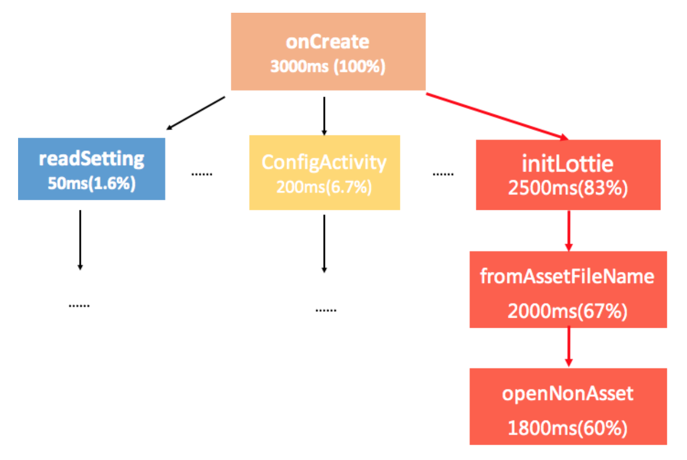

从图上看，Activity 的 onCreate 函数耗时达到 3 秒，而其中 Lottie 动画中[openNonAsset](http://androidxref.com/9.0.0_r3/xref/frameworks/base/core/java/android/content/res/AssetManager.java#852)函数耗时竟然将近 2 秒。尽管是读取一个 30KB 的资源文件，但是它的耗时真的会有那么长吗？

今天我们就一起来分析这个问题吧。

**1. Java 实现**

进一步分析 openNonAsset 相关源码的时候发现，AssetManager 内部有大量的 synchronized 锁。首先我怀疑还是锁的问题，接下来需要把卡顿时各个线程的状态以及堆栈收集起来做进一步分析。

**步骤一：获得 Java 线程状态**

通过 Thread 的 getState 方法可以获取线程状态，当时主线程果然是 BLOCKED 状态。

什么是 BLOCKED 状态呢？当线程无法获取下面代码中的 object 对象锁的时候，线程就会进入 BLOCKED 状态。

```
// 线程等待获取 object 对象锁
synchronized (object)  {
    dosomething();
}  
```

**WAITING、TIME_WAITING 和 BLOCKED 都是需要特别注意的状态。**很多同学可能对 BLOCKED 和 WAITING 这两种状态感到比较困惑，BLOCKED 是指线程正在等待获取锁，对应的是下面代码中的情况一；WAITING 是指线程正在等待其他线程的“唤醒动作”，对应的是代码中的情况二。

```
synchronized (object)  {     // 情况一：在这里卡住 --> BLOCKED
    object.wait();           // 情况二：在这里卡住 --> WAITING
}  
```

不过当一个线程进入 WAITING 状态时，它不仅会释放 CPU 资源，还会将持有的 object 锁也同时释放。对 Java 各个线程状态的定义以及转换等更多介绍，你可以参考[Thread.State](http://developer.android.com/reference/java/lang/Thread.State)和[《Java 线程 Dump 分析》](http://juejin.im/post/5b31b510e51d4558a426f7e9)。

**步骤二：获得所有线程堆栈**

接着我们在 Java 层通过 Thread.getAllStackTraces() 进一步拿所有线程的堆栈，希望知道具体是因为哪个线程导致主线程的 BLOCKED。

需要注意的是在 Android 7.0，getAllStackTraces 是不会返回主线程的堆栈的。通过分析收集上来的卡顿日志，我们发现跟 AssetManager 相关的线程有下面这个。

```
"BackgroundHandler"  RUNNABLE
  at  android.content.res.AssetManager.list
  at  com.sample.business.init.listZipFiles
```

通过查看[AssetManager.list](http://androidxref.com/9.0.0_r3/xref/frameworks/base/core/java/android/content/res/AssetManager.java#788)的确发现是使用了同一个 synchronized 锁，而 list 函数需要遍历整个目录，耗时会比较久。

```
public String[] list(String path) throws IOException {
  synchronized (this) {
    ensureValidLocked();
    return nativeList(mObject, path);
  }
}
```

**另外一方面，“BackgroundHandler”线程属于低优先级后台线程，这也是我们前面文章提到的不良现象，也就是主线程等待低优先级的后台线程。**

**2. SIGQUIT 信号实现**

Java 实现的方案看起来非常不错，也帮助我们发现了卡顿的原因。不过在我们印象中，似乎[ANR 日志](http://developer.android.com/topic/performance/vitals/anr)的信息更加丰富，那我们能不能直接用 ANR 日志呢？

比如下面的例子，它的信息的确非常全，所有线程的状态、CPU 时间片、优先级、堆栈和锁的信息应有尽有。其中 utm 代表 utime，HZ 代表 CPU 的时钟频率，将 utime 转换为毫秒的公式是“time * 1000/HZ”。例子中 utm=218，也就是 218*1000/100=2180 毫秒。

```
// 线程名称 ; 优先级 ; 线程 id; 线程状态
"main" prio=5 tid=1 Suspended
  // 线程组 ;  线程 suspend 计数 ; 线程 debug suspend 计数 ; 
  | group="main" sCount=1 dsCount=0 obj=0x74746000 self=0xf4827400
  // 线程 native id; 进程优先级 ; 调度者优先级 ;
  | sysTid=28661 nice=-4 cgrp=default sched=0/0 handle=0xf72cbbec
  // native 线程状态 ; 调度者状态 ; 用户时间 utime; 系统时间 stime; 调度的 CPU
  | state=D schedstat=( 3137222937 94427228 5819 ) utm=218 stm=95 core=2 HZ=100
  // stack 相关信息
  | stack=0xff717000-0xff719000 stackSize=8MB
```

**疑问一：Native 线程状态**

细心的你可能会发现，为什么上面的 ANR 日志中“main”线程的状态是 Suspended？想了一下，Java 线程中的 6 种状态中并不存在 Suspended 状态啊。

事实上，Suspended 代表的是 Native 线程状态。怎么理解呢？在 Android 里面 Java 线程的运行都委托于一个 Linux 标准线程 pthread 来运行，而 Android 里运行的线程可以分成两种，一种是 Attach 到虚拟机的，一种是没有 Attach 到虚拟机的，在虚拟机管理的线程都是托管的线程，所以本质上 Java 线程的状态其实是 Native 线程的一种映射。

不同的 Android 版本 Native 线程的状态不太一样，例如 Android 9.0 就定义了 27 种线程状态，它能更加明确地区分线程当前所处的情况。关于 Java 线程状态、Native 线程状态转换，你可以参考[thread_state.h](http://androidxref.com/9.0.0_r3/xref/art/runtime/thread_state.h#24)和[Thread_nativeGetStatus](http://androidxref.com/9.0.0_r3/xref/art/runtime/native/java_lang_Thread.cc#64)。

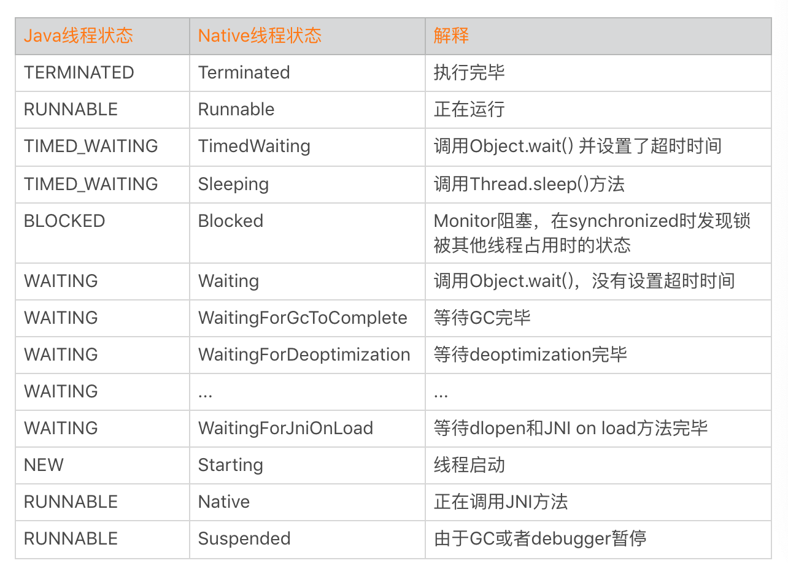

**可以看到 Native 线程状态的确更加丰富，例如将 TIMED_WAITING 拆分成 TimedWaiting 和 Sleeping 两种场景，而 WAITING 更是细化到十几种场景等，这对我们分析特定场景问题的时候会有非常大的帮助。**

**疑问二：获得 ANR 日志**

虽然 ANR 日志信息非常丰富，那问题又来了，如何拿到卡顿时的 ANR 日志呢？

我们可以利用系统 ANR 的生成机制，具体步骤是：

第一步：当监控到主线程卡顿时，主动向系统发送 SIGQUIT 信号。

第二步：等待 /data/anr/traces.txt 文件生成。

第三步：文件生成以后进行上报。

通过 ANR 日志，我们可以直接看到主线程的锁是由“BackgroundHandler”线程持有。相比之下通过 getAllStackTraces 方法，我们只能通过一个一个线程进行猜测。

```
  // 堆栈相关信息
  at android.content.res.AssetManager.open(AssetManager.java:311)
  - waiting to lock <0x41ddc798> (android.content.res.AssetManager) held by tid=66 (BackgroundHandler)
  at android.content.res.AssetManager.open(AssetManager.java:289)
```

线程间的死锁和热锁分析是一个非常有意思的话题，很多情况分析起来也比较困难，例如我们只能拿到 Java 代码中使用的锁，而且有部分类型锁的持有并不会表现在堆栈上面。对这部分内容感兴趣，想再深入一下的同学，可以认真看一下这两篇文章：[《Java 线程 Dump 分析》](http://juejin.im/post/5b31b510e51d4558a426f7e9)、[《手 Q Android 线程死锁监控与自动化分析实践》](http://cloud.tencent.com/developer/article/1064396)。

**3. Hook 实现**

用 SIGQUIT 信号量获取 ANR 日志，从而拿到所有线程的各种信息，这套方案看起来很美好。但事实上，它存在这几个问题：

- **可行性**。正如我在崩溃分析所说的一样，很多高版本系统已经没有权限读取 /data/anr/traces.txt 文件。
- **性能**。获取所有线程堆栈以及各种信息非常耗时，对于卡顿场景不一定合适，它可能会进一步加剧用户的卡顿。

那有什么方法既可以拿到 ANR 日志，整个过程又不会影响用户的体验呢？

再回想一下，在[崩溃分析](http://time.geekbang.org/column/article/70602)的时候我们就讲过一种获得所有线程堆栈的方法。它通过下面几个步骤实现。

- 通过`libart.so`、`dlsym`调用[ThreadList::ForEach](http://androidxref.com/9.0.0_r3/xref/art/runtime/thread_list.cc#1501)方法，拿到所有的 Native 线程对象。
- 遍历线程对象列表，调用[Thread::DumpState](http://androidxref.com/9.0.0_r3/xref/art/runtime/thread.cc#1615)方法。

它基本模拟了系统打印 ANR 日志的流程，但是因为整个过程使用了一些黑科技，可能会造成线上崩溃。

为了兼容性考虑，我们会通过 fork 子进程方式实现，这样即使子进程崩溃了也不会影响我们主进程的运行。**这样还可以带来另外一个非常大的好处，获取所有线程堆栈这个过程可以做到完全不卡我们主进程。**

但使用 fork 进程会导致进程号改变，源码中通过 /proc/self 方式获取的一些信息都会失败（**错误的拿了子进程的信息，而子进程只有一个线程**），例如 state、schedstat、utm、stm、core 等。不过问题也不大，这些信息可以通过指定 /proc/[父进程 id] 的方式重新获取。

```
"main" prio=7 tid=1 Native
  | group="" sCount=0 dsCount=0 obj=0x74e99000 self=0xb8811080
  | sysTid=23023 nice=-4 cgrp=default sched=0/0 handle=0xb6fccbec
  | state=? schedstat=( 0 0 0 ) utm=0 stm=0 core=0 HZ=100
  | stack=0xbe4dd000-0xbe4df000 stackSize=8MB
  | held mutexes=
```

**总的来说，通过 Hook 方式我们实现了一套“无损”获取所有 Java 线程堆栈与详细信息的方法。为了降低上报数据量，只有主线程的 Java 线程状态是 WAITING、TIME_WAITING 或者 BLOCKED 的时候，才会进一步使用这个“大杀器”。**

**4. 现场信息**

现在再来看，这样一份我们自己构造的“ANR 日志”是不是已经是收集崩溃现场信息的完全体了？它似乎缺少了我们常见的头部信息，例如进程 CPU 使用率、GC 相关的信息。

正如第 6 期文章开头所说的一样，卡顿跟崩溃一样是需要“现场信息”的。能不能进一步让卡顿的“现场信息”的比系统 ANR 日志更加丰富？我们可以进一步增加这些信息：

- **CPU 使用率和调度信息**。参考第 5 期的课后练习，我们可以得到系统 CPU 使用率、负载、各线程的 CPU 使用率以及 I/O 调度等信息。
- **内存相关信息**。我们可以添加系统总内存、可用内存以及应用各个进程的内存等信息。如果开启了 Debug.startAllocCounting 或者 atrace，还可以增加 GC 相关的信息。
- **I/O 和网络相关**。我们还可以把卡顿期间所有的 I/O 和网络操作的详细信息也一并收集，这部分内容会在后面进一步展开。

在 Android 8.0 后，Android 虚拟机终于支持了 JVM 的[JVMTI](http://www.ibm.com/developerworks/cn/java/j-lo-jpda2/index.html)机制。Profiler 中内存采集等很多模块也切换到这个机制中实现。使用它可以获得的信息非常丰富，包括内存申请、线程创建、类加载、GC 等，有大量的应用场景。

最后我们还可以利用崩溃分析中的一些思路，例如添加用户操作路径等信息，这样我们可以得到一份比系统 ANR 更加丰富的卡顿日志，这对我们解决某些疑难的卡顿问题会更有帮助。

## 卡顿分析

在客户端捕获卡顿之后，最后数据需要上传到后台统一分析。我们可以对数据做什么样的处理？应该关注哪些指标？

**1. 卡顿率**

如果把主线程卡顿超过 3 秒定义为一个卡顿问题，类似崩溃，我们会先评估卡顿问题的影响面，也就是 UV 卡顿率。

```
UV 卡顿率 = 发生过卡顿 UV / 开启卡顿采集 UV
```

因为卡顿问题一般都是抽样上报，采样规则跟内存相似，都应该按照人来抽样。一个用户如果命中采集，那么在一天内都会持续的采集数据。

UV 卡顿率可以评估卡顿的影响范围，但对于低端机器来说比较难去优化卡顿的问题。如果想评估卡顿的严重程度，我们可以使用 PV 卡顿率。

```
PV 卡顿率 = 发生过卡顿 PV / 启动采集 PV
```

需要注意的是，对于命中采集 PV 卡顿率的用户，每次启动都需要上报作为分母。

**2. 卡顿树**

发生卡顿时，我们会把 CPU 使用率和负载相关信息也添加到卡顿日志中。虽然采取了抽样策略，但每天的日志量还是达到十万级别。这么大的日志量，如果简单采用堆栈聚合日志，会发现有几百上千种卡顿类型，很难看出重点。

我们能不能实现卡顿的火焰图，在一张图里就可以看到卡顿的整体信息？

这里我非常推荐卡顿树的做法，对于超过 3 秒的卡顿，具体是 4 秒还是 10 秒，这涉及手机性能和当时的环境。我们决定抛弃具体的耗时，只按照相同堆栈出现的比例来聚合。这样我们从一棵树上面，就可以看到哪些堆栈出现的卡顿问题最多，它下面又存在的哪些分支。

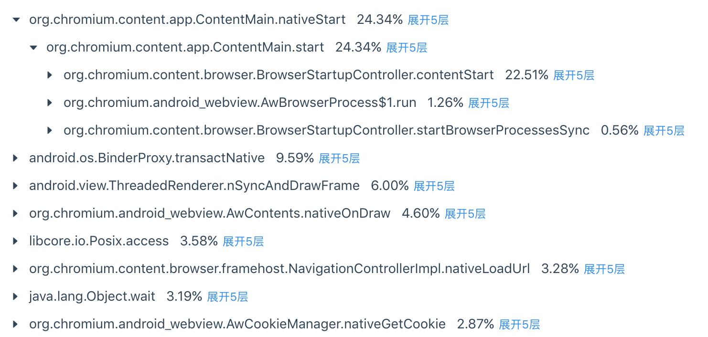

我们的精力是有限的，一般会优先去解决 Top 的卡顿问题。采用卡顿树的聚合方式，可以从全盘的角度看到 Top 卡顿问题的各个分支情况，帮助我们快速找到关键的卡顿点。