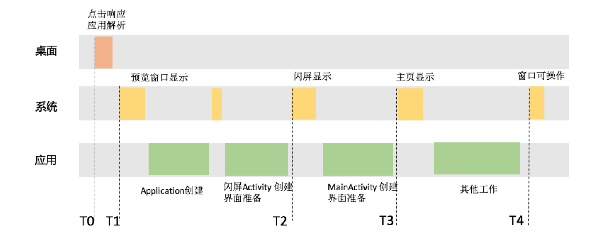
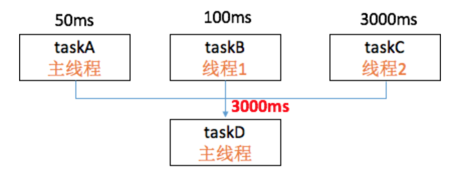
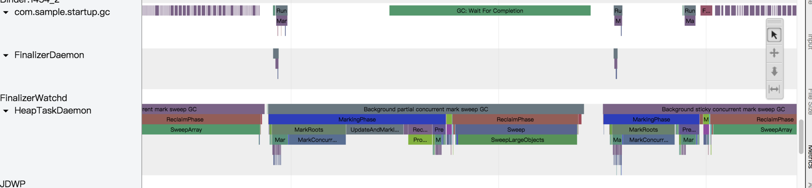
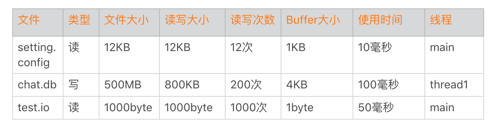
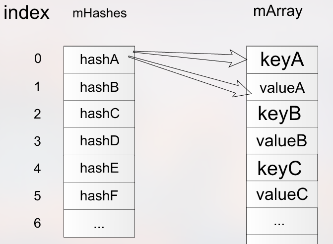
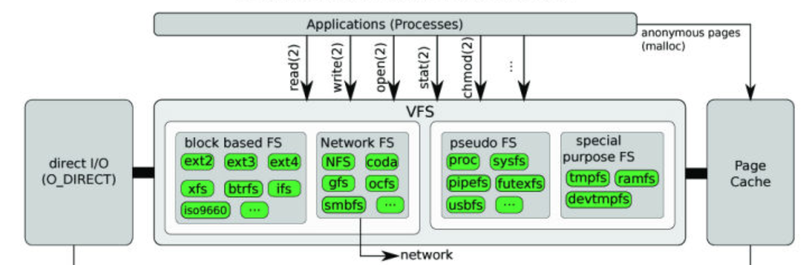
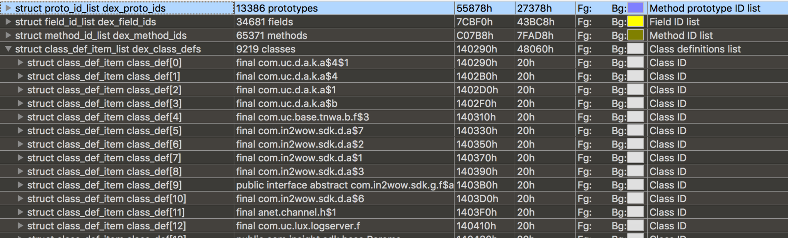
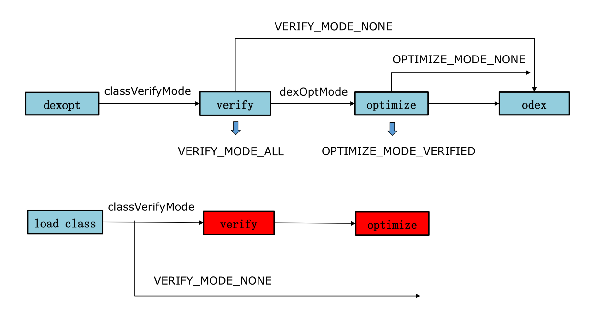

# 从启动过程看启动速度优化

## 启动分析

在真正动手开始优化之前，我们应该先搞清楚从用户点击图标开始，整个启动过程经过哪几个关键阶段，又会给用户带来哪些体验问题。

**1. 启动过程分析**



以微信为例，用户从桌面点击图标开始，会经过 4 个关键阶段。

- **T1 预览窗口显示**。系统在拉起微信进程之前，会先根据微信的 Theme 属性创建预览窗口。当然如果我们禁用预览窗口或者将预览窗口指定为透明，用户在这段时间依然看到的是桌面。
- **T2 闪屏显示**。在微信进程和闪屏窗口页面创建完毕，并且完成一系列 inflate view、onmeasure、onlayout 等准备工作后，用户终于可以看到熟悉的“小地球”。
- **T3 主页显示**。在完成主窗口创建和页面显示的准备工作后，用户可以看到微信的主界面。
- **T4 界面可操作**。在启动完成后，微信会有比较多的工作需要继续执行，例如聊天和朋友圈界面的预加载、小程序框架和进程的准备等。在这些工作完成后，用户才可以真正开始愉快地聊天。

**2. 启动问题分析**

从启动流程的 4 个关键阶段，我们可以推测出用户启动过程会遇到的 3 个问题。这 3 个问题其实也是大多数应用在启动时可能会遇到的。

- 问题 1：点击图标很久都不响应

如果我们禁用了预览窗口或者指定了透明的皮肤，那用户点击了图标之后，需要 T2 时间才能真正看到应用闪屏。对于用户体验来说，点击了图标，过了几秒还是停留在桌面，看起来就像没有点击成功，这在中低端机中更加明显。

- 问题 2：首页显示太慢

现在应用启动流程越来越复杂，闪屏广告、热修复框架、插件化框架、大前端框架，所有准备工作都需要集中在启动阶段完成。上面说的 T3 首页显示时间对于中低端机来说简直就是噩梦，经常会达到十几秒的时间。

- 问题 3：首页显示后无法操作。

既然首页显示那么慢，那我能不能把尽量多的工作都通过异步化延后执行呢？很多应用的确就是这么做的，但这会造成两种后果：要么首页会出现白屏，要么首页出来后用户根本无法操作。

很多应用把启动结束时间的统计放到首页刚出现的时候，这对用户是不负责任的。看到一个首页，但是停住十几秒都不能滑动，这对用户来说完全没有意义。**启动优化不能过于 KPI 化，要从用户的真实体验出发，要着眼从点击图标到用户可操作的整个过程。**

**1. 优化工具**

“工欲善其事必先利其器”，需要先找到一款适合做启动优化分析的工具。

回忆一下“卡顿优化”提到的几种工具。Traceview 性能损耗太大，得出的结果并不真实；Nanoscope 非常真实，不过暂时只支持 Nexus 6P 和 x86 模拟器，无法针对中低端机做测试；Simpleperf 的火焰图并不适合做启动流程分析；systrace 可以很方便地追踪关键系统调用的耗时情况，但是不支持应用程序代码的耗时分析。

综合来看，在卡顿优化中提到“systrace + 函数插桩”似乎是比较理想的方案，而且它还可以看到系统的一些关键事件，例如 GC、System Server、CPU 调度等。

我们可以通过下面的命令，可以查看手机支持哪些 systrace 类型。不同的系统支持的类型有所差别，其中 Dalvik、sched、ss、app 都是我们比较关心的。

```
python systrace.py --list-categories
```

通过插桩，可以看到应用主线程和其他线程的函数调用流程。它的实现原理非常简单，就是将下面的两个函数分别插入到每个方法的入口和出口。

```
class Trace {
  public static void i(String tag) {
    Trace.beginSection(name);
  }
 
 
  public static void o() {
      Trace.endSection();
  }
}
```

当然这里面有非常多的细节需要考虑，比如怎么样降低插桩对性能的影响、哪些函数需要被排除掉。最终改良版的 systrace 性能损耗在一倍以内，基本可以反映真实的启动流程。函数插桩后的效果如下，你也可以参考课后练习的 Sample。

**只有准确的数据评估才能指引优化的方向，这一步是非常非常重要的。我见过太多同学在没有充分评估或者评估使用了错误的方法，最终得到了错误的方向。辛辛苦苦一两个月，最后发现根本达不到预期的效果。**

**2. 优化方式**

在拿到整个启动流程的全景图之后，我们可以清楚地看到这段时间内系统、应用各个进程和线程的运行情况，现在我们要开始真正开始“干活”了。

具体的优化方式，我把它们分为闪屏优化、业务梳理、业务优化、线程优化、GC 优化和系统调用优化。

- 闪屏优化

今日头条把预览窗口实现成闪屏的效果，这样用户只需要很短的时间就可以看到“预览闪屏”。这种完全“跟手”的感觉在高端机上体验非常好，但对于中低端机，会把总的的闪屏时间变得更长。

如果点击图标没有响应，用户主观上会认为是手机系统响应比较慢。所以**我比较推荐的做法是，只在 Android 6.0 或者 Android 7.0 以上才启用“预览闪屏”方案，让手机性能好的用户可以有更好的体验**。

微信做的另外一个优化是合并闪屏和主页面的 Activity，减少一个 Activity 会给线上带来 100 毫秒左右的优化。但是如果这样做的话，管理时会非常复杂，特别是有很多例如 PWA、扫一扫这样的第三方启动流程的时候。

- 业务梳理

我们首先需要梳理清楚当前启动过程正在运行的每一个模块，哪些是一定需要的、哪些可以砍掉、哪些可以懒加载。我们也可以根据业务场景来决定不同的启动模式，例如通过扫一扫启动只需要加载需要的几个模块即可。对于中低端机器，我们要学会降级，学会推动产品经理做一些功能取舍。但是需要注意的是，**懒加载要防止集中化，否则容易出现首页显示后用户无法操作的情形**。

- 业务优化

通过梳理之后，剩下的都是启动过程一定要用的模块。这个时候，我们只能硬着头皮去做进一步的优化。优化前期需要“抓大放小”，先看看主线程究竟慢在哪里。最理想是通过算法进行优化，例如一个数据解密操作需要 1 秒，通过算法优化之后变成 10 毫秒。退而求其次，我们要考虑这些任务是不是可以通过异步线程预加载实现，**但需要注意的是过多的线程预加载会让我们的逻辑变得更加复杂。**

业务优化做到后面，会发现一些架构和历史包袱会拖累我们前进的步伐。比较常见的是一些事件会被各个业务模块监听，大量的回调导致很多工作集中执行，部分框架初始化“太厚”，例如一些插件化框架，启动过程各种反射、各种 Hook，整个耗时至少几百毫秒。还有一些历史包袱又非常沉重，而且“牵一发动全身”，改动风险比较大。但是我想说，如果有合适的时机，我们依然需要勇敢去偿还这些“历史债务”。

- 线程优化

线程优化就像做填空题和解锁题，我们希望能把所有的时间片都利用上，因此主线程和各个线程都是一直满载的。当然我们也希望每个线程都开足马力向前跑，而不是作为接力棒。**所以线程的优化主要在于减少 CPU 调度带来的波动，让应用的启动时间更加稳定。**

从具体的做法来看，线程的优化一方面是控制线程数量，线程数量太多会相互竞争 CPU 资源，因此要有统一的线程池，并且根据机器性能来控制数量。

线程切换的数据我们可以通过卡顿优化中学到的 sched 文件查看，这里特别需要注意 nr_involuntary_switches 被动切换的次数。

```
proc/[pid]/sched:
  nr_voluntary_switches：     
  主动上下文切换次数，因为线程无法获取所需资源导致上下文切换，最普遍的是 IO。    
  nr_involuntary_switches：   
  被动上下文切换次数，线程被系统强制调度导致上下文切换，例如大量线程在抢占 CPU。
```

另一方面是检查线程间的锁。为了提高启动过程任务执行的速度，有一次我们把主线程内的一个耗时任务放到线程中并发执行，但是发现这样做根本没起作用。仔细检查后发现线程内部会持有一个锁，主线程很快就有其他任务因为这个锁而等待。通过 systrace 可以看到锁等待的事件，我们需要排查这些等待是否可以优化，特别是防止主线程出现长时间的空转。


现在有很多启动框架，会使用 Pipeline 机制，根据业务优先级规定业务初始化时机。比如微信内部使用的[mmkernel](http://mp.weixin.qq.com/s/6Q818XA5FaHd7jJMFBG60w)、阿里最近开源的[Alpha](http://github.com/alibaba/alpha)启动框架，它们为各个任务建立依赖关系，最终构成一个有向无环图。对于可以并发的任务，会通过线程池最大程度提升启动速度。如果任务的依赖关系没有配置好，很容易出现下图这种情况，即主线程会一直等待 taskC 结束，空转 2950 毫秒。



- GC 优化

在启动过程，要尽量减少 GC 的次数，避免造成主线程长时间的卡顿，特别是对 Dalvik 来说，我们可以通过 systrace 单独查看整个启动过程 GC 的时间。

```
python systrace.py dalvik -b 90960 -a com.sample.gc
```

对于 GC 各个事件的具体含义，你可以参考[《调查 RAM 使用情况》](http://developer.android.com/studio/profile/investigate-ram?hl=zh-cn)。



不知道你是否还记得我在“内存优化”中提到 Debug.startAllocCounting，我们也可以使用它来监控启动过程总 GC 的耗时情况，特别是阻塞式同步 GC 的总次数和耗时。

```
// GC 使用的总耗时，单位是毫秒
Debug.getRuntimeStat("art.gc.gc-time");
// 阻塞式 GC 的总耗时
Debug.getRuntimeStat("art.gc.blocking-gc-time");
```

如果我们发现主线程出现比较多的 GC 同步等待，那就需要通过 Allocation 工具做进一步的分析。启动过程避免进行大量的字符串操作，特别是序列化跟反序列化过程。一些频繁创建的对象，例如网络库和图片库中的 Byte 数组、Buffer 可以复用。如果一些模块实在需要频繁创建对象，可以考虑移到 Native 实现。

Java 对象的逃逸也很容易引起 GC 问题，我们在写代码的时候比较容易忽略这个点。我们应该保证对象生命周期尽量的短，在栈上就进行销毁。

- 系统调用优化

通过 systrace 的 System Service 类型，我们可以看到启动过程 System Server 的 CPU 工作情况。在启动过程，我们尽量不要做系统调用，例如 PackageManagerService 操作、Binder 调用等待。

在启动过程也不要过早地拉起应用的其他进程，System Server 和新的进程都会竞争 CPU 资源。特别是系统内存不足的时候，当我们拉起一个新的进程，可能会成为“压死骆驼的最后一根稻草”。它可能会触发系统的 low memory killer 机制，导致系统杀死和拉起（保活）大量的进程，从而影响前台进程的 CPU。

讲个实践的案例，之前我们的一个程序在启动过程会拉起下载和视频播放进程，改为按需拉起后，线上启动时间提高了 3%，对于 1GB 以下的低端机优化，整个启动时间可以优化 5%～8%，效果还是非常明显的。

## 总结

今天我们首先学习了启动的整个流程，其中比较关键的是 4 个阶段。在这 4 个阶段中，用户可能会出现“点击图标很久都不响应“”首页显示太慢“和”首页显示后无法操作“这 3 个问题。

接着我们学习了启动优化和监控的一些常规方法。针对不同的业务场景、不同性能的机器，需要采用不同的策略。**有些知识点似乎比较“浅尝辄止”，我更希望你能够通过学习和实践将它们丰富起来。**

我讲到的大部分内容都是跟业务相关，业务的梳理和优化也是最快出成果的。不过这个过程我们要学会取舍，你可能遇到过，很多产品经理为了提升自己负责的模块的数据，总会逼迫开发做各种各样的预加载。但是大家都想快，最后的结果就是代码一团糟，肯定都快不起来。

比如只有 1% 用户使用的功能，却让所有用户都做预加载。面对这种情况，我们要狠下心来，只留下那些真正不能删除的业务，或者通过场景化直接找到那 1% 的用户。跟产品经理 PK 可能不是那么容易，关键在于数据。**我们需要证明启动优化带来整体留存、转化的正向价值，是大于某个业务取消预加载带来的负面影响**。


# 优化启动速度的进阶方法

## 启动进阶方法

**1. I/O 优化**

在负载过高的时候，I/O 性能下降得会比较快。特别是对于低端机，同样的 I/O 操作耗时可能是高端机器的几十倍。**启动过程不建议出现网络 I/O**，相比之下，磁盘 I/O 是启动优化一定要抠的点。首先我们要清楚启动过程读了什么文件、多少个字节、Buffer 是多大、使用了多长时间、在什么线程等一系列信息。



那么如何实现 I/O 的监控呢？我今天先卖个关子，下一期我会详细和你聊聊 I/O 方面的知识。

通过上面的数据，我们发现 chat.db 的大小竟然达到 500MB。我们经常发现本地启动明明非常快，为什么线上有些用户就那么慢？这可能是一些用户本地积累了非常多的数据，我们也发现有些微信的重度用户，他的 DB 文件竟然会超过 1GB。所以，**重度用户是启动优化一定要覆盖的群体**，我们要做一些特殊的优化策略。

还有一个是数据结构的选择问题，我们在启动过程只需要读取 Setting.sp 的几项数据，不过 SharedPreference 在初始化的时候还是要全部数据一起解析。**如果它的数据量超过 1000 条，启动过程解析时间可能就超过 100 毫秒**。如果只解析启动过程用到的数据项则会很大程度减少解析时间，启动过程适合使用随机读写的数据结构。



可以将 ArrayMap 改造成支持随机读写、延时解析的数据存储方式。同样我们今天也不再展开这部分内容，这些知识会在存储优化的相关章节进一步展开。

**2. 数据重排**

在上面的表格里面，我们读取 test.io 文件中 1KB 数据，因为 Buffer 不小心写成了 1 byte，总共要读取 1000 次。那系统是不是真的会读 1000 次磁盘呢？

事实上 1000 次读操作只是我们发起的次数，并不是真正的磁盘 I/O 次数。你可以参考下面 Linux 文件 I/O 流程。



Linux 文件系统从磁盘读文件的时候，会以 block 为单位去磁盘读取，一般 block 大小是 4KB。也就是说一次磁盘读写大小至少是 4KB，然后会把 4KB 数据放到页缓存 Page Cache 中。如果下次读取文件数据已经在页缓存中，那就不会发生真实的磁盘 I/O，而是直接从页缓存中读取，大大提升了读的速度。所以上面的例子，我们虽然读了 1000 次，但事实上只会发生一次磁盘 I/O，其他的数据都会在页缓存中得到。

Dex 文件用的到的类和安装包 APK 里面各种资源文件一般都比较小，但是读取非常频繁。我们可以利用系统这个机制将它们按照读取顺序重新排列，减少真实的磁盘 I/O 次数。

**类重排**

启动过程类加载顺序可以通过复写 ClassLoader 得到。

```
class GetClassLoader extends PathClassLoader {
    public Class<?> findClass(String name) {
        // 将 name 记录到文件
        writeToFile(name，"coldstart_classes.txt");
        return super.findClass(name);
    }
}
```

然后通过 ReDex 的[Interdex](https://github.com/facebook/redex/blob/master/docs/Interdex.md)调整类在 Dex 中的排列顺序，最后可以利用 010 Editor 查看修改后的效果。



我多次提到的[ReDex](https://github.com/facebook/redex)，是 Facebook 开源的 Dex 优化工具，它里面有非常多好用的东西，后续我们会有更详细的介绍。

**资源文件重排**

Facebook 在比较早的时候就使用“资源热图”来实现资源文件的重排，最近支付宝在[《通过安装包重排布优化 Android 端启动性能》](https://mp.weixin.qq.com/s/79tAFx6zi3JRG-ewoapIVQ)中也详细讲述了资源重排的原理和落地方法。

在实现上，它们都是通过修改 Kernel 源码，单独编译了一个特殊的 ROM。这样做的目的有三个：

- 统计。统计应用启动过程加载了安装包中哪些资源文件，比如 assets、drawable、layout 等。跟类重排一样，我们可以得到一个资源加载的顺序列表。
- 度量。在完成资源顺序重排后，我们需要确定是否真正生效。比如有哪些资源文件加载了，它是发生真实的磁盘 I/O，还是命中了 Page Cache。
- 自动化。任何代码提交都有可能改变启动过程中类和资源的加载顺序，如果完全依靠人工手动处理，这个事情很难持续下去。通过定制 ROM 的一些埋点和配合的工具，我们可以将它们放到自动化流程当中。

跟前面提到的 Nanoscope 耗时分析工具一样，当系统无法满足我们的优化需求时，就需要直接修改 ROM 的实现。Facebook“资源热图”相对比较完善，也建设了一些配套的 Dashboard 工具，希望后续可以开源出来。

事实上如果仅仅为了统计，我们也可以使用 Hook 的方式。下面是利用 Frida 实现获得 Android 资源加载顺序的方法，不过 Frida 还是相对小众，后面会替换其他更加成熟的 Hook 框架。

```
resourceImpl.loadXmlResourceParser.implementation=function(a,b,c,d){
   send('file:'+a)
   return this.loadXmlResourceParser(a,b,c,d)
}
 
 
resourceImpl.loadDrawableForCookie.implementation=function(a,b,c,d,e){
   send("file:"+a)
   return this.loadDrawableForCookie(a,b,c,d,e)
}
```

调整安装包文件排列需要修改 7zip 源码实现支持传入文件列表顺序，同样最后可以利用 010 Editor 查看修改后的效果。

这两个优化可能会带来 100～200 毫秒的提高，**我们还可以大大减少启动过程 I/O 的时间波动**。特别是对于中低端机器来说，经常发现启动时间波动非常大，这个波动跟 CPU 调度相关，但更多时候是跟 I/O 相关。

可能有同学会问，这些优化思路究竟是怎么样想出来的呢？其实利用文件系统和磁盘读取机制的优化思路，在服务端和 Windows 上早已经不是什么新鲜事。**所谓的创新，不一定是创造前所未有的东西。我们将已有的方案移植到新的平台，并且很好地结合该平台的特性将其落地，就是一个很大的创新。**

**3. 类的加载**

在 WeMobileDev 公众号发布的[《微信 Android 热补丁实践演进之路》](https://mp.weixin.qq.com/s/-NmkSwZu83HAmzKPawdTqQ)中，我提过在加载类的过程有一个 verify class 的步骤，它需要校验方法的每一个指令，是一个比较耗时的操作。



可以通过 Hook 来去掉 verify 这个步骤，这对启动速度有几十毫秒的优化。不过我想说，其实最大的优化场景在于首次和覆盖安装时。以 Dalvik 平台为例，一个 2MB 的 Dex 正常需要 350 毫秒，将 classVerifyMode 设为 VERIFY_MODE_NONE 后，只需要 150 毫秒，节省超过 50% 的时间。

```
// Dalvik Globals.h
gDvm.classVerifyMode = VERIFY_MODE_NONE;
// Art runtime.cc
verify_ = verifier::VerifyMode::kNone;
```

但是 ART 平台要复杂很多，Hook 需要兼容几个版本。而且在安装时大部分 Dex 已经优化好了，去掉 ART 平台的 verify 只会对动态加载的 Dex 带来一些好处。Atlas 中的[dalvik_hack-3.0.0.5.jar](https://github.com/alibaba/atlas/blob/master/atlas-core/libs/dalvik_hack-3.0.0.5.jar)可以通过下面的方法去掉 verify，但是当前没有支持 ART 平台。

```
AndroidRuntime runtime = AndroidRuntime.getInstance();
runtime.init(context);
runtime.setVerificationEnabled(false);
```

这个黑科技可以大大降低首次启动的速度，代价是对后续运行会产生轻微的影响。同时也要考虑兼容性问题，暂时不建议在 ART 平台使用。

**4. 黑科技**

**第一，保活**

讲到黑科技，你可能第一个想到的就是保活。保活可以减少 Application 创建跟初始化的时间，让冷启动变成温启动。不过在 Target 26 之后，保活的确变得越来越难。

对于大厂来说，可能需要寻求厂商合作的机会，例如微信的 Hardcoder 方案和 OPPO 推出的[Hyper Boost](https://www.geekpark.net/news/233791)方案。根据 OPPO 的数据，对于手机 QQ、淘宝、微信启动场景会直接有 20% 以上的优化。

有的时候你问为什么微信可以保活？为什么它可以运行的那么流畅？这里可能不仅仅是技术上的问题，当应用体量足够大，就可以倒逼厂商去专门为它们做优化。

**第二，插件化和热修复**

从 2012 年开始，淘宝、微信尝试做插件化的探索。到了 2015 年，淘宝的 Dexposed、支付宝的 AndFix 以及微信的 Tinker 等热修复技术开始“百花齐放”。

它们真的那么好吗？事实上大部分的框架在设计上都存在大量的 Hook 和私有 API 调用，带来的缺点主要有两个：

- 稳定性。虽然大家都号称兼容 100% 的机型，由于厂商的兼容性、安装失败、dex2oat 失败等原因，还是会有那么一些代码和资源的异常。Android P 推出的 non-sdk-interface 调用限制，以后适配只会越来越难，成本越来越高。
- 性能。Android Runtime 每个版本都有很多的优化，因为插件化和热修复用到的一些黑科技，导致底层 Runtime 的优化我们是享受不到的。Tinker 框架在加载补丁后，应用启动速度会降低 5%～10%。

应用加固对启动速度来说简直是灾难，有时候我们需要做一些权衡和选择。为了提升启动速度，支付宝也提出一种[GC 抑制](https://mp.weixin.qq.com/s/ePjxcyF3N1vLYvD5dPIjUw)的方案。不过首先 Android 5.0 以下的系统占比已经不高，其次这也会带来一些兼容性问题。我们还是更希望通过手段可以真正优化整个耗时，而不是一些取巧的方式。

总的来说，对于黑科技我们需要慎重，当你足够了解它们内部的机制以后，可以选择性的使用。

## 启动监控

终于千辛万苦的优化好了，我们还要找一套合理、准确的方法来度量优化的成果。同时还要对它做全方位的监控，以免被人破坏劳动果实。

**1. 实验室监控**

如果想客观地反映启动的耗时，视频录制会是一个非常好的选择。特别是我们很难拿到竞品的线上数据，所以实验室监控也非常适合做竞品的对比测试。

它的难点在于如何让实验系统准确地找到启动结束的点，这里可以通过下面两种方式。

- 80% 绘制。当页面绘制超过 80% 的时候认为是启动完成，不过可能会把闪屏当成启动结束的点，不一定是我们所期望的。
- 图像识别。手动输入一张启动结束的图片，当实验系统认为当前截屏页面有 80% 以上相似度时，就认为是启动结束。这种方法更加灵活可控，但是实现难度会稍微高一点。

启动的实验室监控可以定期自动去跑，需要注意的是，我们应该覆盖高、中、低端机不同的场景。但是使用录屏的方式也有一个缺陷，就是出现问题时我们需要人工二次定位具体是什么代码所导致的。

**2. 线上监控**

实验室覆盖的场景和机型还是有限的，是驴是马我们还是要发布到线上进行验证。针对线上，启动监控会更加复杂一些。[Android Vitals](https://developer.android.google.cn/topic/performance/vitals/launch-time)可以对应用冷启动、温启动时间做监控。

- 快开慢开比。例如 2 秒快开比、5 秒慢开比，我们可以看到有多少比例的用户体验非常好，多少比例的用户比较槽糕。
- 90% 用户的启动时间。如果 90% 的用户启动时间都小于 5 秒，那么我们 90% 区间启动耗时就是 5 秒。

此外我们还要区分启动的类型。这里要统计首次安装启动、覆盖安装启动、冷启动和温启动这些类型，一般我们都使用普通的**冷启动时间**作为指标。另一方面热启动的占比也可以反映出我们程序的活跃或保活能力。

除了指标的监控，启动的线上堆栈监控更加困难。Facebook 会利用 Profilo 工具对启动的整个流程耗时做监控，并且在后台直接对不同的版本做自动化对比，监控新版本是否有新增耗时的函数。