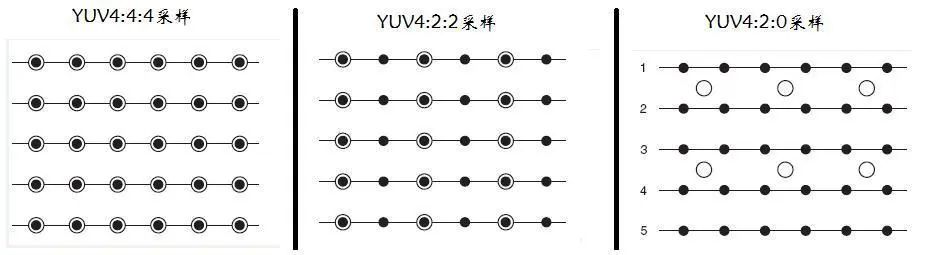
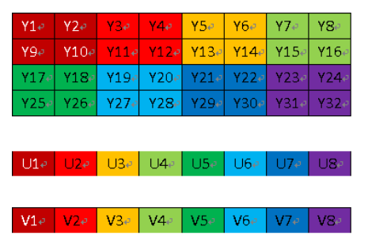
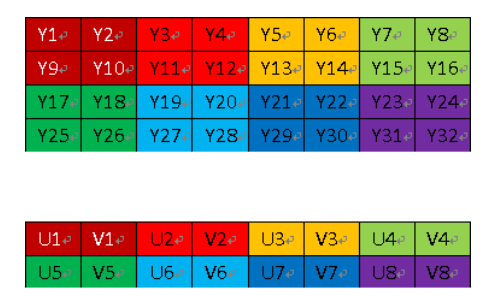
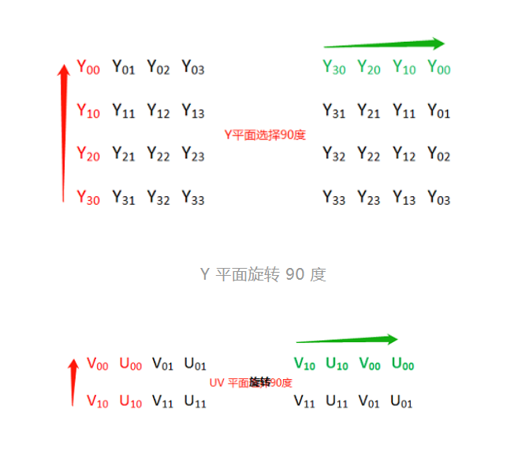
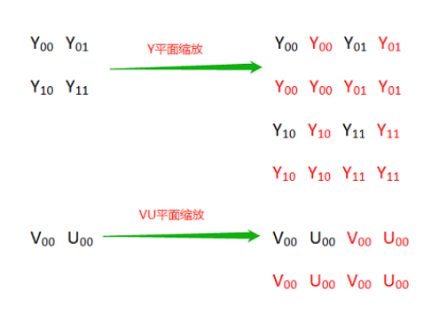
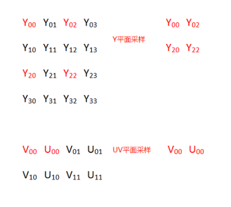
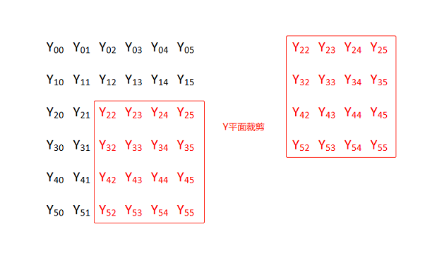
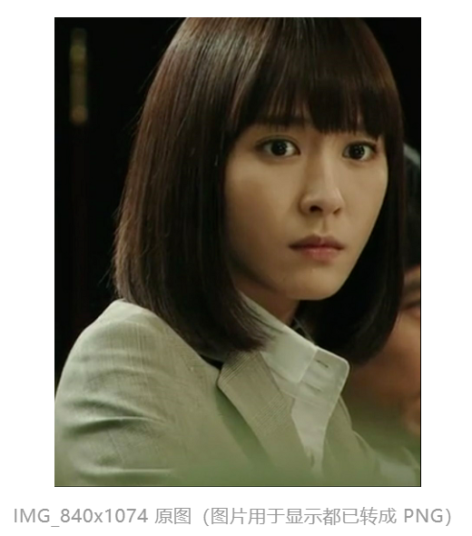
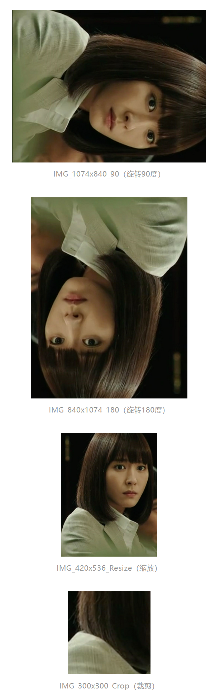

[视音频数据处理入门：RGB、YUV像素数据处理](https://blog.csdn.net/leixiaohua1020/article/details/50534150)

[ YUV 图像的基本处理](https://mp.weixin.qq.com/s?__biz=MzIwNTIwMzAzNg==&mid=2654162691&idx=1&sn=50ccf8f9742ee8fe887dd29719a1df3a&chksm=8cf39c30bb841526fdc354191db5f4190f06a89344397f01d75dbdf97f95fe19ccca3cf4c1b9&scene=21&poc_token=HPwF1mWjCR_c6MEf8Y483vUTj7Qkf_J8RDet0dAx)

[所有 YUV 格式图像的 OpenGL 渲染](https://mp.weixin.qq.com/s/DE0oGazC9rddCbS8m5yAUw)


# YUV

YUV 是一种色彩编码模型，也叫做 YCbCr，其中 “Y” 表示明亮度（Luminance），“U” 和 “V” 分别表示色度（Chrominance）和浓度（Chroma）。

**YUV 色彩编码模型，其设计初衷为了解决彩色电视机与黑白电视的兼容问题，利用了人类眼睛的生理特性（对亮度敏感，对色度不敏感），允许降低色度的带宽，降低了传输带宽**。**利用 YUV 色彩编码模型可以降低图片数据的内存占用，提高数据处理效率。**

**另外，YUV 编码模型的图像数据一般不能直接用于显示，还需要将其转换为 RGB（RGBA） 编码模型，才能够正常显示图像。**


# YUV 常见采样方式



YUV 图像主流的采样方式有三种：

- **YUV 4：4：4，每一个 Y 分量对于一对 UV 分量，每像素占用 （Y +   U +   V = 8 + 8 + 8 = 24bits）3 字节；**

- **YUV 4：2：2，每两个 Y 分量共用一对 UV 分量，每像素占用 （Y +  0.5U +  0.5V = 8 + 4 + 4 = 16bits）2 字节；**

- **YUV 4：2：0，每四个 Y 分量共用一对 UV 分量，每像素占用 （Y + 0.25U + 0.25V = 8 + 2 + 2 = 12bits）1.5 字节。**

最常用的采样方式是 YUV422 和 YUV420 。

YUV 格式也可按照 YUV 三个分量的组织方式分为打包（Packed）格式和平面格式（Planar）。

- **打包（Packed）格式：每个像素点的 YUV 分量是连续交叉存储的，如 YUYV 、NV21 格式；**

- **平面格式（Planar）：YUV 图像数据的三个分量分别存放在不同的矩阵中，这种格式适用于采样，如 YV12、YU12 格式。**


# YUV 几种常用的格式

对 YUV 图像处理中，YUYV 、YU12（I420）、NV21 和 NV12 最为常用，下面介绍下这几种格式的存储方式。

以一幅分辨率为 4x4 的 YUV 图为例，说明在不同 YUV 格式下的存储方式（括号内范围表示内存地址索引范围，默认以下不同格式图片存储使用的都是连续内存）。


## YUYV （YUV422 采样方式）

YUYV  是 2 个Y 分量共用一对 UV 分量，YUYV 格式的存储格式：

```
(0  ~  7)  Y00  U00  Y01  V00  Y02  U01   Y03  V01
(8  ~ 15)  Y10  U10  Y11  V10  Y12  U11   Y13  V11
(16 ~ 23)  Y20  U20  Y21  V20  Y22  U21   Y23  V21
(24 ~ 31)  Y30  U30  Y31  V30  Y32  U31   Y33  V31
```

一幅 720P (1280x720分辨率) 的图片，使用 YUV422 采样时占用存储大小为：

```
Y 分量：1280 * 720  = 921600 字节
U 分量：1280 * 720 * 0.5 = 460800 字节
V 分量：1280 * 720 * 0.5 = 460800 字节
总大小：Y 分量 + U 分量 + V 分量 = （1280 * 720 + 1280 * 720 * 0.5 * 2） / 1024 / 1024 = 1.76 MB 
```

由上面计算可以看出 **YUV422 采样的图像比 RGB 模型图像节省了 1/3 的存储空间。，在传输时占用的带宽也会随之减小。**


## YV12/YU12 (YUV420 采样方式)

YV12/YU12 也属于 YUV420P ，即 YUV420 采样方式的平面模式，YUV 三个分量分别存储于 3 个不同的矩阵（平面）。



YV12 格式的存储方式

```
(0  ~  3) Y00  Y01  Y02  Y03  
(4  ~  7) Y10  Y11  Y12  Y13  
(8  ~ 11) Y20  Y21  Y22  Y23
(12 ~ 15) Y30  Y31  Y32  Y33

(16 ~ 17) V00  V01
(18 ~ 19) V10  V11

(20 ~ 21) U00  U01
(22 ~ 23) U10  U11
```

YU12（也称 I420） 格式的存储方式

```
(0  ~  3) Y00  Y01  Y02  Y03
(4  ~  7) Y10  Y11  Y12  Y13
(8  ~ 11) Y20  Y21  Y22  Y23
(12 ~ 15) Y30  Y31  Y32  Y33

(16 ~ 17) U00  U01
(18 ~ 19) U10  U11

(20 ~ 21) V00  V01
(22 ~ 23) V10  V11
```

一幅 720P (1280x720分辨率) 的图片，使用 YUV420 采样时（格式 YV12/YU12 ）占用存储大小为：

```
Y 分量：1280 * 720  = 921600 字节
U 分量：1280 * 720 * （1/4） = 230400 字节
V 分量：1280 * 720 * （1/4） = 230400 字节
总大小：Y 分量 + U 分量 + V 分量 = （1280 * 720 + 1280 * 720 * （1/4）* 2） / 1024 / 1024 = 1.32 MB 
```

由上面计算可以看出 **YUV420 采样（格式 YV12/YU12 ）的图像比 RGB 模型图像节省了 1/2 的存储空间**。


## NV21/NV12 (YUV420 采样方式)

NV21/NV12 属于 YUV420SP ，YUV420SP 格式有 2 个平面，Y 分量存储于一个平面，UV 分量交错存储于另一个平面。



NV21 格式的存储方式

```
(0  ~  3) Y00  Y01  Y02  Y03  
(4  ~  7) Y10  Y11  Y12  Y13  
(8  ~ 11) Y20  Y21  Y22  Y23  
(12 ~ 15) Y30  Y31  Y32  Y33  

(16 ~ 19) V00  U00  V01  U01 
(20 ~ 23) V10  U10  V11  U11
```

NV12 格式的存储方式

```
(0  ~  3) Y00  Y01  Y02  Y03
(4  ~  7) Y10  Y11  Y12  Y13
(8  ~ 11) Y20  Y21  Y22  Y23
(12 ~ 15) Y30  Y31  Y32  Y33

(16 ~ 19) U00  V00  U01  V01 
(20 ~ 23) U10  V10  U11  V11
```

**NV21 与 NV12 格式的区别仅在于 UV 分量排列的先后顺序不同。**

一幅 720P (1280x720分辨率) 的图片，使用 YUV420 采样时（格式 NV21/NV12 ）占用存储大小为：

```
Y 分量：1280 * 720  = 921600 字节
UV 分量：1280 * 720 * （1/2） = 460800 字节
总大小：Y 分量 + UV 分量 = （1280 * 720 + 1280 * 720 * （1/2）） / 1024 / 1024 = 1.32 MB 
```

由上面计算可以看出 **YUV420 采样（格式 NV21/NV12 ）的图像比 RGB 模型图像也节省了 1/2 的存储空间**。


# YUV 图像的基本操作

NV21 图为例介绍其旋转、缩放和剪切的基本方法。

YUV 图片的定义、加载、保存及内存释放。

```c
//YUV420SP  NV21 or NV12 

typedef struct
{
    int width;                 // 图片宽
    int height;                // 图片高 
    unsigned char  *yPlane;    // Y 平面指针
    unsigned char  *uvPlane;   // UV 平面指针
} YUVImage;

void LoadYUVImage(const char *filePath, YUVImage *pImage)
{
    FILE *fpData = fopen(filePath, "rb+");
    if (fpData != NULL)
    {
        fseek(fpData, 0, SEEK_END);
        int len = ftell(fpData);
        pImage->yPlane = malloc(len);
        fseek(fpData, 0, SEEK_SET);
        fread(pImage->yPlane, 1, len, fpData);
        fclose(fpData);
        fpData = NULL;
    }
    pImage->uvPlane = pImage->yPlane + pImage->width * pImage->height;
}

void SaveYUVImage(const char *filePath, YUVImage *pImage)
{
    FILE *fp = fopen(filePath, "wb+");
    if (fp)
    {
        fwrite(pImage->yPlane, pImage->width * pImage->height, 1, fp);
        fwrite(pImage->uvPlane, pImage->width * (pImage->height >> 1), 1, fp);
    }
}

void ReleaseYUVImage(YUVImage *pImage)
{
    if (pImage->yPlane)
    {
        free(pImage->yPlane);
        pImage->yPlane = NULL;
        pImage->uvPlane = NULL;
    }
}
```


## NV21 图片旋转

以顺时针旋转 90 度为例，Y 和 UV 两个平面分别从平面左下角进行纵向拷贝，需要注意的是一对 UV 分量作为一个整体进行拷贝。

以此类比，顺时针旋转 180 度时从平面右下角进行横向拷贝，顺时针旋转 270 度时从平面右上角进行纵向拷贝。



存储空间表示：

```
Y00  Y01  Y02  Y03              Y30  Y20  Y10  Y00
Y10  Y11  Y12  Y13    旋转90度  Y31  Y21  Y11  Y01
Y20  Y21  Y22  Y23    ----->    Y32  Y22  Y12  Y02
Y30  Y31  Y32  Y33              Y33  Y23  Y13  Y03
                      旋转90度
V00  U00  V01  U01    ----->    V10  U10  V00  U00
V10  U10  V11  U11              V11  U11  V01  U01
```

代码实现：

```c
//angle 90,  270, 180
void RotateYUVImage(YUVImage *pSrcImg, YUVImage *pDstImg, int angle)
{
    int yIndex = 0;
    int uvIndex = 0;
    switch (angle)
    {
    case 90:
    {
        // y plane
        for (int i = 0; i < pSrcImg->width; i++) {
            for (int j = 0; j < pSrcImg->height; j++) {
                *(pDstImg->yPlane + yIndex) = *(pSrcImg->yPlane + (pSrcImg->height - j - 1) * pSrcImg->width + i);
                yIndex++;
            }
        }

        //uv plane
        for (int i = 0; i < pSrcImg->width; i += 2) {
            for (int j = 0; j < pSrcImg->height / 2; j++) {
                *(pDstImg->uvPlane + uvIndex) = *(pSrcImg->uvPlane + (pSrcImg->height / 2 - j - 1) * pSrcImg->width + i);
                *(pDstImg->uvPlane + uvIndex + 1) = *(pSrcImg->uvPlane + (pSrcImg->height / 2 - j - 1) * pSrcImg->width + i + 1);
                uvIndex += 2;
            }
        }
    }
    break;
    case 180:
    {
        // y plane
        for (int i = 0; i < pSrcImg->height; i++) {
            for (int j = 0; j < pSrcImg->width; j++) {
                *(pDstImg->yPlane + yIndex) = *(pSrcImg->yPlane + (pSrcImg->height - 1 - i) * pSrcImg->width + pSrcImg->width - 1 - j);
                yIndex++;
            }
        }

        //uv plane
        for (int i = 0; i < pSrcImg->height / 2; i++) {
            for (int j = 0; j < pSrcImg->width; j += 2) {
                *(pDstImg->uvPlane + uvIndex) = *(pSrcImg->uvPlane + (pSrcImg->height / 2 - 1 - i) * pSrcImg->width + pSrcImg->width - 2 - j);
                *(pDstImg->uvPlane + uvIndex + 1) = *(pSrcImg->uvPlane + (pSrcImg->height / 2 - 1 - i) * pSrcImg->width + pSrcImg->width - 1 - j);
                uvIndex += 2;
            }
        }
    }
    break;
    case 270:
    {
        // y plane
        for (int i = 0; i < pSrcImg->width; i++) {
            for (int j = 0; j < pSrcImg->height; j++) {
                *(pDstImg->yPlane + yIndex) = *(pSrcImg->yPlane + j * pSrcImg->width + (pSrcImg->width - i - 1));
                yIndex++;
            }
        }

        //uv plane
        for (int i = 0; i < pSrcImg->width; i += 2) {
            for (int j = 0; j < pSrcImg->height / 2; j++) {
                *(pDstImg->uvPlane + uvIndex + 1) = *(pSrcImg->uvPlane + j * pSrcImg->width + (pSrcImg->width - i - 1));
                *(pDstImg->uvPlane + uvIndex) = *(pSrcImg->uvPlane + j * pSrcImg->width + (pSrcImg->width - i - 2));
                uvIndex += 2;
            }
        }
    }
    break;
    default:
        break;
    }

}
```


## NV21 图片缩放

将 2x2 的 NV21 图缩放成 4x4 的 NV21 图，原图横向每个像素的 Y 分量向右拷贝 1（放大倍数-1）次，纵向每列元素以列为单位向下拷贝 1（放大倍数-1）次.



将 4x4 的 NV21 图缩放成 2x2 的 NV21 图，实际上就是进行采样。



代码实现：

```c
void ResizeYUVImage(YUVImage *pSrcImg, YUVImage *pDstImg)
{
    if (pSrcImg->width > pDstImg->width)
    {
        //缩小
        int x_scale = pSrcImg->width / pDstImg->width;
        int y_scale = pSrcImg->height / pDstImg->height;

        for (size_t i = 0; i < pDstImg->height; i++)
        {
            for (size_t j = 0; j < pDstImg->width; j++)
            {
                *(pDstImg->yPlane + i*pDstImg->width + j) = *(pSrcImg->yPlane + i * y_scale *pSrcImg->width + j * x_scale);
            }
        }

        for (size_t i = 0; i < pDstImg->height / 2; i++)
        {
            for (size_t j = 0; j < pDstImg->width; j += 2)
            {
                *(pDstImg->uvPlane + i*pDstImg->width + j) = *(pSrcImg->uvPlane + i * y_scale *pSrcImg->width + j * x_scale);
                *(pDstImg->uvPlane + i*pDstImg->width + j + 1) = *(pSrcImg->uvPlane + i * y_scale *pSrcImg->width + j * x_scale + 1);
            }
        }
    }
    else
    {
        // 放大
        int x_scale = pDstImg->width / pSrcImg->width;
        int y_scale = pDstImg->height / pSrcImg->height;

        for (size_t i = 0; i < pSrcImg->height; i++)
        {
            for (size_t j = 0; j < pSrcImg->width; j++)
            {
                int yValue = *(pSrcImg->yPlane + i *pSrcImg->width + j);
                for (size_t k = 0; k < x_scale; k++)
                {
                    *(pDstImg->yPlane + i * y_scale * pDstImg->width + j  * x_scale + k) = yValue;
                }
            }

            unsigned char  *pSrcRow = pDstImg->yPlane + i * y_scale * pDstImg->width;
            unsigned char  *pDstRow = NULL;
            for (size_t l = 1; l < y_scale; l++)
            {
                pDstRow = (pDstImg->yPlane + (i * y_scale + l)* pDstImg->width);
                memcpy(pDstRow, pSrcRow, pDstImg->width * sizeof(unsigned char ));
            }
        }

        for (size_t i = 0; i < pSrcImg->height / 2; i++)
        {
            for (size_t j = 0; j < pSrcImg->width; j += 2)
            {
                int vValue = *(pSrcImg->uvPlane + i *pSrcImg->width + j);
                int uValue = *(pSrcImg->uvPlane + i *pSrcImg->width + j + 1);
                for (size_t k = 0; k < x_scale * 2; k += 2)
                {
                    *(pDstImg->uvPlane + i * y_scale * pDstImg->width + j  * x_scale + k) = vValue;
                    *(pDstImg->uvPlane + i * y_scale * pDstImg->width + j  * x_scale + k + 1) = uValue;
                }
            }

            unsigned char  *pSrcRow = pDstImg->uvPlane + i * y_scale * pDstImg->width;
            unsigned char  *pDstRow = NULL;
            for (size_t l = 1; l < y_scale; l++)
            {
                pDstRow = (pDstImg->uvPlane + (i * y_scale + l)* pDstImg->width);
                memcpy(pDstRow, pSrcRow, pDstImg->width * sizeof(unsigned char ));
            }
        }
    }
}
```


## NV21 图片裁剪

图例中将 6x6 的 NV21 图按照横纵坐标偏移量为（2，2）裁剪成 4x4 的 NV21 图。



代码实现：

```c
测试原图// x_offSet ，y_offSet % 2 == 0
void CropYUVImage(YUVImage *pSrcImg, int x_offSet, int y_offSet, YUVImage *pDstImg)
{
    // 确保裁剪区域不存在内存越界
    int cropWidth = pSrcImg->width - x_offSet;
    cropWidth = cropWidth > pDstImg->width ? pDstImg->width : cropWidth;
    int cropHeight = pSrcImg->height - y_offSet;
    cropHeight = cropHeight > pDstImg->height ? pDstImg->height : cropHeight;

    unsigned char  *pSrcCursor = NULL;
    unsigned char  *pDstCursor = NULL;

    //crop yPlane
    for (size_t i = 0; i < cropHeight; i++)
    {
        pSrcCursor = pSrcImg->yPlane + (y_offSet + i) * pSrcImg->width + x_offSet;
        pDstCursor = pDstImg->yPlane + i * pDstImg->width;
        memcpy(pDstCursor, pSrcCursor, sizeof(unsigned char ) * cropWidth);
    }

    //crop uvPlane
    for (size_t i = 0; i < cropHeight / 2; i++)
    {
        pSrcCursor = pSrcImg->uvPlane + (y_offSet / 2 + i) * pSrcImg->width + x_offSet;
        pDstCursor = pDstImg->uvPlane + i * pDstImg->width;
        memcpy(pDstCursor, pSrcCursor, sizeof(unsigned char ) * cropWidth);
    }

}
```

**测试原图**



**测试代码**

```C++
void main()
{
    YUVImage srcImg = { 0 };
    srcImg.width = 840;
    srcImg.height = 1074;
    LoadYUVImage("IMG_840x1074.NV21", &srcImg);

    YUVImage rotateDstImg = { 0 };
    rotateDstImg.width = 1074;
    rotateDstImg.height = 840;
    rotateDstImg.yPlane = malloc(rotateDstImg.width * rotateDstImg.height*1.5);
    rotateDstImg.uvPlane = rotateDstImg.yPlane + rotateDstImg.width * rotateDstImg.height;

    RotateYUVImage(&srcImg, &rotateDstImg, 270);

    SaveYUVImage("D:\\material\\IMG_1074x840_270.NV21", &rotateDstImg);

    RotateYUVImage(&srcImg, &rotateDstImg, 90);

    SaveYUVImage("D:\\material\\IMG_1074x840_90.NV21", &rotateDstImg);

    rotateDstImg.width = 840;
    rotateDstImg.height = 1074;
    RotateYUVImage(&srcImg, &rotateDstImg, 180);

    SaveYUVImage("D:\\material\\IMG_840x1074_180.NV21", &rotateDstImg);


    YUVImage resizeDstImg = { 0 };
    resizeDstImg.width = 420;
    resizeDstImg.height = 536;
    resizeDstImg.yPlane = malloc(resizeDstImg.width * resizeDstImg.height*1.5);
    resizeDstImg.uvPlane = resizeDstImg.yPlane + resizeDstImg.width * resizeDstImg.height;

    ResizeYUVImage(&srcImg, &resizeDstImg);

    SaveYUVImage("D:\\material\\IMG_420x536_Resize.NV21", &resizeDstImg);

    YUVImage cropDstImg = { 0 };
    cropDstImg.width = 300;
    cropDstImg.height = 300;
    cropDstImg.yPlane = malloc(cropDstImg.width * cropDstImg.height*1.5);
    cropDstImg.uvPlane = cropDstImg.yPlane + cropDstImg.width * cropDstImg.height;

    CropYUVImage(&srcImg, 100, 500, &cropDstImg);

    SaveYUVImage("D:\\material\\IMG_300x300_crop.NV21", &cropDstImg);

    ReleaseYUVImage(&srcImg);
    ReleaseYUVImage(&rotateDstImg);
    ReleaseYUVImage(&resizeDstImg);
    ReleaseYUVImage(&cropDstImg);
}
```

**测试结果**




# YUV 格式图像的 OpenGL 渲染

OpenGL ES 渲染 NV21、NV12、I420、YV12、YUYV、UYVY、I444

## 渲染 NV21、NV12 图像

NV21、NV12 可以看成同一种结构，**区别只是 uv 的交错排列顺序不同。**

渲染 NV21/NV12 格式图像需要使用 2 个纹理，分别用于保存 Y plane 和 UV plane 的数据，然后在片段着色器中分别对 2 个纹理进行采样，转换成 RGB 数据。

**需要用到 GL_LUMINANCE 和 GL_LUMINANCE_ALPHA 格式的纹理，其中 GL_LUMINANCE 纹理用来加载 NV21/NV12 Y Plane 的数据，GL_LUMINANCE_ALPHA 纹理用来加载 UV Plane 的数据。**

加载 NV21/NV12 的 2 个 Plane 数据到纹理，ppPlane[0] 表示 Y Plane 的指针，ppPlane[1] 表示 UV Plane 的指针，注意 2 个纹理的格式和宽高。

```
//upload Y plane data
glBindTexture(GL_TEXTURE_2D, m_yTextureId);
glTexImage2D(GL_TEXTURE_2D, 0, GL_LUMINANCE, m_RenderImage.width, m_RenderImage.height, 0, GL_LUMINANCE, GL_UNSIGNED_BYTE, m_RenderImage.ppPlane[0]);
glTexParameterf(GL_TEXTURE_2D, GL_TEXTURE_WRAP_S, GL_CLAMP_TO_EDGE);
glTexParameterf(GL_TEXTURE_2D, GL_TEXTURE_WRAP_T, GL_CLAMP_TO_EDGE);
glTexParameteri(GL_TEXTURE_2D, GL_TEXTURE_MIN_FILTER, GL_LINEAR);
glTexParameteri(GL_TEXTURE_2D, GL_TEXTURE_MAG_FILTER, GL_LINEAR);
glBindTexture(GL_TEXTURE_2D, GL_NONE);

//update UV plane data
glBindTexture(GL_TEXTURE_2D, m_uvTextureId);
glTexImage2D(GL_TEXTURE_2D, 0, GL_LUMINANCE_ALPHA, m_RenderImage.width >> 1, m_RenderImage.height >> 1, 0, GL_LUMINANCE_ALPHA, GL_UNSIGNED_BYTE, m_RenderImage.ppPlane[1]);
glTexParameterf(GL_TEXTURE_2D, GL_TEXTURE_WRAP_S, GL_CLAMP_TO_EDGE);
glTexParameterf(GL_TEXTURE_2D, GL_TEXTURE_WRAP_T, GL_CLAMP_TO_EDGE);
glTexParameteri(GL_TEXTURE_2D, GL_TEXTURE_MIN_FILTER, GL_LINEAR);
glTexParameteri(GL_TEXTURE_2D, GL_TEXTURE_MAG_FILTER, GL_LINEAR);
glBindTexture(GL_TEXTURE_2D, GL_NONE);
```

使用 2 个纹理渲染 NV21 格式图像的片段着色器：

```
#version 300 es                                    
precision mediump float;                           
in vec2 v_texCoord;                                
layout(location = 0) out vec4 outColor;            
uniform sampler2D y_texture;                       
uniform sampler2D uv_texture;                      
void main()                                        
{                                                  
   vec3 yuv;                                        
   yuv.x = texture(y_texture, v_texCoord).r -0.063;
   yuv.y = texture(uv_texture, v_texCoord).a-0.502;
   yuv.z = texture(uv_texture, v_texCoord).r-0.502;
    vec3 rgb = mat3(1.164, 1.164, 1.164,        
               0,          -0.392,    2.017,          
               1.596,   -0.813,    0.0) * yuv;     
    outColor = vec4(rgb, 1.0);                      
}                                                  
```

使用 2 个纹理渲染 NV12 格式图像的片段着色器（只是交换了一下 uv 分量）：

```
#version 300 es                                    
precision mediump float;                           
in vec2 v_texCoord;                                
layout(location = 0) out vec4 outColor;            
uniform sampler2D y_texture;                       
uniform sampler2D uv_texture;                      
void main()                                        
{                                                  
   vec3 yuv;                                        
   yuv.x = texture(y_texture, v_texCoord).r -0.063;
   yuv.z = texture(uv_texture, v_texCoord).a-0.502;
   yuv.y = texture(uv_texture, v_texCoord).r-0.502;
    vec3 rgb = mat3(1.164, 1.164, 1.164,        
               0,          -0.392,    2.017,          
               1.596,   -0.813,    0.0) * yuv;     
    outColor = vec4(rgb, 1.0);                      
}                                                  
```

当然也可以使用一张纹理实现 NV21/NV12 图像渲染，参考文章[**OpenGL ES 渲染 NV21/NV12 格式图像有哪些“姿势”？**](http://mp.weixin.qq.com/s?__biz=MzIwNTIwMzAzNg==&mid=2654176354&idx=1&sn=995080128622903eab26e139cbe785f1&chksm=8cf35751bb84de47db1dbc9b264cf088160874d1277c320f9a4bf6cf5c9497487b6bb2a390cf&scene=21#wechat_redirect)

## 渲染 I420、YV12 图像

I420 也是 YUV4:2:0 的采样方式，有 3 个 plane , 跟 YV12 格式的区别就是 uv plane 的位置不同。

4x4 的 I420 图像内存分布：

```
(0  ~  3) Y00  Y01  Y02  Y03
(4  ~  7) Y10  Y11  Y12  Y13
(8  ~ 11) Y20  Y21  Y22  Y23
(12 ~ 15) Y30  Y31  Y32  Y33

(16 ~ 17) U00  U01
(18 ~ 19) U10  U11

(20 ~ 21) V00  V01
(22 ~ 23) V10  V11
```

类比 NV21 渲染 ，**可以将 I420 格式的三个 plane 数据加载到 3 个纹理，然后再分别采样。**

上传 I420 三个 plane 的数据到纹理：

```
//upload Y plane data
glBindTexture(GL_TEXTURE_2D, m_yTextureId);
glTexImage2D(GL_TEXTURE_2D, 0, GL_LUMINANCE, m_RenderImage.width, m_RenderImage.height, 0, GL_LUMINANCE, GL_UNSIGNED_BYTE, m_RenderImage.ppPlane[0]);
glTexParameterf(GL_TEXTURE_2D, GL_TEXTURE_WRAP_S, GL_CLAMP_TO_EDGE);
glTexParameterf(GL_TEXTURE_2D, GL_TEXTURE_WRAP_T, GL_CLAMP_TO_EDGE);
glTexParameteri(GL_TEXTURE_2D, GL_TEXTURE_MIN_FILTER, GL_LINEAR);
glTexParameteri(GL_TEXTURE_2D, GL_TEXTURE_MAG_FILTER, GL_LINEAR);
glBindTexture(GL_TEXTURE_2D, GL_NONE);

//update U plane data
glBindTexture(GL_TEXTURE_2D, m_uTextureId);
glTexImage2D(GL_TEXTURE_2D, 0, GL_LUMINANCE, m_RenderImage.width >> 1, m_RenderImage.height >> 1, 0, GL_LUMINANCE, GL_UNSIGNED_BYTE, m_RenderImage.ppPlane[1]);
glTexParameterf(GL_TEXTURE_2D, GL_TEXTURE_WRAP_S, GL_CLAMP_TO_EDGE);
glTexParameterf(GL_TEXTURE_2D, GL_TEXTURE_WRAP_T, GL_CLAMP_TO_EDGE);
glTexParameteri(GL_TEXTURE_2D, GL_TEXTURE_MIN_FILTER, GL_LINEAR);
glTexParameteri(GL_TEXTURE_2D, GL_TEXTURE_MAG_FILTER, GL_LINEAR);
glBindTexture(GL_TEXTURE_2D, GL_NONE);

//update V plane data
glBindTexture(GL_TEXTURE_2D, m_vTextureId);
glTexImage2D(GL_TEXTURE_2D, 0, GL_LUMINANCE, m_RenderImage.width >> 1, m_RenderImage.height >> 1, 0, GL_LUMINANCE, GL_UNSIGNED_BYTE, m_RenderImage.ppPlane[2]);
glTexParameterf(GL_TEXTURE_2D, GL_TEXTURE_WRAP_S, GL_CLAMP_TO_EDGE);
glTexParameterf(GL_TEXTURE_2D, GL_TEXTURE_WRAP_T, GL_CLAMP_TO_EDGE);
glTexParameteri(GL_TEXTURE_2D, GL_TEXTURE_MIN_FILTER, GL_LINEAR);
glTexParameteri(GL_TEXTURE_2D, GL_TEXTURE_MAG_FILTER, GL_LINEAR);
glBindTexture(GL_TEXTURE_2D, GL_NONE);
```

使用 3 个纹理渲染 I420 格式图像的片段着色器：

```
#version 300 es                                    
precision mediump float;                           
in vec2 v_texCoord;                                
layout(location = 0) out vec4 outColor;            
uniform sampler2D y_texture;                       
uniform sampler2D u_texture;
uniform sampler2D v_texture;                      
void main()                                        
{                                                  
   vec3 yuv;                                        
   yuv.x = texture(y_texture, v_texCoord).r -0.063;
   yuv.y = texture(u_texture, v_texCoord).r-0.502;
   yuv.z = texture(v_texture, v_texCoord).r-0.502;
    vec3 rgb = mat3(1.164, 1.164, 1.164,        
               0,          -0.392,    2.017,          
               1.596,   -0.813,    0.0) * yuv;     
    outColor = vec4(rgb, 1.0);                      
}                                                  
```

**同上一节，渲染 YV12 格式只需要在 shader 中交换下 uv 分量，或者上传数据到纹理之前交换下 uv plane 的数据**，代码就不贴出来了，显得太啰嗦。

那么 I420/YV12 的渲染能不能只使用一张纹理就可以实现？

答案是可以的。**类似前文提到的，需要使用 OpenGL ES 3.0 texlFetch 来替代 texture 采样函数，因为 yuv 3 个 plane 都在同一张纹理上，所以不能执行任何形式的过滤和插值操，必须要精确获取像素的内容。**

我们把整个 I420 数据上传到一张 GL_LUMINANCE 纹理，尺寸 [width,height * 3 / 2] 。

```
    glBindTexture(GL_TEXTURE_2D, m_TextureId);
    glTexImage2D ( GL_TEXTURE_2D, 0, GL_LUMINANCE, m_RenderImage.width, m_RenderImage.height * 3 / 2, 0, GL_LUMINANCE, GL_UNSIGNED_BYTE, m_RenderImage.ppPlane[0]);
    glTexParameterf(GL_TEXTURE_2D, GL_TEXTURE_WRAP_S, GL_CLAMP_TO_EDGE);
    glTexParameterf(GL_TEXTURE_2D, GL_TEXTURE_WRAP_T, GL_CLAMP_TO_EDGE);
    glTexParameteri(GL_TEXTURE_2D, GL_TEXTURE_MIN_FILTER, GL_LINEAR);
    glTexParameteri(GL_TEXTURE_2D, GL_TEXTURE_MAG_FILTER, GL_LINEAR);
    glBindTexture(GL_TEXTURE_2D, GL_NONE);
```

只使用一张纹理渲染 I420 格式图像的片段着色器，shader 中需要传入图像的分辨率来确保采样的准确性，inputSize 为图像分辨率：

```
#version 300 es
precision highp float;
in vec2 v_texCoord;
uniform sampler2D y_texture;
uniform vec2 inputSize;
out vec4 outColor;
void main() {
    vec2 uv = v_texCoord;
    uv.y *= 2.0 / 3.0;
    float y = texture(y_texture, uv).r - 0.063;

    vec2 pixelUV = v_texCoord * inputSize;
    pixelUV.x = mod(pixelUV.y/2.0, 2.0) > 0.001 ? pixelUV.x / 2.0 + inputSize.x / 2.0 : pixelUV.x / 2.0;
    pixelUV.y = floor(pixelUV.y / 4.0);
    pixelUV.y += inputSize.y;
    float u = texelFetch(y_texture, ivec2(int(pixelUV.x), int(pixelUV.y)), 0).r - 0.502;

    pixelUV = v_texCoord * inputSize;
    pixelUV.x = mod(pixelUV.y/2.0, 2.0) > 0.001 ? pixelUV.x / 2.0 + inputSize.x / 2.0 : pixelUV.x / 2.0;
    pixelUV.y = floor(pixelUV.y / 4.0);
    pixelUV.y += inputSize.y * 5.0 / 4.0;
    float v = texelFetch(y_texture, ivec2(int(pixelUV.x), int(pixelUV.y)), 0).r - 0.502;
    vec3 yuv = vec3(y,u,v);

    highp vec3 rgb = mat3(1.164, 1.164, 1.164,
    0,       -0.392,    2.017,
    1.596,   -0.813,    0.0) * yuv;
    outColor = vec4(rgb, 1.0);
}
```

## 渲染 YUYV、UYVY 图像

YUYV 和 UYVY 格式用的是 YUV 4:2:2 的采样方式，2 个 Y 分量共用一对 UV 分量，一个像素占用 2 个字节。

YUYV 格式的存储格式：

```
(0  ~  7)  Y00  U00  Y01  V00  Y02  U01   Y03  V01
(8  ~ 15)  Y10  U10  Y11  V10  Y12  U11   Y13  V11
(16 ~ 23)  Y20  U20  Y21  V20  Y22  U21   Y23  V21
(24 ~ 31)  Y30  U30  Y31  V30  Y32  U31   Y33  V31
```

参考 I420 的渲染方式，可以使用 2 个纹理来实现，由于 **YUYV、UYVY 格式是每 2 个字节才有一个 Y 分量**，可以使用 GL_LUMINANCE_ALPHA 格式纹理来采样 Y 分量；**每 4 个字节才出现一对 UV 分量**，可以使用 GL_RGBA 格式纹理来采样 UV 分量。

上传 YUYV、UYVY 数据到纹理：

```
//upload YUYV、UYVY data
glBindTexture(GL_TEXTURE_2D, m_yTextureId);
glTexImage2D(GL_TEXTURE_2D, 0, GL_LUMINANCE_ALPHA, m_RenderImage.width, m_RenderImage.height, 0, GL_LUMINANCE_ALPHA, GL_UNSIGNED_BYTE, m_RenderImage.ppPlane[0]);
glTexParameterf(GL_TEXTURE_2D, GL_TEXTURE_WRAP_S, GL_CLAMP_TO_EDGE);
glTexParameterf(GL_TEXTURE_2D, GL_TEXTURE_WRAP_T, GL_CLAMP_TO_EDGE);
glTexParameteri(GL_TEXTURE_2D, GL_TEXTURE_MIN_FILTER, GL_LINEAR);
glTexParameteri(GL_TEXTURE_2D, GL_TEXTURE_MAG_FILTER, GL_LINEAR);
glBindTexture(GL_TEXTURE_2D, GL_NONE);

//update YUYV、UYVY data
glBindTexture(GL_TEXTURE_2D, m_uvTextureId);
glTexImage2D(GL_TEXTURE_2D, 0, GL_RGBA, m_RenderImage.width >> 1, m_RenderImage.height, 0, GL_RGBA, GL_UNSIGNED_BYTE, m_RenderImage.ppPlane[0]);
glTexParameterf(GL_TEXTURE_2D, GL_TEXTURE_WRAP_S, GL_CLAMP_TO_EDGE);
glTexParameterf(GL_TEXTURE_2D, GL_TEXTURE_WRAP_T, GL_CLAMP_TO_EDGE);
glTexParameteri(GL_TEXTURE_2D, GL_TEXTURE_MIN_FILTER, GL_LINEAR);
glTexParameteri(GL_TEXTURE_2D, GL_TEXTURE_MAG_FILTER, GL_LINEAR);
glBindTexture(GL_TEXTURE_2D, GL_NONE);
```

使用 2 个纹理渲染 YUYV 格式图像的片段着色器：

```
#version 300 es                                    
precision mediump float;                           
in vec2 v_texCoord;                                
layout(location = 0) out vec4 outColor;            
uniform sampler2D y_texture;                       
uniform sampler2D uv_texture;                      
void main()                                        
{                                                  
   vec3 yuv;                                        
   yuv.x = texture(y_texture, v_texCoord).r -0.063;
   vec4 yuyv = texture(uv_texture, v_texCoord);
   yuv.y = yuyv.g - 0.502;
   yuv.z = yuyv.a - 0.502;
    vec3 rgb = mat3(1.164, 1.164, 1.164,        
               0,          -0.392,    2.017,          
               1.596,   -0.813,    0.0) * yuv;     
    outColor = vec4(rgb, 1.0);                      
}   
```

使用 2 个纹理渲染 UYVY 格式图像的片段着色器：

```
#version 300 es                                    
precision mediump float;                           
in vec2 v_texCoord;                                
layout(location = 0) out vec4 outColor;            
uniform sampler2D y_texture;                       
uniform sampler2D uv_texture;                      
void main()                                        
{                                                  
   vec3 yuv;                                        
   yuv.x = texture(y_texture, v_texCoord).a -0.063;
   vec4 uyvy = texture(uv_texture, v_texCoord);
   yuv.y = yuyv.r - 0.502;
   yuv.z = yuyv.b - 0.502;
    vec3 rgb = mat3(1.164, 1.164, 1.164,        
               0,          -0.392,    2.017,          
               1.596,   -0.813,    0.0) * yuv;     
    outColor = vec4(rgb, 1.0);                      
}   
```

另外，借助于 OpenGL ES 3.0 的 texlFetch 也可以实现只需要一张纹理就可以实现 YUYV、UYVY 格式图像渲染。

直接把整个 YUYV、UYVY 图像数据上传到一张 GL_LUMINANCE_ALPHA 格式的纹理，**在 shader 中通过偏移采样的方式获取 uv 值**，同样 shader 中需要传入图像的分辨率 inputSize 来确保采样的准确性。

```
    glBindTexture(GL_TEXTURE_2D, m_TextureId);
    glTexImage2D ( GL_TEXTURE_2D, 0, GL_LUMINANCE_ALPHA, m_RenderImage.width, m_RenderImage.height, 0,
                   GL_LUMINANCE_ALPHA, GL_UNSIGNED_BYTE, m_RenderImage.ppPlane[0]);

    glTexParameterf(GL_TEXTURE_2D, GL_TEXTURE_WRAP_S, GL_CLAMP_TO_EDGE);
    glTexParameterf(GL_TEXTURE_2D, GL_TEXTURE_WRAP_T, GL_CLAMP_TO_EDGE);
    glTexParameteri(GL_TEXTURE_2D, GL_TEXTURE_MIN_FILTER, GL_LINEAR);
    glTexParameteri(GL_TEXTURE_2D, GL_TEXTURE_MAG_FILTER, GL_LINEAR);
    glBindTexture(GL_TEXTURE_2D, GL_NONE);
```

只使用一张纹理渲染 YUYV 格式图像的片段着色器：

```
#version 300 es
precision highp float;
in vec2 v_texCoord;
uniform sampler2D y_texture;
uniform vec2 inputSize;
out vec4 outColor;
void main() {
    //YUYV YUYV
    vec2 uv = v_texCoord;
    vec2 pixelUV = v_texCoord * inputSize;
    pixelUV = floor(pixelUV);
    vec4 col = texelFetch(y_texture, ivec2(int(pixelUV.x), int(pixelUV.y)), 0);
    float y = col.r - 0.063;
    float u,v;
    if(mod(pixelUV.x, 2.0) > 0.01) {
        v = col.a - 0.502;
        pixelUV.x -= 1.0;
        u = texelFetch(y_texture, ivec2(int(pixelUV.x), int(pixelUV.y)), 0).a - 0.502;
    } else {
        u = col.a - 0.502;
        pixelUV.x += 1.0;
        v = texelFetch(y_texture, ivec2(int(pixelUV.x), int(pixelUV.y)), 0).a - 0.502;
    }
    vec3 yuv = vec3(y,u,v);
    vec3 rgb = mat3(1.164, 1.164, 1.164,
    0,       -0.392,    2.017,
    1.596,   -0.813,    0.0) * yuv;
    outColor = vec4(rgb, 1.0);
}
```

只使用一张纹理渲染 UYVY 格式图像的片段着色器：

```
#version 300 es
precision highp float;
in vec2 v_texCoord;
uniform sampler2D y_texture;
uniform vec2 inputSize;
out vec4 outColor;
void main() {
    //UYVY UYVY
    vec2 uv = v_texCoord;
    vec2 pixelUV = v_texCoord * inputSize;
    pixelUV = floor(pixelUV);
    vec4 col = texelFetch(y_texture, ivec2(int(pixelUV.x), int(pixelUV.y)), 0);
    float y = col.a - 0.063;
    float u,v;
    if(mod(pixelUV.x, 2.0) > 0.01) {
        v = col.r - 0.502;
        pixelUV.x -= 1.0;
        u = texelFetch(y_texture, ivec2(int(pixelUV.x), int(pixelUV.y)), 0).r - 0.502;
    } else {
        u = col.r - 0.502;
        pixelUV.x += 1.0;
        v = texelFetch(y_texture, ivec2(int(pixelUV.x), int(pixelUV.y)), 0).r - 0.502;
    }
    vec3 yuv = vec3(y,u,v);
    vec3 rgb = mat3(1.164, 1.164, 1.164,
    0,       -0.392,    2.017,
    1.596,   -0.813,    0.0) * yuv;
    outColor = vec4(rgb, 1.0);
}
```

## 渲染 I444 图像

I444 使用的是 YUV 4:4:4 的采样方式，每个像素占用 3 个字节，yuv 各占一个字节，I444 有 3 个 plane 。

首先能想到是使用 3 个 GL_LUMINANCE 格式纹理来装载 3 个 plane 的数据，然后在 shader 分别采样出 yuv 值。

上传 I444 三个 plane 的数据到纹理：

```
//upload Y plane data
glBindTexture(GL_TEXTURE_2D, m_yTextureId);
glTexImage2D(GL_TEXTURE_2D, 0, GL_LUMINANCE, m_RenderImage.width, m_RenderImage.height, 0, GL_LUMINANCE, GL_UNSIGNED_BYTE, m_RenderImage.ppPlane[0]);
glTexParameterf(GL_TEXTURE_2D, GL_TEXTURE_WRAP_S, GL_CLAMP_TO_EDGE);
glTexParameterf(GL_TEXTURE_2D, GL_TEXTURE_WRAP_T, GL_CLAMP_TO_EDGE);
glTexParameteri(GL_TEXTURE_2D, GL_TEXTURE_MIN_FILTER, GL_LINEAR);
glTexParameteri(GL_TEXTURE_2D, GL_TEXTURE_MAG_FILTER, GL_LINEAR);
glBindTexture(GL_TEXTURE_2D, GL_NONE);

//update U plane data
glBindTexture(GL_TEXTURE_2D, m_uTextureId);
glTexImage2D(GL_TEXTURE_2D, 0, GL_LUMINANCE, m_RenderImage.width, m_RenderImage.height, 0, GL_LUMINANCE, GL_UNSIGNED_BYTE, m_RenderImage.ppPlane[1]);
glTexParameterf(GL_TEXTURE_2D, GL_TEXTURE_WRAP_S, GL_CLAMP_TO_EDGE);
glTexParameterf(GL_TEXTURE_2D, GL_TEXTURE_WRAP_T, GL_CLAMP_TO_EDGE);
glTexParameteri(GL_TEXTURE_2D, GL_TEXTURE_MIN_FILTER, GL_LINEAR);
glTexParameteri(GL_TEXTURE_2D, GL_TEXTURE_MAG_FILTER, GL_LINEAR);
glBindTexture(GL_TEXTURE_2D, GL_NONE);

//update V plane data
glBindTexture(GL_TEXTURE_2D, m_vTextureId);
glTexImage2D(GL_TEXTURE_2D, 0, GL_LUMINANCE, m_RenderImage.width, m_RenderImage.height, 0, GL_LUMINANCE, GL_UNSIGNED_BYTE, m_RenderImage.ppPlane[2]);
glTexParameterf(GL_TEXTURE_2D, GL_TEXTURE_WRAP_S, GL_CLAMP_TO_EDGE);
glTexParameterf(GL_TEXTURE_2D, GL_TEXTURE_WRAP_T, GL_CLAMP_TO_EDGE);
glTexParameteri(GL_TEXTURE_2D, GL_TEXTURE_MIN_FILTER, GL_LINEAR);
glTexParameteri(GL_TEXTURE_2D, GL_TEXTURE_MAG_FILTER, GL_LINEAR);
glBindTexture(GL_TEXTURE_2D, GL_NONE);
```

使用 3 个纹理渲染 I444 格式图像的片段着色器（是不是跟 I420 使用的一样？）：

```
#version 300 es                                    
precision mediump float;                           
in vec2 v_texCoord;                                
layout(location = 0) out vec4 outColor;            
uniform sampler2D y_texture;                       
uniform sampler2D u_texture;
uniform sampler2D v_texture;                      
void main()                                        
{                                                  
   vec3 yuv;                                        
   yuv.x = texture(y_texture, v_texCoord).r -0.063;
   yuv.y = texture(u_texture, v_texCoord).r-0.502;
   yuv.z = texture(v_texture, v_texCoord).r-0.502;
    vec3 rgb = mat3(1.164, 1.164, 1.164,        
               0,          -0.392,    2.017,          
               1.596,   -0.813,    0.0) * yuv;     
    outColor = vec4(rgb, 1.0);                      
}                                                  
```

**I444 的渲染推荐使用一张纹理，纹理格式 GL_LUMINANCE ，纹理尺寸[width, height \* 3]，然后 yuv 三个 plane 各占纹理的 1/3 .**

上传 I444 数据到一张纹理：

```
glBindTexture(GL_TEXTURE_2D, m_TextureId);
glTexImage2D ( GL_TEXTURE_2D, 0, GL_LUMINANCE, m_RenderImage.width, m_RenderImage.height * 3, 0, GL_LUMINANCE, GL_UNSIGNED_BYTE, m_RenderImage.ppPlane[0]);

glTexParameterf(GL_TEXTURE_2D, GL_TEXTURE_WRAP_S, GL_CLAMP_TO_EDGE);
glTexParameterf(GL_TEXTURE_2D, GL_TEXTURE_WRAP_T, GL_CLAMP_TO_EDGE);
glTexParameteri(GL_TEXTURE_2D, GL_TEXTURE_MIN_FILTER, GL_LINEAR);
glTexParameteri(GL_TEXTURE_2D, GL_TEXTURE_MAG_FILTER, GL_LINEAR);
glBindTexture(GL_TEXTURE_2D, GL_NONE);
```

只使用一张纹理渲染 I444 格式图像的片段着色器：

```

#version 300 es
precision highp float;
in vec2 v_texCoord;
uniform sampler2D y_texture;
uniform vec2 inputSize;
out vec4 outColor;
void main() {
    vec2 uv = v_texCoord;
    uv.y *= 1.0 / 3.0;
    float y = texture(y_texture, uv).r - 0.063;
    uv.y += 1.0 / 3.0;
    float u = texture(y_texture, uv).r - 0.502;
    uv.y += 1.0 / 3.0;
    float v = texture(y_texture, uv).r - 0.502;
    vec3 yuv = vec3(y,u,v);
    highp vec3 rgb = mat3(1.164, 1.164, 1.164,
    0,       -0.392,    2.017,
    1.596,   -0.813,    0.0) * yuv;
    outColor = vec4(rgb, 1.0);
}
```

由于 I444 yuv 三个 plane 各占纹理的 1/3 ，需要在 shader 中控制每个分量的采样范围，这样既可以节省 2 个纹理也提升了渲染效率。