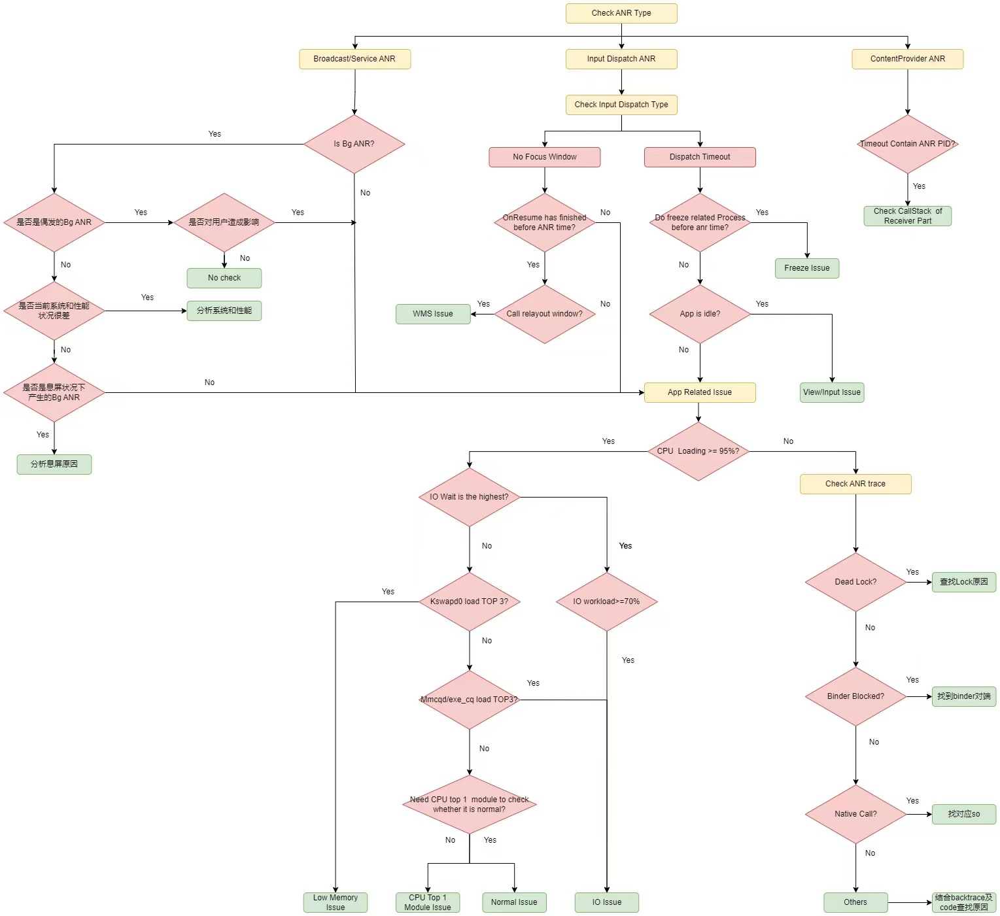

[ANRs  | App quality  | Android Developers](https://developer.android.com/topic/performance/vitals/anr)

[Android ANR问题总结_内核工匠的博客-CSDN博客](https://blog.csdn.net/feelabclihu/article/details/119962884)

[干货：ANR日志分析全面解析 - 掘金 (juejin.cn)](https://juejin.cn/post/6971327652468621326)


# trace

trace文件中的状态是是CPP代码中定义的状态

"main" prio=5 tid=1 Native


由此可知，main函数的native状态是正在执行JNI函数。堆栈信息是我们分析ANR的第一个重要的信息，一般来说：

**main线程处于 BLOCK、WAITING、TIMEWAITING状态，那基本上是函数阻塞导致ANR； 如果main线程无异常，则应该排查CPU负载和内存环境。**


# 内存

am_meminf|onTrimMemory

~~~
Total number of allocations 476778　　进程创建到现在一共创建了多少对象
​
Total bytes allocated 52MB　进程创建到现在一共申请了多少内存
​
Total bytes freed 52MB　　　进程创建到现在一共释放了多少内存
​
Free memory 777KB　　　 不扩展堆的情况下可用的内存
​
Free memory until GC 777KB　　GC前的可用内存
​
Free memory until OOME 383MB　　OOM之前的可用内存
​
Total memory 当前总内存（已用+可用）
​
Max memory 384MB  进程最多能申请的内存

~~~

**Free memory until OOME **的值很小的时候，已经处于内存紧张状态。应用可能是占用了过多内存。

除了trace文件中有内存信息，普通的eventlog日志中，也有内存信息（不一定打印）

04-02 22:00:08.195  1531  1544 I am_meminfo: [350937088,41086976,492830720,427937792,291887104]

以上四个值分别指的是：

- Cached
- Free,
- Zram,
- Kernel,Native

Cached+Free的内存代表着当前整个手机的可用内存，如果值很小，意味着处于内存紧张状态。一般低内存的判定阈值为：4G 内存手机以下阀值：350MB，以上阀值则为：450MB


# 分析步骤

一. ANR 分析步骤
Log分析：

1.首先，需要定位ANR发生的时间点，从event-log查找“am_ANR”关键字可以定位。
2.其次，从main-log（system-log）中查找“ANR in”关键字确认ANR具体的信息。
3.信息包含：ANR发生的进程名、进程号。ANR发生的原因。ANR发生的时候，当时的进程cpu占用情况，同时具体进程占用的上层和kernel层资源情况。ANR发生的时候cpu的负载情况。IOWAIT情况以及总的CPU使用情况。
4.进一步查看trace-log，了解进程的堆栈信息来判断ANR的原因。(一定要结合trace log 看，否则像一些死锁，进程堆栈都会发现不了)


***APP is Idle：***

检查CallStack，查看main thread的CallStack停在nativePollOnce (From SWT_JBT_TRACES)，如果是system anr，需要查看“android.ui” thread。


***No Focus Window ANR Check Point：***

1. 检查activity onResume时间点（此时activity能被看到），如果发生ANR时onResume还未完成，归类为APP Related Issue，否则进行步骤2判断：

2. ***异常case：\*the am_on_resume_called is called after ANR time

   // ANR Time (From Sys Log or SYS_ANDROID_LOG)**

   03-12 15:36:42.713  853  895 I WindowManager: **Input event dispatching timed out** sending to application AppWindowToken{f24f3cf token=Token{70fcbf5 ActivityRecord{1a714df u0 com.android.browser/.**BrowserActivity** t30}}}. Reason: Waiting because **no window has focus** but there is a focused application that may eventually add a window when it finishes starting up.

   **// onResume called (From Event Log)**

   03-12 15:36:54.024543 4616 4616 I **am_on_resume_called**: [0,com.android.browser.**BrowserActivity**]

   

3. 检查relayout window时间，如果发生ANR时resume activity还未call relayout window，归类为APP Related Issue，否则为WMS Issue。

   ***异常case：\*the resume activity call relayout window after ANR time**

   **// onResume called(From Event Log or SYS_ANDROID_EVENT_LOG)**

   11-08 01:29:43.077073 20643 20643 I **am_on_resume_called**: [0,com.android.camera.CameraLauncher,LAUNCH_ACTIVITY]

   **// ANR time(From Sys Log or SYS_ANDROID_LOG)**

   11-08 01:29:45.769929  995 1155 I WindowManager: **Input event dispatching timed out** sending to application AppWindowToken{ddf4807 token=Token{d3fc2b1 ActivityRecord{e40f158 u0 com.mediatek.camera/com.android.camera.CameraLauncher t514}}}. Reason: Waiting because **no window has focus** but there is a focused application that may eventually add a window when it finishes starting up.

   **// relayout window called(From Sys Log or SYS_ANDROID_LOG)**

   11-08 01:29:45.895444  995 2093 I WindowManager: **Relayout Window**{599852d u0 com.mediatek.camera/com.android.camera.CameraLauncher}: oldVis=4 newVis=0 focusMayChange = true

   11-08 01:29:46.034805  995 2087 W InputManager: Input event injection from pid 13134 timed out.


短时间内发生多次ANR，请先解掉第一个ANR，再确认后续ANR是否还能复现。


**APP Related Issue一般处理流程：**

1. 如果不是performance问题，请APP Owner参考“Call Stack Analysis”根据call stack进一步分析，常见问题同“常见SWT/ANR原因”。
2. 第三方APP问题，请使用最新版本软件和对比机进行对比验证，如果只有敝司平台手机能复现而对比机不能复现，请提交case同时注明“APPIOT” 关键字。

3. Google GMS包问题，请用最新版本的GMS包进行测试，如仍能复现，提交case时请同时注明“GMS” 关键字。

4. 如果是Performance问题，建议先在user/user+root版本上复测，如仍能复现，请参考“Performance Check Point”进一步定位。


**如果ANR发生在另一个ANR dump期间，可以考虑受ANR dump影响**

**打印WindowManager:ANR时间点距离am_anr时间点过长，侧面反映System Server卡顿**

**AnrManager:ANR in 打印的时间通常比ANR实际时间滞后，不要以此为ANR发生时间**


ANR trace

打印ANR后应用进程各个线程的调用栈,查看是否有block在native、binder、delock等

```java
主线程的堆栈信息
查看trace file anr 进程的main thread回调栈
“main”（线程名） 
prio=5（进程号） 
tid=1（进程内部线程号） 
Runnable （线程状态）|
 group=“main”（线程组） sCount=0 dsCount=0 obj=0x73bcc7d0 self=0x7f20814c00 |
 sysTid=20176 （系统线程号） nice=-10 cgrp=default sched=0/0 handle=0x7f251349b0 | state=R schedstat=( 0 0 0 ) 
utm=12 stm=3 （  用户态/内核态的CPU时间(单位是jiffies) ）
core=5 （该线程执行的cpu所在核）
HZ=100（1 jiffies  = 1000ms/100=10ms）
 | stack=0x7fdb75e000-0x7fdb760000 stackSize=8MB | held mutexes= "mutator lock"(shared held)
（堆栈调用信息,可以查看调用的关系，定位到具体位置）
```


**CPU loading Log**

**CPU loading反映的是一段时间的情况需要注意区间和ANR发生点是否对应，dump ANR前几秒或前半分钟的区间最为准确**

**CPU loading大于95可以考虑CPU高loading影响，如果区间太长如几分钟且CPU loading不高不能排除CPU非高loading，可以待定CPU条件**

**AnrManager:Load:这行显示 1分钟/5分钟/10分钟 的CPU负载情况，值越大CPU负载越重**

**iowait loading同时大于user和kernel时要注意iowait的影响**


**ANR发生前特殊信息Log**

**1)内存信息**

 搜寻对应ANR时间点前的内存状态，可用内存，各进程占用内存，Swap内存,再结合当前CPU loading情况判断是否由于低内存造成kswapd0 loading增加从而加剧CPU usage

 **一、Bugreport中dump meminfo**

------ DUMPSYS HIGH (/system/bin/dumpsys) ------
\-------------------------------------------------------------------------------
DUMP OF SERVICE HIGH meminfo:


--------- 15.335s was the duration of dumpsys meminfo, ending at: 2023-04-04 12:07:21
\-------------------------------------------------------------------------------

  **二、TGuard打印memory信息**

04-01 06:38:55.745  2005  2152 I TGuardMemoryManagerMemoryStrategy: unit(kb),need=63976,lost=9752,swapFree=81388,memAvail=1981752,WarningThreshold=1003716,realAvail=978036,realNeed=-914060
0

**2)线程handler消息延迟**

侧面反映1401进程在带有TGuardServiceHandler的线程执行缓慢

1401  1998 W Looper  : Slow dispatch took 5118ms TGuardServiceHandler h=[com.android.server.am](http://com.android.server.am/).TGuardService$ServiceHandler c=null m=1

**3)lowmemorykill**

对应ANR发生时间搜索lowmemorykill查看当前系统查杀情况，如果查杀到adj 100甚至0说明系统当前内存极为紧张

**4)待补充..**


# ANR Check Flow

- 根据MTK结合TCL客制化流程： [SWT/ANR问题教战手册 (mediatek.com)](https://online.mediatek.com/QuickStart/QS00152#QSS01626)
- 只增加BG ANG和Freeze判断流程,其余部分同MTK
- Owner需要严格按照如下流程Check,如相关条件无法判断，需要走**进一步分析流程(systrace/black/开log 复测)**或者通过上述**关键日志**来**侧面反映性能情况**




# ANR

Android app UI 线程被阻塞时间过长，会触发 Application Not Responding (ANR)。如果应用程序位于前台，会向用户显示一个 ANR 对话框，为用户提供强制退出应用的机会。

ANR 会给用户带来糟糕的体验，因为负责更新 UI 的应用主线程无法处理用户的绘制事件或绘制（input events or draw）


# ANR 分类

- Input disatching timed out：应用 5s 内未响应输入时间（key press or screen touch）

  ~~~
  a.InputDispatcher发送key事件给 对应的进程的 Focused Window ，对应的window不存在、处于暂停态、或通道(input channel)占满、通道未注册、通道异常、或5s内没有处理完一个事件，就会发生ANR
  
  b.InputDispatcher发送MotionEvent事件有个例外之处：当对应Touched Window的 input waitQueue中有超过0.5s的事件，inputDispatcher会暂停该事件，并等待5s，如果仍旧没有收到window的‘finish’事件，则触发ANR
  
  c.下一个事件到达，发现有一个超时事件才会触发ANR
  ~~~

  

- Executing service：应用声明的服务无法在几秒内完成 Service.onCreate() 和 ServiceonStartCommand() / Service.onBind()

- Service.startForeground() not called：应用使用 Context.startForegroundService() 在前台启动新服务，但该服务随后未在 5s 内调用 startForeground()

- Broadcast of intent：

- JobScheduler interactions：


# ANR 原因分析

## 导致ANR的原因

1 应用层导致ANR（耗时操作）

```java
java复制代码a. 函数阻塞：如死循环、主线程IO、处理大数据

b. 锁出错：主线程等待子线程的锁

c. 内存紧张：系统分配给一个应用的内存是有上限的，长期处于内存紧张，会导致频繁内存交换，进而导致应用的一些操作超时
```

2 系统导致ANR

```java
java复制代码a. CPU被抢占：一般来说，前台在玩游戏，可能会导致你的后台广播被抢占CPU

b. 系统服务无法及时响应：比如获取系统联系人等，系统的服务都是Binder机制，服务能力也是有限的，有可能系统服务长时间不响应导致ANR

c. 其他应用占用的大量内存
```


诊断 ANR 时需要考虑以下几种常见模式：

1. 应用正在执行涉及主线程上的 I/O 的缓慢操作
2. 线程正在对另一个进程进行同步 binder 调用，而后者需要很长时间才能返回
3. 主线程处于阻塞状态，为发生在另一个线程的长操作等待同步的块
4. 主线程在进程中或通过 binder 调用与另一个线程之间发生死锁。主线程不只是在等待长操作执行完毕，而且处于死锁状态。

发生 ANR 的原因

1. 主线程存在耗时操作：主线程阻塞（blocked）、挂起（suspend）、死锁、死循环、耗时操作
2. CPU 资源被抢占：其他进程某一时间点 CPU 占比高、某一刻系统的 CPU 占比过高，都会导致这一时间段无法抢到 CPU 时间片
3. 主线程卡在 binder 通信的对端：需要通过 binderinfo 查看对端信息
4. 系统或者应用自身可用内存紧张：系统一直执行 lowmemorykiller 操作查杀进程
5. 应用频繁 crash：包括应用自身也容易导致前台应用出现 anr 的现象
6. 系统原因导致：如冻结、温度过高、多媒体（音视频、编解码）、包管理、Block I/O、底层服务 NE（native crash）、watchdog 等


## 分析思路

android system 日志中搜索 “ANR in“，关键字查看

1. 发生 ANR 的应用进程、pid、类型
2. CPU 负载、内存压力、CPU 使用情况

其次查看 event 日志（ANR 发生最准的时间点）

最后查看 trace 日志


## 分析角度

1、CPU 使用率信息分析

从android（高通平台在android.txt,MTK平台在system*.txt）日志中，查看系统中各个进程的cpu使用率，首先关注的进程就是发生anr的进程、system_server、kswapd0、kworker和其他占比较高的进程、以及最终统计的整体cpu使用率信息。例如，如果 **kswapd0** 占比较高，就说明内存存在一定的压力；iowait很高就说明系统在一些I/O耗时操作，就可以结合上下文日志及系统日志辅助分析发生ANR的原因。如果很多进程的cpu使用率普遍较高，发生anr应用的cpu使用率较低，此时可以怀疑发生anr的应用拿不到cpu时间片导致anr等。


2、Memory 角度分析

查看发生anr时间点前后的可用内存情况，以及系统查杀应用的频繁程度。


3、kernel 日志分析

在日志中直接搜索关键字“lowmemorykiller”、“iowait”等，查看发生的时间点与发生anr的时间点是否基本对应。如果发生anr时间点附近，出现大量的lowmemorykiller日志信息，则说明当时内存已经严重紧张，可以较大概率认为是内存不足导致后台一直在查杀进程，同时影响前台应用的操作，导致前台应用操作耗时出现anr问题；如果出现iowait，则表示可能出现了I/O卡顿。


4、综合系统功能进行整体分析

部分情况下，根据trace日志很难能够直接确定发生anr的原因，需要根据当时的系统运行情况进行辅助分析。综合当前的系统环境，可以从消息队列、系统可用内存、发热功耗、后台GC频率和时长、dex2oat耗时、冻结、频繁crash、温度过高、lowmemorykiller、root权限、system.err、system.out、binder_sample、slow operation等角度在日志中搜索关键字进行分析。也存在这种情况，系统日志信息不足以分析出anr的问题，此时需要借助日志中的systrace日志进行详细分析，虽然说大部分时间都对不上，但是也存在对上的时候。

总之，ANR问题需要进行整体分析，结合系统中的所有关键信息共同得出发生ANR的准确结论。

