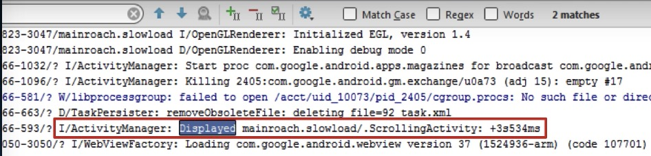
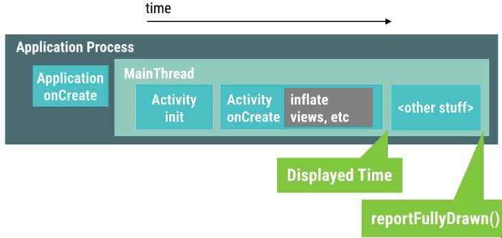
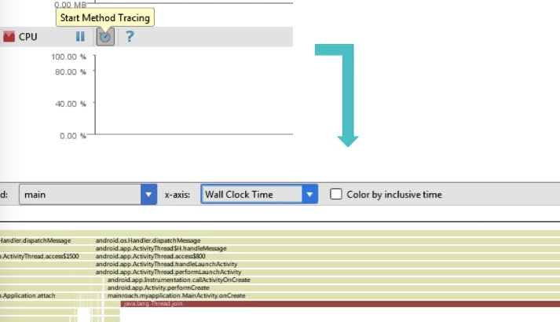
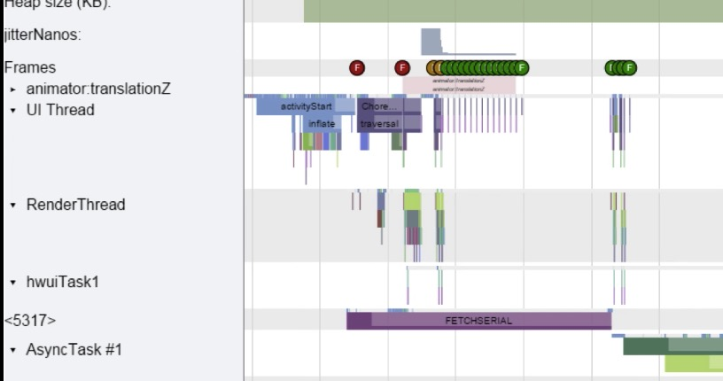
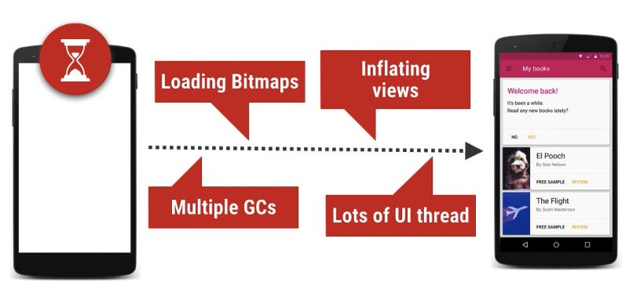
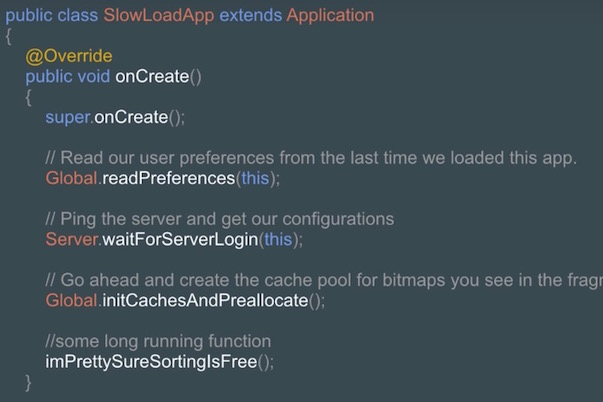
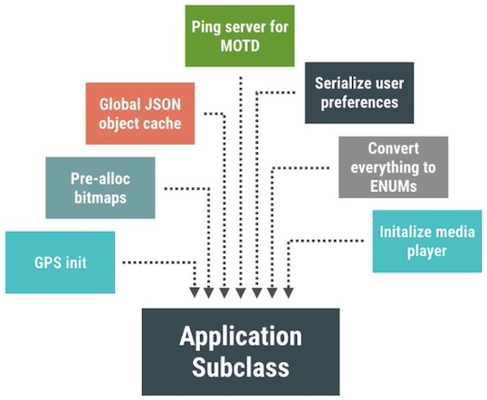
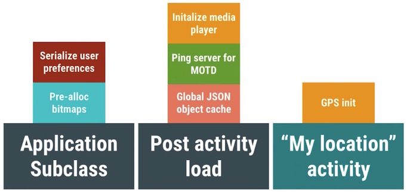
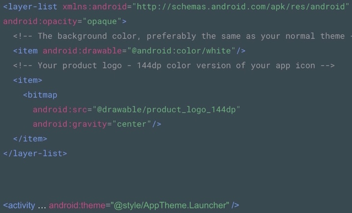
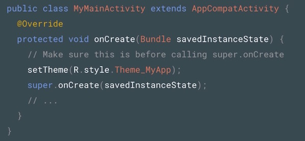

# Launch

## 1. App Launch time 101

程序启动过程中的那些复杂错误的操作很可能导致严重的性能问题。Android系统会根据用户的操作行为调整程序的显示策略，用来提高程序的显示性能。例如，一旦用户点击桌面图标，Android系统会立即显示一个启动窗口，这个窗口会一直保持显示直到画面中的元素成功加载并绘制完第一帧。这种行为常见于程序的冷启动，或者程序的热启动场景（程序从后台被唤起或者从其他APP界面切换回来）。那么关键的问题是，用户很可能会因为从启动窗口到显示画面的过程耗时过长而感到厌烦，从而导致用户没有来得及等程序启动完毕就切换到其他APP了。更严重的是，如果启动时间过长，可能导致程序出现ANR。我们应该避免出现这两种糟糕的情况。

从技术角度来说，当用户点击桌面图标开始，系统会立即为这个APP创建独立的专属进程，然后显示启动窗口，直到APP在自己的进程里面完成了程序的创建以及主线程完成了Activity的初始化显示操作，再然后系统进程就会把启动窗口替换成APP的显示窗口。

上述流程里面的绝大多数步骤都是由系统控制的，一般来说不会出现什么问题，可是对于启动速度，我们能够控制并且需要特别关注的地方主要有三处：

- 1）Activity的onCreate流程，特别是UI的布局与渲染操作，如果布局过于复杂很可能导致严重的启动性能问题。
- 2）Application的onCreate流程，对于大型的APP来说，通常会在这里做大量的通用组件的初始化操作。
- 3）目前有部分APP会提供自定义的启动窗口，这里可以做成品牌宣传界面或者是给用户提供一种程序已经启动的视觉效果。

在正式着手解决问题之前，我们需要掌握一套正确测量评估启动性能的方法。所幸的是，Android系统有提供一些工具来帮助我们定位问题。

- 1）首先是**display time**：从Android KitKat版本开始，Logcat中会输出从程序启动到某个Activity显示到画面上所花费的时间。这个方法比较适合测量程序的启动时间。

- 2）其次是**reportFullyDrawn**方法：我们通常来说会使用异步懒加载的方式来提升程序画面的显示速度，这通常会导致的一个问题是，程序画面已经显示，可是内容却还在加载中。为了衡量这些异步加载资源所耗费的时间，我们可以在异步加载完毕之后调用`activity.reportFullyDrawn()`方法来告诉系统此时的状态，以便获取整个加载的耗时。

- 3）然后是**Method Tracing**：前面两个方法提供了启动耗时的总时间，可是却无法提供具体的耗时细节。为了获取具体的耗时分布情况，我们可以使用Method Tracing工具来进行详细的测量。

- 4）最后是**Systrace**：我们可以在onCreate方法里面添加trace.beginSection()与trace.endSection()方法来声明需要跟踪的起止位置，系统会帮忙统计中间经历过的函数调用耗时，并输出报表。

## 2. App Launch Time & Activity Creation

提升Activity的创建速度是优化APP启动速度的首要关注目标。从桌面点击APP图标启动应用开始，程序会显示一个启动窗口等待Activity的创建加载完毕再进行显示。在Activity的创建加载过程中，会执行很多的操作，例如设置页面的主题，初始化页面的布局，加载图片，获取网络数据，读写Preference等等。

上述操作的任何一个环节出现性能问题都可能导致画面不能及时显示，影响了程序的启动速度。上一个段落我们介绍了使用Method Tracing来发现那些耗时占比相对较多的方法。假设我们发现某个方法执行时间过长，接下去就可以使用Systrace来帮忙定位到底是什么原因导致那个方法执行时间过长。

除了使用工具进行具体定位分析性能问题之外，以下两点经验可以帮助我们对Activity启动做性能优化：

- 1）优化布局耗时：一个布局层级越深，里面包含需要加载的元素越多，就会耗费更多的初始化时间。关于布局性能的优化，这里就不展开描述了！
- 2）异步延迟加载：一开始只初始化最需要的布局，异步加载图片，非立即需要的组件可以做延迟加载。

## 3.  App Launch Time & Bloated Application Objects

在Application初始化的地方做太多繁重的事情是可能导致严重启动性能问题的元凶之一。Application里面的初始化操作不结束，其他任意的程序操作都无法进行。

有时候，我们会一股脑的把绝大多数全局组件的初始化操作都放在Application的onCreate里面，但其实很多组件是需要做区队对待的，有些可以做延迟加载，有些可以放到其他的地方做初始化操作，特别需要留意包含Disk IO操作，网络访问等严重耗时的任务，他们会严重阻塞程序的启动。

优化这些问题的解决方案是做延迟加载，可以在application里面做延迟加载，也可以把一些初始化的操作延迟到组件真正被调用到的时候再做加载。

## 4. App Launch Time & Theme Launch Screens

启动闪屏不仅仅可以作为品牌宣传页，还能够减轻用户对启动耗时的感知，但是如果使用不恰当，将适得其反。前面介绍过当点击桌面图标启动APP的时候，程序会显示一个启动窗口，一直到页面的渲染加载完毕。如果程序的启动速度足够快，我们看的闪屏窗口停留显示的时间则会很短，但是当程序启动速度偏慢的时候，这个启动闪屏可以一定程度上减轻用户等待的焦虑感，避免用户过于轻易的关闭应用。

目前大多数开发者都会通过设置启动窗口主题的方式来替换系统默认的启动窗口，通过这种方式只是使用『障眼法』弱化了用户对启动时间的感知，但本质上并没有对启动速度做什么优化。也有些APP通过关闭启动窗口属性`android:windowDisablePreview`的方式来直接移除系统默认的启动窗口，但是这样的弊端是用户从点击桌面图标到真的看到实际页面的这段时间当中，画面没有任何变化，这样的用户体验是十分糟糕的！

对于启动闪屏，正确的使用方法是自定义一张图片，把这张图片通过设置主题的方式显示为启动闪屏，代码执行到主页面的onCreate的时候设置为程序正常的主题。

# Compute

## 1. Intro to Compute and Memory Problems

Android中的Java代码会需要经过编译优化再执行的过程。代码的不同写法会影响到Java编译器的优化效率。例如for循环的不同写法就会对编译器优化这段代码产生不同的效率，当程序中包含大量这种可优化的代码的时候，运算性能就会出现问题。想要知道如何优化代码的运算性能就需要知道代码在硬件层的执行差异。

## 2. Slow Function Performance

如果你写了一段代码，它的执行效率比想象中的要差很多。我们需要知道有哪些因素有可能影响到这段代码的执行效率。例如：比较两个float数值大小的执行时间是int数值的4倍左右。这是因为CPU的运算架构导致的。

通常来说有两类运行效率差的情况：第1种是相对执行时间长的方法，我们可以很轻松的找到这些方法并做一定的优化。第2种是执行时间短，但是执行频次很高的方法，因为执行次数多，累积效应下就会对性能产生很大的影响。

修复这些细节效率问题，需要使用Android SDK提供的工具，进行仔细的测量，然后再进行微调修复。

## 3. Traceview Walkthrough

通过Android Studio打开里面的Android Device Monitor，切换到DDMS窗口，点击左边栏上面想要跟踪的进程，再点击上面的Start Method Tracing的按钮。

启动跟踪之后，再操控app，做一些你想要跟踪的事件，例如滑动listview，点击某些视图进入另外一个页面等等。操作完之后，回到Android Device Monitor，再次点击Method Tracing的按钮停止跟踪。此时工具会为刚才的操作生成TraceView的详细视图。

关于TraceView中详细数据如何查看，这里不展开了。

## 4. Batching and Caching

为了提升运算性能，这里介绍2个非常重要的技术，Batching与Caching。

**Batching**是在真正执行运算操作之前对数据进行批量预处理，例如你需要有这样一个方法，它的作用是查找某个值是否存在与于一堆数据中。假设一个前提，我们会先对数据做排序，然后使用二分查找法来判断值是否存在。我们先看第一种情况，下图中存在着多次重复的排序操作。

## 5. Blocking the UI Thread

提升代码的运算效率是改善性能的一方面，让代码执行在哪个线程也同样很重要。我们都知道Android的Main Thread也是UI Thread，它需要承担用户的触摸事件的反馈，界面视图的渲染等操作。这就意味着，我们不能在Main Thread里面做任何非轻量级的操作，类似I/O操作会花费大量时间，这很有可能会导致界面渲染发生丢帧的现象，甚至有可能导致ANR。防止这些问题的解决办法就是把那些可能有性能问题的代码移到非UI线程进行操作。

## 6. Container Performance

需要注意的运算性能问题是基础算法的合理选择，例如冒泡排序与快速排序的性能差异：

Java提供了很多现成的容器，例如Vector，ArrayList，LinkedList，HashMap等等，在Android里面还有新增加的SparseArray等，我们需要了解这些基础容器的性能差异以及适用场景。这样才能够选择合适的容器，达到最佳的性能。