# Network

## 1. Cachematters for networking

想要使得Android系统上的网络访问操作更加的高效就必须做好网络数据的缓存。这是提高网络访问性能最基础的步骤之一。从手机的缓存中直接读取数据肯定比从网络上获取数据要更加的便捷高效，特别是对于那些会被频繁访问到的数据，需要把这些数据缓存到设备上，以便更加快速的进行访问。

Android系统上关于网络请求的Http Response Cache是默认关闭的，这样会导致每次即使请求的数据内容是一样的也会需要重复被调用执行，效率低下。我们可以通过下面的代码示例开启[HttpResponseCache](http://developer.android.com/reference/android/net/http/HttpResponseCache.html)。

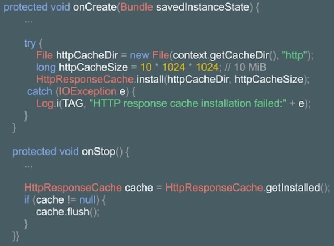

开启Http Response Cache之后，Http操作相关的返回数据就会缓存到文件系统上，不仅仅是主程序自己编写的网络请求相关的数据会被缓存，另外引入的library库中的网络相关的请求数据也会被缓存到这个Cache中。

网络请求的场景有可以是普通的http请求，也可以打开某个URL去获取数据，如下图所示：

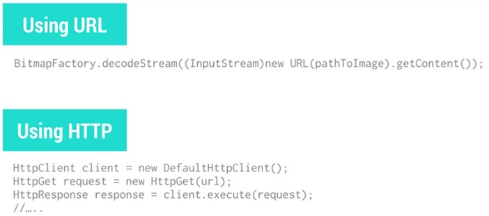

我们有两种方式来清除`HttpResponseCache`的缓存数据：第一种方式是缓存溢出的时候删除最旧最老的文件，第二种方式是通过Http返回Header中的`Cache-Control`字段来进行控制的。如下图所示：

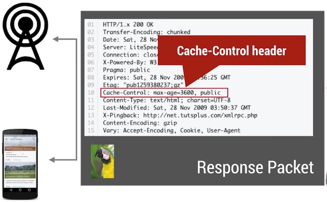

通常来说，`HttpResponseCache`会缓存所有的返回信息，包括实际的数据与Header的部分.一般情况下，这个Cache会自动根据协议返回`Cache-Control`的内容与当前缓存的数据量来决定哪些数据应该继续保留，哪些数据应该删除。但是在一些极端的情况下，例如服务器返回的数据没有设置Cache废弃的时间，或者是本地的Cache文件系统与返回的缓存数据有冲突，或者是某些特殊的网络环境导致HttpResponseCache工作异常，在这些情况下就需要我们自己来实现Http的缓存Cache。

实现自定义的http缓存，需要解决两个问题：第一个是实现一个DiskCacheManager，另外一个是制定Cache的缓存策略。关于DiskCacheManager，我们可以扩展Android系统提供的[DiskLruCache](https://developer.android.com/intl/zh-cn/samples/DisplayingBitmaps/src/com.example.android.displayingbitmaps/util/DiskLruCache.html)来实现。而Cache的缓存策略，相对来说复杂一些，我们可能需要把部分JSON数据设计成不能缓存的，另外一些JSON数据设计成可以缓存几天的，把缩略图设计成缓存一两天的等等，为不同的数据类型根据他们的使用特点制定不同的缓存策略。

想要比较好的实现这两件事情，如果全部自己从头开始写会比较繁琐复杂，所幸的是，有不少著名的开源框架帮助我们快速的解决了那些问题。我们可以使用[Volly](https://developer.android.com/training/volley/index.html)，[okHTTP](http://square.github.io/okhttp/)，[Picasso](http://square.github.io/picasso/)来实现网络缓存。

实现好网络缓存之后，我们可以使用Android Studio里面的`Network Traffic Tools`来查看网络数据的请求与返回情况，另外我们还可以使用[AT&T ARO](https://developer.att.com/application-resource-optimizer)工具来抓取网络数据包进行分析查看。

## 2. Optimizing Network Request Frequencies

应用程序的一个基础功能是能够保持确保界面上呈现的信息是即时最新的，例如呈现最新的新闻，天气，信息流等等信息。但是，过于频繁的促使手机客户端应用去同步最新的服务器数据会对性能产生很大的负面影响，不仅仅使得CPU不停的在工作，内存，网络流量，电量等等都会持续的被消耗，所以在进行网络请求操作的时候一定要避免多度同步操作。

退到后台的应用为了能够在切换回前台的时候呈现最新的数据，会偷偷在后台不停的做同步的操作。这种行为会带来很严重的问题，首先因为网络请求的行为异常的耗电，其次不停的进行网络同步会耗费很多带宽流量。

为了能够尽量的减少不必要的同步操作，我们需要遵守下面的一些规则：

- 首先我们要对网络行为进行分类，区分需要立即更新数据的行为和其他可以进行延迟的更新行为，为不同的场景进行差异化处理。
- 其次要避免客户端对服务器的轮询操作，这样会浪费很多的电量与带宽流量。解决这个问题，我们可以使用Google Cloud Message来对更新的数据进行推送。
- 然后在某些必须做同步的场景下，需要避免使用固定的间隔频率来进行更新操作，我们应该在返回的数据无更新的时候，使用双倍的间隔时间来进行下一次同步。
- 最后更进一步，我们还可以通过判断当前设备的状态来决定同步的频率，例如判断设备处于休眠，运动等不同的状态设计各自不同时间间隔的同步频率。

另外，我们还可以通过判断设备是否连接上WiFi，是否正在充电来决定更新的频率。为了能够方便的实现这个功能，Android为我们提供了[GCMNetworkManager](https://developers.google.com/android/reference/com/google/android/gms/gcm/GcmNetworkManager)来判断设备当下的状态，从而设计更加高效的网络同步操作。

## 3. Effective Prefetching

关于提升网络操作的性能，除了避免频繁的网络同步操作之外，还可以使用捆绑批量访问的方式来减少访问的频率，为了达到这个目的，我们就需要了解Prefetching。

使用Prefetching的难点在于如何判断事先获取的数据量到底是多少，如果预取的数据量偏少，那么就起不到什么效果，但是如果预取过多，又可能导致访问的时间过长。

## 4. Adapting to Latency

网络延迟通常来说很容易被用户察觉到，严重的网络延迟会对用户体验造成很大的影响，用户很容易抱怨应用程序写的不好。

一个典型的网络操作行为，通常包含以下几个步骤：首先手机端发起网络请求，到达网络服务运营商的基站，再转移到服务提供者的服务器上，经过解码之后，接着访问本地的存储数据库，获取到数据之后，进行编码，最后按照原来传递的路径逐层返回。

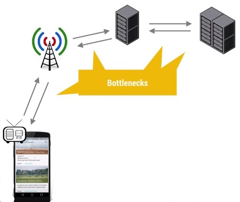

在上面的网络请求链路当中的任何一个环节都有可能导致严重的延迟，成为性能瓶颈，但是这些环节可能出现的问题，客户端应用是无法进行调节控制的，应用能够做的就只是根据当前的网络环境选择当下最佳的策略来降低出现网络延迟的概率。主要的实施步骤有两步：第1步检测收集当前的网络环境信息，第2步根据当前收集到的信息进行网络请求行为的调整。

关于第1步检测当前的网络环境，我们可以使用系统提供的API来获取到相关的信息，如下图所示：

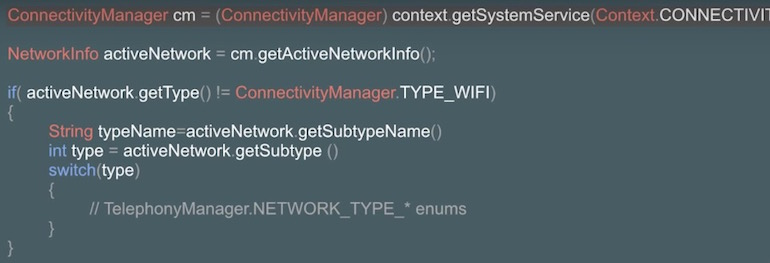

通过上面的示例，我们可以获取到移动网络的详细子类型，例如4G(LTE),3G等等，详细分类见下图，获取到详细的移动网络类型之后，我们可以根据当前网络的速率来调整网络请求的行为：

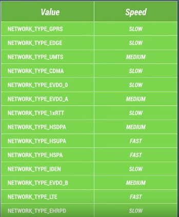

关于第2步根据收集到的信息进行策略的调整，通常来说，我们可以把网络请求延迟划分为三档：例如把网络延迟小于60ms的划分为GOOD，大于220ms的划分为BAD，介于两者之间的划分为OK（这里的60ms，220ms会需要根据不同的场景提前进行预算推测）。如果网络延迟属于GOOD的范畴，我们就可以做更多比较激进的预取数据的操作，如果网络延迟属于BAD的范畴，我们就应该考虑把当下的网络请求操作Hold住等待网络状况恢复到GOOD的状态再进行处理。

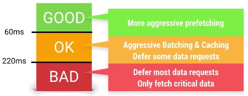

前面提到说60ms，220ms是需要提前自己预测的，可是预测的工作相当复杂。首先针对不同的机器与网络环境，网络延迟的三档阈值都不太一样，出现的概率也不尽相同，我们会需要针对这些不同的用户与设备选择不同的阈值进行差异化处理：

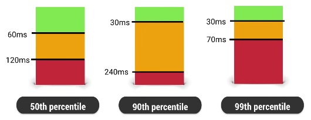

Android官方为了帮助我们设计自己的网络请求策略，为我们提供了模拟器的网络流量控制功能来对实际环境进行模拟测量，或者还可以使用AT&T提供的[AT&T Network Attenuator](http://developer.att.com/developer/legalAgreementPage.jsp?passedItemId=14500040)来帮助预估网络延迟。

## 5. Minimizing Asset Payload

为了能够减小网络传输的数据量，我们需要对传输的数据做压缩的处理，这样能够提高网络操作的性能。首先不同的网络环境，下载速度以及网络延迟是存在差异的。

如果我们选择在网速更低的网络环境下进行数据传输，这就意味着需要执行更长的时间，而更长的网络操作行为，会导致电量消耗更加严重。另外传输的数据如果不做压缩处理，也同样会增加网络传输的时间，消耗更多的电量。不仅如此，未经过压缩的数据，也会消耗更多的流量，使得用户需要付出更多的流量费。

通常来说，网络传输数据量的大小主要由两部分组成：图片与序列化的数据，那么我们需要做的就是减少这两部分的数据传输大小，分下面两个方面来讨论。

- A)首先需要做的是减少图片的大小，选择合适的图片保存格式是第一步。

于JPEG与WEBP格式的图片，不同的清晰度对占用空间的大小也会产生很大的影响，适当的减少JPG Quality，可以大大的缩小图片占用的空间大小。

另外，我们需要为不同的使用场景提供当前场景下最合适的图片大小，例如针对全屏显示的情况我们会需要一张清晰度比较高的图片，而如果只是显示为缩略图的形式，就只需要服务器提供一个相对清晰度低很多的图片即可。服务器应该支持到为不同的使用场景分别准备多套清晰度不一样的图片，以便在对应的场景下能够获取到最适合自己的图片。这虽然会增加服务端的工作量，可是这个付出却十分值得！

- B)其次需要做的是减少序列化数据的大小。JSON与XML为了提高可读性，在文件中加入了大量的符号，空格等等字符，而这些字符对于程序来说是没有任何意义的。我们应该使用Protocal Buffers，Nano-Proto-Buffers，FlatBuffer来减小序列化的数据的大小。

Android系统为我们提供了工具来查看网络传输的数据情况，打开Android Studio的Monitor，里面有网络访问的模块。或者是打开AT&T提供的[ARO](https://developer.att.com/application-resource-optimizer)工具来查看网络请求状态。

## 6. Caching UI data

如今绝大多数的应用界面上呈现的数据都依赖于网络请求返回的结果，如何做到在网络数据返回之前避免呈现一个空白的等待页面呢（当然这里说的是非首次冷启动的情况）？这就会涉及到如何缓存UI界面上的数据。

缓存UI界面上的数据，可以采用方案有存储到文件系统，Preference，SQLite等等，做了缓存之后，这样就可以在请求数据返回结果之前，呈现给用户旧的数据，而不是使用正在加载的方式让用户什么数据都看不到，当然在请求网络最新数据的过程中，需要有正在刷新的提示。至于到底选择哪个方案来对数据进行缓存，就需要根据具体情况来做选择了。

# Battery

[Optimize for Doze and App Standby  | App quality  | Android Developers](https://developer.android.com/training/monitoring-device-state/doze-standby)

## 1. Understanding Battery Drain

手机各个硬件模块的耗电量是不一样的，有多有少。

电量消耗的计算与统计：记录电量消耗本身也费电量。需要使用第三方检测电量的设备才能获取较为真实的电量消耗。（如录像，trace，监测本身就有消耗，分析性能需考虑，性能对比需要环境一致）

点亮屏幕，硬件各个模块就需要开始工作，这会需要消耗很多电量。

使用WakeLock或者JobScheduler唤醒设备处理定时的任务之后，一定要及时让设备回到初始状态。每次唤醒蜂窝信号进行数据传递，都会消耗很多电量，它比WiFi等操作更加的耗电。

## 2. Battery Historian

可以通过 adb 获取设备电量消耗信息，通过 [battery-historian](https://github.com/google/battery-historian) 可以转换成可读性更好的 html 文件具体分析

[BatteryHistorian Android手机耗电分析神器_battery historian_内核工匠的博客-CSDN博客](https://blog.csdn.net/feelabclihu/article/details/124207048)

## 3. Track Battery Status & Battery Manager

获取设备的充电状态，得到充电状态信息后可以针对部分代码做优化，比如我们可以判断只有当前设备AC充电状态时才去执行一些耗电的操作。如何获取WakeLock是简单的，可是及时释放WakeLock也是非常重要的，不恰当的使用WakeLock会导致严重错误。

## 4. Wakelock and Battery Drain

一个最简单的唤醒手机的方法是使用PowerManager.WakeLock的API来保持CPU工作并防止屏幕变暗关闭。这使得手机可以被唤醒，执行工作，然后回到睡眠状态。这也是为何使用带超时参数的wakelock.acquice()方法是很关键的。

但是仅仅设置超时并不足够解决问题，例如设置多长的超时比较合适？什么时候进行重试等等？正确的方式可能是使用非精准定时器。通常情况下，我们会设定一个时间进行某个操作，但是动态修改这个时间也许会更好。例如，如果有另外一个程序需要比你设定的时间晚5分钟唤醒，最好能够等到那个时候，两个任务捆绑一起同时进行，这就是非精确定时器的核心工作原理。我们可以定制计划的任务，可是系统如果检测到一个更好的时间，它可以推迟你的任务，以节省电量消耗。

这正是JobScheduler API所做的事情。它会根据当前的情况与任务，组合出理想的唤醒时间，例如等到正在充电或者连接到WiFi的时候，或者集中任务一起执行。可以通过这个API实现很多免费的调度算法。

## 5. Network and Battery Drain

为了减少电量的消耗，在蜂窝移动网络下，最好做到批量执行网络请求，尽量避免频繁的间隔网络请求。

当程序想要执行某个网络请求之前，需要先唤醒设备，然后发送数据请求，之后等待返回数据，最后才慢慢进入休眠状态。激活瞬间，发送数据的瞬间，接收数据的瞬间都有很大的电量消耗，所以，我们应该从如何传递网络数据以及何时发起网络请求这两个方面来着手优化。

**1.1)何时发起网络请求**

首先我们需要区分哪些网络请求是需要及时返回结果的，哪些是可以延迟执行的。例如，用户主动下拉刷新列表，这种行为需要立即触发网络请求，并等待数据返回。但是对于上传用户操作的数据，同步程序设置等等行为则属于可以延迟的行为。可以通过Battery Historian这个工具来查看关于移动蜂窝模块的电量消耗（关于这部分的细节，请点击[Android性能优化之电量篇](http://hukai.me/android-performance-battery/)）。在Mobile Radio那一行会显示蜂窝模块的电量消耗情况，红色的部分代表模块正在工作，中间的间隔部分代表模块正在休眠状态，如果看到有一段区间，红色与间隔频繁的出现，那就说明这里有可以优化的行为。如下图所示：

经过上面的优化之后，我们再回头使用Battery Historian导出电量消耗图，可以看到唤醒状态与休眠状态是连续大块间隔的，这样的话，总体电量的消耗就会变得更少。

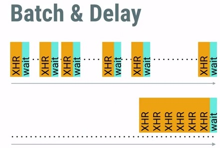

甚至可以把请求的任务延迟到手机网络切换到WiFi，手机处于充电状态下再执行。在前面的描述过程中，我们会遇到的一个难题是如何把网络请求延迟，并批量进行执行。还好，Android提供了[JobScheduler](http://developer.android.com/intl/zh-cn/reference/android/app/job/JobScheduler.html)来帮助我们达成这个目标。

**减少移动网络被激活的时间与次数**

通常来说，发生网络行为可以划分为如下图所示的三种类型，一个是用户主动触发的请求，另外被动接收服务器的返回数据，最后一个是数据上报，行为上报，位置更新等等自定义的后台操作。

坚决肯定不应该使用Polling(轮询)的方式去执行网络请求，这样不仅仅会造成严重的电量消耗，还会浪费许多网络流量。

Android官方推荐使用[Google Cloud Messaging](https://developers.google.com/cloud-messaging/)(在大陆，然并卵)，这个框架会帮助把更新的数据推送给手机客户端，效率极高！我们应该遵循下面的规则来处理数据同步的问题：

首先，我们应该使用回退机制来避免固定频繁的同步请求，例如，在发现返回数据相同的情况下，推迟下次的请求时间。

其次，我们还可以使用**Batching**(批处理)的方式来集中发出请求，避免频繁的间隔请求。

最后，我们还可以使用**Prefetching**(预取)的技术提前把一些数据拿到，避免后面频繁再次发起网络请求。

Google Play Service中提供了一个叫做[GCMNetworkManager](https://developers.google.com/cloud-messaging/network-manager)的类来帮助我们实现上面的那些功能，我们只需要调用对应的API，设置一些简单的参数，其余的工作就都交给Google来帮我们实现了。

**1.2)如何传递网络数据**

关于这部分主要会涉及到Prefetch(预取)与Compressed(压缩)这两个技术。对于Prefetch的使用，我们需要预先判断用户在此次操作之后，后续零散的请求是否很有可能会马上被触发，可以把后面5分钟有可能会使用到的零散请求都一次集中执行完毕。对于Compressed的使用，在上传与下载数据之前，使用CPU对数据进行压缩与解压，可以很大程度上减少网络传输的时间。

想要知道我们的应用程序中网络请求发生的时间，每次请求的数据量等等信息，可以通过Android Studio中的[Networking Traffic Tool](http://developer.android.com/intl/zh-cn/tools/debugging/ddms.html#network)来查看详细的数据，如下图所示：

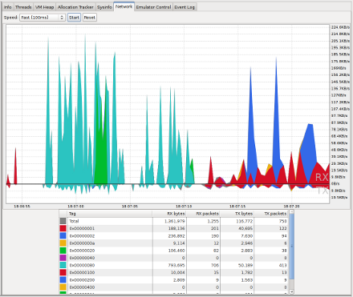

关于压缩传输数据，我们可以学习以下的一些课程(真的够喝好几壶了)：

- [CompressorHead](https://www.youtube.com/playlist?list=PLOU2XLYxmsIJGErt5rrCqaSGTMyyqNt2H)：这系列的课程会介绍压缩的基本概念以及一些常见的压缩算法知识。
- [Image Compression](http://www.html5rocks.com/en/tutorials/speed/img-compression/)：介绍关于图片的压缩知识。
- [Texture Wranglin](http://www.gdcvault.com/play/1020682/Texture-Wranglin-Getting-your-Android)：介绍了游戏开发相关的知识。
- [Grabby](https://www.youtube.com/watch?v=P7riQin9Bfo&feature=iv&src_vid=l5mE3Tpjejs&annotation_id=annotation_3146342489)：介绍了游戏开发相关的知识。
- [Gzip is not enough](https://www.youtube.com/watch?v=whGwm0Lky2s&feature=iv&src_vid=l5mE3Tpjejs&annotation_id=annotation_1270272007)
- [Text Compression](http://www.html5rocks.com/en/tutorials/speed/txt-compression/)
- [FlatBuffers](https://www.youtube.com/watch?v=iQTxMkSJ1dQ&feature=iv&src_vid=l5mE3Tpjejs&annotation_id=annotation_632816183)

## 6. Using Job Scheduler

那么如何才能够把任务缓存起来，做到批量化执行呢？使用[Job Scheduler](https://developer.android.com/reference/android/app/job/JobScheduler.html)，应用需要做的事情就是判断哪些任务是不紧急的，可以交给Job Scheduler来处理，Job Scheduler集中处理收到的任务，选择合适的时间，合适的网络，再一起进行执行。

为了避免我们的应用程序过多的频繁消耗电量，我们需要学习如何把后台任务打包批量，并选择一个合适的时机进行触发执行。

执行延迟任务，通常有下面三种方式：

1)AlarmManager

使用AlarmManager设置定时任务，可以选择精确的间隔时间，也可以选择非精确时间作为参数。除非程序有很强烈的需要使用精确的定时唤醒，否者一定要避免使用他，我们应该尽量使用非精确的方式。

2)SyncAdapter

我们可以使用SyncAdapter为应用添加设置账户，这样在手机设置的账户列表里面可以找到我们的应用。这种方式功能更多，但是实现起来比较复杂。

3)JobSchedulor

这是最简单高效的方法，我们可以设置任务延迟的间隔，执行条件，还可以增加重试机制。

## 7. Wear & Sensors

Android Wear上会大量的使用Sensors来实现某些特殊功能，如何在尽量节约电量的前提下利用好Sensor会是我们需要特别注意的问题。下面会介绍一些在Android Wear上的最佳实践典范。

尽量减少刷新请求，例如我们可以在不需要某些数据的时候尽快注销监听，减小刷新频率，对Sensor的数据做批量处理等等。那么如何做到这些优化呢？

- 首先我们需要尽量使用Android平台提供的既有运动数据，而不是自己去实现监听采集数据，因为大多数Android Watch自身记录Sensor数据的行为是有经过做电量优化的。
- 其次在Activity不需要监听某些Sensor数据的时候需要尽快释放监听注册。
- 还有我们需要尽量控制更新的频率，仅仅在需要刷新显示数据的时候才触发获取最新数据的操作。
- 另外我们可以针对Sensor的数据做批量处理，待数据累积一定次数或者某个程度的时候才更新到UI上。
- 最后当Watch与Phone连接起来的时候，可以把某些复杂操作的事情交给Phone来执行，Watch只需要等待返回的结果。

**Android Wear Data Batching**

因为Phone的CPU与电量都比Wear要强大，另外Phone还可以直接接入网络，而Wear要接入网络则相对更加困难，所以我们在开发Wear应用的时候需要尽量做到把复杂的操作交给Phone来执行。例如我们可以让Phone来获取天气信息，然后把数据返回Wear进行显示。更进一步，在之前的性能优化课程里面我们有学习过如何使用JobScheduler来延迟批量处理任务，假设Phone收到来自Wear的其中一个任务是每隔5分钟检查一次天气情况，那么Phone使用JobScheduler执行检查天气任务之后，先判断这次返回的结果和之前是否有差异，仅仅当天气发生变化的时候，才有必要把结果通知到Wear，或者仅仅把变化的某一项数据通知给Wear，这样可以更大程度上减少Wear的电量消耗。

下面我们总结一下如何优化Wear的性能与电量：

- 仅仅在真正需要刷新界面的时候才发出请求
- 尽量把计算复杂操作的任务交给Phone来处理
- Phone仅仅在数据发生变化的时候才通知到Wear
- 把零碎的数据请求捆绑一起再进行操作

## 8. Smooth Android Wear Animation

优化动画的性能不仅能够提升用户体验还可以减少电量的消耗。在Android里面一个相对操作比较繁重的事情是对Bitmap进行旋转，缩放，裁剪等等。例如在一个圆形的钟表图上，我们把时钟的指针抠出来当做单独的图片进行旋转会比旋转一张完整的圆形图的所形成的帧率要高56%。

另外尽量减少每次重绘的元素可以极大的提升性能，假如某个钟表界面上有很多需要显示的复杂组件，我们可以把这些组件做拆分处理，例如把背景图片单独拎出来设置为一个独立的View，通过setLayerType()方法使得这个View强制用Hardware来进行渲染。至于界面上哪些元素需要做拆分，他们各自的更新频率是多少，需要有针对性的单独讨论。

使用Systrace等工具来查看某些View的渲染性能。对于大多数应用中的动画，我们会使用PropertyAnimation或者ViewAnimation来操作实现，Android系统会自动对这些Animation做一定的优化处理。

## 9. Location & Battery Drain

开启定位功能是一个相对来说比较耗电的操作，通常来说，我们会使用类似下面这样的代码来发出定位请求：

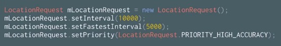

有一个方法是**setInterval()**指的意思是每隔多长的时间获取一次位置更新，时间相隔越短，自然花费的电量就越多，但是时间相隔太长，又无法及时获取到更新的位置信息。其中存在的一个优化点是，我们可以通过判断返回的位置信息是否相同，从而决定设置下次的更新间隔是否增加一倍，通过这种方式可以减少电量的消耗。

还有一个方法是**setFastestInterval()**，因为整个系统中很可能存在其他的应用也在请求位置更新，那些应用很有可能设置的更新间隔时间很短，这种情况下，我们就可以通过setFestestInterval的方法来过滤那些过于频繁的更新。

通过GPS定位服务相比起使用网络进行定位更加的耗电，但是也相对更加精准一些。

为了提供不同精度的定位需求，同时屏蔽实现位置请求的细节，Android提供了下面4种不同精度与耗电量的参数给应用进行设置调用，应用只需要决定在适当的场景下使用对应的参数就好了，通过LocationRequest.setPriority()方法传递下面的参数就好了。

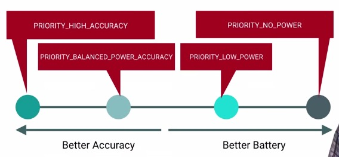

# Others

## 1. The Performance Lifecycle

大多数开发者在没有发现严重性能问题之前是不会特别花精力去关注性能优化的，通常大家关注的都是功能是否实现。当性能问题真的出现的时候，请不要慌乱。我们通常采用下面三个步骤来解决性能问题。

#### Gather：收集数据

我们可以通过Android SDK里面提供的诸多工具来收集CPU，GPU，内存，电量等等性能数据，

#### Insight：分析数据

通过上面的步骤，我们获取到了大量的数据，下一步就是分析这些数据。工具帮我们生成了很多可读性强的表格，我们需要事先了解如何查看表格的数据，每一项代表的含义，这样才能够快速定位问题。如果分析数据之后还是没有找到问题，那么就只能不停的重新收集数据，再进行分析，如此循环。

#### Action：解决问题

定位到问题之后，我们需要采取行动来解决问题。解决问题之前一定要先有个计划，评估这个解决方案是否可行，是否能够及时的解决问题。

## 2. Tool: Strict Mode

UI线程被阻塞超过5秒，就会出现ANR，这太糟糕了。防止程序出现ANR是很重要的事情，那么如何找出程序里面潜在的坑，预防ANR呢？很多大部分情况下执行很快的方法，但是他们有可能存在巨大的隐患，这些隐患的爆发就很容易导致ANR。

Android提供了一个叫做Strict Mode的工具，我们可以通过手机设置里面的开发者选项，打开Strict Mode选项，如果程序存在潜在的隐患，屏幕就会闪现红色。我们也可以通过[StrictMode](http://developer.android.com/reference/android/os/StrictMode.html) API在代码层面做细化的跟踪，可以设置StrictMode监听那些潜在问题，出现问题时如何提醒开发者，可以对屏幕闪红色，也可以输出错误日志。

## 3. Smaller APKs: A Checklist

减少应用程序安装包的大小，不仅仅减少了用户的网络数据流量还减少了下载等待的时间。毋庸置疑，尽量减少程序安装包的大小是十分有必要的。通常来说，减少程序安装包的大小有两条规律：要么减少程序资源的大小，要么就是减少程序的代码量。这里总结一个简易版的减少安装包大小的Checklist:

### 减少程序图片资源的大小

- 1）确保在build.gradle文件中开启了`minifEnabled`与`shrinkResources`的属性，这两个属性可以帮助移除那些在程序中使用不到的代码与资源，帮助减少APP的安装包大小。

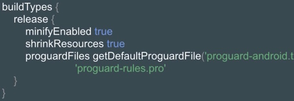

- 2）有选择性的提供对应分辨率的图片资源，系统会自动匹配最合适分辨率的图片并执行拉伸或者压缩的处理。

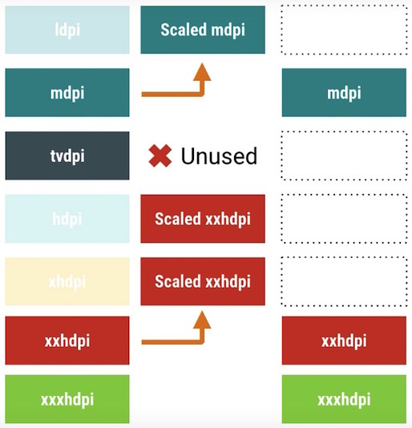

- 3）在符合条件的情况下，使用Vertor Drawable替代传统的PNG/JPEG图片，能够极大的减少图片资源的大小。传统模式下，针对不同dpi的手机都需要提供一套PNG/JPEG的图片，而如果使用Vector Drawable的话，只需要一个XML文件即可。

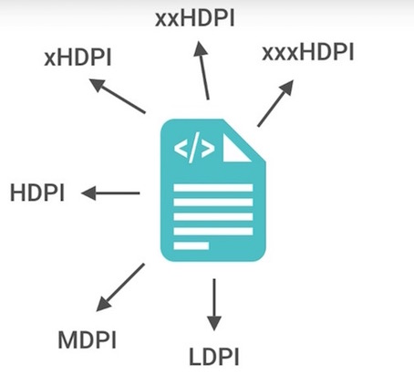

- 4）尽量复用已经存在的资源图片，使用代码的方式对已有的资源进行复用，如下图所示：

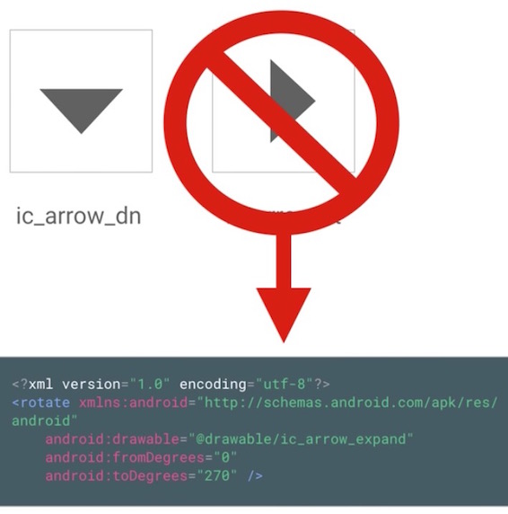

以上几点虽然看起来都微不足道，但是真正执行之后，能够显著减少安装包的资源图片大小。

### 减少程序的代码量

- 1）开启MinifEnabled，Proguard。打开这些编译属性之后，程序在打包的时候就不会把没有引用到的代码编译进来，以此达到减少安装包大小的目的。
- 2）注意因为编译行为额外产生的方法数，例如类似Enum，Protocal Buffer可能导致方法数与类的个数增加。
- 3）部分引入到工程中的jar类库可能并不是专门针对移动端APP而设计的，他们最开始可能是运用在PC或者Server上的。使用这些类库不仅仅额外增加了包的大小，还增加了编译时间。单纯依靠Proguard可能无法完全移除那些使用不到的方法，最佳的方式是使用一些更加轻量化，专门为Android APP设计的jar类库。

### 安装包的拆分

设想一下，一个low dpi，API<14的用户手机下载安装的APK里面却包含了大量xxhdpi的资源文件，对于这个用户来说，这个APK是存在很大的资源浪费的。幸好Android平台为我们提供了拆分APK的方法，它能够根据API Level，屏幕大小以及GPU版本的不同进行拆分，使得对应平台的用户下载到最合适自己手机的安装包。

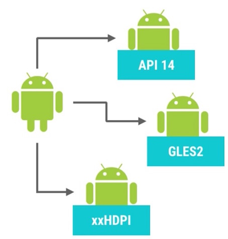

更多关于安装包拆分的信息，请查看[Configure APK Splits](https://developer.android.com/studio/build/configure-apk-splits.html)与[Maintaining Multiple APKs](https://developer.android.com/training/multiple-apks/index.html)(由于国内应用分发市场的现状，这一条几乎没有办法执行)。

## 4. VectorDrawable for smaller APKs

针对不同的分辨率提供多张精度的图片会额外增加APK的大小，针对这个问题的解决方案是考虑使用VectorDrawable，它仅仅只需要一个文件，能够动态生成对应分辨率的图片。

[VectorDrawable](https://developer.android.com/reference/android/graphics/drawable/VectorDrawable.html)通过XML文件描述图片的形状，大小，样式。

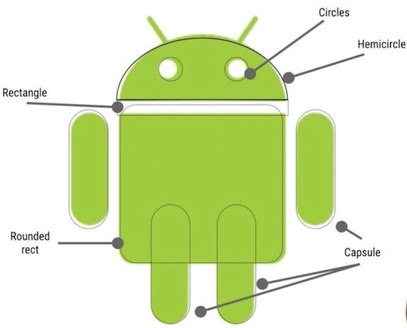

通过这种方式，我们可以显著减少图片资源对安装包大小的影响。

使用VectorDrawable还可以避免因为使用帧动画导致的图片资源过多的情况，如下图所示

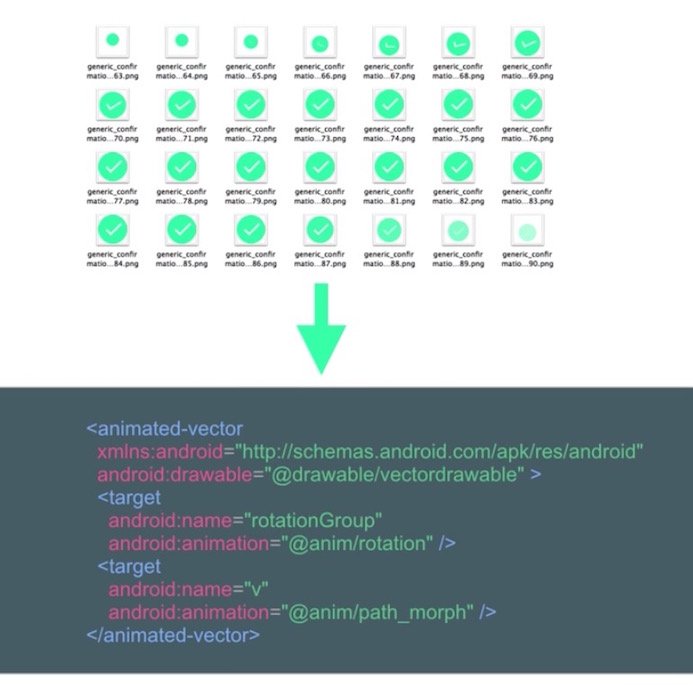

前面介绍了VectorDrawable(VD)的优势，但是在使用VectorDrawable的时候，还是有以下的问题需要特别注意的？

- 首先VD的加载有异于JPEG/PNG文件，图片文件可以依靠硬件进行纹理的渲染，而VD文件需要先进行加载解析，然后才能够进行纹理的渲染。

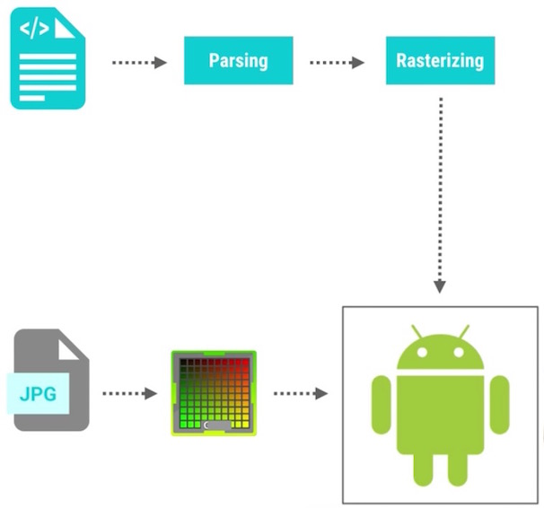

- 其次VD文件适用于简单有规则的图片渲染，不适用于那些纹理过于复杂的图片，这样不仅仅会过度增加描述文件的复杂度还可能无法获取到想要的渲染效果。

- 最后VD文件中关于Path的描述需要尽量简化，复杂冗余的Path信息不仅对得到想要的图片没有益处，还增加了加载渲染的难度。

## 5. Service Performance Patterns

Service是Android程序里面最常用的基础组件之一，但是使用Service很容易引起电量的过度消耗以及系统资源的未及时释放。学会在何时启用Service以及使用何种方式杀掉Service就显得十分有必要了。

简要过一下Service的特性：Service和UI没有关联，Service的创建，执行，销毁Service都是需要占用系统时间和内存的。另外Service是默认运行在UI线程的，这意味着Service可能会影响到系统的流畅度。

使用Service应该遵循下面的一些规则：

- 避免错误的使用Service，例如我们不应该使用Service来监听某些事件的变化，不应该搞一个Service在后台对服务器不断的进行轮询(应该使用Google Cloud Messaging)
- 如果已经事先知道Service里面的任务应该执行在后台线程(非默认的主线程)的时候，我们应该使用IntentService或者结合HanderThread，AsycnTask Loader实现的Service。

Android系统为我们提供了以下的一些异步相关的工具类

- GCM
- BroadcastReciever
- LocalBroadcastReciever
- WakefulBroadcastReciver
- HandlerThreads
- AsyncTaskLoaders
- IntentService

如果使用上面的诸多方案还是无法替代普通的Service，那么需要注意的就是如何正确的关闭Service。

- 普通的Started Service，需要通过stopSelf()来停止Service

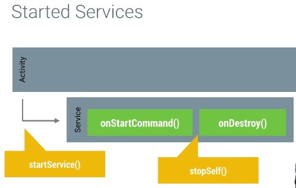

- 另外一种Bound Service，会在其他组件都unBind之后自动关闭自己

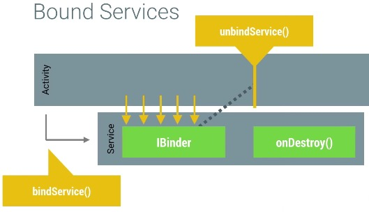

把上面两种Service进行合并之后，我们可以得到如下图所示的Service

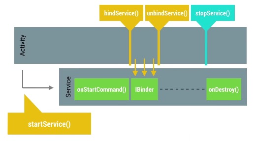

## 6. Removing unused code

使用第三方库(library)可以在不用自己编写大量代码的前提下帮助我们解决一些难题，节约大量的时间，但是这些引入的第三方库很可能会导致主程序代码臃肿冗余。

如果我们处在人力，财力都相对匮乏的情况下，通常会倾向大量使用第三方库来帮助编写应用程序。这其实是无可厚非的，那些著名的第三方库的可行性早就被很多应用所采用并实践证明过。但是这里面存在的问题是，如果我们因为只需要某个library的一小部分功能而把整个library都导入自己的项目，这就会引起代码臃肿。一旦发生代码臃肿，用户就会下载到安装包偏大的应用程序，另外因为代码臃肿，还很有可能会超过单个编译文件只能有65536个方法的上限。解决这个问题的办法是使用**MultiDex**的方案，可是这实在是无奈之举，原则上，我们还是应该尽量避免出现这种情况。

Android为我们提供了Proguard的工具来帮助应用程序对代码进行瘦身，优化，混淆的处理。它会帮助移除那些没有使用到的代码，还可以对类名，方法名进行混淆处理以避免程序被反编译。举个例子，Google I/O 2015这个应用使用了大量的library，没有经过Proguard处理之前编译出来的包是8.4Mb大小，经过处理之后的包仅仅是4.1Mb大小。

使用Proguard相当的简单，只需要在build.gradle文件中配置minifEnable为true即可，如下图所示：

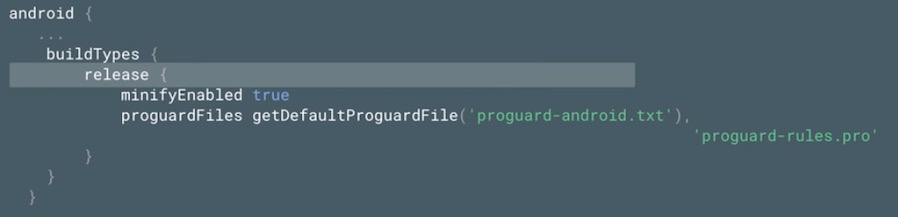

但是Proguard还是不足够聪明到能够判断哪些类，哪些方法是不能够被混淆的，针对这些情况，我们需要手动的把这些需要保留的类名与方法名添加到Proguard的配置文件中，如下图所示：

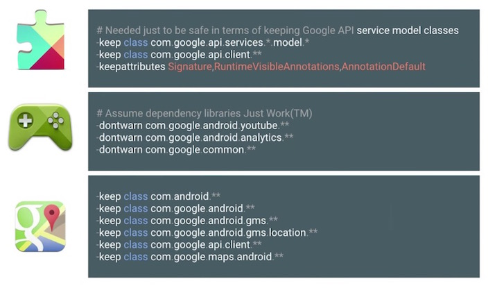

在使用library的时候，需要特别注意这些library在proguard配置上的说明文档，我们需要把这些配置信息添加到自己的主项目中。关于Proguard的详细说明，请看官方文档http://developer.android.com/tools/help/proguard.html

## 7. Serialization performance

数据的序列化是程序代码里面必不可少的组成部分，当我们讨论到数据序列化的性能的时候，需要了解有哪些候选的方案，他们各自的优缺点是什么。首先什么是序列化？用下面的图来解释一下：

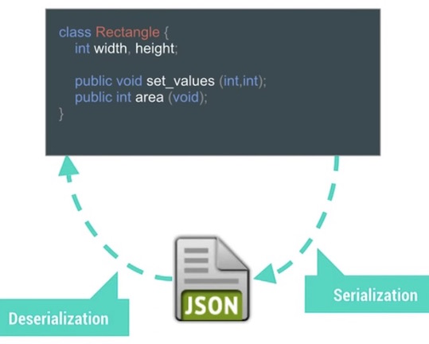

数据序列化的行为可能发生在数据传递过程中的任何阶段，例如网络传输，不同进程间数据传递，不同类之间的参数传递，把数据存储到磁盘上等等。通常情况下，我们会把那些需要序列化的类实现Serializable接口(如下图所示)，但是这种传统的做法效率不高，实施的过程会消耗更多的内存。

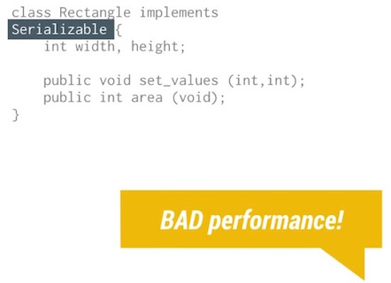

但是我们如果使用GSON库来处理这个序列化的问题，不仅仅执行速度更快，内存的使用效率也更高。Android的XML布局文件会在编译的阶段被转换成更加复杂的格式，具备更加高效的执行性能与更高的内存使用效率。

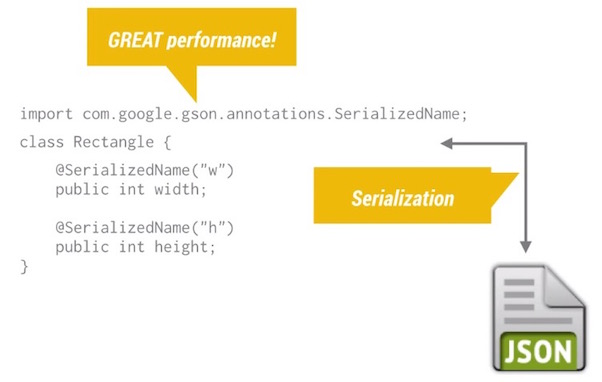

面介绍三个数据序列化的候选方案：

- **[Protocal Buffers](https://developers.google.com/protocol-buffers/?utm_campaign=android_series_serialization_performance_101315&utm_source=anddev&utm_medium=yt-annt)**：强大，灵活，但是对内存的消耗会比较大，并不是移动终端上的最佳选择。
- **[Nano-Proto-Buffers](https://android.googlesource.com/platform/external/protobuf/+/master/java/README.txt?utm_campaign=android_series_serialization_performance_101315&utm_source=anddev&utm_medium=yt-annt)**：基于Protocal，为移动终端做了特殊的优化，代码执行效率更高，内存使用效率更佳。
- **[FlatBuffers](https://google.github.io/flatbuffers/)**：这个开源库最开始是由Google研发的，专注于提供更优秀的性能。

上面这些方案在性能方面的数据对比如下图所示：

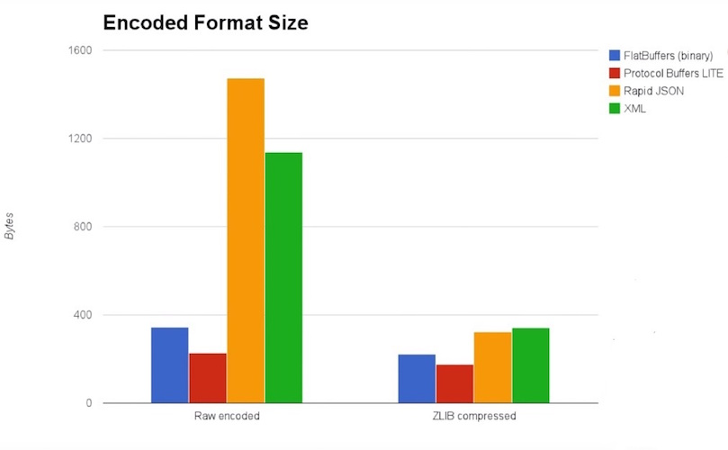

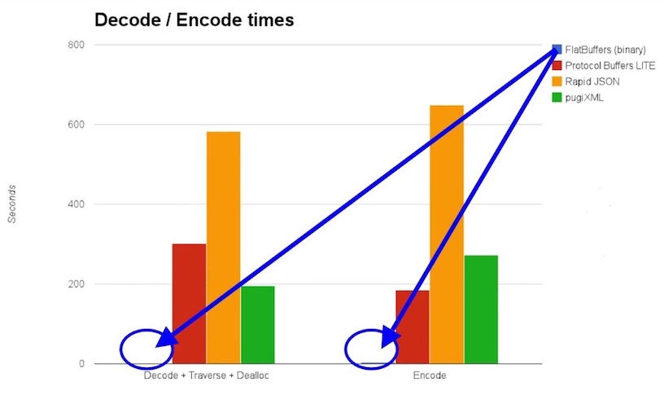

为了避免序列化带来的性能问题，我们其实可以考虑使用SharedPreference或者SQLite来存储那些数据，避免需要先把那些复杂的数据进行序列化的操作。

## 8. Smaller Serialized Data

数据呈现的顺序以及结构会对序列化之后的空间产生不小的影响。通常来说，一般的数据序列化的过程如下图所示：

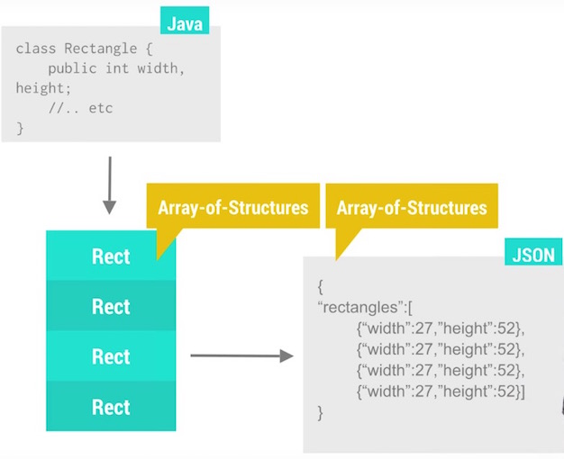

上面的过程，存在两个弊端，第一个是重复的属性名称：

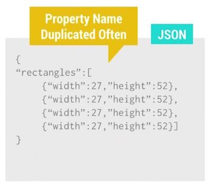

另外一个是GZIP没有办法对上面的数据进行更加有效的压缩，假如相似数据间隔了32k的数据量，这样GZIP就无法进行更加有效的压缩：

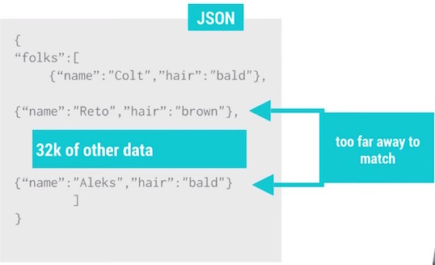

但是我们稍微改变下数据的记录方式，就可以得到占用空间更小的数据，如下图所示：

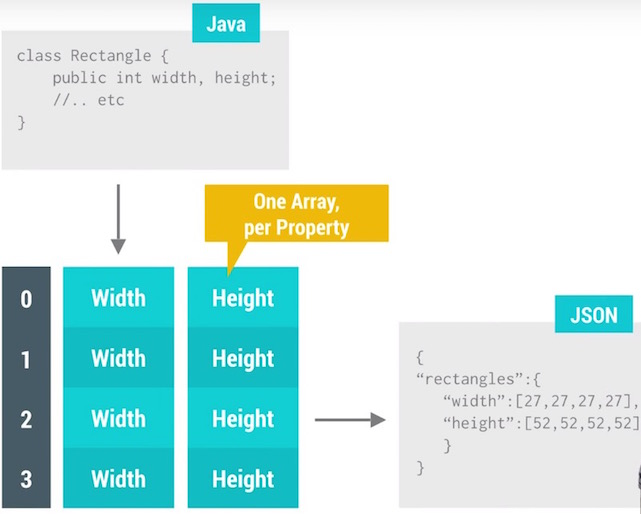

通过优化，至少有三方面的性能提升，如下图所示：

1）减少了重复的属性名：

2）使得GZIP的压缩效率更高：

3）同样的数据类型可以批量优化：

## 9. CPU Frequency Scaling

调节CPU的频率会执行的性能产生较大的影响，为了最大化的延长设备的续航时间，系统会动态调整CPU的频率，频率越高执行代码的速度自然就越快。

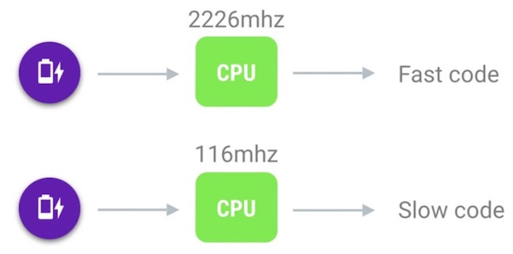

Android系统会在电量消耗与表现性能之间不断的做权衡，当有需要的时候会迅速调整CPU的频率到一个比较高负荷的状态，当程序不需要高性能的时候就会降低频率来确保更长的续航时间。

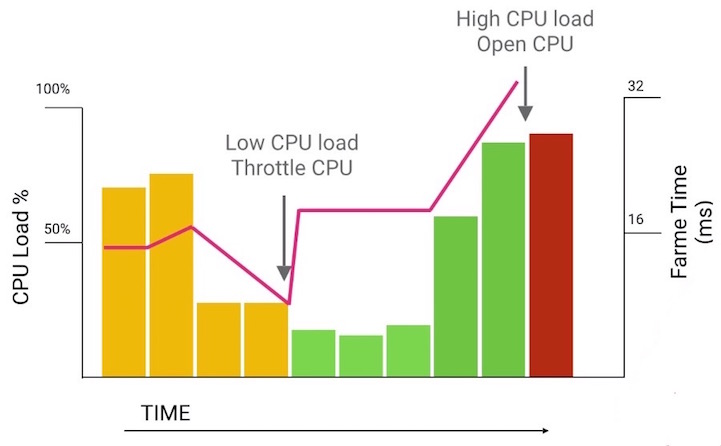

Android系统检测到需要调整CPU的频率到CPU频率真的达到对应频率会需要花费大概20ms的时间，在此期间很有可能会因为CPU频率不够而导致代码执行偏慢

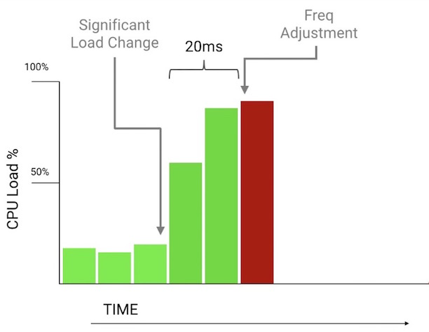

以使用Systrace工具来导出CPU的执行情况，以便帮助定位性能问题。

