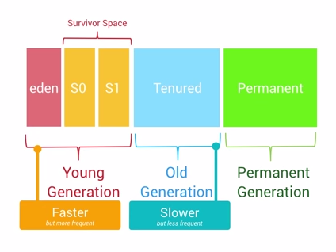
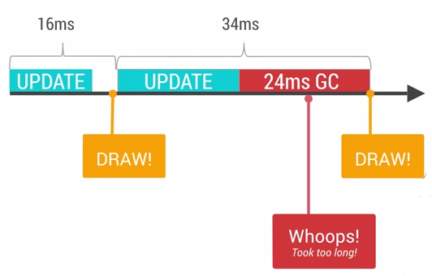
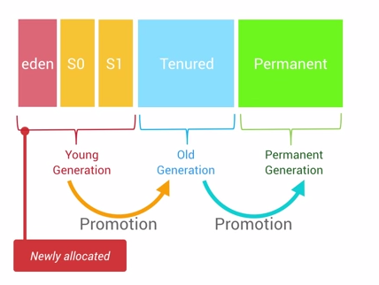
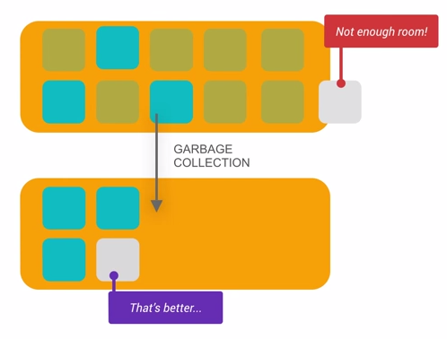
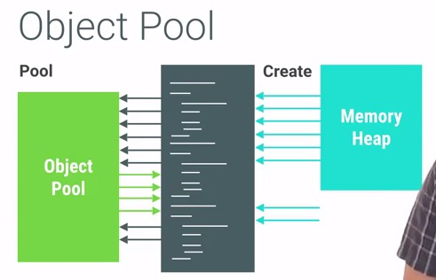
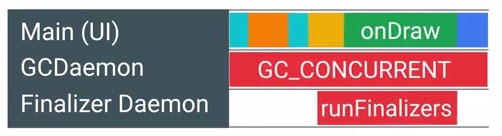
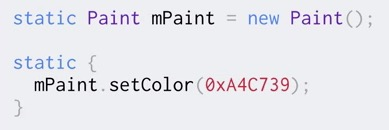
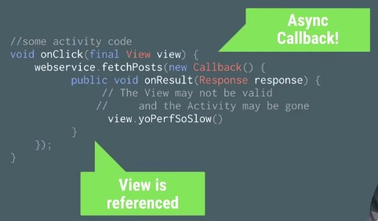
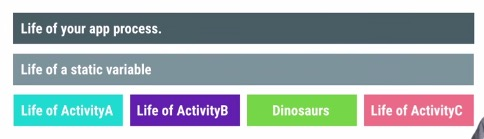

分析案例

[Android Camera 内存问题剖析 - 掘金 (juejin.cn)](https://juejin.cn/post/6862508868438589447#heading-7)

# Memory

[Overview of memory management  | App quality  | Android Developers](https://developer.android.com/topic/performance/memory-overview)

## 1. Memory Churn(抖动) nad performance

虽然Android有自动管理内存的机制，但是对内存的不恰当使用仍然容易引起严重的性能问题。在同一帧里面创建过多的对象是件需要特别引起注意的事情。

Android系统里面有一个**Generational Heap Memory**的模型，系统会根据内存中不同的内存数据类型分别执行不同的GC操作。例如，最近刚分配的对象会放在Young Generation区域，这个区域的对象通常都是会快速被创建并且很快被销毁回收的，同时这个区域的GC操作速度也是比Old Generation区域的GC操作速度更快的。

除了速度差异之外，执行GC操作的时候，所有线程的任何操作都会需要暂停，等待GC操作完成之后，其他操作才能够继续运行。

通常来说，单个的GC并不会占用太多时间，但是大量不停的GC操作则会显著占用帧间隔时间(16ms)。如果在帧间隔时间里面做了过多的GC操作，那么自然其他类似计算，渲染等操作的可用时间就变得少了。

导致GC频繁执行有两个原因：

- **Memory Churn内存抖动**，内存抖动是因为大量的对象被创建又在短时间内马上被释放。
- 瞬间产生大量的对象会严重占用Young Generation的内存区域，当达到阀值，剩余空间不够的时候，也会触发GC。即使每次分配的对象占用了很少的内存，但是他们叠加在一起会增加Heap的压力，从而触发更多其他类型的GC。这个操作有可能会影响到帧率，并使得用户感知到性能问题。

解决上面的问题有简洁直观方法，如果你在**Memory Monitor**里面查看到短时间发生了多次内存的涨跌，这意味着很有可能发生了内存抖动。

同时我们还可以通过**Allocation Tracker**来查看在短时间内，同一个栈中不断进出的相同对象。这是内存抖动的典型信号之一。

当你大致定位问题之后，接下去的问题修复也就显得相对直接简单了。例如，你需要避免在for循环里面分配对象占用内存，需要尝试把对象的创建移到循环体之外，自定义View中的onDraw方法也需要引起注意，每次屏幕发生绘制以及动画执行过程中，onDraw方法都会被调用到，避免在onDraw方法里面执行复杂的操作，避免创建对象。对于那些无法避免需要创建对象的情况，我们可以考虑对象池模型，通过对象池来解决频繁创建与销毁的问题，但是这里需要注意结束使用之后，需要手动释放对象池中的对象。

## 2. Garbage Collection in Android

JVM的回收机制给开发人员带来很大的好处，不用时刻处理对象的分配与回收，可以更加专注于更加高级的代码实现。相比起Java，C与C++等语言具备更高的执行效率，他们需要开发人员自己关注对象的分配与回收，但是在一个庞大的系统当中，还是免不了经常发生部分对象忘记回收的情况，这就是内存泄漏。

原始JVM中的GC机制在Android中得到了很大程度上的优化。Android里面是一个三级Generation的内存模型，最近分配的对象会存放在Young Generation区域，当这个对象在这个区域停留的时间达到一定程度，它会被移动到Old Generation，最后到Permanent Generation区域。

每一个级别的内存区域都有固定的大小，此后不断有新的对象被分配到此区域，当这些对象总的大小快达到这一级别内存区域的阀值时，会触发GC的操作，以便腾出空间来存放其他新的对象。

前面提到过每次GC发生的时候，所有的线程都是暂停状态的。GC所占用的时间和它是哪一个Generation也有关系，Young Generation的每次GC操作时间是最短的，Old Generation其次，Permanent Generation最长。执行时间的长短也和当前Generation中的对象数量有关，遍历查找20000个对象比起遍历50个对象自然是要慢很多的。

虽然Google的工程师在尽量缩短每次GC所花费的时间，但是特别注意GC引起的性能问题还是很有必要。如果不小心在最小的for循环单元里面执行了创建对象的操作，这将很容易引起GC并导致性能问题。通过Memory Monitor我们可以查看到内存的占用情况，每一次瞬间的内存降低都是因为此时发生了GC操作，如果在短时间内发生大量的内存上涨与降低的事件，这说明很有可能这里有性能问题。我们还可以通过**Heap and Allocation Tracker**工具来查看此时内存中分配的到底有哪些对象。

## 3. Performance Cost of Memory Leaks

Java有自动回收的机制，可是这不意味着Java中不存在内存泄漏的问题，而内存泄漏会很容易导致严重的性能问题。

内存泄漏指的是那些程序不再使用的对象无法被GC识别，这样就导致这个对象一直留在内存当中，占用了宝贵的内存空间。显然，这还使得每级Generation的内存区域可用空间变小，GC就会更容易被触发，从而引起性能问题。

寻找内存泄漏并修复这个漏洞是件很棘手的事情，你需要对执行的代码很熟悉，清楚的知道在特定环境下是如何运行的，然后仔细排查。例如，你想知道程序中的某个activity退出的时候，它之前所占用的内存是否有完整的释放干净了？首先你需要在activity处于前台的时候使用Heap Tool获取一份当前状态的内存快照，然后你需要创建一个几乎不这么占用内存的空白activity用来给前一个Activity进行跳转，其次在跳转到这个空白的activity的时候主动调用System.gc()方法来确保触发一个GC操作。最后，如果前面这个activity的内存都有全部正确释放，那么在空白activity被启动之后的内存快照中应该不会有前面那个activity中的任何对象了。

如果你发现在空白activity的内存快照中有一些可疑的没有被释放的对象存在，那么接下去就应该使用**Alocation Track Tool**来仔细查找具体的可疑对象。我们可以从空白activity开始监听，启动到观察activity，然后再回到空白activity结束监听。这样操作以后，我们可以仔细观察那些对象，找出内存泄漏的真凶。

## 4. Memory Performance

Android对GC做了大量的优化操作，虽然执行GC操作的时候会暂停其他任务，可是大多数情况下，GC操作还是相对很安静并且高效的。但是如果我们对内存的使用不恰当，导致GC频繁执行，这样就会引起不小的性能问题。

为了寻找内存的性能问题，Android Studio提供了工具来帮助开发者。

- **Memory Monitor：**查看整个app所占用的内存，以及发生GC的时刻，短时间内发生大量的GC操作是一个危险的信号。
- **Allocation Tracker：**使用此工具来追踪内存的分配，前面有提到过。
- **Heap Tool：**查看当前内存快照，便于对比分析哪些对象有可能是泄漏了的，请参考前面的Case。

## 5. Tool Memory Monitor

Android Studio中的Memory Monitor可以很好的帮助我们查看程序的内存使用情况。

## 6. Object Pools

经常会遇到的一个问题是短时间内创建大量的对象，导致内存紧张，从而触发GC导致性能问题。对于这个问题，我们可以使用对象池技术来解决它。通常对象池中的对象可能是bitmaps，views，paints等等。关于对象池的操作原理，不展开述说了，请看下面的图示：

使用对象池技术有很多好处，它可以避免内存抖动，提升性能，但是在使用的时候有一些内容是需要特别注意的。通常情况下，初始化的对象池里面都是空白的，当使用某个对象的时候先去对象池查询是否存在，如果不存在则创建这个对象然后加入对象池，但是我们也可以在程序刚启动的时候就事先为对象池填充一些即将要使用到的数据，这样可以在需要使用到这些对象的时候提供更快的首次加载速度，这种行为就叫做**预分配**。使用对象池也有不好的一面，程序员需要手动管理这些对象的分配与释放，所以我们需要慎重地使用这项技术，避免发生对象的内存泄漏。为了确保所有的对象能够正确被释放，我们需要保证加入对象池的对象和其他外部对象没有互相引用的关系。

## 7. LRU Cache

在Android上面最常用的一个缓存算法是LRU(Least Recently Use)。使用LRU Cache能够显著提升应用的性能，可是也需要注意LRU Cache中被淘汰对象的回收，否者会引起严重的内存泄露。

## 8. Avoiding Allocations in onDraw()

都知道应该避免在onDraw()方法里面执行导致内存分配的操作，为何需要这样做。

onDraw()方法是执行在UI线程的，在UI线程尽量避免做任何可能影响到性能的操作。虽然分配内存的操作并不需要花费太多系统资源，但是这并不意味着是免费无代价的。设备有一定的刷新频率，导致View的onDraw方法会被频繁的调用，如果onDraw方法效率低下，在频繁刷新累积的效应下，效率低的问题会被扩大，然后会对性能有严重的影响。

在onDraw里面执行内存分配的操作，会容易导致内存抖动，GC频繁被触发，虽然GC后来被改进为执行在另外一个后台线程(GC操作在2.3以前是同步的，之后是并发)，可是频繁的GC的操作还是会影响到CPU，影响到电量的消耗。

简单解决频繁分配内存的方法就是把分配操作移动到onDraw()方法外面，通常情况下，我们会把onDraw()里面new Paint的操作移动到外面，如下面所示：

## 9. Reduce Memory Usage

### 1）Smaller Pixel Formats

常见的png,jpeg,webp等格式的图片在设置到UI上之前需要经过解码的过程，而解压时可以选择不同的解码率，不同的解码率对内存的占用是有很大差别的。在不影响到画质的前提下尽量减少内存的占用，这能够显著提升应用程序的性能。

Android的Heap空间是不会自动做兼容压缩的，意思就是如果Heap空间中的图片被收回之后，这块区域并不会和其他已经回收过的区域做重新排序合并处理，那么当一个更大的图片需要放到heap之前，很可能找不到那么大的连续空闲区域，那么就会触发GC，使得heap腾出一块足以放下这张图片的空闲区域，如果无法腾出，就会发生OOM。

所以为了避免加载一张超大的图片，需要尽量减少这张图片所占用的内存大小，Android为图片提供了4种解码格式，他们分别占用的内存大小

| Format    | Bits Per Pixel |
| --------- | -------------- |
| ARGB_8888 | 32             |
| RGB_565   | 16             |
| ARGB_4444 | 16             |
| ALPHA_8   | 8              |

随着解码占用内存大小的降低，清晰度也会有损失。我们需要针对不同的应用场景做不同的处理，大图和小图可以采用不同的解码率。

### 2）Smaller PNG Files

尽量减少PNG图片的大小是Android里面很重要的一条规范。相比起JPEG，PNG能够提供更加清晰无损的图片，但是PNG格式的图片会更大，占用更多的磁盘空间。到对于那些使用JPEG就可以达到视觉效果的，可以考虑采用JPEG即可。

图片格式：Webp，它是由Google推出的一种既保留png格式的优点，又能够减少图片大小的一种新型图片格式。

### 3）Pre-scaling Bitmaps

对bitmap做缩放，这也是Android里面最遇到的问题。对bitmap做缩放的意义很明显，提示显示性能，避免分配不必要的内存。Android提供了现成的bitmap缩放的API，叫做createScaledBitmap()，使用这个方法可以获取到一张经过缩放的图片。

上面的方法能够快速的得到一张经过缩放的图片，可是这个方法能够执行的前提是，原图片需要事先加载到内存中，如果原图片过大，很可能导致OOM。下面介绍其他几种缩放图片的方式。

inSampleSize能够等比的缩放显示图片，同时还避免了需要先把原图加载进内存的缺点。另外，我们还可以使用inScaled，inDensity，inTargetDensity的属性来对解码图片做处理。

还有一个经常使用到的技巧是inJustDecodeBounds，使用这个属性去尝试解码图片，可以事先获取到图片的大小而不至于占用什么内存。

### 4）Re-using Bitmaps

我们知道bitmap会占用大量的内存空间，这节会讲解什么是inBitmap属性，如何利用这个属性来提升bitmap的循环效率。前面我们介绍过使用对象池的技术来解决对象频繁创建再回收的效率问题，使用这种方法，bitmap占用的内存空间会差不多是恒定的数值，每次新创建出来的bitmap都会需要占用一块单独的内存区域。

为了解决上图所示的效率问题，Android在解码图片的时候引进了**inBitmap**属性，使用这个属性可以告知Bitmap解码器去尝试使用已经存在的内存区域，新解码的bitmap会尝试去使用之前那张bitmap在heap中所占据的pixel data内存区域，而不是去问内存重新申请一块区域来存放bitmap。利用这种特性，即使是上千张的图片，也只会仅仅只需要占用屏幕所能够显示的图片数量的内存大小。

使用inBitmap需要注意几个限制条件：

- 在SDK 11 -> 18之间，重用的bitmap大小必须是一致的，例如给inBitmap赋值的图片大小为100-100，那么新申请的bitmap必须也为100-100才能够被重用。从SDK 19开始，新申请的bitmap大小必须小于或者等于已经赋值过的bitmap大小。
- 新申请的bitmap与旧的bitmap必须有相同的解码格式，例如大家都是8888的，如果前面的bitmap是8888，那么就不能支持4444与565格式的bitmap了。

我们可以创建一个包含多种典型可重用bitmap的对象池，这样后续的bitmap创建都能够找到合适的“模板”去进行重用。

### 5）Fun with ArrayMaps

程序内存的管理是否合理高效对应用的性能有着很大的影响，有的时候对容器的使用不当也会导致内存管理效率低下。Android为移动操作系统特意编写了一些更加高效的容器，例如SparseArray，今天要介绍的是一个新的容器，叫做**[ArrayMap](https://android.googlesource.com/platform/frameworks/base.git/+/master/core/java/android/util/ArrayMap.java)**。

我们经常会使用到HashMap这个容器，它非常好用，但是却很占用内存。为了解决HashMap更占内存的弊端，Android提供了内存效率更高的**ArrayMap**。

ArrayMap的插入与删除的效率是不够高的，但是如果数组的列表只是在一百这个数量级上，则完全不用担心这些插入与删除的效率问题。与HashMap相比，ArrayMap在循环遍历的时候也更加简单高效。

并不是所有情况下都适合使用ArrayMap，我们应该在满足下面2个条件的时候才考虑使用ArrayMap：

- 对象个数的数量级最好是千以内
- 数据组织形式包含Map结构

### 6）Beware Autoboxing

有时候性能问题也可能是因为那些不起眼的小细节引起的，例如在代码中不经意的“自动装箱”。我们知道基础数据类型的大小：boolean(8 bits), int(32 bits), float(32 bits)，long(64 bits)，为了能够让这些基础数据类型在大多数Java容器中运作，会需要做一个autoboxing的操作，转换成Boolean，Integer，Float等对象、

Autoboxing的行为还经常发生在类似HashMap这样的容器里面，对HashMap的增删改查操作都会发生了大量的autoboxing的行为。

为了避免这些autoboxing带来的效率问题，Android特地提供了一些如下的Map容器用来替代HashMap，不仅避免了autoboxing，还减少了内存占用。

Android系统提供了SparseBoolMap，SparseIntMap，SparseLongMap，LongSparseMap等容器。关于这些容器的基本原理请参考前面的ArrayMap的介绍，另外这些容器的使用场景也和ArrayMap一致，需要满足数量级在千以内，数据组织形式需要包含Map结构。

### 7）The price of ENUMs

关于enum的效率，使用enum之后的dex大小增长量是使用static int的13倍。不仅仅如此，使用enum，运行时还会产生额外的内存占用。

但是目前**在开启 ProGuard 优化的情况下，枚举会被转为 int 类型**，所以内存占用问题是可以忽略的。

[Android 开发中是否应该使用枚举？-咕咚同学 (gudong.site)](https://gudong.site/2019/11/04/use-enum-or-not.html)

## 10. Trimming and Sharing Memory

Android系统的一大特色是多任务，用户可以随意在不同的app之间进行快速切换。为了确保你的应用在这种复杂的多任务环境中正常运行，我们需要了解下面的知识。

为了让background的应用能够迅速的切换到foreground，每一个background的应用都会占用一定的内存。Android系统会根据当前的系统内存使用情况，决定回收部分background的应用内存。如果background的应用从暂停状态直接被恢复到foreground，能够获得较快的恢复体验，如果background应用是从Kill的状态进行恢复，就会显得稍微有点慢。

Android系统提供了一些回调来通知应用的内存使用情况，通常来说，当所有的background应用都被kill掉的时候，foreground应用会收到**onLowMemory()**的回调。在这种情况下，需要尽快释放当前应用的非必须内存资源，从而确保系统能够稳定继续运行。Android系统还提供了onTrimMemory()的回调，当系统内存达到某些条件的时候，所有正在运行的应用都会收到这个回调，同时在这个回调里面会传递以下的参数，代表不同的内存使用情况。onTrimMemory()的回调可以发生在Application，Activity，Fragment，Service，Content Provider。

## 11. DO NOT LEAK VIEWS

通常来说，View会保持Activity的引用，Activity同时还和其他内部对象也有可能保持引用关系。当屏幕发生旋转的时候，activity很容易发生泄漏，这样的话，里面的view也会发生泄漏。Activity以及view的泄漏是非常严重的，为了避免出现泄漏，请特别留意以下的规则：

### 1）避免使用异步回调

异步回调被执行的时间不确定，很有可能发生在activity已经被销毁之后，这不仅仅很容易引起crash，还很容易发生内存泄露。

### 2）避免使用Static对象

因为static的生命周期过长，使用不当很可能导致leak，在Android中应该尽量避免使用static对象。

### 3）避免把View添加到没有清除机制的容器里面 

假如把view添加到[WeakHashMap](http://stackoverflow.com/questions/5511279/what-is-a-weakhashmap-and-when-to-use-it)，如果没有执行清除操作，很可能会导致泄漏。