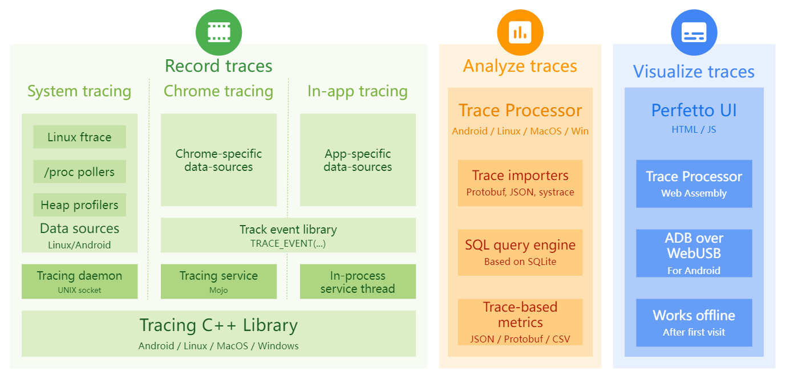

[Perfetto - System profiling, app tracing and trace analysis - Perfetto Tracing Docs](https://perfetto.dev/docs/)

Perfetto ，用于性能检测和跟踪分析。它提供了用于记录系统级和应用程序级 trace 的 services 和 libraries、native + Java heap profiling、用于使用 SQL 分析 trace 的库。

# Recording traces

userspace-to-userspace  [tracing protocol](https://perfetto.dev/docs/design-docs/api-and-abi#tracing-protocol-abi) based on direct protobuf serialization onto a shared memory buffer. The tracing protocol is used both internally for the built-in data sources and exposed to C++ apps through the [Tracing SDK](https://perfetto.dev/docs/instrumentation/tracing-sdk) and the [Track Event Library](https://perfetto.dev/docs/instrumentation/track-events).

### System-wide tracing on Android and Linux

Linux 和 Android 上，Perfetto 捆绑了许多数据源，这些数据源能够从不同的系统接口收集详细的性能数据。

- 内核跟踪：Perfetto 集成了  [Linux's ftrace](https://www.kernel.org/doc/Documentation/trace/ftrace.txt)，并允许将内核事件（例如调度事件、系统调用）记录到 trace。
- [/proc and /sys pollers](https://perfetto.dev/docs/data-sources/memory-counters)，允许对进程范围或系统范围的 CPU 和内存计数器随时间推移的状态进行采样。
- 与 Android HAL 模块集成，用于记录 [battery and energy-usage counters](https://perfetto.dev/docs/data-sources/battery-counters)
- 用与 Android RunTime 紧密集成的进程外探查器捕获 [Java heap dumps](https://perfetto.dev/docs/data-sources/java-heap-profiler)

### Tracing SDK and user-space instrumentation

 