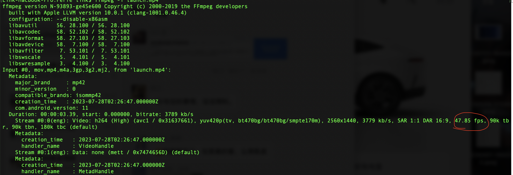
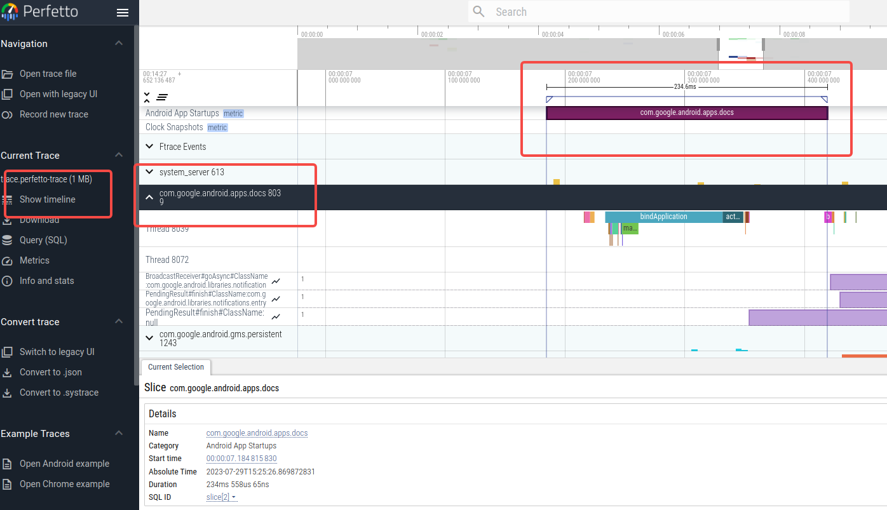
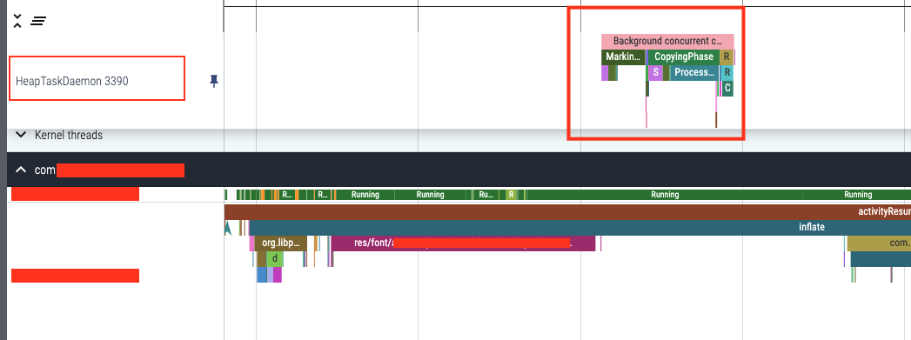
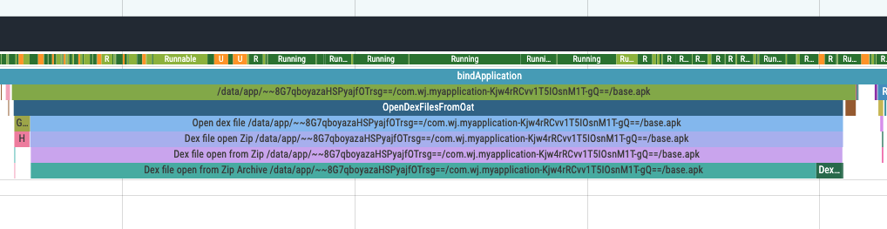
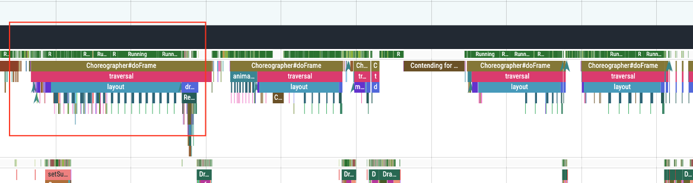

[【性能优化】使用Perfetto定位应用启动性能的瓶颈](https://blog.csdn.net/linkwj/article/details/132460341)


Android中有关应用启动时间的基础性常识

# 应用启动时间

## **初始显示时间（TTID）**

初始显示时间 （TTID，The Time to Initial Display） ，它是从系统接收到启动意图到应用程序显示第一帧界面的时间，也就是用户看到应用界面的时间。

### **测量TTID**

当应用程序完成上面提到的所有工作时，可以在logcat中看到以下的日志输出。

```C++
/system_process I/ActivityTaskManager: Displayed xxxx/.MainActivity: +401ms在所有资源完全加载并显示之前，Logcat输出中的Displayed时间指标，省去了布局文件中未引用的资源或应用作为对象初始化一部分创建资源的时间。
```

有的时候logcat输出中的日志中会包含一个附加字段total。如下所示：

```C++
ActivityManager: Displayed com.android.myexample/.StartupTiming: +3s534ms (total +1m22s643ms)在这种情况下，第一个时间测量值仅针对第一个绘制的 activity。total 时间测量值是从应用进程启动时开始计算，并且可以包含首次启动但未在屏幕上显示任何内容的另一个 activity。total 时间测量值仅在单个activity的时间和总启动时间之间存在差异时才会显示。
```

使用am start -S -W命令来测得的时间，实际上就是初始显示时间。大多数情况下，初始显示时间并不能代表应用真正的启动时间，例如，应用启动时需要从网络上同步最新的数据，当所有的数据加载完毕后的耗时才是真正的启动耗时，这个就是接下来要介绍的TTFD - 完全显示时间。

## **完全显示的时间（TTFD）**

完全显示时间 （TTFD，The Time to Full Display） 。它是从系统接收到启动意图到应用程序加载完成所有资源和视图层次结构的时间，也就是用户可以真正使用应用程序的时间。

### **测量TTFD**

#### 一：调用reportFullyDrawn()

reportFullyDrawn()方法可以在应用程序加载完成所有资源和视图层次结构后调用，让系统知道应用程序已经完全显示，从而计算出完全显示时间。如果不调用这个方法，系统只能计算出TTID而无法得知TTFD。

```C++
system_process I/ActivityTaskManager: Fully drawn xxxx/.MainActivity: +1s54ms
```


#### 二：拆帧

拆帧法是目前计算车载应用启动耗时时最普遍的做法，拆帧法有许多不同的录制、拆帧方式。

常见的有，使用支持60fps的摄像机拍摄应用的启动视频，再使用Potplay播放器查看从桌面点击到应用画面完全显示出来的帧数差值，然后除以60就可以得到应用的启动耗时。

以上方法适合测试人员使用，这里介绍另一种更适合开发人员操作的方式：FFmpeg拆帧。

首先使用adb连接Android设备，使用录屏指令录制应用启动时的视频。

```C++
adb shell screenrecord /sdcard/launch.mp4
```

使用FFmpeg查看视频的帧数

```C++
ffmpeg -i launch.mp4 
```



将补帧后的视频，每一帧拆成一张图片，然后计算出从桌面点击到应用画面完全显示出来的帧数差值即可。

```C++
ffmpeg -i output.mp4 output_%04d.jpg
```

或将补帧后的视频转换成gif动图，使用图片浏览器数帧（MAC OS自带的图片浏览器就可以）。

```C++
ffmpeg -i output.mp4 -vf fps=60,scale=320:-1:flags=lanczos -loop 0 output.gif
```

当前主流车载应用的平均启动耗时（以8155平台为例）如下：

冷启动TTFD
第三方大型互联网应用需要控制在2.6s以下，车载系统应用需控制在1.6s以下，

温启动TTFD
普遍需控制在0.8s以下。


record_android_trace脚本

下载：https://raw.githubusercontent.com/google/perfetto/master/tools/record_android_trace

options是一些可选的参数，例如：

o OUT_FILE：指定输出文件的路径，如果不指定，默认为 perfetto_trace.pb。
-t TIME：指定跟踪的时间，如果不指定，默认为 10 秒。
-b SIZE：指定跟踪的缓冲区大小，如果不指定，默认为 32 MB。

category是一些要跟踪的atrace或ftrace类别，可以使用–list查看设备支持的Trace类别

```C++
link@link-PC:~/Desktop$ ./record_android_trace --list
         gfx - Graphics
       input - Input
        view - View System
     webview - WebView
          wm - Window Manager
          am - Activity Manager
          sm - Sync Manager
       audio - Audio
       video - Video
      camera - Camera
         hal - Hardware Modules
         res - Resource Loading
      dalvik - Dalvik VM
          rs - RenderScript
      bionic - Bionic C Library
       power - Power Management
          pm - Package Manager
          ss - System Server
    database - Database
     network - Network
         adb - ADB
    vibrator - Vibrator
        aidl - AIDL calls
       nnapi - NNAPI
         rro - Runtime Resource Overlay
         pdx - PDX services
       sched - CPU Scheduling
         irq - IRQ Events
         i2c - I2C Events
        freq - CPU Frequency
        idle - CPU Idle
        disk - Disk I/O
        sync - Synchronization
       workq - Kernel Workqueues
  memreclaim - Kernel Memory Reclaim
  regulators - Voltage and Current Regulators
  binder_driver - Binder Kernel driver
  binder_lock - Binder global lock trace
   pagecache - Page cache
      memory - Memory
     thermal - Thermal event
         gfx - Graphics (HAL)
         ion - ION allocation (HAL)

```

跟踪 sched、gfx和view，输出文件为 trace.perfetto-trace，跟踪时间为 5 秒，缓冲区大小为 16 MB，可以执行以下命令：

```C++
./record_android_trace -o trace.perfetto-trace -t 5s -b 16mb sched gfx view
```


Perfetto 分析启动性能
使用Perfetto分析应用的启动性能非常简单，首先使用record_android_trace抓取应用的启动数据，执行如下指令:

```C++
./record_android_trace -o trace.perfetto-trace -t 15s -b 200mb gfx input view webview wm am sm audio video camera hal res dalvik rs bionic power pm ss database network adb vibrator aidl nnapi rro pdx sched irq i2c freq idle disk sync workq memreclaim regulators binder_driver binder_lock pagecache memory gfx ion
```

Android App Startups显示的时间是应用的TTID - 初始显示时间。



选择Metrics，然后选择android_startup，点击Run，Perfetto会自动帮我们分析中应用启动时的各项数据

```C++
android_startup {
  startup {
    startup_id: 1
    startup_type: "warm"
    package_name: "com.xxx.xxx.weather"
    process_name: "com.xxx.xxx.weather"
    process {
      name: "com.xxx.xxx.weather"
      uid: 1000
      pid: 3376
    }
    zygote_new_process: false
    activity_hosting_process_count: 1
    event_timestamps {
      intent_received: 100680138137
      first_frame: 102167532928
    }
    to_first_frame {
      dur_ns: 1487394791
      dur_ms: 1487.394791
      main_thread_by_task_state {
        running_dur_ns: 1316606193
        runnable_dur_ns: 34121303
        uninterruptible_sleep_dur_ns: 20429636
        interruptible_sleep_dur_ns: 84415940
        uninterruptible_io_sleep_dur_ns: 12221457
        uninterruptible_non_io_sleep_dur_ns: 8208179
      }
      time_activity_manager {
        dur_ns: 16070209
        dur_ms: 16.070209
      }
      time_activity_start {
        dur_ns: 97578437
        dur_ms: 97.578437
      }
      time_activity_resume {
        dur_ns: 833413073
        dur_ms: 833.413073
      }
      time_choreographer {
        dur_ns: 481555469
        dur_ms: 481.555469
      }
      time_inflate {
        dur_ns: 1241538748
        dur_ms: 1241.538748
      }
      time_get_resources {
        dur_ns: 6173178
        dur_ms: 6.173178
      }
      time_verify_class {
        dur_ns: 1675365
        dur_ms: 1.675365
      }
      time_gc_total {
        dur_ns: 82049531
        dur_ms: 82.049531
      }
      time_dlopen_thread_main {
        dur_ns: 15522344
        dur_ms: 15.522344
      }
      time_lock_contention_thread_main {
        dur_ns: 4711976
        dur_ms: 4.711976
      }
      time_jit_thread_pool_on_cpu {
        dur_ns: 375033124
        dur_ms: 375.033124
      }
      time_gc_on_cpu {
        dur_ns: 81314427
        dur_ms: 81.314427
      }
      jit_compiled_methods: 218
      other_processes_spawned_count: 6
    }
    verify_class {
      name: "com.xxx.xxx.weather.service.VoiceActionManager"
      dur_ns: 1675365
    }
    dlopen_file: "/system/priv-app/Weather/Weather.apk!/lib/arm64-v8a/libffavc.so"
    dlopen_file: "/system/priv-app/Weather/Weather.apk!/lib/arm64-v8a/libpag.so"
    dlopen_file: "/vendor/lib64/hw/android.hardware.graphics.mapper@4.0-impl-qti-display.so"
    dlopen_file: "libadreno_utils.so"
    dlopen_file: "/vendor/lib64/hw/android.hardware.graphics.mapper@3.0-impl-qti-display.so"
    dlopen_file: "/vendor/lib64/hw/gralloc.msmnile.so"
    dlopen_file: "libadreno_app_profiles.so"
    dlopen_file: "libEGL_adreno.so"
    system_state {
      dex2oat_running: false
      installd_running: false
      broadcast_dispatched_count: 0
      broadcast_received_count: 0
      most_active_non_launch_processes: "media.codec"
      most_active_non_launch_processes: "app_process"
      most_active_non_launch_processes: "media.hwcodec"
      most_active_non_launch_processes: "/vendor/bin/hw/vendor.qti.hardware.display.allocator-service"
      most_active_non_launch_processes: "/system/bin/audioserver"
      installd_dur_ns: 0
      dex2oat_dur_ns: 0
    }
slow_start_reason: "GC Activity"
slow_start_reason: "Main Thread - Time spent in Running state"
slow_start_reason: "Time spent in view inflation"
  }
}
```

android_startup是一个用于记录和分析Android应用启动性能的数据结构，它包含了应用启动过程中的各种信息，例如启动类型、启动时间、启动原因、启动依赖、系统状态等。

android_startup的内容是一个protobuf格式的文本，它表示了一个名为com.xxx.xxx.weather的天气应用的启动数据。其中，最重要的是最后一段的slow_start_reason，它向我们展示了应用可能导致启动缓慢的原因，在第三节我们会重点分析。

其他字段的含义如下：

startup_id： 是一个唯一标识符，表示这是第一次启动；

startup_type： 是一个枚举类型，表示这是一个warm（温）启动，即应用进程已经存在，但没有活动在前台；

package_name和process_name表示应用的包名和进程名；

process： 表示应用进程的信息，包括名称、用户标识符（uid）和进程标识符（pid）；

zygote_new_process： 表示是否通过zygote创建了新进程，这里为false；

activity_hosting_process_count： 表示有多少个活动托管在这个进程中，这里为1；

event_timestamps： 表示各种事件发生的时间戳，例如intent_received表示收到启动意图的时间，first_frame表示显示第一帧画面的时间；

to_first_frame： 表示从收到启动意图到显示第一帧画面所花费的时间和细节，包括总时间、主线程各种状态的时间、各种操作的时间、各种资源的使用情况等；

verify_class： 表示验证类加载的信息，包括类名和时间；

dlopen_file： 表示打开共享库文件的信息，包括文件名；

system_state： 表示系统状态的信息，包括是否有dex2oat或installd在运行、是否有广播发送或接收、哪些非启动进程最活跃等；


## Perfetto实践

**启动时触发GC**
现象：slow_start_reason中出现"GC Activity"，表示在启动阶段GC活动拖慢了应用程序的启动。

分析：点击【show timeline】返回到Perfetto时间轴界面。在启动时间轴中，可以看到有一个线程名为HeapTaskDaemon，他就是应用程序的GC线程，在启动阶段活跃了约100ms左右，导致activityResume的时间轴也被拉长100ms。为防止是偶发现现象，进行了多次测量，发现该应用启动时必定会触发GC活动。如图所示：



原因：根据时间轴向前分析，发现该应用在启动阶段会加载一个特殊字体，该字体约13MB，经过与应用的开发沟通，确认该字体已经移动到系统层，应用层不必加载该字体。移除字体后，应用启动时不再100%触发GC。

**主线程耗时操作**
现象：slow_start_reason出现 “Main Thread - Time spent in Running state”，表示启动阶段，主线程中执行较多的耗时操作。

原因：这种情况在应用开发时很常见，一些跨进程的获取数据的操作，应用开发人员会很自然的将其放在主线程Activity的OnCreate或onStart方法下执行，这些IPC方法虽然不至于触发ANR，但是会拖慢应用的启动，应该放置到线程池或协程中执行。

**OpenDexFilesFromOat耗时**
现象：slow_start_reason出现"Main Thread - Time spent in OpenDexFilesFromOat*"，表示启动阶段，花费了较多时间在读取dex文件上。



原因：这种情况在车载Android系统中较为常见。这可能是因为系统为了加快启动速度，修改了系统中dex2oat的流程，导致此现象，耗时不多的话可以忽略。

这里只说是“可能”，是因为车载OS为了快速启动，对原生Android的修改非常多，需要结合实际情况再做详细分析。

**连续多帧绘制超时**
现象： 某个应用在Perfetto中的启动时间并不长，大约在1.3s左右，但是使用拆帧法后，发现该应用启动后会有些许卡顿，导致实际启动时间拉长到2.1s。表现在Perfetto上如下所示，在第一帧绘制完毕后，后续2、4、5帧的绘制时间都超过了150ms。



分析：Perfetto给出的帧绘制时间轴显示大部分时间花费在View的Layout上，这说明在首帧绘制完毕后，又触发了多次页面重绘。

原因：通过代码结合应用的日志，发现该应用在启动时会使用空数据刷新一次页面，然后会从IPC接口中再获取一次数据更新页面，而且由于代码缺陷，数据刷新会连续执行4次，导致了该情况。修改缺陷代码，首帧之后就不会再发生连续绘制超时的情况了。
