[应用性能指南](https://developer.android.com/topic/performance/overview?hl=zh-cn)

[native code 帧速率一致性](https://developer.android.com/games/optimize?hl=zh-cn#framerate-consistency)

# 一、性能检查

性能检查着重点：

- 应用启动
- 卡顿（Slow rendering、jank）
- 屏幕转换和导航事件
- 长时间运行的工作
- 后台操作（如 I/O、网络）

也可以检查应用工作流的关键用户场景。

检查方法：

**1、人工检查**

[Quickstart: Record traces on Android](https://perfetto.dev/docs/quickstart/android-tracing)

[Overview of system tracing](https://developer.android.com/topic/performance/tracing)

**2、自动化测试**

除了人工检查外，还可以通过自动化测试来收集和汇总性能数据。可帮助用户查看和确定何时可能衰退。 

[Benchmark your app](https://developer.android.com/topic/performance/benchmarking/benchmarking-overview)

**应用启动性能**

**1、使用基准库了解本地性能**

- [Macrobenchmark 库](https://developer.android.com/topic/performance/benchmarking/macrobenchmark-overview?hl=zh-cn)可帮助测量更大规模的最终用户互动，例如启动、与界面的互动和动画。
- [Microbenchmark 库](https://developer.android.com/topic/performance/benchmarking/microbenchmark-overview?hl=zh-cn)可帮助分析更精细的应用特定情形下的性能。

**2、了解生产环境性能**

- [Android Vitals](https://developer.android.com/topic/performance/vitals?hl=zh-cn) 可以在各种性能指标超出预定阈值时提醒您，从而帮助您提升应用性能。
- [Firebase 性能 SDK](https://firebase.google.com/docs/perf-mon/get-started-android?hl=zh-cn) 会收集有关应用性能的各种指标。例如，可以使用该 SDK 测量从用户打开应用到应用进入响应状态所用的时间，这有助于发现潜在的启动瓶颈。

**3、Android Studio 本地性能分析**

[Record traces](https://developer.android.com/studio/profile/record-traces)

[Simpleperf](https://android.googlesource.com/platform/system/extras/+/master/simpleperf/doc/README.md), native 堆栈采样工具，分析 Android 应用程序和 Android 上运行的 native  进程。它可以分析 Android 上的 Java 和 C++ 代码。

**4、Perfetto trace**

[overview of Perfetto traces](https://perfetto.dev/docs/)

[Run Perfetto using `adb`](https://developer.android.com/studio/command-line/perfetto)

[Recording a trace through the cmdline](https://perfetto.dev/docs/quickstart/android-tracing#recording-a-trace-through-the-cmdline)

[Perfetto web-based trace viewer](https://perfetto.dev/docs/quickstart/android-tracing#recording-a-trace-through-the-perfetto-ui)

## 1、性能分析和跟踪

### 1）System tracing

**分析 Systrace report**

report element：

- 用户交互

- CPU 活动

- system event

  直方图显示特定的系统级事件，例如纹理计数和特定对象的总大小。SurfaceView 的直方图。该计数表示已传递到显示管道并等待在设备屏幕上显示的组合帧缓冲区的数量。由于大多数设备都是双缓冲或三缓冲的，因此该计数几乎总是 0、1 或 2。

  Surface Flinger 进程的其他直方图（包括 VSync 事件和 UI 线程交换工作）

  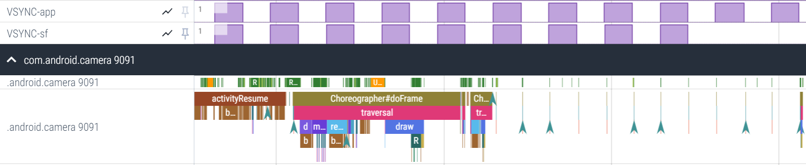

- Display frames

  一条彩色线，后面跟着一堆条形图。这些形状代表已创建的特定线程的状态和帧堆栈。堆栈的每个级别代表对 `beginSection()` 的调用，或者您为应用或游戏定义的自定义跟踪事件的开始。

UI 线程或通常运行应用程序或游戏的主线程始终显示为第一个线程。

**线程状态颜色：**

- 绿色：Running，

  线程正在完成与某个进程相关的工作或正在响应中断。

- 蓝色：Runnable

  线程可以运行但目前未进行调度

- 白色：Sleeping

  线程没有可执行的任务，可能是因为线程在遇到互斥锁定时被阻止。

- 橙色：Uninterruptable sleep 不可中断睡眠

  线程在遇到 I/O 操作时被阻止或正在等待磁盘操作完成。

- 紫色：Interruptable sleep

  线程在遇到另一项内核操作（通常是内存管理）时被阻止

**快捷键**

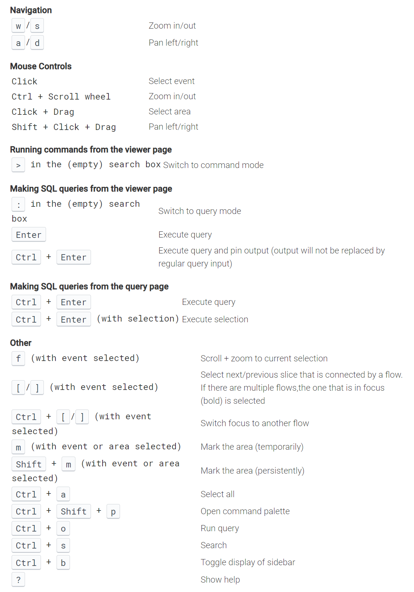

[定义自定义事件](https://developer.android.com/topic/performance/tracing/custom-events?hl=zh-cn)

### 2）检查 GPU 渲染

[检查 GPU 渲染速度和过度绘制 ](https://developer.android.com/topic/performance/rendering/inspect-gpu-rendering?hl=zh-cn)

## 2、基准化分析

基准测试是检查和监控应用性能的一种方式。定期运行基准测试，以分析和调试性能问题，并帮助确保近期的更改不会引起性能下降。

Android 提供了两种基准测试的库和方法：Macrobenchmark、Microbenchmark。

### Macrobenchmark

[Macrobenchmark](https://developer.android.com/studio/profile/macrobenchmark?hl=zh-cn) 库可衡量更大规模的最终用户互动，例如启动、与界面交互和动画。此库可让您直接控制受测试的性能环境。借助它，还可以通过控制编译、启动和停止应用来直接衡量实际的应用启动或滚动。

Macrobenchmark 库可在外部从您通过测试构建的测试应用注入事件并监控结果。因此，您在编写基准测试时，不要直接调用应用代码，而要像用户那样在应用中操作。

### Microbenchmark

借助 [Microbenchmark](https://developer.android.com/studio/profile/benchmark?hl=zh-cn) 库，您可以直接在一个循环中对应用代码进行基准测试。该库旨在衡量 CPU 工作情况，衡量结果将用于评估最佳情况下的性能（例如，JIT 编译已预热，磁盘访问已缓存），使用内部循环或特定热函数时就可能获得这种最佳性能。此外，该库只能衡量您可以直接单独调用的代码。

如果您的应用需要处理复杂的数据结构，或者采用了一些会在应用运行期间进行多次调用的特定计算密集型算法，就可能适合进行基准测试。您还可以衡量界面的各个部分。例如，您可以衡量绑定一个 `RecyclerView` 的花销、inflate 布局时间，以及从性能的角度来看，`View` 类的“布局和衡量”遍历的要求有多高。

不过，您无法衡量进行基准测试的用例对整体用户体验所产生的影响。在某些情况下，您无法通过基准测试判断卡顿或应用启动时间等瓶颈是否得到了改善。因此，首先使用 [Android 性能分析器](https://developer.android.com/studio/profile?hl=zh-cn)找出这类瓶颈至关重要。找到要调查和优化的代码后，您便可以快速且更轻松地反复运行会进行基准测试的循环，并生成噪声较少的结果，让您能够专注于需要改进的方面。

Microbenchmark 库只能报告应用的相关信息，而非整个系统的相关信息。因此，它最适合用来分析应用在特定情况下的性能，而不是分析系统的整体性能问题。

## 3、衡量性能

### 1）关键性能问题

常见问题

1. 滚动卡顿

   “卡顿” 指画面在以下时候出现断断续续的情况：系统无法及时构建和提供帧，以致无法以请求的频率（60hz 或更高）将其绘制到屏幕上。卡顿问题在滚动操作期间最为明显：本应流畅播放的动画流会出现断断续续的情况。由于应用渲染内容所需的时间超过了相应帧在系统上显示的时长，所以画面移动时就会在一帧或多帧中暂停，导致出现卡顿。

2. 启动延迟

   启动延迟时间是指从点按应用图标、通知或其他入口点到屏幕上显示用户的数据所需的时间。

   争取在应用中实现以下启动目标：

   - 冷启动时间少于 500 ms。当正在启动的应用不存在于系统内存中时，就会发生“冷启动”。应用在系统重新启动后或应用进程被用户/系统停止后首次启动时，就会进行冷启动。

     如果应用已在后台运行，则为“热启动”。冷启动需要系统完成大部分工作，因为系统必须从存储空间加载所有内容并初始化应用。因此，请尽量让冷启动耗时不超过 500 ms。

   - 让 [P95 和 P99](https://www.cnblogs.com/hunternet/p/14354983.html)  延迟时间非常接近延迟时间中值。如果应用需要很长时间才能启动，用户体验会很糟糕。应用启动关键路径中的进程间通信 (IPC) 和不必要的 I/O 可能会遇到锁争用，进而造成不一致的情况。

3. 过渡不流畅

   交互期间出现，例如 tab 切换或加载新的 Activity 时。这些过渡必须是平滑的动画，且没有延迟和视觉闪烁

4. 电源效率低

   创建新对象的内存分配可能是系统中大量工作的原因。因为不仅分配本身需要 AndroidRuntime (ART) 的工作，而且稍后释放这些对象（垃圾回收）也需要花销。分配和收集都更快、更高效，特别是对于临时对象。尽管过去最佳实践是尽可能避免分配对象，但建议采取对您的应用程序和架构最有意义的做法。

### 2）确定问题

1. 检查关键用户流程、场景：
   - 常见启动流程，包括启动器和通知
   - 用户滚动浏览其中数据的屏幕。
   - 在屏幕之间切换。
   - 长时间运行的工作流，例如导航或播放音乐。
2. 使用调试工具检查上述工作中发生的情况：
   - [Perfetto](https://perfetto.dev/)：根据准确的计时数据，确切了解整个设备中的运作情况。
   - [内存分析器](https://developer.android.com/studio/profile/memory-profiler?hl=zh-cn)：了解堆上正在发生的内存分配。
   - [Simpleperf](https://developer.android.com/ndk/guides/simpleperf?hl=zh-cn)：显示有关特定时间段内哪些函数调用占用最多 CPU 的火焰图。当您在 Systrace 中发现有些操作用时很长但又不知道什么原因时，Simpleperf 可以提供额外的信息。

### 3）设置应用进行性能分析

正确设置对于从应用获得准确、可重复、可操作的 benchmark 至关重要。在尽可能接近生产的系统上进行测试，同时抑制干扰。

- Tracepoint

  应用可以利用[自定义 trace 事件](https://developer.android.com/topic/performance/tracing/custom-events?hl=zh-cn)在代码中插桩。在捕获轨迹时，每个部分的跟踪会产生少量开销（约 5 us），因此请勿在每个方法中都使用 trace。跟踪较大的工作块（> 0.1 ms）可以提供关于瓶颈的重要洞察。

- APK 注意事项

  不要在 debug 版本测试性能。debug variant 有助于对堆栈样本进行故障排除和符号化，但它们会对性能产生严重的非线性影响。使用 production-grade code shrinking 配置，某些 ProGuard 配置会删除 tracepoints，进行测试时需要考虑删除相关配置规则。

- System 注意事项

- 应用启动缓慢

  trampoline activity：一个 `activityStart` 后面紧跟着另一个 `activityStart` ，第一个活动不会绘制任何帧。

- 不必要的分配触发频繁 GC

  垃圾回收 (GC) 的频率高于预期。示例显示，在长时间运行的操作期间，每 10 秒就出现一次垃圾回收，表示应用可能遭到不必要地分配，但一直在持续进行：

  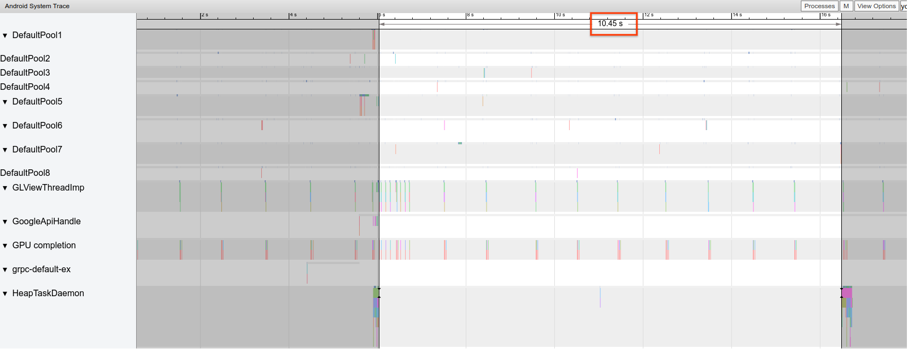

  在使用内存分析器时，绝大部分的分配都源于某个特定的调用堆栈。不需要激进地消除所有分配，因为这样做可能会使代码维护起来更加困难。不妨改为从分配热点着手。

- Janky frames

  graphics pipeline 相对复杂，并且在确定用户最终是否会看到丢帧时可能存在一些细微差别。某些情况下，platform 使用 buffering 来 rescue a frame。但是，你可以忽略大部分细微差别，从应用程序的角度识别有问题的 frames。

  在绘制帧时几乎不需要应用完成什么工作的情况下，`Choreographer.doFrame()` tracepoints 的间隔在帧速率为 60 FPS的设备上是 16.7 ms：

  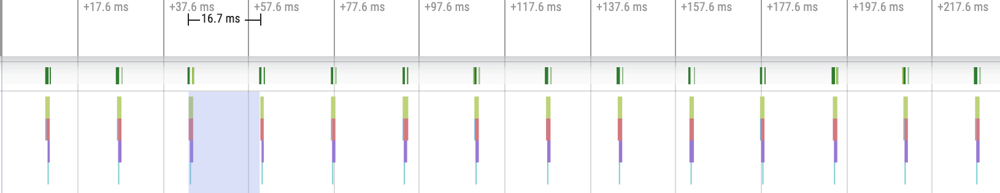

  缩小并浏览轨迹，有时会看到一些帧需要稍长时间才能完成，但这种情况仍然没有问题，因为这些帧的用时并未超过分配给它们的 16.7 ms：

  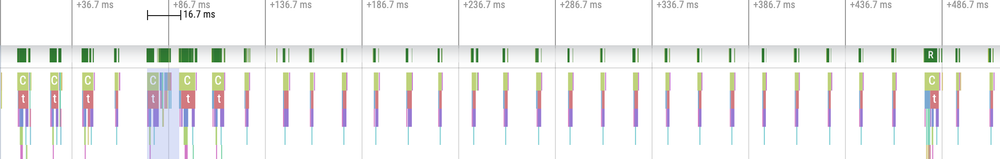

  如果您在这种规律的间隔中看到一处中断，那就是卡顿帧

  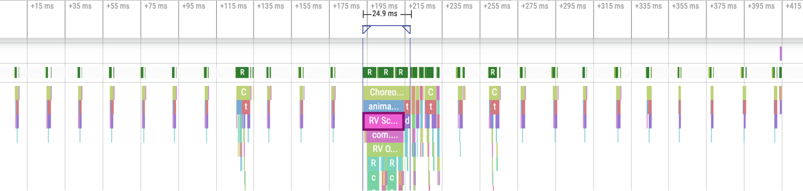

- 场景 RecycleView 错误

  不必要的情况下，让 [`RecyclerView`](https://developer.android.com/jetpack/androidx/releases/recyclerview?hl=zh-cn) 的整个后备数据失效可能会导致帧的渲染时间较长，造成卡顿。您应当仅让更改的数据失效，从而最大限度地减少需要更新的视图数量。[呈现动态数据](https://developer.android.com/reference/androidx/recyclerview/widget/RecyclerView?hl=zh-cn#presenting-dynamic-data)，了解避免高开销 `notifyDatasetChanged()` 调用的方式，这些方式会更新内容，而不是完全替换内容。

  如果您无法正确支持每个嵌套的 `RecyclerView`，就会导致内部 `RecyclerView` 每次都要完全重新创建。每个嵌套的内部 `RecyclerView` 都必须设置一个 [`RecycledViewPool`](https://developer.android.com/reference/kotlin/androidx/recyclerview/widget/RecyclerView.RecycledViewPool?hl=zh-cn)，以便确保能够在每个内部 `RecyclerView` 之间回收视图。

  如果未预提取足够的数据，或未及时预提取，用户可能就需要等待从服务器提取更多数据，才能顺畅滚动到列表底部。尽管从技术角度而言这并不属于卡顿，因为并没有错过任何帧的截止时间，但如果您能修改预提取的时间和数量，让用户不必等待数据，用户体验就能得到显著提升。

# 二、性能优化

Android 提供了多种工具和库，可帮助持续改进应用关键时刻的性能。

**基准配置文件**

将基准配置文件实现到您的应用或库中，以最高效的方式提升性能。它可以大幅缩短应用启动时间、加快呈现速度并提高最终用户性能。如需了解详情，请参阅[基准配置文件](https://developer.android.com/topic/performance/baselineprofiles?hl=zh-cn)。

**启动配置文件**

启动配置文件是一项实验性功能，与基准配置文件类似，但应用方式有所不同，并且具有独特的优势。基准配置文件会在应用安装在设备上以后优化性能，而启动配置文件是在编译时应用的。它会提示 R8 缩减器在 DEX 文件中将常用类归为一组。这可以减少应用启动期间的页面故障，从而缩短启动时间。如需了解详情，请参阅 [DEX 布局优化和启动配置文件](https://developer.android.com/topic/performance/baselineprofiles/dex-layout-optimizations?hl=zh-cn)。

**App Startup 库**

借助 [App Startup 库](https://developer.android.com/topic/libraries/app-startup?hl=zh-cn)，库开发者和应用开发者都可以使用 App Startup 库来简化启动序列并优化启动操作。

## 1、Baseline Profiles

性能对业务指标的影响，[Josh](https://developer.android.com/stories/apps/josh?hl=zh-cn)、[Lyft](https://developer.android.com/stories/apps/lyft?hl=zh-cn)、[TikTok](https://developer.android.com/stories/apps/tiktok?hl=zh-cn) 和 [Zomato](https://developer.android.com/stories/apps/zomato?hl=zh-cn) 。

## 2、应用启动

### 1）分析和优化启动步骤

应用程序通常要在启动期间加载对用户必需的资源。非必需资源可以等到启动完成后才加载。

性能权衡考虑的因素：

- 测量每个操作所花费的时间，并识别需要很长时间才能完成的块。
- 确认资源密集型操作对于应用程序启动至关重要。如果操作可以等到应用完整绘制后再执行，则有助于最大限度地减小启动期间的资源限制。
- 确认是否希望相应操作在应用启动期间执行。很多时候，系统可能会从旧版代码或第三方库调用不必要的操作。
- 尽可能将长时间运行的操作移至后台。在启动期间，后台进程仍可能会影响 CPU 使用率。

在对操作进行全面研究后，您可以在所需的加载时间与将其纳入应用启动的必要性之间做出权衡。在更改应用的工作流时，请务必留意可能会发生回归问题或破坏性更改。

### 2）测量和分析主要操作所用时间

查看启动 trace 并测量 `bindApplication` 或 `activityStart` 等主要操作所用的时间。

通过查看应用启动期间所用的总时间，找出具有以下特点的操作：

- 占用大量时间并且可优化的操作。例如，可以查看 [`Choreographer`](https://developer.android.com/reference/android/view/Choreographer?hl=zh-cn) 绘制时间、布局inflate 时间、库加载时间、[`Binder`](https://developer.android.com/reference/android/os/Binder?hl=zh-cn) 事务或资源加载时间。一般，可查看所有耗时超过 20 ms的操作。
- 阻塞主线程。参阅[浏览 Systrace 报告](https://developer.android.com/topic/performance/tracing/navigate-report?hl=zh-cn)。
- 不需要在启动期间运行。
- 可以等到第一帧绘制完毕后再执行。

进一步研究各个跟踪记录，找出性能上有待改进的方面。

**找出主线程上开销大的操作**

避免在主线程上执行开销大的操作（例如文件 I/O 和网络访问）。因为在主线程上执行开销大的操作可能会导致应用无响应，并延迟其他关键操作。[`StrictMode.ThreadPolicy`](https://developer.android.com/reference/android/os/StrictMode.ThreadPolicy?hl=zh-cn) 可以帮助找出在主线程上执行大开销操作的情况。 最佳做法是在调试 build 中启用 [`StrictMode`](https://developer.android.com/reference/android/os/StrictMode?hl=zh-cn)，以尽早发现问题。使用 `StrictMode.ThreadPolicy` 在检测到违反线程规则的行为时触发应用崩溃。

**TTID 和 TTFD**

如需了解应用生成第一帧所用的时间，请测量[初步显示所用时间](https://developer.android.com/topic/performance/vitals/launch-time?hl=zh-cn#time-initial) (TTID)。不过，此指标不一定反映您的应用启动直至用户可开始与应用互动之间的时间。[完全显示所用时间](https://developer.android.com/topic/performance/vitals/launch-time?hl=zh-cn#time-full) (TTFD) 指标在测量和优化拥有完全可用应用状态所需的代码路径方面更为有用。

了解在应用界面完全绘制后的报告策略，参阅[提高启动时间精确度](https://developer.android.com/topic/performance/benchmarking/macrobenchmark-metrics?hl=zh-cn#startup-accuracy)。

### 3）分析整体线程状态

**找出主线程处于休眠状态的主要区块**

如果长时间处于休眠状态，可能是因为应用的主线程要等待作业完成。对于多线程的应用，请确定主线程在等待的线程，并考虑优化相关操作。确保关键路径不会因为不必要的锁争用而出现延迟。

**减少主线程发生阻塞及进入不可中断的休眠状态的情况**

找出主线程每次进入阻塞状态的实例。线程状态时间轴上用橙色指明这种情况。确认这些操作是符合预期的，还是可以避免的，并根据需要进行优化。

与 IO 相关的可中断休眠可能是值得改进的方面。 其他执行 IO 的进程（即使是无关的应用）都能与前台应用在执行的 IO 争用资源。

**缩短启动时间**

在找到可优化之处后，探索采用一些可能的方案来缩短启动时间：

- 通过延迟和异步方式加载内容，缩短 [TTID](https://developer.android.com/topic/performance/vitals/launch-time?hl=zh-cn#time-initial)。
- 尽量减少进行 binder 调用的调用函数。如果这类函数必不可少，请确保优化其调用，可采用缓存值的方式，而不要重复调用，还可以将非阻塞性作业移至后台线程中。
- 为了让应用看起来启动更快，可以尽快对用户显示需要最少渲染的内容，直到界面的其余部分完成加载。
- 创建[启动配置文件](https://developer.android.com/topic/performance/baselineprofiles/overview?hl=zh-cn#startup-profiles)并将其添加到应用。
- 使用 Jetpack [应用启动库](https://developer.android.com/topic/libraries/app-startup?hl=zh-cn)简化应用启动期间的组件初始化。

### 4）分析 UI 性能

应用启动过程包括启动画面和首页的加载时间。优化应用启动，需要 inspect trace 了解绘制界面所用的时间。

**限制初始化工作**

某些帧的加载时间可能比其他帧更长。认为这类帧在应用启动期间的绘制开销很高。

如需优化初始化，请执行以下操作：

- 优先考虑缓慢的布局传递，选择改进这些方面。
- 通过添加[自定义跟踪事件](https://developer.android.com/topic/performance/tracing/custom-events?hl=zh-cn)来分析来自 Perfetto 的 alert，以减少开销较高的绘制和延迟。

**测量帧数据**

可通过多种方式测量帧数据。以下是五种主要的帧数据收集方法：

- 使用 `dumpsys gfxinfo` 进行本地收集：并非 dumpsys 数据中观察到的所有帧都会导致应用呈现速度缓慢，或者对用户造成影响。不过，观察这项指标在不同发布周期之间的变化，有助于了解总体的性能趋势。了解如何使用 `gfxinfo` 和 `framestats` 将界面性能测量值集成到您的测试实践中，请参阅 [Android 应用测试基础知识](https://developer.android.com/training/testing/performance?hl=zh-cn)。
- 使用 [JankStats](https://developer.android.com/topic/performance/jankstats?hl=zh-cn) 进行字段收集：使用 [JankStats 库](https://developer.android.com/studio/profile/jankstats?hl=zh-cn)从应用的特定部分收集帧呈现时间，并记录和分析数据。
- 在测试中使用 Macrobenchmark（在后台使用 Perfetto）
- **[Perfetto FrameTimeline](https://perfetto.dev/docs/data-sources/frametimeline)**：在 Android 12 上，可以从 Perfetto trace 的 [Frame timeline metrics](https://perfetto.dev/docs/data-sources/frametimeline)，了解导致帧丢失的操作。
- 使用 Android Studio Profiler [检测卡顿](https://developer.android.com/studio/profile/jank-detection?hl=zh-cn)

**查看 main activity 的加载时间**

应用的 main activity 可能包含从多个来源加载的大量信息。检查首页 `Activity` 布局，特别是首页 activity 的 [`Choreographer.onDraw`](https://developer.android.com/reference/android/view/Choreographer?hl=zh-cn) 方法。

- 使用 [`reportFullyDrawn`](https://developer.android.com/reference/android/app/Activity?hl=zh-cn#reportFullyDrawn()) 向系统报告您的应用现已完全绘制，达到优化目的。
- 使用 [`StartupTimingMetric`](https://developer.android.com/reference/kotlin/androidx/benchmark/macro/StartupTimingMetric?hl=zh-cn) 和 Macrobenchmark 库来测量 activity 和应用启动情况。
- 查看丢帧情况。
- 找出在渲染或测量方面很耗时的布局。
- 找出加载用时较长的资源。
- 找出在启动期间原本没必要 inflate 的布局。

考虑使用以下可优化 main activity 加载时间的解决方案：

- 简化初始布局。参阅[优化布局层次结构](https://developer.android.com/training/improving-layouts/optimizing-layouts?hl=zh-cn)。

- 添加自定义跟踪点，以获取有关丢帧和复杂布局的更多信息。

- 缩减启动期间加载的位图资源的数量和大小。

- 在布局不会立即 `VISIBLE` 的地方使用 [`ViewStub`](https://developer.android.com/reference/android/view/ViewStub?hl=zh-cn)。`ViewStub` 是一个不可见、零大小的 View，可用于在运行时延迟 inflate 布局资源。参阅 [`ViewStub`](https://developer.android.com/reference/android/view/ViewStub?hl=zh-cn)。

  如果使用的是 [Jetpack Compose](https://developer.android.com/jetpack/compose?hl=zh-cn)，则可以使用状态获取与 `ViewStub` 类似的行为，以延迟加载某些组件：

### 5）[app-startup](https://developer.android.com/topic/libraries/app-startup?hl=zh-cn)

## 3、解决常见问题

### 1）应用启动

####  I 应用启动状态

应用有三种启动状态：冷启动、温启动或热启动。每种状态都会影响应用向用户显示所需的时间。在冷启动中，应用从头开始启动。在另外两种状态中，系统需要将后台运行的应用带入前台。

建议始终在冷启动的基础上进行优化。这样也可以提升温启动和热启动的性能。优化应用以实现快速启动，了解系统和应用层面的情况以及它们在各个状态中的互动方式很有帮助。

应用启动时间的两个重要指标是[初步显示所用时间 (TTID)](https://developer.android.com/topic/performance/vitals/launch-time?hl=zh-cn#time-initial) 和[完全绘制所用时间 (TTFD)](https://developer.android.com/topic/performance/vitals/launch-time?hl=zh-cn#time-full)。TTID 是显示第一帧所用的时间，TTFD 则是应用达到可全面互动的状态所用的时间。[提高启动时间准确性](https://developer.android.com/topic/performance/benchmarking/macrobenchmark-metrics?hl=zh-cn#startup-accuracy)。

1、冷启动

冷启动是指应用从头开始启动。系统进程在冷启动后才创建应用进程。发生冷启动的情况包括应用自设备启动后或系统终止应用后首次启动。

在冷启动开始时，系统有以下三项任务：

1. 加载并启动应用。
2. 在启动后立即显示应用的空白启动窗口。
3. 创建应用[进程](https://developer.android.com/guide/components/processes-and-threads?hl=zh-cn#Processes)。

系统一创建应用进程，应用进程就负责后续阶段：

1. 创建应用对象。
2. 启动主线程。
3. 创建 main activity。
4. inflate 视图。
5. 创建屏幕布局。
6. 执行初步绘制。

当应用进程完成第一次绘制时，系统进程就会换掉显示的后台窗口，将其替换为 main activity。此时，用户可以开始使用应用。下图显示系统进程和应用进程如何交接工作。

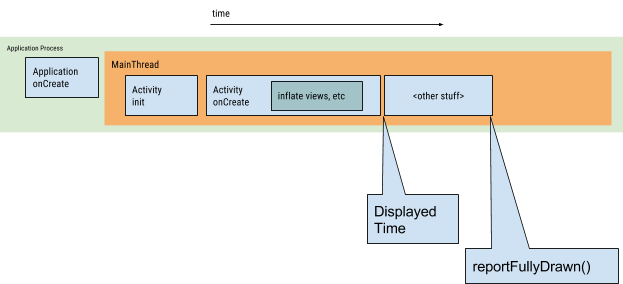

在创建应用和创建 activity 的过程中可能会出现性能问题。

- 应用创建

  当应用启动时，空白启动窗口将保留在屏幕上，直到系统首次完成应用绘制。此时，系统进程会切换应用的启动窗口，让用户与应用互动。

  如果您在自己的应用中替换了 [`Application.onCreate()`](https://developer.android.com/reference/android/app/Application?hl=zh-cn#onCreate())，系统将对应用对象调用 `onCreate()` 方法。之后，应用生成主线程（也称为界面线程），并用其执行创建主 activity 的任务。

  从此时开始，系统级和应用级进程根据[应用生命周期阶段](https://developer.android.com/guide/topics/processes/process-lifecycle?hl=zh-cn)继续运行。

- activity 创建

  在应用进程创建 activity 后，activity 将执行以下操作：

  1. 初始化值。
  2. 调用构造函数。
  3. 根据 activity 的当前生命周期状态，相应地调用回调方法，如 [`Activity.onCreate()`](https://developer.android.com/reference/android/app/Instrumentation?hl=zh-cn#callApplicationOnCreate(android.app.Application))。

  通常，[`onCreate()`](https://developer.android.com/reference/android/app/Activity?hl=zh-cn#onCreate(android.os.Bundle)) 方法对加载时间的影响最大，因为它执行工作的开销最高：加载和膨胀视图，以及初始化运行 activity 所需的对象。

2、温启动

温启动包含了在冷启动期间发生的部分操作。同时，它的开销要比热启动高。有许多状态可视为温启动，例如以下状态：

- 用户在退出应用后又重新启动应用。进程可能继续运行，但应用必须通过调用 `onCreate()` 从头开始重新创建 activity。
- 系统将您的应用从内存中移出，然后用户又重新启动它。进程和 activity 需要重启，但传递到 `onCreate()` 的已保存实例 state bundle 对于完成此任务有帮助。

3、热启动

应用的热启动开销比冷启动更低。在热启动中，系统会将您的 activity 带到前台。如果应用的所有 activity 仍驻留在内存中，则应用可以避免重复执行对象初始化、布局 inflate 和呈现。

但是，如果一些内存为响应内存整理事件（如 [`onTrimMemory()`](https://developer.android.com/reference/android/app/Instrumentation?hl=zh-cn#callApplicationOnCreate(android.app.Application))）而被完全清除，则需要为了响应热启动事件而重新创建相应的对象。

热启动显示的屏幕上行为和冷启动场景相同。系统进程会显示空白屏幕，直到应用完成 activity 呈现。

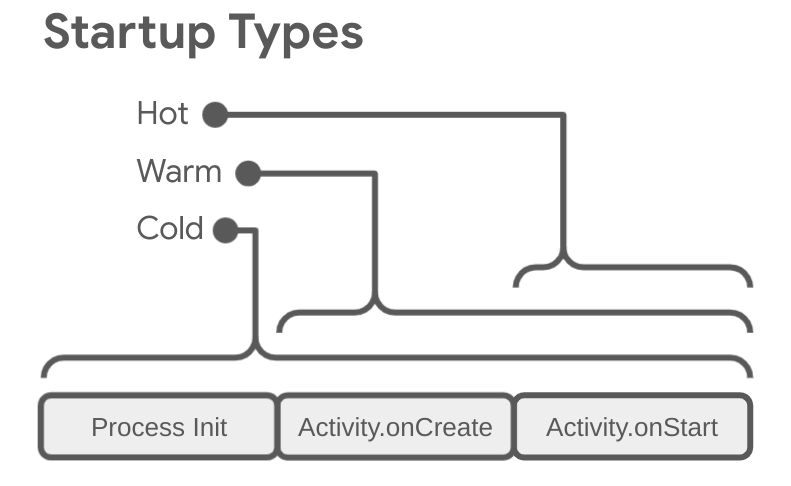

#### II Perfetto 查看应用启动

1. 找到 Android App Startups metric 行

   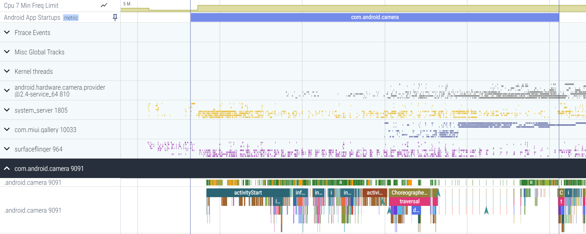

2. 按 m，该 Slice 会被括出显示，并标注所用时间。

#### III 使用指标分析问题

**使用启动指标的优势**

Android 使用[初步显示所用时间 (TTID)](https://developer.android.com/topic/performance/vitals/launch-time?hl=zh-cn#time-initial) 和[完全显示所用时间 (TTFD)](https://developer.android.com/topic/performance/vitals/launch-time?hl=zh-cn#time-full) 指标来优化冷应用启动和温应用启动。Android 运行时 (ART) 使用这些指标的数据来高效地预编译代码，以优化未来启动。

更快的启动速度可以促进用户与应用的持续互动，从而减少过早退出、重启实例或前往其他应用的情况。

**Android Vitals**

**初步显示所用时间**

初步显示所用时间 (TTID) 指标用于测量应用生成第一帧所用的时间，包括冷启动期间的进程初始化、冷启动或温启动期间的 activity 创建，以及显示第一帧。

[Logcat](https://developer.android.com/tools/logcat?hl=zh-cn) 包含一个输出行，该行包含名为 `Displayed` 的值。此值代表从启动进程到在屏幕上完成对应 activity 的绘制所用的时间。经过的时间包括以下事件序列：

- 启动进程。
- 初始化对象。
- 创建并初始化 activity。
- inflate 布局。
- 首次绘制应用。

**完全显示所用时间**

完全显示所用时间 (TTFD) 指标用于测量应用生成具有完整内容的第一帧所用的时间，包括在第一帧之后异步加载的内容。一般情况下，这是从网络加载的主要列表内容。

可以使用 [`reportFullyDrawn()`](https://developer.android.com/reference/android/app/Activity?hl=zh-cn#reportFullyDrawn()) 方法测量从应用启动到完全显示所有资源和视图层次结构所用的时间。在应用执行延迟加载时，此数据会很有用。在延迟加载中，应用不会阻止窗口的初步绘制，但会异步加载资源并更新视图层次结构。

由于延迟加载，应用的初步显示不包括所有资源，您不妨将完全加载并显示所有资源及视图视为单独的指标。例如，您的界面可能已完全加载，并绘制了一些文本，但尚未显示应用必须从网络中提取的图片。

[提高启动时间准确性](https://developer.android.com/topic/performance/benchmarking/macrobenchmark-metrics?hl=zh-cn#startup-accuracy)说明了如何在您的应用达到可与用户进行互动的状态之前使用 [`FullyDrawnReporter`](https://developer.android.com/reference/androidx/activity/FullyDrawnReporter?hl=zh-cn) 延迟调用 [`reportFullyDrawn`](https://developer.android.com/reference/androidx/activity/ComponentActivity?hl=zh-cn#reportFullyDrawn())。

当您使用此 API 时，Logcat 显示的值为从创建应用对象到调用 `reportFullyDrawn()` 时所用的时间。

#### IV 常见问题

这些问题主要涉及初始化应用和 activity 对象，以及屏幕加载。

**heavy 应用初始化**

在您的代码覆写 `Application` 对象，并在初始化该对象过程中执行密集工作或复杂逻辑时，启动性能可能会受影响。 `Application` 子类执行尚不需要完成的初始化，应用可能会在启动过程中浪费时间。

有些初始化可能完全没有必要：例如，当应用为了响应 intent 而实际上已经启动时，初始化 main activity 的状态信息就是不必要的。通过 intent，应用仅使用之前初始化状态数据的一个子集。

应用初始化过程中的其他挑战包括影响范围较大或数量众多的垃圾回收事件，或与初始化同时发生、会进一步阻止初始化过程的磁盘 I/O。垃圾回收是 Dalvik 运行时特别需要考虑的问题；Android 运行时 (ART) 同时执行垃圾回收，从而最大限度地减少该操作的影响。

不管问题在于不必要的初始化还是磁盘 I/O，解决方案都是延迟初始化。换言之，应当仅初始化立即需要的对象。采用单例模式，让应用仅在首次需要对象时初始化对象，而不是创建全局静态对象。

此外，考虑使用依赖项注入框架（如 [Hilt](https://developer.android.com/training/dependency-injection/hilt-android?hl=zh-cn)），它们会在首次注入时创建对象和依赖项。

如果应用使用 content provider 在启动时初始化应用组件，考虑改用 [App Startup 库](https://developer.android.com/topic/libraries/app-startup?hl=zh-cn)。

**heavy activity 初始化**

创建 activity 通常需要进行大量的高开销工作，常见问题有：

- inflate 大型或复杂的布局
- 磁盘或网络 I/O 阻塞屏幕绘制。
- 加载和解码位图。
- 栅格化 [`VectorDrawable`](https://developer.android.com/reference/android/graphics/drawable/VectorDrawable?hl=zh-cn) 对象。
- 初始化 activity 的其他子系统。

常见问题和补救措施：

- View 层次结构越复杂，应用 inflate 它所花时间越长。
  - 减少冗余嵌套布局，展平 View 层次结构。
  - 不要 inflate 启动期间无需显示的界面部分，使用  [`ViewStub`](https://developer.android.com/reference/android/view/ViewStub?hl=zh-cn) 对象作为应用可以在更合适的时间膨胀的子层次结构的占位符。
- 在主线程上进行所有资源初始化也会降低启动速度。
  - 转移所有资源初始化，以便应用可以在其他线程上延迟执行。
  - 允许应用加载并显示您的视图，稍后再更新依赖于位图和其他资源的可视属性。

**自定义启动画面**

迁移到 [`SplashScreen`](https://developer.android.com/reference/android/window/SplashScreen?hl=zh-cn) API。此 API 可以缩短启动时间，并允许您通过以下方式调整启动画面：

- [设置主题](https://developer.android.com/guide/topics/ui/splash-screen?hl=zh-cn#set-theme)以更改启动画面的外观。
- 使用 [`windowSplashScreenAnimationDuration`](https://developer.android.com/guide/topics/ui/splash-screen?hl=zh-cn#suspend-drawing) 控制启动画面的显示时长。
- 自定义[启动画面动画](https://developer.android.com/develop/ui/views/launch/splash-screen?hl=zh-cn#customize-animation)，并妥善处理动画以关闭启动画面。

### 2）ANR

### 3）渲染

应用将图片和文字渲染到屏幕上的流畅度。

#### I 减少过度绘制

过度绘制是指系统在渲染单个帧的过程中多次在屏幕上绘制某一个像素。例如，有若干界面卡片堆叠在一起，每张卡片都会遮盖其下面一张卡片的部分内容。但是，系统仍然需要绘制堆叠中的卡片被遮盖的部分。这是因为堆叠的卡片是根据 [painter's algorithm](https://en.wikipedia.org/wiki/Painter's_algorithm)（按从后到前的顺序）来渲染的。按照这种渲染顺序，系统可以将适当的透明度混合应用于阴影之类的半透明对象。

[可视化 GPU 过度绘制](https://developer.android.com/topic/performance/rendering/inspect-gpu-rendering?hl=zh-cn#debug_overdraw)、[分析 GPU 渲染速度](https://developer.android.com/topic/performance/rendering/inspect-gpu-rendering?hl=zh-cn#profile_rendering)。

减少过度绘制：

- 移除布局中不必要的背景。

  默认情况下，布局没有背景，这表示布局本身不会直接渲染任何内容。但是，当布局具有背景时，有可能会导致过度绘制。通过移除不必要的背景来提高渲染性能。不必要的背景可能不可见，因为它会被应用在其上绘制的所有其他内容完全覆盖。例如，当系统在父视图上绘制子视图时，可能会完全覆盖父视图的背景。

- 使视图层次结构扁平化。

  优化视图层次结构以减少重叠 UI 对象的数量来提高性能。

- 降低透明度。

  在屏幕上渲染 transparent pixels 是导致过度绘制的重要因素。在普通的过度绘制中，系统会在已绘制的现有像素上绘制不透明的像素，从而将其完全遮盖，透明对象需要先绘制现有的像素，以便达到正确的混合效果。

  诸如透明动画、淡出和阴影之类的视觉效果都会涉及某种透明度，有可能导致严重的过度绘制。可以减少要渲染的透明对象的数量，来改善过度绘制。例如，如需获得灰色文本，您可以在 [`TextView`](https://developer.android.com/reference/android/widget/TextView?hl=zh-cn) 中绘制黑色文本，再为其设置一个半透明的透明度值。但是，通过用灰色绘制文本来获得同样的效果。[Hidden Cost of Transparency ](https://www.youtube.com/watch?v=wIy8g8yNhNk&ab_channel=GoogleforDevelopers)

#### II 性能和 View 层次结构

**布局和测量性能**

渲染 pipeline 包括布局和测量阶段。测量部分确定 View 的大小和边界，布局部分确定 View 在屏幕上的位置。这两个 pipeline 阶段在处理每个 View 或布局时都会产生少量花销。当应用添加或删除 View 对象时，例如当  `RecyclerView` 对象回收或重用它们时，花销会较大。如果 View 对象需要调整大小满足其 constraint 时，花销还会更高。例如，在 wrap text 的 View 对象调用 SetText()，View 可能需要调整大小。

此类情况花费时间太长，可能会阻止帧在允许的 16 ms内渲染，导致帧丢失并使动画卡顿。因为无法将这些操作移至工作线程（必须在主线程上处理它们），所以最好对它们进行优化。

1、管理复杂布局

嵌套 UI 对象会增加布局花销，当应用处理布局对象时，还会对布局的所有子项执行相同操作。

对于复杂的布局，，有时仅在系统第一次计算布局时才会产生成本。例如，当应用回收 `RecyclerView` 对象中的复杂列表项时，系统需要对所有对象进行布局。另一示例中，微小更改可以沿着链向父级传播，直到到达不影响父级大小的对象。

建议使用 [Layout Editor](https://developer.android.com/studio/write/layout-editor#intro) 创建  [`ConstraintLayout`](https://developer.android.com/develop/ui/views/layout/constraint-layout)，而不是 `RelativeLayout` 或 `LinearLayout` ，因为它通常更高效并减少布局的嵌套。对于可以使用 `FrameLayout` 实现的简单布局，建议使用 `FrameLayout` 。如果使用 `RelativeLayout` 类，则可以使用嵌套的、未加权的 `LinearLayout` 视图来实现相同的效果。但是，如果使用嵌套的加权 `LinearLayout` 视图，则布局成本会高得多，因为它需要多次布局。使用 `RecyclerView` 而不是 `ListView` ，因为它可以回收各个列表项的布局，既更高效，又可以提高滚动性能。

2、Double taxation

通常框架一次性执行布局或测量阶段。然而，对于一些复杂的布局情况，框架可能必须对层次结构的部分进行多次 iterate，这些部分需要多次传递，然后才能最终定位元素。必须执行多次布局和测量 iterate 被称为Double taxation。

**分析 view 层次结构问题**

Perfetto

Profile GPU redering

Lint

Layout Inspector：[Debug your layout with Layout Inspector and Layout Validation](https://developer.android.com/studio/debug/layout-inspector).

**解决 view 层次结构问题**

- 删除冗余的嵌套布局

  ConstraintLayout、不必要的嵌套布局（`RelativeLayout` 容器可能包含一个子容器，该子容器也是 `RelativeLayout` 容器）

- 采用 merge or include

  冗余嵌套布局的一个常见原因是 `<include>` 标记。`<merge>` 标记可以帮助防止此问题。 [Use the  tag](https://developer.android.com/develop/ui/views/layout/improving-layouts/reusing-layouts#Merge).

- 采用 cheaper layout

  可能无法调整现有布局方案以使其不包含冗余布局。在某些情况下，唯一的解决方案可能是通过切换到完全不同的布局类型来展平层次结构。例如， `TableLayout` 提供与具有许多位置依赖性的更复杂布局相同的功能。`ConstraintLayout` 提供与 `RelativeLayout` 类似的功能。

#### III [使用 Profile GPU Rendering 分析](https://developer.android.com/topic/performance/rendering/profile-gpu)

#### IV 提高布局性能

**[Optimize layout hierarchies](https://developer.android.com/develop/ui/views/layout/improving-layouts/optimizing-layouts)**

**[Reuse layouts with <include> ](https://developer.android.com/develop/ui/views/layout/improving-layouts/reusing-layouts)**

**[Load views on demand](https://developer.android.com/develop/ui/views/layout/improving-layouts/loading-ondemand)**

### 4）内存

#### ① 内存管理

Android Runtime (ART) 和 Dalvik VM 使用 分页[paging](https://en.wikipedia.org/wiki/Paging) 和 内存映射[memory-mapping](https://en.wikipedia.org/wiki/Memory-mapped_files) 来管理内存。应用修改的任何内存（无论是分配新对象还是映射页面）都驻留在 RAM 中并且无法调出。应用释放内存的唯一方法是释放应用持有的对象引用，使内存可供垃圾收集器使用。但有个例外：如果系统想要在其他地方使用该内存，则任何未经修改而映射的文件（例如代码）都可以从 RAM 中调出。

1、垃圾收集

[Garbage collection](https://en.wikipedia.org/wiki/Garbage_collection_(computer_science))

内存管理环境（ ART 或 Dalvik 虚拟机）会跟踪每个内存分配。一旦它确定某块内存不再被程序使用，它就会将其释放回堆，而无需开发者干预。在内存管理环境中回收未使用内存的机制称为垃圾收集，用于查找程序中将来无法访问的数据对象，并回收这些对象使用的资源。

Android 的内存堆是分代的（heap generation），它根据所分配对象的预期寿命和大小来跟踪不同的分配桶。例如，最近分配的对象属于年轻代。当一个对象保持活动状态足够长的时间时，它可以被提升到老一代，然后是永久代。

每个堆代对于其中的对象可占用的内存量都有其自己的上限。每当一代开始填满时，系统都会执行垃圾收集事件以尝试释放内存。垃圾收集的持续时间取决于它正在收集哪一代的对象以及每代中有多少个活动对象。

尽管垃圾收集可能非常快，但它仍会影响应用性能。您通常无法控制代码中何时发生垃圾收集事件。系统有一组运行的标准来确定何时执行垃圾收集。当满足条件时，系统停止执行进程并开始垃圾收集。如果垃圾收集发生在动画等密集处理循环的中间或音乐播放期间，则可能会增加处理时间。可能会导致应用代码执行时间超过 16 ms 阈值。

此外，您的代码流可能会执行各种工作，迫使垃圾收集事件更频繁地发生或使其持续时间比正常情况更长。例如，如果在 Alpha 混合动画的每一帧期间在 for 循环的最内部分配多个对象，则可能会因大量对象而污染内存堆。这种情况下，垃圾收集器会执行多个垃圾收集事件，并可能降低应用性能。

2、共享内存

[Investigating Your RAM Usage](https://developer.android.com/studio/profile/investigate-ram).

Android 跨进程共享 RAM 页面，做法如下：

- 每个应用进程都从一个 Zygote 的现有进程派生出来的。 Zygote进程在系统启动时启动并加载通用 Framework 代码和资源（如活动主题）。要启动新的应用进程，系统会 fork Zygote 进程，然后在新进程中加载并运行应用代码。这种方法允许为 framework 代码和资源分配的大部分 RAM 页面在所有应用进程之间共享。
- 大多数静态数据都会映射到进程中。该技术允许在进程之间共享数据，并且还允许在需要时将其调出。示例静态数据包括：Dalvik 代码（将其放置在预链接的 `.odex` 文件中以进行直接映射）、应用资源（将资源表设计为可映射的结构并通过对齐 zip APK 的条目），以及传统的项目元素，例如 `.so` 文件中的 native 代码。
- 许多地方，Android 使用显式分配的共享内存区域（如 ashmem 或 gralloc）跨进程共享相同的动态 RAM。例如，window surfaces 在应用和屏幕合成器之间使用共享内存，而 cursor buffers 在 content provider 和 client 之间使用共享内存。

3、分配和回收应用内存

Dalvik 堆限制于每个应用进程的单个虚拟内存范围。逻辑堆大小，它可以根据需要增长，但最多只能达到系统为每个应用程序定义的限制。

4、限制应用内存

Android 对每个应用程序的堆大小设置了硬性限制。如果应用已达到堆容量并尝试分配更多内存，可能会收到 `OutOfMemoryError` 。查询系统以确定当前设备上有多少可用堆空间，例如，确定缓存中可以安全保留多少数据。可以通过调用 `getMemoryClass()` 向系统查询。

5、切换应用

用户在应用之间切换时，Android 会将非前台应用（用户不可见或音乐播放等前台服务的应用）保留在缓存中。例如，当用户第一次启动应用时，会为其创建一个进程；但是当用户离开应用时，该进程不会结束。系统会缓存进程。如果用户稍后返回应用，系统会重用该进程，从而使应用切换速度更快。

如果应用有缓存进程并且保留了当前不需要的资源，那么应用（即使用户没有使用它）也会影响系统的整体性能。当系统运行内存等资源不足时，它会杀死缓存中的进程。系统还会考虑把占用最多内存的进程终止以释放 RAM。

应用在缓存中消耗的内存越少，其不被杀死并能够快速恢复的机会就越大。但是，根据瞬时系统要求，缓存的进程可能随时终止，无论其资源利用率如何。

5、内存压力测试

#### ② 进程间内存分配

系统在应用关闭后将其保留在内存中，以便用户可以快速切换回。因此，Android 运行时的可用内存通常很少。内存管理对于在重要的系统进程和许多用户应用之间正确分配内存至关重要。

1、内存类型

3 种不同的 memory：RAM、zRAM 和 storage。CPU 和 GPU 访问相同的 RAM。

- RAM 是最快的内存类型，但通常大小有限。
- zRAM 是用于交换空间的 RAM 分区。当放入 zRAM 时，所有内容都会被压缩，然后在从 zRAM 中复制时被解压缩。这部分 RAM 的大小会随着页面移入或移出 zRAM 而增大或缩小。
- storage 包含所有持久性数据，例如文件系统以及所有应用、库和平台所包含的目标代码。存储的容量比其他两种类型的内存大得多。在Android 上，存储不像在 Linux 实现上那样用于交换空间，因为频繁写入会导致此内存磨损，并缩短存储介质的寿命。

2、内存页

RAM被分成多个页。通常，每页的内存为 4KB。

页面是 free 或者 used。可用页面（free pages）是未使用的 RAM。已使用的页面是系统正在使用的 RAM，分为以下几类：

- Cached：存储上的文件（例如，代码或内存映射文件）已备份的内存。缓存内存有两种类型：
  - Private：有一个进程拥有，不共享
    - Clean：storage 中文件的未修改副本，可以通过 kswap 增加内存来删除
    - Dirty：storage 中文件的修改副本，可通过 kswap 移动或压缩到 zRAM 中，以增加可用内存
  - Shared：由多个进程使用
    - Clean：sotrage 中未修改文件的副本，可以通过`kswapd` 删除以增加可用内存
    - Dirty：sotrage 中文件的修改副本，允许通过 `kswapd` 或者显式使用 [`msync()`](https://developer.android.com/reference/android/system/Os?hl=zh-cn#msync(long,%20long,%20int)) 或 [`munmap()`](https://developer.android.com/reference/android/system/Os?hl=zh-cn#munmap(long,%20long)) 将更改写回 sotrage 中的文件，以增加可用内存
- Anonymous：sotrage 中的文件无备份的内存（例如，由设置了 `MAP_ANONYMOUS` 标志的 [`mmap()`](https://developer.android.com/reference/android/system/Os?hl=zh-cn#mmap(long,%20long,%20int,%20int,%20java.io.FileDescriptor,%20long)) 进行分配）
  - Dirty：可由 `kswapd` 移动到 zRAM/在 zRAM 压缩以增加可用内存

3、低内存管理

kernel swap daemon（kswapd）是 Linux 内核的一部分，它将用过的内存转换为可用内存。当设备上的可用内存不足时，守护程序将变为活动状态。Linux 内核保持低可用内存阈值和高可用内存阈值。当可用内存低于低阈值时， `kswapd` 开始回收内存。一旦可用内存达到高阈值， `kswapd` 将停止回收内存。

`kswapd` 可以通过删除干净的页面来回收它们，因为它们由 storage 备份并且尚未修改。如果进程尝试处理已删除的干净页面，系统会将该页面从存储复制到 RAM。此操作称为 demand paging。图：Clean page, backed by storage, deleted

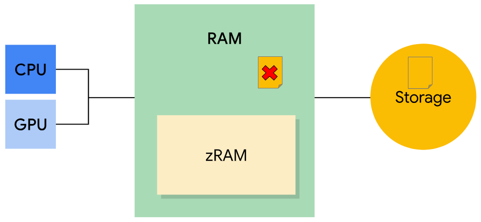

`kswapd` 可以将缓存的私有脏页和匿名脏页移动到 zRAM，在那里进行压缩。这样做可以释放 RAM（可用页）中的可用内存。如果进程试图访问 zRAM 中的脏页，则该页将被解压缩并移回 RAM 中。如果与压缩页面关联的进程被终止，那么该页面将从 zRAM 中删除。

如果可用内存低于某个阈值，系统将开始终止进程。图：Dirty page moved to zRAM and compressed

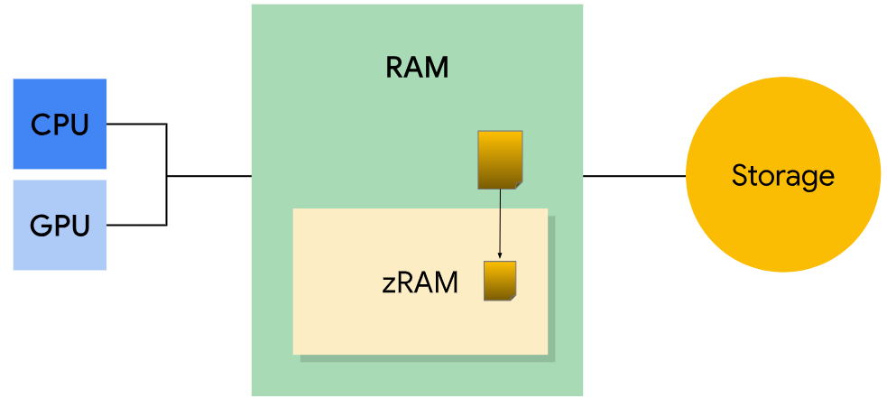

Low-memory killer。很多时候， `kswapd` 无法为系统释放足够的内存。该情况下，系统用于 `onTrimMemory()` 通知应用内存不足，并且应减少其分配。如果还不够，内核将开始终止进程以释放内存。它使用 low-memory killer（LMK） 来执行此操作。

为了决定要终止哪个进程，LMK 使用 `oom_adj_score` （“out of memory” score）来确定正在运行的进程的优先级。分数高的进程首先被终止。后台应用首先被终止，系统进程最后被终止。从高到低的 LMK 评分类别，如下：

- 后台应用：以前运行且当前未处于活动状态的应用。LMK 将首先杀死后台应用程序，具有最高 `oom_adj_score` 。
- 上一个应用：最近使用的后台应用。与后台应用相比，分数较低。
- Home app：这是启动器应用程序。杀死它将使壁纸消失。
- Services：Services 由应用启动，可能包括同步或上传到云。
- 可感知的应用：用户以某种方式可感知的非前台应用，例如运行显示小 UI 的搜索过程或听音乐。
- 前台应用：当前正在使用的应用。终止前台应用看起来像应用程序崩溃。
- 持久性（services）：设备的核心服务，例如电话和 wifi。
- System：系统进程。当这些进程被终止，手机可能会重启
- Native：系统使用的 low-level 进程，例如 kswapd

4、计算内存占用

在确定应用正在使用的内存量时，系统必须考虑共享页面。访问同一服务或库的应用将共享内存页面。例如，Google Play 服务和游戏应用可能共享位置信息服务。这使得很难确定与每个应用相比，有多少内存属于整个服务。

若要确定应用程序的内存占用，可以使用以下任何指标：

- 常驻集大小 Resident Set Size（RSS）：应用使用的共享和非共享页面数
- 比例集大小 Proportional Set Size（PSS）：应用使用的非共享页面数和共享页面的均匀分布（例如，如果三个进程共享 3MB，则每个进程在 PSS 中获取 1MB）
- 唯一集大小 Unique Set Size（USS）：应用使用的非共享页面数（不包括共享页面）

当操作系统想知道所有进程使用了多少内存时，PSS 对操作系统很有用，因为页面不会被多次计数。PSS 需要很长时间来计算，因为系统需要确定共享哪些页面以及共享多少个进程。RSS 不区分共享页面和非共享页面（使其计算速度更快），更适合跟踪内存分配的变化。

[Understanding Android memory usage - Google I/O presentation](https://www.youtube.com/watch?v=w7K0jio8afM)

[Android Low Memory Killer Daemon](https://android.googlesource.com/platform/system/memory/lmkd/+/master/README.md)

#### ③ 管理应用内存

需要避免引入内存泄漏（通常是在静态成员变量中持有对象引用引起的），并在生命周期回调定义的适当时间释放任何 `Reference` 对象。

1、监控可用内存和内存使用

- 释放内存以响应事件

[Inspect your app's memory usage with Memory Profiler](https://developer.android.com/studio/profile/memory-profiler)

为了帮助平衡系统内存并避免系统需要停止应用进程，可在 `Activity` 类中实现该 `ComponentCallbacks2` 接口。通过提供的 `onTrimMemory()` 回调方法，当应用处于前台或后台时，应用可以侦听与内存相关的事件。然后，它允许应用释放对象，以响应指示系统需要回收内存的应用生命周期或系统事件。

- 检查需要多少内存

为了允许多个运行进程，Android 对为每个应用分配的堆大小设置了硬性限制。如果应用达到堆容量并尝试分配更多内存，系统会抛出 `OutOfMemoryError` 。为避免内存不足，您可以查询系统以确定当前设备上有多少可用堆空间。您可以通过调用 `getMemoryInfo()` 来查询系统以获取此数字。

2、使用节省内存的代码构造

- 节约使用 services

  如果应用需要服务才能在后台运行，请不要让它保持运行状态，除非它需要运行作业。服务完成任务后停止服务。否则，可能会导致内存泄漏。

  避免使用持久性服务，因为它们会持续请求可用内存。建议使用替代实现，例如 `WorkManager` 。[Persistent work](https://developer.android.com/guide/background/persistent)

- 使用优化的数据容器

  编程语言提供的某些类未针对在移动设备上使用进行优化。例如，泛型 `HashMap` 实现的内存效率可能很低，因为它需要为每个映射提供单独的入口对象。

  Android 框架包含多个优化的数据容器，包括 `SparseArray` 、 `SparseBooleanArray` 和 `LongSparseArray` 。例如，这些 `SparseArray` 类效率更高，因为它们避免了系统对键的自动装箱需求，有时也避免了值的自动装箱需求，因为值会为每个条目创建另一个或两个对象。

- 避免 code abstractions

- 使用 protobufs 序列化数据

  [协议缓冲区 (protobuf) ](https://developers.google.com/protocol-buffers/docs/overview?hl=zh-cn)是 Google 设计的一种无关语言和平台且可扩展的机制，用于对结构化数据进行序列化。该机制与 XML 类似，但更小、更快也更简单。如果您要针对数据使用 protobuf，请始终在客户端代码中使用精简版 protobuf。常规 protobuf 会生成极其冗长的代码，这会导致应用出现许多问题，例如 RAM 使用量增多、APK 大小显著增加以及执行速度变慢。

- 避免内存抖动

  memory churn 会导致发生大量垃圾回收事件。例如，在循环 `for` 中分配多个临时对象。或者，在 View `onDraw()` 函数中创建新的 `Paint` 对象 `Bitmap` 或对象。在这两种情况下，应用都会以快速创建大量对象。这会迅速消耗 young generation 的所有可用内存，迫使发生垃圾回收事件。

  考虑将内容移出内部循环，或者将它们移入 [factory-based](https://en.wikipedia.org/wiki/Factory_method_pattern) 的分配结构中。还可以评估对象池是否有利于用例。借助对象池，您可以在不再需要某个对象实例时将其释放到池中，而不是将其丢弃。下次需要此类对象实例时，您可以从对象池中获取，而无需进行分配。

  全面评估性能，以确定某个对象池是否适合指定场景。某些情况下，对象池可能会导致性能下降。虽然对象池可以避免分配，但它们会产生其他开销。例如，维护对象池通常涉及到同步，这会产生较大开销。此外，在释放期间清除放入池中的对象实例（以免内存泄漏），然后在获取期间对其进行的初始化可能会产生一定的开销。

  在对象池中保留的对象实例数量超出所需也会给垃圾回收带来负担。尽管对象池可以减少垃圾回收调用次数，但最终会增加每次调用时所需完成的工作量，因为它与活跃（可访问的）字节数成比例。

  

3、移除占用大量内存的资源和库

代码中的某些资源和库可能会在您不知情的情况下消耗内存。应用的总体大小（包括第三方库或嵌入式资源）可能会影响应用的内存用量。可以通过从代码中移除冗余的组件、资源和库，降低应用的内存用量。

- 缩减 APK 大小

  通过缩减应用的总体大小来降低应用的内存用量。[Reduce your app size](https://developer.android.com/topic/performance/reduce-apk-size)

- 使用 Hilt 或 Dagger 2 实现依赖项注入

  依赖项注入框架可以简化您编写的代码，并提供便于您进行测试及其他配置更改的自适应环境。

  如果打算在应用中使用依赖项注入框架，请考虑使用 [Hilt](https://developer.android.com/training/dependency-injection/hilt-android?hl=zh-cn) 或 [Dagger](http://dagger.dev/)。Hilt 是 Android 的依赖项注入库，可在 Dagger 上运行。Dagger 不使用反射来扫描您应用的代码。您可以在 Android 应用中使用 Dagger 的静态编译时实现，而不会带来不必要的运行时开销或内存用量。

  其他使用反射的依赖项注入框架会通过扫描代码中的注释来初始化进程。此过程可能需要更多的 CPU 周期和 RAM，并可能在应用启动时导致明显的延迟。

- 谨慎使用外部库

  外部库代码通常不是针对移动环境编写的，在移动客户端上运行时效率可能并不高

#### ④ 进程和线程

当应用组件启动时，如果应用没有运行任何其他组件，Android 系统会使用单个执行线程为应用启动新的 Linux 进程。默认情况下，同一应用的所有组件都在同一进程和线程（称为主线程）中运行。

1、进程

`android:process` 属性，该属性可指定运行组件的进程。可以设置该属性，让每个组件都在自己的进程中运行，或者使一些组件共享一个进程，而其他组件不共享。

[进程和应用生命周期](https://developer.android.com/guide/topics/processes/process-lifecycle?hl=zh-cn)

2、线程

应用启动时，系统会为应用创建一个执行线程，称为“主线程”。此线程负责将事件分派给相应的界面 widget，包括绘图事件。它几乎始终是应用与 Android 的 `android.widget` 和 `android.view` 包中的组件进行交互的线程。主线程有时称为 UI 线程。不过，在特殊情况下，应用的主线程可能并不是其 UI 线程。参阅[线程注解](https://developer.android.com/studio/write/annotations?hl=zh-cn#thread-annotations)。

Android UI toolkit 不是线程安全的。不要从工作线程操作 UI。Android 的单线程模型有两条规则：

1. 不要阻塞 UI 线程。
2. 不要从 UI 线程外部访问 Android UI toolkit。

工作线程

不阻塞 UI 线程对于应用程序 UI 的响应能力至关重要。如果要执行的操作不是即时的，请在单独的后台或工作线程中执行这些操作。记住，不能从 UI 或主线程以外的任何线程更新 UI。

Android 提供了多种从其他线程访问界面线程的方法：

- `Activity.runOnUiThread(Runnable)`
- `View.post(Runnable)`
- `View.postDelayed(Runnable, long)`

若要处理与工作线程的复杂的交互，考虑在工作线程中使用处理 `Handler` 从 UI 线程传递的消息。后台线程上计划工作以及与 UI 线程通信，[Background Work Overview](https://developer.android.com/training/multiple-threads)

线程安全方法

某些情况下，实现的方法是从多个线程调用的，因此必须编写为线程安全的方法。

这主要适用于可以远程调用的方法，如[绑定服务](https://developer.android.com/guide/components/bound-services?hl=zh-cn)中的方法。如果对 `IBinder` 中实现的方法的调用源自运行 `IBinder` 的同一进程，则系统会在调用方的线程中执行该方法。不过，当调用源自另一个进程时，该方法会在从系统与 `IBinder` 在同一进程中维护的线程池中选择的线程中执行。它不会在进程的 UI 线程中执行。

例如，虽然从服务进程的界面线程调用服务的 `onBind()` 方法，但在 `onBind()` 返回的对象中实现的方法（例如实现远程过程调用 (RPC) 方法的子类）是从池中的线程调用的。由于一项服务可以有多个客户端，因此多个池线程可同时使用同一 `IBinder` 方法，因此 `IBinder` 方法必须实现为线程安全的。

同样，content provider 可以接收源自其他进程的数据请求。`ContentResolver` 和 `ContentProvider` 类会隐藏关于进程间通信 (IPC) 如何管理的详细信息，但响应这些请求的 `ContentProvider` 方法（`query()`、`insert()`、`delete()`、`update()` 和 `getType()` 方法）是从 content provider 进程中的线程池调用的，而不是从进程的界面线程中调用的。由于这些方法可能会同时从任意数量的线程调用，因此它们也必须实现为线程安全方法。

3、进程间通信

Android 提供了一种使用 RPC 的 IPC 机制。在这种机制中，一个方法被 activity 或其他应用组件调用，但在另一个进程中远程执行，系统会将所有结果返回给调用方。这需要将方法调用及其数据分解到操作系统可以理解的级别，将其从本地进程和地址空间传输到远程进程和地址空间，然后在远程进程和地址空间中重新组装和执行该调用。

然后，返回值将沿相反方向传输。Android 提供了执行这些 IPC 事务的所有代码，因此您可以专注于定义和实现 RPC 编程接口。

如需执行 IPC，必须使用 `bindService()` 将应用绑定到服务。如需了解详情，请参阅[服务概览](https://developer.android.com/guide/components/services?hl=zh-cn)。

### 5）电池电量

### 6）减小应用大小

### 7）硬件加速

View‘s canvas 执行的所有绘图操作都使用 GPU。由于启用硬件加速所需的资源增加，应用将消耗更多 RAM。

默认启用硬件加速。并非所有 2D 绘制操作都支持硬件加速，因此启用硬件加速可能会影响部分自定义视图或绘制调用。具体问题通常以不可见的元素、异常或错误渲染的像素出现。为了解决此问题，Android 允许您在多个级别选择是启用还是停用硬件加速。

1、控制硬件加速

可以在以下级别控制硬件加速：

- Application
- Activity
- Window
- View

2、决定 View 是否硬件加速

应用有必要了解当前是否经过硬件加速，尤其是对于自定义视图等内容。如果应用执行大量自定义绘制，但并非所有操作都得到新渲染管道的正确支持，这会特别有用。

3、Andorid drawing models

启用硬件加速后，Android 框架会使用新的绘图模型

基于软件的绘图模型，绘制视图分为以下两步：

1. invalidate 层次结构
2. 绘制层次结构

每当应用需要更新其界面的一部分时，就会对内容已发生更改的所有视图调用 `invalidate()`。invalidate 消息会一直传播到视图层次结构上层，以计算需要重新绘制的屏幕区域（脏区域）。然后，Android 系统会绘制层次结构中与脏区域交互的所有视图。这种绘制模型具有以下两个缺点：

- 第一，该模型每次绘制时都需要执行大量代码。例如，如果应用对某个按钮调用 `invalidate()` 且该按钮位于另一个视图上方，那么即使该视图未发生更改，Android 系统仍会重新绘制该视图。
- 第二，该绘制模型会隐藏应用中的 bug。由于 Android 系统会在视图与脏区域交互时重新绘制视图，因此即使未对其调用 `invalidate()` 也可能会重新绘制内容发生更改的视图。发生这种情况，您要依赖其他 invalidate 的视图才能获得正确的行为。每次修改应用时，此行为都可能会发生更改。因此，每次修改会影响视图绘制代码的数据或状态后，您都要对自定义 view 调用 `invalidate()`。

Android 视图会在其属性（例如 `TextView` 中的背景颜色或文本）发生更改时自动调用 `invalidate()`。

硬件加速绘图模型

Android 系统仍会使用 `invalidate()` 和 `draw()` 请求屏幕更新和渲染视图，但对实际绘图的处理方式不同。Android 系统不会立即执行绘制命令，而是将这些命令记录在显示列表中，这些列表中包含视图层次结构绘制代码的输出。另一项优化是，Android 系统只需要记录和更新被 `invalidate()` 调用标记为脏视图的视图的显示列表。未 invalidate 的视图只需重新发出先前记录的显示列表即可重新绘制。新的绘图模型包含三个阶段：

1. invalidate 层次结构
2. 记录并更新显示列表
3. 绘制显示列表

使用此模型时，您无法依赖与脏区域交互的视图来执行其 `draw()` 方法。要确保 Android 系统会记录视图的显示列表，您必须调用 `invalidate()`。如果忘记执行此操作，则视图在发生更改后看起来仍然没有变化。

使用 display lists 还有助于改进动画性能，因为设置特定属性（例如 Alpha 或旋转）不需要对目标视图进行无效化处理（该操作是自动完成的）。这项优化还适用于具有显示列表的视图（如果应用经过硬件加速，则适用于所有视图）。例如，假设有一个 `LinearLayout`，其中包含一个`ListView`（位于 `Button` 之上）。`LinearLayout` 的显示列表如下所示：

- DrawDisplayList(ListView)
- DrawDisplayList(Button)

假设现在要更改 `ListView` 的不透明度。在对 `ListView` 调用 `setAlpha(0.5f)` 后，显示列表现在包含以下内容：

- SaveLayerAlpha(0.5)
- DrawDisplayList(ListView)
- Restore
- DrawDisplayList(Button)

系统没有执行 `ListView` 的复杂绘制代码，而是仅更新了更为简单的 `LinearLayout` 的显示列表。在未启用硬件加速的应用中，系统会再次执行列表及其父级的绘制代码。

4、支持绘图操作

经过硬件加速后，2D 渲染管道支持最常用的 `Canvas` 绘制操作以及很多不太常用的操作。用于渲染 Android 系统内置应用、默认 widget 和布局以及常见的高级视觉效果（例如反射和平铺纹理）的所有绘制操作均受到支持。

各种操作在各个 API 级别的支持级别。如果缺失以上任意功能或限制会对您的应用造成影响，您可以调用 `setLayerType(View.LAYER_TYPE_SOFTWARE, null)`，仅针对应用中受影响的部分关闭硬件加速。这样一来，您仍能针对其余任何部分利用硬件加速。

5、View layers

views 可以渲染到屏幕外缓冲区：使用 view 的绘制缓存或使用 `Canvas.saveLayer()`。屏幕外缓冲区具有多种用途。在为复杂的视图添加动画效果或应用合成效果时，可以使用屏幕外缓冲区获得更好效果。例如，您可以使用 `Canvas.saveLayer()` 实现淡入淡出效果，以将视图暂时渲染到层，然后使用不透明度系数将其合成回屏幕上。

可以通过 `View.setLayerType()` 方法更好地控制使用图层。该 API 需要 2 个参数：要使用的层类型以及描述层应如何合成的可选 `Paint` 对象。您可以使用 `Paint` 参数向层应用颜色滤镜、特殊混合模式或不透明度。视图可以使用以下三种层类型之一：

- `LAYER_TYPE_NONE`：视图正常渲染，不受屏幕外缓冲区支持。这是默认行为。
- `LAYER_TYPE_HARDWARE`：如果应用经过硬件加速，视图在硬件中渲染为硬件纹理。如果应用未经过硬件加速，此层类型的行为方式与 `LAYER_TYPE_SOFTWARE` 相同。
- `LAYER_TYPE_SOFTWARE`：视图在软件中渲染为位图。

要使用何种层类型取决于您的目标：

- **性能**：使用硬件层类型可将视图渲染为硬件纹理。将视图渲染为层后，在该视图调用 `invalidate()` 之前，无需执行其绘制代码。然后，可将 Alpha 动画等部分动画直接应用到层，GPU 可非常高效地完成此操作。

- **视觉效果**：使用硬件层或软件层类型和 `Paint` 可将特殊视觉处理应用到视图。例如，您可以使用 `ColorMatrixColorFilter` 绘制黑白视图。

- **兼容性**：使用软件层类型可强制在软件中渲染视图。如果经过硬件加速的视图（例如，如果整个应用都经过硬件加速）遇到渲染问题，采用这种方法可轻松解决硬件渲染管道的局限性。

  

View layers and animations

如果应用经过硬件加速，硬件层能够提供更快更顺畅的动画。在为需要发出大量绘制操作的复杂视图添加动画效果时，以 60 帧/秒的速度运行动画并非总能实现。使用硬件层将视图渲染为硬件纹理可在一定程度上解决此问题。然后，硬件纹理可用于为视图添加动画效果，这样视图在动画效果添加过程中无需不断自行重新绘制。除非您更改视图的属性（这会调用 `invalidate()`），或者手动调用 `invalidate()`，否则系统不会重新绘制视图。如果应用动画不流畅，考虑对添加动画效果之后的视图启用硬件层。

如果视图由硬件层提供支持，则其部分属性可通过在屏幕上合成层的方式处理。设置这些属性有助于提高效率，因为它们不需要先对视图进行无效化处理后再重新绘制。

由于硬件层会占用视频内存，因此强烈建议您仅在动画播放期间启用，然后在动画结束后停用。您可以使用动画监听器完成此操作。参阅[属性动画](https://developer.android.com/guide/topics/graphics/prop-animation?hl=zh-cn)。

6、tips

切换到硬件加速的 2D 图形可立即提升性能，但应按照以下建议，以便有效利用 GPU：

- 减少 view 数量

- 避免过度绘制

- 不要在 draw 方法创建 render objects

  常见的错误是，每次调用渲染方法时都创建新的 `Paint` 或 `Path`。这会强制垃圾回收器频繁运行，同时还会绕过硬件管道中的缓存和优化。

- 不要频繁修改形状

- 不要频繁修改位图

- 谨慎使用 alpha

### 8）SQLite 最佳实践

## 4、最佳实践

# 三、性能监控

[Android Vitals](https://developer.android.com/topic/performance/vitals?hl=zh-cn)

[Firebase Performance Monitoring](https://firebase.google.com/docs/perf-mon?hl=zh-cn)

 [JankStats 库](https://developer.android.com/topic/performance/jankstats?hl=zh-cn)，跟踪和分析应用中呈现速度缓慢的帧，并针对影响用户的卡顿问题生成统计信息报告。

持续集成，在 CI 流水线中运行基准测试，以便跟踪性能随时间变化情况，并在向用户推送更新之前先一步洞察性能下降或提升情况。。[持续集成环境中的基准测试](https://developer.android.com/topic/performance/benchmarking/benchmarking-in-ci?hl=zh-cn)

