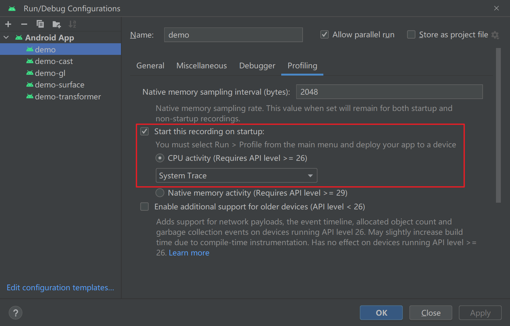

[应用性能指南](https://developer.android.com/topic/performance/overview?hl=zh-cn)

# Inspecting performance

检查性能着重点：

- 应用启动
- 卡顿（Slow rendering、jank）
- 屏幕转换和导航事件
- 长时间运行的工作
- 后台操作（如 I/O、网络）

## Manual inspection

[Quickstart: Record traces on Android](https://perfetto.dev/docs/quickstart/android-tracing)

[Overview of system tracing](https://developer.android.com/topic/performance/tracing)

## Automated testing

除了人工检查外，还可以通过自动话测试来收集和汇总性能数据。可帮助用户查看和确定何时可能衰退。 

[Benchmark your app](https://developer.android.com/topic/performance/benchmarking/benchmarking-overview)

## App startup performance

### Benchmark libraries 了解本地性能

- [Macrobenchmark 库](https://developer.android.com/topic/performance/benchmarking/macrobenchmark-overview?hl=zh-cn)可帮助测量更大规模的最终用户互动，例如启动、与界面的互动和动画。
- [Microbenchmark 库](https://developer.android.com/topic/performance/benchmarking/microbenchmark-overview?hl=zh-cn)可帮助分析更精细的应用特定情形下的性能。

### 了解生产环境性能

- [Android Vitals](https://developer.android.com/topic/performance/vitals?hl=zh-cn) 可以在各种性能指标超出预定阈值时提醒您，从而帮助您提升应用性能。
- [Firebase 性能 SDK](https://firebase.google.com/docs/perf-mon/get-started-android?hl=zh-cn) 会收集有关应用性能的各种指标。例如，可以使用该 SDK 测量从用户打开应用到应用进入响应状态所用的时间，这有助于发现潜在的启动瓶颈。

### Android Studio 本地性能分析

[Record traces](https://developer.android.com/studio/profile/record-traces)

[Simpleperf](https://android.googlesource.com/platform/system/extras/+/master/simpleperf/doc/README.md), native 堆栈采样工具，分析 Android 应用程序和 Android 上运行的 native  进程。它可以分析 Android 上的 Java 和 C++ 代码。

### Perfetto trace

[overview of Perfetto traces](https://perfetto.dev/docs/)

[Run Perfetto using `adb`](https://developer.android.com/studio/command-line/perfetto)

[Recording a trace through the cmdline](https://perfetto.dev/docs/quickstart/android-tracing#recording-a-trace-through-the-cmdline)

[Perfetto web-based trace viewer](https://perfetto.dev/docs/quickstart/android-tracing#recording-a-trace-through-the-perfetto-ui)

# Improving performance

# Monitoring performance