[App performance guide | Android Developers](https://developer.android.com/topic/performance/overview)

[Category: Android:Performance - 胡凯 (kesenhoo.github.io)](https://kesenhoo.github.io/blog/categories/android-performance/)

[Android性能优化典范——渲染篇. 2015年年初，Google官方在Youtube上发布了一系列的Android性… | by seanutf | Medium](https://medium.com/@seanutf/android性能优化典范-渲染篇-c73b63536d58)

[Performance - MAD Skills - YouTube](https://www.youtube.com/playlist?list=PLWz5rJ2EKKc9T9fxvsrbzg_mflg2EYLZk)

# Render

## 0. Render Performance

大多数用户感知到的卡顿等性能问题的最主要根源都是因为渲染性能。从设计师的角度，他们希望App能够有更多的动画，图片等时尚元素来实现流畅的用户体验。但是Android系统很有可能无法及时完成那些复杂的界面渲染操作。Android系统每隔16ms发出VSYNC信号，触发对UI进行渲染，如果每次渲染都成功，这样就能够达到流畅的画面所需要的60fps，为了能够实现60fps，这意味着程序的大多数操作都必须在16ms内完成。

如果你的某个操作花费时间是24ms，系统在得到VSYNC信号的时候就无法进行正常渲染，这样就发生了丢帧现象。那么用户在32ms内看到的会是同一帧画面。

用户容易在UI执行动画或者滑动ListView的时候感知到卡顿不流畅，是因为这里的操作相对复杂，容易发生丢帧的现象，从而感觉卡顿。有很多原因可以导致丢帧，也许是因为你的layout太过复杂，无法在16ms内完成渲染，有可能是因为你的UI上有层叠太多的绘制单元，还有可能是因为动画执行的次数过多。这些都会导致CPU或者GPU负载过重。

我们可以通过一些工具来定位问题，比如可以使用HierarchyViewer来查找Activity中的布局是否过于复杂，也可以使用手机设置里面的开发者选项，打开Show GPU Overdraw等选项进行观察。你还可以使用TraceView来观察CPU的执行情况，更加快捷的找到性能瓶颈。

## 1. Understanding Overdraw

Overdraw(过度绘制)描述的是屏幕上的某个像素在同一帧的时间内被绘制了多次。在多层次的UI结构里面，如果不可见的UI也在做绘制的操作，这就会导致某些像素区域被绘制了多次。这就浪费大量的CPU以及GPU资源。

当设计上追求更华丽的视觉效果的时候，我们就容易陷入采用越来越多的层叠组件来实现这种视觉效果的怪圈。这很容易导致大量的性能问题，为了获得最佳的性能，我们必须尽量减少Overdraw的情况发生。

我们可以通过手机设置里面的开发者选项，打开Show GPU Overdraw的选项，可以观察UI上的Overdraw情况。尽量减少红色Overdraw，看到更多的蓝色区域。

Overdraw有时候是因为你的UI布局存在大量重叠的部分，还有的时候是因为非必须的重叠背景。例如某个Activity有一个背景，然后里面的Layout又有自己的背景，同时子View又分别有自己的背景。仅仅是通过移除非必须的背景图片，这就能够减少大量的红色Overdraw区域，增加蓝色区域的占比。这一措施能够显著提升程序性能。

优化步骤如下：

- 移除Window默认的Background
- 移除XML布局文件中非必需的Background
- 按需显示占位背景图片

## 2. Understanding VSYNC

为了理解App是如何进行渲染的，我们必须了解手机硬件是如何工作，那么就必须理解什么是*VSYNC*。

在讲解VSYNC之前，我们需要了解两个相关的概念：

- Refresh Rate：代表了屏幕在一秒内刷新屏幕的次数，这取决于硬件的固定参数，例如60Hz。
- Frame Rate：代表了GPU在一秒内绘制操作的帧数，例如30fps，60fps。

GPU会获取图形数据进行渲染，然后硬件负责把渲染后的内容呈现到屏幕上，他们两者不停的进行协作。

不幸的是，刷新频率和帧率并不是总能够保持相同的节奏。如果发生帧率与刷新频率不一致的情况，就会容易出现**Tearing**的现象(画面上下两部分显示内容发生断裂，来自不同的两帧数据发生重叠)。

理解图像渲染里面的双重与三重缓存机制，这个概念比较复杂，请移步查看这里：http://source.android.com/devices/graphics/index.html，还有这里http://article.yeeyan.org/view/37503/304664。

通常来说，帧率超过刷新频率只是一种理想的状况，在超过60fps的情况下，GPU所产生的帧数据会因为等待VSYNC的刷新信息而被Hold住，这样能够保持每次刷新都有实际的新的数据可以显示。但是我们遇到更多的情况是帧率小于刷新频率。

在这种情况下，某些帧显示的画面内容就会与上一帧的画面相同。糟糕的事情是，帧率从超过60fps突然掉到60fps以下，这样就会发生**LAG**，**JANK**，**HITCHING**等卡顿掉帧的不顺滑的情况。这也是用户感受不好的原因所在。

## 3. Tool: Profile GPU Rendering

性能问题如此的麻烦，幸好我们可以有工具来进行调试。打开手机里面的开发者选项，选择Profile GPU Rendering，选中On screen as bars的选项。

选择了这样以后，我们可以在手机画面上看到丰富的GPU绘制图形信息，分别关于StatusBar，NavBar，激活的程序Activity区域的GPU Rending信息。

随着界面的刷新，界面上会滚动显示垂直的柱状图来表示每帧画面所需要渲染的时间，柱状图越高表示花费的渲染时间越长。

中间有一根绿色的横线，代表16ms，我们需要确保每一帧花费的总时间都低于这条横线，这样才能够避免出现卡顿的问题。

每一条柱状线都包含三部分，蓝色代表测量绘制Display List的时间，红色代表OpenGL渲染Display List所需要的时间，黄色代表CPU等待GPU处理的时间。

## 4. Why 60fps?

通常都会提到60fps与16ms，可是知道为何会是以程序是否达到60fps来作为App性能的衡量标准吗？这是因为人眼与大脑之间的协作无法感知超过60fps的画面更新。

开发app的性能目标就是保持60fps，这意味着每一帧你只有16ms=1000/60的时间来处理所有的任务。

## 5. Android, UI and the GPU

了解Android是如何利用GPU进行画面渲染有助于我们更好的理解性能问题。那么一个最实际的问题是：activity的画面是如何绘制到屏幕上的？那些复杂的XML布局文件又是如何能够被识别并绘制出来的？

**Resterization栅格化**是绘制那些Button，Shape，Path，String，Bitmap等组件最基础的操作。它把那些组件拆分到不同的像素上进行显示。这是一个很费时的操作，GPU的引入就是为了加快栅格化的操作。

CPU负责把UI组件计算成Polygons，Texture纹理，然后交给GPU进行栅格化渲染。

然而每次从CPU转移到GPU是一件很麻烦的事情，所幸的是OpenGL ES可以把那些需要渲染的纹理Hold在GPU Memory里面，在下次需要渲染的时候直接进行操作。所以如果你更新了GPU所hold住的纹理内容，那么之前保存的状态就丢失了。

在Android里面那些由主题所提供的资源，例如Bitmaps，Drawables都是一起打包到统一的Texture纹理当中，然后再传递到GPU里面，这意味着每次你需要使用这些资源的时候，都是直接从纹理里面进行获取渲染的。当然随着UI组件的越来越丰富，有了更多演变的形态。例如显示图片的时候，需要先经过CPU的计算加载到内存中，然后传递给GPU进行渲染。文字的显示更加复杂，需要先经过CPU换算成纹理，然后再交给GPU进行渲染，回到CPU绘制单个字符的时候，再重新引用经过GPU渲染的内容。动画则是一个更加复杂的操作流程。

为了能够使得App流畅，我们需要在每一帧16ms以内处理完所有的CPU与GPU计算，绘制，渲染等等操作。

## 6. Invalidations, Layouts, and Performance

顺滑精妙的动画是app设计里面最重要的元素之一，这些动画能够显著提升用户体验。下面会讲解Android系统是如何处理UI组件的更新操作的。

通常来说，Android需要把XML布局文件转换成GPU能够识别并绘制的对象。这个操作是在**DisplayList**的帮助下完成的。DisplayList持有所有将要交给GPU绘制到屏幕上的数据信息。

在某个View第一次需要被渲染时，DisplayList会因此而被创建，当这个View要显示到屏幕上时，我们会执行GPU的绘制指令来进行渲染。如果你在后续有执行类似移动这个View的位置等操作而需要再次渲染这个View时，我们就仅仅需要额外操作一次渲染指令就够了。然而如果你修改了View中的某些可见组件，那么之前的DisplayList就无法继续使用了，我们需要回头重新创建一个DisplayList并且重新执行渲染指令并更新到屏幕上。

需要注意的是：任何时候View中的绘制内容发生变化时，都会重新执行创建DisplayList，渲染DisplayList，更新到屏幕上等一系列操作。这个流程的表现性能取决于你的View的复杂程度，View的状态变化以及渲染管道的执行性能。举个例子，假设某个Button的大小需要增大到目前的两倍，在增大Button大小之前，需要通过父View重新计算并摆放其他子View的位置。修改View的大小会触发整个HierarcyView的重新计算大小的操作。如果是修改View的位置则会触发HierarchView重新计算其他View的位置。如果布局很复杂，这就会很容易导致严重的性能问题。我们需要尽量减少Overdraw。

可以通过前面介绍的Monitor GPU Rendering来查看渲染的表现性能如何，另外也可以通过开发者选项里面的Show GPU view updates来查看视图更新的操作，最后我们还可以通过HierarchyViewer这个工具来查看布局，使得布局尽量扁平化，移除非必需的UI组件，这些操作能够减少Measure，Layout的计算时间。

## 7. Overdraw, Cliprect, QuickReject

引起性能问题的一个很重要的方面是因为过多复杂的绘制操作。我们可以通过工具来检测并修复标准UI组件的Overdraw问题，但是针对高度自定义的UI组件则显得有些力不从心。

有一个窍门是我们可以通过执行几个APIs方法来显著提升绘制操作的性能。前面有提到过，非可见的UI组件进行绘制更新会导致Overdraw。例如Nav Drawer从前置可见的Activity滑出之后，如果还继续绘制那些在Nav Drawer里面不可见的UI组件，这就导致了Overdraw。为了解决这个问题，Android系统会通过避免绘制那些完全不可见的组件来尽量减少Overdraw。那些Nav Drawer里面不可见的View就不会被执行浪费资源。

不幸的是，对于那些过于复杂的自定义的View(重写了onDraw方法)，Android系统无法检测具体在onDraw里面会执行什么操作，系统无法监控并自动优化，也就无法避免Overdraw了。但是我们可以通过[canvas.clipRect()](http://developer.android.com/reference/android/graphics/Canvas.html)来帮助系统识别那些可见的区域。这个方法可以指定一块矩形区域，只有在这个区域内才会被绘制，其他的区域会被忽视。这个API可以很好的帮助那些有多组重叠组件的自定义View来控制显示的区域。同时clipRect方法还可以帮助节约CPU与GPU资源，在clipRect区域之外的绘制指令都不会被执行，那些部分内容在矩形区域内的组件，仍然会得到绘制。

除了clipRect方法之外，我们还可以使用[canvas.quickreject()](http://developer.android.com/reference/android/graphics/Canvas.html)来判断是否没和某个矩形相交，从而跳过那些非矩形区域内的绘制操作。做了那些优化之后，我们可以通过上面介绍的Show GPU Overdraw来查看效果。

## 8. Hidden Cost of Transparency

减少透明区域对性能的影响。通常来说，对于不透明的View，显示它只需要渲染一次即可，可是如果这个View设置了alpha值，会至少需要渲染两次。原因是包含alpha的view需要事先知道混合View的下一层元素是什么，然后再结合上层的View进行Blend混色处理。

在某些情况下，一个包含alpha的View有可能会触发改View在HierarchyView上的父View都被额外重绘一次。看一个例子，下图演示的ListView中的图片与二级标题都有设置透明度。

大多数情况下，屏幕上的元素都是由后向前进行渲染的。在上面的图示中，会先渲染背景图(蓝，绿，红)，然后渲染人物头像图。如果后渲染的元素有设置alpha值，那么这个元素就会和屏幕上已经渲染好的元素做blend处理。很多时候，我们会给整个View设置alpha的来达到fading的动画效果，如果我们图示中的ListView做alpha逐渐减小的处理，我们可以看到ListView上的TextView等等组件会逐渐融合到背景色上。但是在这个过程中，我们无法观察到它其实已经触发了额外的绘制任务，我们的目标是让整个View逐渐透明，可是期间ListView在不停的做Blending的操作，这样会导致不少性能问题。

如何渲染才能够得到我们想要的效果呢？我们可以先按照通常的方式把View上的元素按照从后到前的方式绘制出来，但是不直接显示到屏幕上，而是使用GPU预处理之后，再又GPU渲染到屏幕上，GPU可以对界面上的原始数据直接做旋转，设置透明度等等操作。使用GPU进行渲染，虽然第一次操作相比起直接绘制到屏幕上更加耗时，可是一旦原始纹理数据生成之后，接下去的操作就比较省时省力。

如何才能够让GPU来渲染某个View呢？我们可以通过setLayerType的方法来指定View应该如何进行渲染，从SDK 16开始，我们还可以使用ViewPropertyAnimator.alpha().withLayer()来指定。

另外一个例子是包含阴影区域的View，这种类型的View并不会出现我们前面提到的问题，因为他们并不存在层叠的关系。

为了能够让渲染器知道这种情况，避免为这种View占用额外的GPU内存空间，我们可以做下面的设置。

通过上面的设置以后，性能可以得到显著的提升，如下图所示：

## 9. Custom Views and Performance

在某些时候，这些标准的View无法满足我们的需要，那么就需要我们自己来实现一个View，这节会介绍如何优化自定义View的性能。

通常来说，针对自定义View，我们可能犯下面三个错误：

- **Useless calls to onDraw()：**我们知道调用View.invalidate()会触发View的重绘，有两个原则需要遵守，第1个是仅仅在View的内容发生改变的时候才去触发invalidate方法，第2个是尽量使用ClipRect等方法来提高绘制的性能。
- **Useless pixels：**减少绘制时不必要的绘制元素，对于那些不可见的元素，我们需要尽量避免重绘。
- **Wasted CPU cycles：**对于不在屏幕上的元素，可以使用Canvas.quickReject把他们给剔除，避免浪费CPU资源。另外尽量使用GPU来进行UI的渲染，这样能够极大的提高程序的整体表现性能。

最后请时刻牢记，尽量提高View的绘制性能，这样才能保证界面的刷新帧率尽量的高。

## 10. Double Layout Taxation

布局中的任何一个View一旦发生一些属性变化，都可能引起很大的连锁反应。例如某个button的大小突然增加一倍，有可能会导致兄弟视图的位置变化，也有可能导致父视图的大小发生改变。当大量的layout()操作被频繁调用执行的时候，就很可能引起丢帧的现象。

在RelativeLayout中，我们通常会定义一些类似alignTop，alignBelow等等属性。

为了获得视图的准确位置，需要经过下面几个阶段。首先子视图会触发计算自身位置的操作，然后RelativeLayout使用前面计算出来的位置信息做边界的调整的操作，如下面两张图所示：

经历过上面2个步骤，relativeLayout会立即触发第二次layout()的操作来确定所有子视图的最终位置与大小信息。

除了RelativeLayout会发生两次layout操作之外，LinearLayout也有可能触发两次layout操作，通常情况下LinearLayout只会发生一次layout操作，可是一旦调用了measureWithLargetChild()方法就会导致触发两次layout的操作。另外，通常来说，GridLayout会自动预处理子视图的关系来避免两次layout，可是如果GridLayout里面的某些子视图使用了weight等复杂的属性，还是会导致重复的layout操作。

如果只是少量的重复layout本身并不会引起严重的性能问题，但是如果它们发生在布局的根节点，或者是ListView里面的某个ListItem，这样就会引起比较严重的性能问题。如下图所示：

可以使用Systrace来跟踪特定的某段操作，如果发现了疑似丢帧的现象，可能就是因为重复layout引起的。通常我们无法避免重复layout，在这种情况下，我们应该尽量保持View Hierarchy的层级比较浅，这样即使发生重复layout，也不会因为布局的层级比较深而增大了重复layout的倍数。另外还有一点需要特别注意，在任何时候都请避免调用**requestLayout()**的方法，因为一旦调用了requestLayout，会导致该layout的所有父节点都发生重新layout的操作。

## 11. Threading Performance

开发的实践当中，为了让程序表现得更加流畅，我们肯定会需要使用到多线程来提升程序的并发执行性能。但是编写多线程并发的代码一直以来都是一个相对棘手的问题，所以想要获得更佳的程序性能，我们非常有必要掌握多线程并发编程的基础技能。

众所周知，Android程序的大多数代码操作都必须执行在主线程，例如系统事件(例如设备屏幕发生旋转)，输入事件(例如用户点击滑动等)，程序回调服务，UI绘制以及闹钟事件等等。那么我们在上述事件或者方法中插入的代码也将执行在主线程。

一旦我们在主线程里面添加了操作复杂的代码，这些代码就很可能阻碍主线程去响应点击/滑动事件，阻碍主线程的UI绘制等等。我们知道，为了让屏幕的刷新帧率达到60fps，我们需要确保16ms内完成单次刷新的操作。一旦我们在主线程里面执行的任务过于繁重就可能导致接收到刷新信号的时候因为资源被占用而无法完成这次刷新操作，这样就会产生掉帧的现象，刷新帧率自然也就跟着下降了(一旦刷新帧率降到20fps左右，用户就可以明显感知到卡顿不流畅了)。

为了避免上面提到的掉帧问题，我们需要使用多线程的技术方案，把那些操作复杂的任务移动到其他线程当中执行，这样就不容易阻塞主线程的操作，也就减小了出现掉帧的可能性。

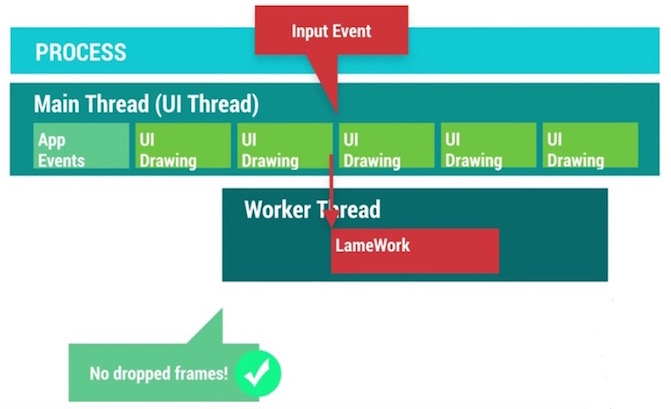

为主线程减轻负的多线程方案有哪些呢？这些方案分别适合在什么场景下使用？Android系统为我们提供了若干组工具类来帮助解决这个问题。

- **AsyncTask**: 为UI线程与工作线程之间进行快速的切换提供一种简单便捷的机制。适用于当下立即需要启动，但是异步执行的生命周期短暂的使用场景。
- **HandlerThread**: 为某些回调方法或者等待某些任务的执行设置一个专属的线程，并提供线程任务的调度机制。
- **ThreadPool**: 把任务分解成不同的单元，分发到各个不同的线程上，进行同时并发处理。
- **IntentService**: 适合于执行由UI触发的后台Service任务，并可以把后台任务执行的情况通过一定的机制反馈给UI。

了解这些系统提供的多线程工具类分别适合在什么场景下，可以帮助我们选择合适的解决方案，避免出现不可预期的麻烦。虽然使用多线程可以提高程序的并发量，但是我们需要特别注意因为引入多线程而可能伴随而来的内存问题。举个例子，在Activity内部定义的一个AsyncTask，它属于一个内部类，该类本身和外面的Activity是有引用关系的，如果Activity要销毁的时候，AsyncTask还仍然在运行，这会导致Activity没有办法完全释放，从而引发内存泄漏。所以说，多线程是提升程序性能的有效手段之一，但是使用多线程却需要十分谨慎小心，如果不了解背后的执行机制以及使用的注意事项，很可能引起严重的问题。

### 1）Understanding Android Threading

通常来说，一个线程需要经历三个生命阶段：开始，执行，结束。线程会在任务执行完毕之后结束，那么为了确保线程的存活，我们会在执行阶段给线程赋予不同的任务，然后在里面添加退出的条件从而确保任务能够执行完毕后退出。

在很多时候，线程不仅仅是线性执行一系列的任务就结束那么简单的，我们会需要增加一个任务队列，让线程不断的从任务队列中获取任务去进行执行，另外我们还可能在线程执行的任务过程中与其他的线程进行协作。如果这些细节都交给我们自己来处理，这将会是件极其繁琐又容易出错的事情。

所幸的是，Android系统为我们提供了Looper，Handler，MessageQueue来帮助实现上面的线程任务模型：

**Looper**: 能够确保线程持续存活并且可以不断的从任务队列中获取任务并进行执行。

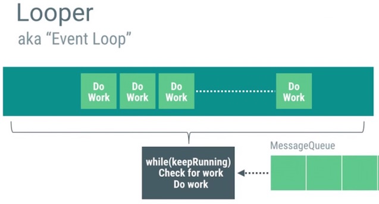

**Handler**: 能够帮助实现队列任务的管理，不仅仅能够把任务插入到队列的头部，尾部，还可以按照一定的时间延迟来确保任务从队列中能够来得及被取消掉。

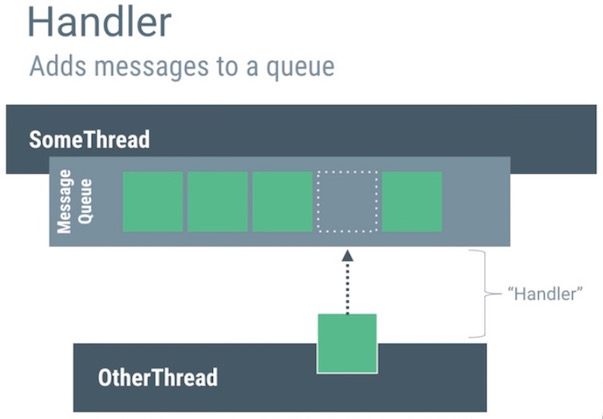

**MessageQueue**: 使用Intent，Message，Runnable作为任务的载体在不同的线程之间进行传递。

把上面三个组件打包到一起进行协作，这就是**HandlerThread**

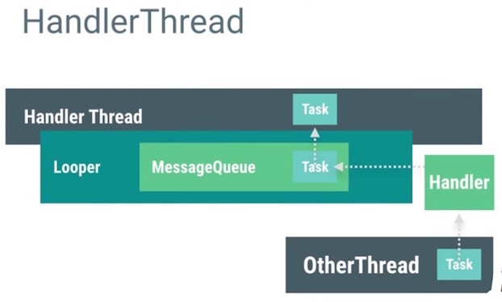

我们知道，当程序被启动，系统会帮忙创建进程以及相应的主线程，而这个主线程其实就是一个HandlerThread。这个主线程会需要处理系统事件，输入事件，系统回调的任务，UI绘制等等任务，为了避免主线程任务过重，我们就会需要不断的开启新的工作线程来处理那些子任务。

### 2）Memory & Threading

增加并发的线程数会导致内存消耗的增加，平衡好这两者的关系是非常重要的。我们知道，多线程并发访问同一块内存区域有可能带来很多问题，例如读写的权限争夺问题，[ABA问题](https://en.wikipedia.org/wiki/ABA_problem)等等。为了解决这些问题，我们会需要引入**锁**的概念。

在Android系统中也无法避免因为多线程的引入而导致出现诸如上文提到的种种问题。Android UI对象的创建，更新，销毁等等操作都默认是执行在主线程，但是如果我们在非主线程对UI对象进行操作，程序将可能出现异常甚至是崩溃。

另外，在非UI线程中直接持有UI对象的引用也很可能出现问题。例如Work线程中持有某个UI对象的引用，在Work线程执行完毕之前，UI对象在主线程中被从ViewHierarchy中移除了，这个时候UI对象的任何属性都已经不再可用了，另外对这个UI对象的更新操作也都没有任何意义了，因为它已经从ViewHierarchy中被移除，不再绘制到画面上了。

不仅如此，View对象本身对所属的Activity是有引用关系的，如果工作线程持续保有View的引用，这就可能导致Activity无法完全释放。除了直接显式的引用关系可能导致内存泄露之外，我们还需要特别留意隐式的引用关系也可能导致泄露。例如通常我们会看到在Activity里面定义的一个AsyncTask，这种类型的AsyncTask与外部的Activity是存在隐式引用关系的，只要Task没有结束，引用关系就会一直存在，这很容易导致Activity的泄漏。更糟糕的情况是，它不仅仅发生了内存泄漏，还可能导致程序异常或者崩溃。

为了解决上面的问题，我们需要谨记的原则就是：不要在任何非UI线程里面去持有UI对象的引用。系统为了确保所有的UI对象都只会被UI线程所进行创建，更新，销毁的操作，特地设计了对应的工作机制(当Activity被销毁的时候，由该Activity所触发的非UI线程都将无法对UI对象进行操作，否者就会抛出程序执行异常的错误)来防止UI对象被错误的使用。

### 3）Good AsyncTask Hunting

AsyncTask是一个让人既爱又恨的组件，它提供了一种简便的异步处理机制，但是它又同时引入了一些令人厌恶的麻烦。一旦对AsyncTask使用不当，很可能对程序的性能带来负面影响，同时还可能导致内存泄露。

举个例子，常遇到的一个典型的使用场景：用户切换到某个界面，触发了界面上的图片的加载操作，因为图片的加载相对来说耗时比较长，我们需要在子线程中处理图片的加载，当图片在子线程中处理完成之后，再把处理好的图片返回给主线程，交给UI更新到画面上。

AsyncTask的出现就是为了快速的实现上面的使用场景，AsyncTask把在主线程里面的准备工作放到`onPreExecute()`方法里面进行执行，`doInBackground()`方法执行在工作线程中，用来处理那些繁重的任务，一旦任务执行完毕，就会调用`onPostExecute()`方法返回到主线程。

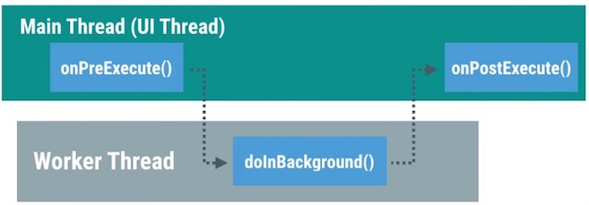

使用AsyncTask需要注意的问题有哪些呢？请关注以下几点：

- 首先，默认情况下，所有的AsyncTask任务都是被线性调度执行的，他们处在同一个任务队列当中，按顺序逐个执行。假设你按照顺序启动20个AsyncTask，一旦其中的某个AsyncTask执行时间过长，队列中的其他剩余AsyncTask都处于阻塞状态，必须等到该任务执行完毕之后才能够有机会执行下一个任务。情况如下图所示：

为了解决上面提到的线性队列等待的问题，我们可以使用`AsyncTask.executeOnExecutor()`强制指定AsyncTask使用线程池并发调度任务。

- 其次，如何才能够真正的取消一个AsyncTask的执行呢？我们知道AsyncTaks有提供`cancel()`的方法，但是这个方法实际上做了什么事情呢？线程本身并不具备中止正在执行的代码的能力，为了能够让一个线程更早的被销毁，我们需要在`doInBackground()`的代码中不断的添加程序是否被中止的判断逻辑，如下图所示：

一旦任务被成功中止，AsyncTask就不会继续调用`onPostExecute()`，而是通过调用`onCancelled()`的回调方法反馈任务执行取消的结果。我们可以根据任务回调到哪个方法（是onPostExecute还是onCancelled）来决定是对UI进行正常的更新还是把对应的任务所占用的内存进行销毁等。

- 最后，使用AsyncTask很容易导致内存泄漏，一旦把AsyncTask写成Activity的内部类的形式就很容易因为AsyncTask生命周期的不确定而导致Activity发生泄漏。

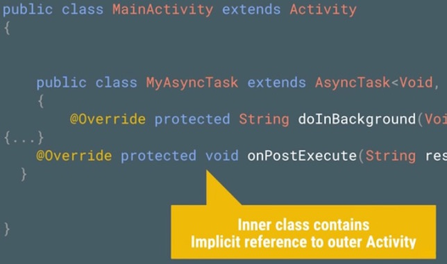

综上所述，AsyncTask虽然提供了一种简单便捷的异步机制，但是我们还是很有必要特别关注到他的缺点，避免出现因为使用错误而导致的严重系统性能问题。

### 4）Getting a HandlerThread

大多数情况下，AsyncTask都能够满足多线程并发的场景需要（在工作线程执行任务并返回结果到主线程），但是它并不是万能的。例如打开相机之后的预览帧数据是通过`onPreviewFrame()`的方法进行回调的，`onPreviewFrame()`和`open()`相机的方法是执行在同一个线程的。

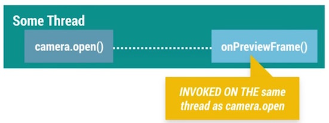

如果这个回调方法执行在UI线程，那么在onPreviewFrame()里面将要执行的数据转换操作将和主线程的界面绘制，事件传递等操作争抢系统资源，这就有可能影响到主界面的表现性能。

我们需要确保onPreviewFrame()执行在工作线程。如果使用AsyncTask，会因为AsyncTask默认的线性执行的特性(即使换成并发执行)会导致因为无法把任务及时传递给工作线程而导致任务在主线程中被延迟，直到工作线程空闲，才可以把任务切换到工作线程中进行执行。

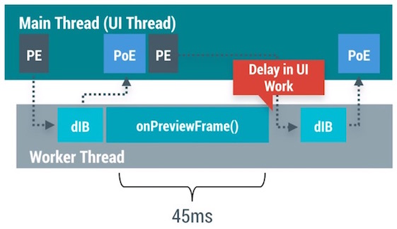

所以我们需要的是一个执行在工作线程，同时又能够处理队列中的复杂任务的功能，而HandlerThread的出现就是为了实现这个功能的，它组合了Handler，MessageQueue，Looper实现了一个长时间运行的线程，不断的从队列中获取任务进行执行的功能。

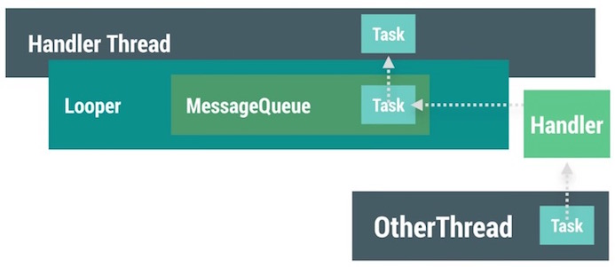

回到刚才的处理相机回调数据的例子，使用HandlerThread我们可以把open()操作与onPreviewFrame()的操作执行在同一个线程，同时还避免了AsyncTask的弊端。如果需要在onPreviewFrame()里面更新UI，只需要调用runOnUiThread()方法把任务回调给主线程就够了。

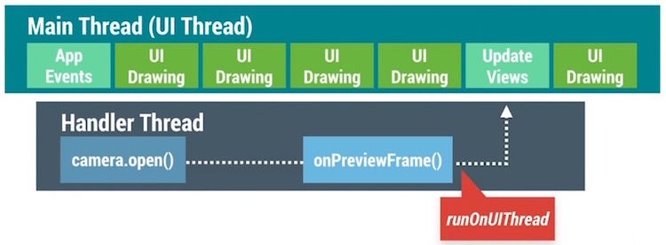

HandlerThread比较合适处理那些在工作线程执行，需要花费时间偏长的任务。我们只需要把任务发送给HandlerThread，然后就只需要等待任务执行结束的时候通知返回到主线程就好了。

另外很重要的一点是，一旦我们使用了HandlerThread，需要特别注意给HandlerThread设置不同的线程优先级，CPU会根据设置的不同线程优先级对所有的线程进行调度优化。

掌握HandlerThread与AsyncTask之间的优缺点，可以帮助我们选择合适的方案。

### 5）Swimming in Threadpools

线程池适合用在把任务进行分解，并发进行执行的场景。通常来说，系统里面会针对不同的任务设置一个单独的守护线程用来专门处理这项任务。例如使用Networking Thread用来专门处理网络请求的操作，使用IO Thread用来专门处理系统的I\O操作。针对那些场景，这样设计是没有问题的，因为对应的任务单次执行的时间并不长而且可以是顺序执行的。但是这种专属的单线程并不能满足所有的情况，例如我们需要一次性decode 40张图片，每个线程需要执行4ms的时间，如果我们使用专属单线程的方案，所有图片执行完毕会需要花费160ms(40*4)，但是如果我们创建10个线程，每个线程执行4个任务，那么我们就只需要16ms就能够把所有的图片处理完毕。

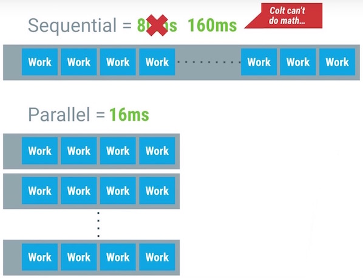

为了能够实现上面的线程池模型，系统为我们提供了`ThreadPoolExecutor`帮助类来简化实现，剩下需要做的就只是对任务进行分解就好了。

使用线程池需要特别注意同时并发线程数量的控制，理论上来说，我们可以设置任意你想要的并发数量，但是这样做非常的不好。因为CPU只能同时执行固定数量的线程数，一旦同时并发的线程数量超过CPU能够同时执行的阈值，CPU就需要花费精力来判断到底哪些线程的优先级比较高，需要在不同的线程之间进行调度切换。

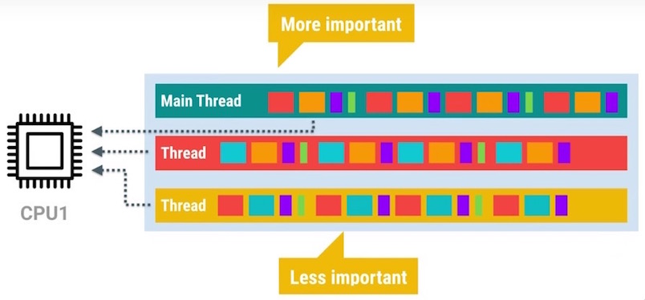

一旦同时并发的线程数量达到一定的量级，这个时候CPU在不同线程之间进行调度的时间就可能过长，反而导致性能严重下降。另外需要关注的一点是，每开一个新的线程，都会耗费至少64K+的内存。为了能够方便的对线程数量进行控制，ThreadPoolExecutor为我们提供了初始化的并发线程数量，以及最大的并发数量进行设置。

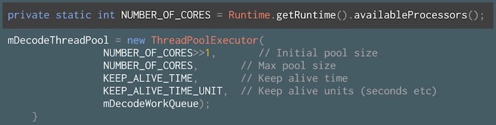

另外需要关注的一个问题是：`Runtime.getRuntime().availableProcesser()`方法并不可靠，他返回的值并不是真实的CPU核心数，因为CPU会在某些情况下选择对部分核心进行睡眠处理，在这种情况下，返回的数量就只能是激活的CPU核心数。

### 6）The Zen of IntentService

默认的Service是执行在主线程的，可是通常情况下，这很容易影响到程序的绘制性能(抢占了主线程的资源)。除了前面介绍过的AsyncTask与HandlerThread，我们还可以选择使用IntentService来实现异步操作。IntentService继承自普通Service同时又在内部创建了一个HandlerThread，在`onHandlerIntent()`的回调里面处理扔到IntentService的任务。所以IntentService就不仅仅具备了异步线程的特性，还同时保留了Service不受主页面生命周期影响的特点。

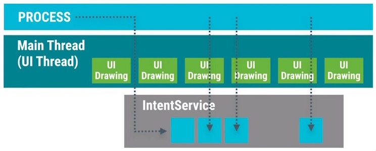

如此一来，我们可以在IntentService里面通过设置闹钟间隔性的触发异步任务，例如刷新数据，更新缓存的图片或者是分析用户操作行为等等，当然处理这些任务需要小心谨慎。

使用IntentService需要特别留意以下几点：

- 首先，因为IntentService内置的是HandlerThread作为异步线程，所以每一个交给IntentService的任务都将以队列的方式逐个被执行到，一旦队列中有某个任务执行时间过长，那么就会导致后续的任务都会被延迟处理。
- 其次，通常使用到IntentService的时候，我们会结合使用BroadcastReceiver把工作线程的任务执行结果返回给主UI线程。使用广播容易引起性能问题，我们可以使用LocalBroadcastManager来发送只在程序内部传递的广播，从而提升广播的性能。我们也可以使用`runOnUiThread()`快速回调到主UI线程。
- 最后，包含正在运行的IntentService的程序相比起纯粹的后台程序更不容易被系统杀死，该程序的优先级是介于前台程序与纯后台程序之间的。

### 7）Threading and Loaders

当启动工作线程的Activity被销毁的时候，我们应该做点什么呢？为了方便的控制工作线程的启动与结束，Android为我们引入了Loader来解决这个问题。我们知道Activity有可能因为用户的主动切换而频繁的被创建与销毁，也有可能是因为类似屏幕发生旋转等被动原因而销毁再重建。在Activity不停的创建与销毁的过程当中，很有可能因为工作线程持有Activity的View而导致内存泄漏(因为工作线程很可能持有View的强引用，另外工作线程的生命周期还无法保证和Activity的生命周期一致，这样就容易发生内存泄漏了)。除了可能引起内存泄漏之外，在Activity被销毁之后，工作线程还继续更新视图是没有意义的，因为此时视图已经不在界面上显示了。

Loader的出现就是为了确保工作线程能够和Activity的生命周期保持一致，同时避免出现前面提到的问题。

LoaderManager会对查询的操作进行缓存，只要对应Cursor上的数据源没有发生变化，在配置信息发生改变的时候(例如屏幕的旋转)，Loader可以直接把缓存的数据回调到`onLoadFinished()`，从而避免重新查询数据。另外系统会在Loader不再需要使用到的时候(例如使用Back按钮退出当前页面)回调`onLoaderReset()`方法，我们可以在这里做数据的清除等等操作。

在Activity或者Fragment中使用Loader可以方便的实现异步加载的框架，Loader有诸多优点。但是实现Loader的这套代码还是稍微有点点复杂，Android官方为我们提供了使用Loader的[示例代码](http://developer.android.com/intl/zh-cn/reference/android/content/AsyncTaskLoader.html)进行参考学习。

### 8）The Importance of Thread Priority

理论上来说，我们的程序可以创建出非常多的子线程一起并发执行的，可是基于CPU时间片轮转调度的机制，不可能所有的线程都可以同时被调度执行，CPU需要根据线程的优先级赋予不同的时间片。

Android系统会根据当前运行的可见的程序和不可见的后台程序对线程进行归类，划分为foreground的那部分线程会大致占用掉CPU的90%左右的时间片，background的那部分线程就总共只能分享到5%-10%左右的时间片。之所以设计成这样是因为foreground的程序本身的优先级就更高，理应得到更多的执行时间。

默认情况下，新创建的线程的优先级默认和创建它的母线程保持一致。如果主UI线程创建出了几十个工作线程，这些工作线程的优先级就默认和主线程保持一致了，为了不让新创建的工作线程和主线程抢占CPU资源，需要把这些线程的优先级进行降低处理，这样才能给帮组CPU识别主次，提高主线程所能得到的系统资源。

在Android系统里面，我们可以通过`android.os.Process.setThreadPriority(int)`设置线程的优先级，参数范围从-20到24，数值越小优先级越高。Android系统还为我们提供了以下的一些预设值，我们可以通过给不同的工作线程设置不同数值的优先级来达到更细粒度的控制。

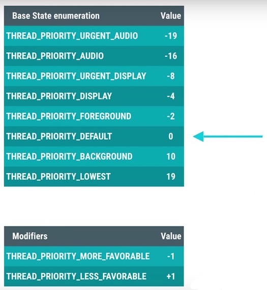

大多数情况下，新创建的线程优先级会被设置为默认的0，主线程设置为0的时候，新创建的线程还可以利用`THREAD_PRIORITY_LESS_FAVORABLE`或者`THREAD_PRIORITY_MORE_FAVORABLE`来控制线程的优先级。

Android系统里面的AsyncTask与IntentService已经默认帮助我们设置线程的优先级，但是对于那些非官方提供的多线程工具类，我们需要特别留意根据需要自己手动来设置线程的优先级。

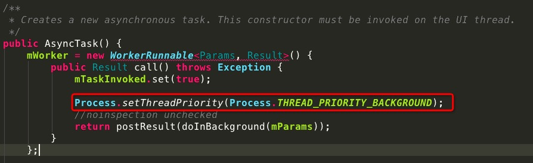

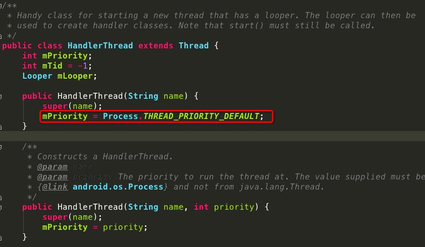

### 9）Profile GPU Rendering : M Update

从Android M系统开始，系统更新了GPU Profiling的工具来帮助我们定位UI的渲染性能问题。早期的CPU Profiling工具只能粗略的显示出Process，Execute，Update三大步骤的时间耗费情况。

但是仅仅显示三大步骤的时间耗费情况，还是不太能够清晰帮助我们定位具体的程序代码问题，所以在Android M版本开始，GPU Profiling工具把渲染操作拆解成如下8个详细的步骤进行显示。

旧版本中提到的Proces，Execute，Update还是继续得到了保留，他们的对应关系如下：

接下去我们看下其他五个步骤分别代表了什么含义：

- **Sync & Upload**：通常表示的是准备当前界面上有待绘制的图片所耗费的时间，为了减少该段区域的执行时间，我们可以减少屏幕上的图片数量或者是缩小图片本身的大小。
- **Measure & Layout**：这里表示的是布局的onMeasure与onLayout所花费的时间，一旦时间过长，就需要仔细检查自己的布局是不是存在严重的性能问题。
- **Animation**：表示的是计算执行动画所需要花费的时间，包含的动画有ObjectAnimator，ViewPropertyAnimator，Transition等等。一旦这里的执行时间过长，就需要检查是不是使用了非官方的动画工具或者是检查动画执行的过程中是不是触发了读写操作等等。
- **Input Handling**：表示的是系统处理输入事件所耗费的时间，粗略等于对于的事件处理方法所执行的时间。一旦执行时间过长，意味着在处理用户的输入事件的地方执行了复杂的操作。
- **Misc/Vsync Delay**：如果稍加注意，我们可以在开发应用的Log日志里面看到这样一行提示：I/Choreographer(691): Skipped XXX frames! The application may be doing too much work on its main thread。这意味着我们在主线程执行了太多的任务，导致UI渲染跟不上vSync的信号而出现掉帧的情况。

上面八种不同的颜色区分了不同的操作所耗费的时间，为了便于我们迅速找出那些有问题的步骤，GPU Profiling工具会显示16ms的阈值线，这样就很容易找出那些不合理的性能问题，再仔细看对应具体哪个步骤相对来说耗费时间比例更大，结合上面介绍的细化步骤，从而快速定位问题，修复问题。

