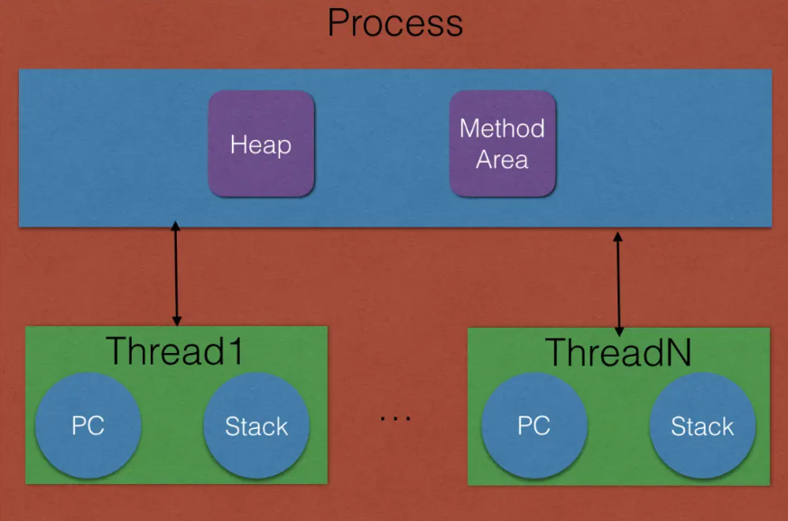
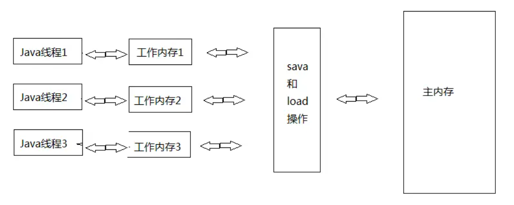

[深入了解Android多线程](https://www.jianshu.com/p/d8e0100ead4e)


# Java 线程基础

## 进程和线程的关系

线程1-线程N共享进程的堆内存（heap）和方法区资源（Method Area），但是每个线程有自己的程序计数器（PC）和栈区（Stack）



**程序计数器（PC）**
 其中 PC 计数器本质上是一块内存区域，用来记录线程当前要执行的指令地址，CPU 一般是使用时间片轮转方式让线程轮询占用的，因此当前线程 CPU 时间片用完后，要让出 CPU，这时 PC 计数器就会记录下当前线程下次要执行的命令的地址，等下次轮到该线程占有 CPU 执行时，就从 PC 计数器获取自己将要执行的命令的地址继续执行。
 **栈（Stack）**
 每个线程有自己的栈资源，用于存储该线程的局部变量，这些局部变量是该线程私有的，其它线程是访问不了的。
 **堆（heap）**
 堆是一个进程中最大的一块内存，是进程创建时候创建的，堆是被进程中的所有线程共享的。堆里面主要存放使用new 创建的对象实例。例如：

```
Object obj=new Object();
```

上述语句就是在堆上创建一个Object对象的实例，需要注意的是obj作为一个引用变量，在内存中是存在stack上的，只是obj指向了Object在堆上的地址。

**方法区（Method Area）**
方法区用来存放 JVM 加载的类信息、常量、静态变量等信息，也是线程共享的。


并发与并行


## Java 线程

Java 开启一个新线程的方式

1. 继承 Thread 类

   ```java
   public static void main(String[] args) {
           Thread mThread=new MyThread();
           mThread.start();
       }
   
   public static class MyThread extends java.lang.Thread{
   
           @Override
           public void run() {
               System.out.println("");
               super.run();
           }
       }
   ```

2. 实现 Runnable 接口

   ```java
   public static void main(String[] args) {
           Thread mThread=new Thread(new MyRunnable());
           mThread.start();
       }
   
   public static class MyRunnable implements Runnable {
   
           @Override
           public void run() {
               System.out.println("");
           }
       }
   ```

3. 直接使用函数体

   ```java
    new Thread(new Runnable() {
               @Override
               public void run() {
                   System.out.println("");     
               }
           });
   ```

4. 使用 ThreadFactory

   ```java
   ThreadFactory factory=new ThreadFactory() {
               @Override
               public Thread newThread(Runnable r) {
                   return new Thread(r,"自定义线程-1");
               }
           };
   
   Runnable runnable=new Runnable() {
               @Override
               public void run() {
                   System.out.println("doing something");
               }
           };
           
   Thread thread=factory.newThread(runnable);
   thread.start();
   ```

5. 实现 Callable 接口

   ```java
    FutureTask<String> task=new FutureTask<>(new Callable<String>() {
               @Override
               public String call() throws Exception {
                   System.out.println(Thread.currentThread().getName());
                   return "done";
               }
           });
   
           new Thread(task).start();
   ```

6. 使用线程池

   ```java
   Executors.newCachedThreadPool().submit(new Runnable() {
               @Override
               public void run() {
                   System.out.println("doing something");
               }
           });
   ```

6种开启多线程的方式，部分开启方式只是其他方式的简写或是特例。
 在Android种最常用的当属第6种，使用线程池创建线程。还有AsyncTask、HandlerThread等等，后面会说明具体的使用场景。


## Java 内存模型

Java 采用的是共享内存模型来实现多线程之间的信息交换和数据同步的。



Java中所有的变量都存储在主内存（Main Memory）中。每个线程有自己的工作内存（Working Memory，工作内存往往是CPU内的高速缓存）,线程的工作内存中保存了该线程使用到的变量在的主内存的副本拷贝，线程对变量的所有操作（读取、赋值等）都必须在工作内存中进行，而不能直接读写主内存中的变量（volatile变量仍然有工作内存的拷贝，但是由于它特殊的操作顺序性规定，所以看起来如同直接在主内存中读写访问一般）。不同的线程之间也无法直接访问对方工作内存中的变量，线程之间数据的传递都需要通过主内存来完成。

一个线程对一个共享变量的操作大致分为三步

1. 当前线程首先从主内存拷贝共享变量到自己的工作内存

2. 然后对工作内存里的变量进行处理

3. 处理完后更新变量值到主内存

上述三步操作是不具原子性的，即：当线程A在修改了共享变量C的值后，如何还未将共享变量C的值从工作内存刷新到主内存，此时线程B开始读取共享变量C，线程B读取到的值就是共享变量C未被线程A修改之前的值。

如果线程B的设计目的是，在线程A操作变量C的基础上在做进一步的操作，实际上到了这一步程序已经出现了bug，因为线程B读取到的值还是共享变量C未被线程A修改之前的值，那么如何保证操作的原子性呢？答案就是**锁**

## Java线程安全与锁

在java中可以通过Synchronized关键字来给方法或代码块加锁，使其保护资源的互斥访问。
 synchronized 关键字代表这个方法加锁,相当于不管哪一个线程（例如线程A），运行到这个方法时,都要检查有没有其它线程B（或者C、 D等）正在用这个方法(或者该类的其他同步方法)，有的话要等正在使用synchronized方法的线程B（或者C 、D）运行完这个方法后再运行此线程A,没有的话,锁定调用者,然后直接运行。

## Synchronized在内存中的表现

1.被修饰代码块或方法会把在 Synchronized 块内使用到的变量从线程的工作内存中清除，在 Synchronized 块内使用该变量时就不会从线程的工作内存中获取了，而是直接从主内存中获取，退出 Synchronized 块，则会把 Synchronized 块内对共享变量的修改刷新到主内存

注意：被Synchronized修饰的方法，如果不指定监视器，则默认监视器就是这个类。线程在调用方法时，会首先获取该方法的监视器，如果该监视器已经被其他线程获取，那么此线程将会阻塞。
可以通过如下代码指定代码块的监视器，其中Object就是指定的监视器，它需要是一个Object的类型对象

```java
synchronized (Objet) {}
```

示例，在程序中让两个线程分别累加两个不同的变量，每隔一秒钟，输出结果。

```java
private void run() {
            new Thread(new Runnable() {
                @Override
                public void run() {
                    while (true) { countA(); }
                }
            }, "线程A").start();

            new Thread(new Runnable() {
                @Override
                public void run() {
                    while (true) { countB(); }
                }
            }, "线程B").start();
        }
        private int countA = 0;
        private int countB = 0;
        //累加方法A加锁，防止其他线程篡改结果
        private synchronized void countA() {
            try {
                countA++;
                Thread.sleep(1000);
            } catch (InterruptedException e) {
                e.printStackTrace();
            }
            System.out.println(Thread.currentThread().getName() + "--" + countA);
        }
        //累加方法B加锁，防止其他线程篡改结果
        private synchronized void countB() {
            try {
                countB++;
                Thread.sleep(1000);
            } catch (InterruptedException e) {
                e.printStackTrace();
            }
            System.out.println(Thread.currentThread().getName() + "--" + countB);
        }
```

代码实际的执行结果和预想的结果，大不相同。只有线程A可以正常输出结果，线程B无法执行。

为什么会出现这样的结果？
原因在于，synchronized修饰的方法，默认监视器是当前的类，代码中countA()与countB()的监视器都是同一个类。线程B在执行countB()时，监视器始终被线程A持有，线程B一直处于等待状态。
知道了原因，我们就可以为countA（）和countB（）指定不同监视器，即可正常执行。

```java
    private final Object monitorA=new Object();
    private final Object monitorB=new Object();
    //累加方法A加锁，并指定监视器
    private  void countA() {
        synchronized (monitorA) {
            try {
                countA++;
                Thread.sleep(1000);
            } catch (InterruptedException e) {
                e.printStackTrace();
            }
            System.out.println(Thread.currentThread().getName() + "--" + countA);
        }
    }
    //累加方法B加锁，并指定监视器
    private  void countB() {
        synchronized (monitorB) {
            try {
                countB++;
                Thread.sleep(1000);
            } catch (InterruptedException e) {
                e.printStackTrace();
            }
            System.out.println(Thread.currentThread().getName() + "--" + countB);
        }
    }

```

## 其他Java线程同步 相关API的解释

**1.interrupt()**
中断线程，仅仅设置线程的中断标志为 true 并立即返回，线程的运行状态并不会发生变化。

**2.isInterrupted()**
检测当前线程是否被中断，如果是返回 true，否则返回 false。

**3.interrupted()**
检测当前线程是否被中断，如果是返回 true，否则返回 false。与isInterrupted 不同的是，该方法发现当前线程被中断后会清除中断标志。
**注意**：当一个线程处于休眠（sleep）、等待（wait、join）的时候，如果其他线程中断了它，则处于休眠的线程会立即抛出 java.lang.InterruptedException 异常，并重置中断状态。Java 中的线程中断只是简单设置中断标志，至于剩下的事情就需要程序员自己来做，比如根据中断标志来判断是否退出执行。
**在Android中如果只希望线程休眠而不希望被打断，可以使用SystemClock.sleep()来替代Thread.sleep()**

**4.wait()**
wait()是Object的方法，也就是说几乎所有的对象都有该方法，当一个线程调用了一个对象的wait方法，该线程就会被挂起，直到出现下列情况：
**1.其他的线程调用该对象的notify()或notifyAll()方法。**
**2.其他线程调用了该线程的interrupt()方法，如果该线程没有指明如何处理中断事件，则会抛出InterruptedException**
需要注意的是在调用对象的wait()时，如果没有获得事先获得该对象的监视锁，则会抛出IllegalMonitorStateException。

**5.wait(long timeout)与wait(long timeout,int naos)**
该方法相比 wait() 方法多一个超时参数，不同在于如果一个线程调用了共享对象的该方法挂起后没有在指定的 timeout ms 时间内被其它线程调用该共享变量的 notify() 或者 notifyAll() 方法唤醒，那么该函数还是会因为超时而返回。需要注意的是如果在调用该函数时候 timeout 传递了负数会抛出 IllegalArgumentException 异常。
**wait(long timeout,int naos)**内部是调用 wait(long timeout)，只是当 nanos > 0 时让参数一递增 1，用处不多，不再过多介绍。

**6.notify()**
一个线程调用共享对象的 notify() 方法后，会唤醒一个在该共享变量上调用 wait 系列方法后被挂起的线程，一个共享变量上可能会有多个线程在等待，具体唤醒哪一个等待的线程是随机的。 类似 wait 系列方法，只有当前线程已经获取到了该共享变量的监视器锁后，才可以调用该共享变量的 notify() 方法，否者会抛出 IllegalMonitorStateException 异常。

**7.notify()**
不同于 nofity() 方法在共享变量上调用一次就会唤醒在该共享变量上调用 wait 系列方法被挂起的一个线程，notifyAll() 则会唤醒所有在该共享变量上由于调用 wait 系列方法而被挂起的线程。

**8.Thread.join()**
thread.Join把指定的线程加入到当前线程，可以将两个交替执行的线程合并为顺序执行的线程。比如在线程B中调用了线程A的Join()方法，直到线程A执行完毕后，才会继续执行线程B。

**9.Thread.yield()**
当一个线程执行了yield()方法后，就会进入Runnable(就绪状态)，【不同于sleep()和join（）方法，因为这两个方法是使线程进入阻塞状态】。除此之外，yield()方法还与线程优先级有关，当某个线程调用yield()方法时，就会从运行状态转换到就绪状态后，CPU从就绪状态线程队列中只会选择与该线程优先级相同或者更高优先级的线程去执行。

下面使用一个经典的案例来加深对线程各种API的理解和使用。

## 生产、消费者模型

假设这样一种场景，一个工厂有一条流水线和三个车间，其中两个生产车间一个包装车间。流水线上最多只能有5件商品，超过5件商品，生产车间需要停产，但是如果生产车间多次停产，则认为产能过剩，需要停止一条生产车间。
这样的场景我们大致可以简化为下面代码：

```java
        //产品流水线
        private final LinkedBlockingDeque<String> line = new LinkedBlockingDeque<>();
        //流水线上最多可容纳5个产品，超过上限，则需要停产
        private final static int MAX_SIZE = 5;
        //累计休息次数，超过5次，则停产
        private int count = 0;

        private Thread addThread, removeThread, addThread2;

        //产品生产车间，用于生产产品打上标签，并放入流水线中
        private void addProduct() {
            addThread = new Thread(new Runnable() {
                @Override
                public void run() {
                    //让程序一直执行
                    while (true) {
                        synchronized (line) {
                            //流水线上产品已满，停止生产，进入等待状态
                            while (line.size() == MAX_SIZE) {
                                try {
                                    System.out.println(Thread.currentThread().getName() + "休息");
                                    count++;
                                    if (count >= 5) {
                                        //5次停产后，打断生产车间2的工作
                                        addThread2.interrupt();
                                    }
                                    //当前线程进入等待状态
                                    line.wait();
                                } catch (InterruptedException e) {
                                    e.printStackTrace();
                                }
                            }

                            int sign = new Random().nextInt(10);
                            line.add("产品" + sign);
                            System.out.println(Thread.currentThread().getName() + "生产了：产品" + sign);
                            //唤醒包装车间
                            line.notifyAll();
                        }
                        try {
                            //生产完一个产品，休息一秒
                            Thread.sleep(1500);
                        } catch (InterruptedException e) {
                            e.printStackTrace();
                        }
                    }
                }
            }, "生产车间1：");
            addThread.start();
        }

        //产品包装车间，从流水线中取出产品，并将其包装好
        private void removeProduct() {
            removeThread = new Thread(new Runnable() {
                @Override
                public void run() {
                    //让程序一直执行
                    while (true) {
                        synchronized (line) {
                            //流水线上没有产品了，停止包装，进入等待状态
                            while (line.size() == 0) {
                                try {
                                    System.out.println("停止包装");
                                    //当前线程进入等待状态
                                    line.wait();
                                } catch (InterruptedException e) {
                                    e.printStackTrace();
                                }
                            }

                            try {
                                System.out.println(Thread.currentThread().getName() + "包装了" + line.take());
                                //唤醒生产车间
                                line.notifyAll();
                            } catch (InterruptedException e) {
                                e.printStackTrace();
                            }
                        }
                        //包装完一个产品，休息两秒
                        try {
                            Thread.sleep(1300);
                        } catch (InterruptedException e) {
                            e.printStackTrace();
                        }

                    }
                }
            }, "包装车间:");
            removeThread.start();
        }

        //生产车间2，当生产车间5次停止生产后，会关闭此车间。
        private void addProduct2() {

            addThread2 = new Thread(new Runnable() {
                @Override
                public void run() {
                    while (!Thread.currentThread().isInterrupted()) {
                        synchronized (line) {
                            try {
                                while (line.size() == MAX_SIZE) {
                                    //当前线程进入等待状态
                                    System.out.println(Thread.currentThread().getName() + "休息");
                                    count++;
                                    if (count>=5){
                                        Thread.currentThread().interrupt();
                                    }
                                    line.wait();
                                }
                            } catch (InterruptedException e) {
                                System.out.println(Thread.currentThread().getName() + "停止生产");
                                return;
                            }
                            int sign = new Random().nextInt(10);
                            line.add("产品" + sign);
                            System.out.println(Thread.currentThread().getName() + "生产了：产品" + sign);
                            //唤醒包装车间
                            line.notifyAll();
                        }

                        try {
                            Thread.sleep(1500);
                        } catch (InterruptedException e) {
                            System.out.println(Thread.currentThread().getName() + "停止生产");
                            //如果被中断的线程正在睡眠，则通过return终止线程
                            return;
                        }
                    }
                }
            }, "生产车间2:");

            addThread2.start();
        }
```


# 多线程性能优化

多线程并发时，可以使用Synchronized加锁，以保证资源的互斥访问。但是使用锁会引起线程上下文的切换开销，同时需要注意的是，线程的创建和销毁是有一定的性能损耗的，如果程序中多处使用了多线程，该如何优化呢？

## 锁性能的优化

```java
private int value;

public synchronized int getValue() {
    return value;
}

public synchronized void setValue(int value) {
    this.value = value;
}
```

如果线程A正在访问setValue（），即使线程A没有在访问getValue（），其他线程也无法访问getValue（）。之前提出给两个方法指定不同的监视器，其实Java 还提供了一种弱形式的同步，也就是使用 **volatile** 。

### volatile

1.该关键字确保了对一个变量的更新对其他线程马上可见。当一个变量被声明为 volatile 的时候，线程写入变量的时候不会把值缓存在寄存器或者其他地方，而是会把值刷新回主内存，当其他线程读取该共享变量的时候，会从主内存重新获取最新值，而不是使用当前线程的工作内存中的值。
**注意：**volatile并不是锁！在保证内存可见性上 synchronized 和使用 volatile 是等价的，但是volatile并没有保证操作的原子性。
**使用场景：**当一个变量的值的改变，不依赖它原来的值时，可以使用volatile替代synchronized。
上面的例子中value的改变和它本身的值无关，所以可以直接使用volatile

```java
    private volatile int value;

    public int getValue() {
        return value;
    }

    public void setValue(int value) {
        this.value = value;
    }
```

例子再做一些修改

```csharp
    private volatile int value;

    public int getValue() {
        //累加
        return value++;
    }

    public void setValue(int value) {
        this.value = value;
    }
```

这里value出现了一个累加操作,value的改变需要依赖其自身的值，用volatile就无法保证它的原子性，在Android Studio编辑器也会提示，这段代码不具有原子性

为了保证getValue（）的原子性，我们就需要重新使用synchronized

```csharp
    private int value;

    public synchronized int getValue() {
        return value++;
    }

    public synchronized void setValue(int value) {
        this.value = value;
    }
```

但是synchronized使getValue（读操作）和setValue（写操作）共用一个监视器，降低了并发度。java的设计者考虑到这种情况，给出了一种并发度更高的锁—**读写分离锁**

### 读写分离锁

**读写分离锁**顾名思义就是将读取和写入加锁的操作进行分离，从而大大提高系统性能的。
使用读写锁改造一下上面的例子。

```java
    private ReentrantReadWriteLock mReentrantReadWriteLock = new ReentrantReadWriteLock();
    //读锁
    private ReentrantReadWriteLock.ReadLock mReadLock = mReentrantReadWriteLock.readLock();
    //写锁
    private ReentrantReadWriteLock.WriteLock mWriteLock = mReentrantReadWriteLock.writeLock();

    private int value;

    public int getValue() {
        mReadLock.lock();
        try {
            return value++;
        } finally {
            //解除锁的操作必须在finally代码块中
            mReadLock.unlock();
        }
    }

    public void setValue(int value) {
        mWriteLock.lock();
        try {
            this.value = value;
        } finally {
            //解除锁的操作必须在finally代码块中
            mWriteLock.unlock();
        }
    }

```

读写锁的基本使用就是这样的，但是需要注意的是，解除锁的操作尽量写在finally代码块中，这样可以避免因为程序加锁后代码执行时抛出异常，导致锁无法释放，而产生期望之外的程序异常。
**使用场景：**任务中执行的读操作远远大于写操作，这时可以考虑读写分离锁。

上述的优化操作依然是加锁，锁在java处理并发任务这一块，功不可没，但是加锁必然带来上下文切换和重新调度时的性能开销，volatile虽然可以实现内存上的可见行，但是并不能操作的原子性，那么有没有办法不加锁还能保证原子性呢？

### 原子类-Atomic

JDK中提供了一种特殊的原子类，比如AtomicInteger、AtomicBoolean等等，它们是使用CAS算法实现的线程安全的无锁类，专门用于多线程并发操作。
**CAS**全称**Compare And Swap（比较和交换）**，我们一般只需要知道Java从硬件上保证了比较-交换操作的原子性，关于它的内部细节，不需要过分深究。
**使用场景：**当我们在使用java基本数据类型，一些更新、累加操作需要保证原子性时。
**注意**：当我们需要对一些变量做一些复杂的操作，而这些操作原子类中并没有提供时，我们应该首先考虑使用锁而不是原子类。
我们使用原子类来改写上面的例子

```csharp
    private AtomicInteger value = new AtomicInteger(0);

    public int getValue() {
        //累加
        return value.incrementAndGet();
    }

    public void setValue(int value) {
        //设定新的值
        this.value.getAndSet(value);
    }
```

## 线程池

说完了锁的优化之后，探讨一下线程的优化。
在 Android 开发中我们鼓励甚至要求程序员必须使用线程池来创建新的线程。前一篇文章中介绍了6种新建线程的方式，为什么鼓励使用线程池来新建线程？
原因在于线程池有以下几个优点：
1.重用线程池中的线程，避免因为线程的创建和销毁所带来的性能开销。
2.能有效控制线程的最大并发数量，避免大量线程之间因互相抢占cpu而导致的阻塞现象。
3.能够对线程进行简单的管理，并提供定时执行以及指定间隔循环执行等功能。

在 Android 中线程池都是通过直接或间接配置ThreadPoolExecutor来实现的，下面简单介绍一下ThreadPoolExecutor

```java
    //核心线程的数量
    int threads = 1;
    //最大线程数
    int maximumPoolSize = 10;
    //非核心线程的闲置超时时间
    long keepAliveTime = 100L;
    //超时单位
    TimeUnit unit = TimeUnit.SECONDS;
    //线程池中阻塞任务队列
    LinkedBlockingDeque<Runnable> deque = new LinkedBlockingDeque<>();
    //线程工厂
    ThreadFactory factory = new ThreadFactory() {
        @Override
        public Thread newThread(Runnable r) {
            return new Thread(r, "线程的名字");
        }
    };
    //线程池
    ExecutorService executorService = new ThreadPoolExecutor(threads,
            maximumPoolSize, keepAliveTime, unit, deque, factory);

    //向线程池中传入一个runnable
    executorService.execute(new Runnable() {
        @Override
        public void run() {
            //do something
        }
    });
```

**核心线程：**即使处于闲置状态，系统也不会销毁的线程。
**maximumPoolSize：**最大线程数，线程池所能容纳的最大线程数，当活动线程达到这个数值后，后续的任务会阻塞。
**keepAliveTime：**非核心线程闲置的超时时间：超过这个时长，非核心的线程会被回收。当allowThreadTimeOut属性为true时，这个时间也会作用于核心线程。
**workQueue：**线程池中阻塞任务队列，通过excute方法提交的runnable对象会存储在这个参数中。
**threadFactory：**线程工厂，用于初始化统一规格的线程。

**线程池在运行时遵守以下的规则**
1.如果线程池中线程未达到核心线程的数量，那么会直接启用一个核心的线程来执行任务。
2.如果线程池中的任务达到或者超过核心线程的数量，那么任务会被插入到任务队列中等待执行。
如果步骤2中无法将任务插入到任务队列中（任务队列已满），此时如果线程池中线程数量未达到线程池规定的最大值，那么会立即启动一个非核心线程来执行任务。如果线程数已经达到了线程池中规定的最大值，为抛出异常rejectedExecutionException。

### 根据不同的任务配置线程池

在实际的开发中，我们需要根据不同的任务类型，配置合适的线程池，这些任务类型大致有以下两种。
**CPU密集型操作：**核心线程应该尽量少一些，如CPU数量+1（保证核心线程的执行积极度是一样的）
**I/O密集型操作：**IO操作不占用cpu，线程数量可以多一些，但也不能过多，否则线程切换带来的开销又会影响到性能。
总结起来就是线程等待时间所占比例越高，需要越多线程。线程CPU时间所占比例越高，需要越少线程。

### 常见的线程池

Java中为我们配置多种常用的线程池，根据执行任务的不同，我们可以直接使用Executors创建出不同的线程池，而不需要再做配置。
1.FixedThreadPool
线程数量固定的线程池，核心线程数量=最大线程数量，并且只有核心线程，当线程处于空闲状态时，它们并不会被回收，除非线程池关闭。线程池队列无限大。
**作用：**快速响应外界的请求

```java
    //线程池
    ExecutorService executorService;
    //核心线程的数量
    int threads = 1;
    //重现方法1
    executorService = Executors.newFixedThreadPool(1);
    //重载方法2
    executorService = Executors.newFixedThreadPool(1, new ThreadFactory() {
        @Override
        public Thread newThread(Runnable r) {
            return new Thread(r, "线程的名字");
        }
    });
    //像线程池传入一个runnable
    executorService.execute(new Runnable() {
        @Override
        public void run() {
            //do something
        }
    });
```

2.CachedThreadPool
线程数量无限大闲置的线程池，并且没有存储任务的队列，线程超时时间为60秒。这意味它会立即处理所有加入进来的任务，在没有任务时，线程会因为超时而被回收，这时它是几乎不占用任何系统资源的。
**作用：**适合处理高并发，且耗时较少的任务。

```java
    //线程池
    ExecutorService executorService;
    executorService = Executors.newCachedThreadPool(new ThreadFactory() {
        @Override
        public Thread newThread(Runnable r) {
            return new Thread(r, "线程的名字");
        }
    });
    //像线程池传入一个runnable
    executorService.execute(new Runnable() {
        @Override
        public void run() {
            //do something
        }
    });
```

3.ScheduledThreadPool
核心线程数固定，非核心线程数无限大，非核心线程超时时间10秒。
**作用：**用于执行定时任务和具有固定周期的重复任务。

```java
    //核心线程的数量
    int threads = 1;
    //定时
    long delay = 2000L;
    //延迟
    long initDelay = 1000L;
    //线程工厂
    ThreadFactory factory = new ThreadFactory() {
        @Override
        public Thread newThread(Runnable r) {
            return new Thread(r, "线程的名字");
        }
    };
    //线程池
    ScheduledExecutorService executorService = Executors.newScheduledThreadPool(threads, factory);
    //方法1：不延迟直接定时执行
    executorService.schedule(new Runnable() {
        @Override
        public void run() {
            //需要定时执行的任务
        }
    }, delay, TimeUnit.SECONDS);
    //方法2：延迟后再定时执行
    executorService.scheduleWithFixedDelay(new Runnable() {
        @Override
        public void run() {
            //
        }
    }, initDelay, delay, TimeUnit.SECONDS);
```

4.SingleThreadExecutor
线程池中只有一个核心线程，线程池队列无限大
**作用：**统一外界所有的任务到一个线程中，使这些任务之间不需要处理线程同步的问题。

```java
    //线程池
    ExecutorService executorService;
    //重现方法1
    executorService = Executors.newSingleThreadExecutor();
    //重载方法2
    executorService = Executors.newSingleThreadExecutor(new ThreadFactory() {
        @Override
        public Thread newThread(Runnable r) {
            return new Thread(r, "线程的名字");
        }
    });
    //像线程池传入一个runnable
    executorService.execute(new Runnable() {
        @Override
        public void run() {
            //do something
        }
    });
```

注意上述所说的无限大实际上是指Java的一个常数Integer.MAX_VALUE，它等于2的31次方-1，我们可以把它近似看作无穷大。

### 后台任务的选择

在Android开发中会经常遇到不同的后台任务，根据不同的任务类型，我们需要选择不同的实现方式，下面说说一些简单的判断场景。

当一个后台任务只运行在后台且不会回到前台或不会与UI发生交互时，考虑使用线程池。
当一个后台任务在后台短期执行后需要返回前台的，考虑使用AyncTask或HandlerThread
以上情况并不是绝对的，有时候甚至需要结合service、intentService等组件一起，才能完成后台任务，说到底适合当前项目的，才是最好的。


# Handler与多线程

android开发中经常使用 Handler 来进行UI线程和子线程间的通信。

## Handler的简单使用

handler在Android开发中经典使用场景

```java
    //ui对象
    TextView textView=findViewById(R.id.textView);
    //创建handler
    Handler handler=new Handler();
    //创建一个线程池
    ExecutorService service = Executors.newCachedThreadPool();
    //创建一个后台任务
    service.execute(new Runnable() {
        @Override
        public void run() {
            //模拟耗时操作
            try {
                Thread.sleep(4000);
            } catch (InterruptedException e) {
                e.printStackTrace();
            }

            handler.post(new Runnable() {
                @Override
                public void run() {
                    textView.setText("修改一下");
                }
            });
        }
    });

```

上述代码中，开启了一个线程并模拟一段时间的后台任务，在后台任务执行完毕后，使用handler发送（post）了一个任务并将该任务切换到UI线程执行。
**需要注意的是**，通过handler post或者send的任务并不一定是在UI线程中执行的，这个任务总会在创建handler的线程中执行，上述示例中的handler正好是UI线程中创建，所以post的任务才会在UI线程中执行。

再来看一个handler不在UI线程创建的例子

```java
    //在主线程中开启handler
    Handler handler = new Handler();
    new Thread(new Runnable() {
        @Override
        public void run() {
            handler.post(new Runnable() {
                @Override
                public void run() {
                    Log.e(TAG, "主线程：" + Thread.currentThread().getName());
                }
            });
        }
    }).start();

    //创建一个线程池
    ExecutorService service = Executors.newCachedThreadPool();
    service.execute(new Runnable() {
        @Override
        public void run() {
            Looper.prepare();
            Handler handler = new Handler();
            handler.post(new Runnable() {
                @Override
                public void run() {
                    Log.e(TAG, "子线程：" + Thread.currentThread().getName());
                }
            });
            Looper.loop();
        }
    });
```

上面的代码分别实现了在主线程中创建handler，在子线程中通过handler发送一个打印当前线程名字的任务，和在子线程创建一个handler，在子线程中通过handler发送一个打印当前线程名字的任务。运行结果如下


运行结果，证实了上面的结论，**通过handler post或者send的任务会是在创建handler的线程中执行的。**

代码里面的Looper.prepare是什么？
Looper是Handler运行机制的一部分，它负责将handler发送到MessageQuene中任务取出来，在UI线程中使用handler我们不需要创建Looper，是因为UI线程中已经创建好了一个Looper，但是如果在其他线程中创建Handler，我们就需要通过Looper.prepare创建一个Looper。
实际上Looper、Handler以及MessageQuene三者的关系密不可分，它们共同组成了Android的消息机制，下面就将详细讲解。

## Android的消息模型

在Android中，消息的处理大致有以下几个过程

- 在线程A（一般是UI线程）中创建handler，开启线程B用于执行耗时操作。
- 当线程B需要与线程A进行通信时，在线程B中创建消息（Message或Runnable）。
- 使用已经创建的handler向消息队列（MessageQueue）中插入（post/send）消息。
- Looper开始循环，并从消息队列中取出消息，并将消息传给handler，这样这个消息就从线程B中来到了创建handler的线程A中。
- 根据开发者的要求处理消息。

下面就分别讲解各个部分的工作原理

### MessageQueue 工作原理

MessageQueue在Android称之为消息队列，虽然是队列，但实际上它的内部是通过单链表实现的，单链表在数据的插入和删除上比较好的性能优势。
MessageQueue中通过enqueueMessage向链表中插入数据，通过next方法取出数据。
需要注意的是next()是一个阻塞方法，当链表中没有消息时，next会一直阻塞在那里。

### Looper 工作原理

Looper在Android的消息机制中主要用于循环消息队列，当它发现消息队列中有新的消息时就会立即处理，否则会一直阻塞在那里。
在上面的例子里我们已经说过了，使用handler必须要先创建一个Looper，创建Looper有两个方法

- Looper.prepare();
  这个方法用于在子线程中开启一个Looper
- Looper.prepareMainLooper();
  该方法用于在UI线程中开启一个Looper，因为主线程的Looper比较特殊，所以Looper单独提供了初始化方法。

如果你需要获取主线程的Looper，可以通过Looper.getMainLooper()在任何地方、任何线程中获得主线程的Looper。
创建完Looper后，你还需要开启循环，Looper才可以正常工作。
开启循环的方法主要是

- Looper.loop()。

loop()的内部是一个死循环，它会不停的从消息队列取出消息，如果消息的队列的next()返回null，则会跳出循环，如下所示

```kotlin
  for (;;) {
            Message msg = queue.next(); // might block
            if (msg == null) {
                // No message indicates that the message queue is quitting.
                return;
            }
  ……
  }
```

因为next()是一个阻塞方法，当消息队列中没有消息时，它并不会返回null，而是一直阻塞在那里。那消息队列什么时候会返回null呢？这个我们暂时不说，接着往下看。
如果msg不为空，Looper就会开始处理这条消息： msg.target.dispatchMessage(msg);msg.target就是发送这条消息的handler对象。这样Handler发送的消息就又交给它的dispatchMessage方法处理了。

Looper也提供了退出循环的方法。

- quit()
- quitSafely()

这两个方法区别在于quit会直接退出Looper，而quitSafely只是设定一个退出标记，它会把消息队列中已有的消息全部处理完，才会退出Looper。
Looper退出后，通过handler发送的消息都会失败，handler的send方法会返回false。
**子线程**中创建了Looper，在所有的事件处理完毕后需要退出Looper，否则该子线程会一直处于阻塞状态，继续占据系统资源，而Looper退出后，该线程就会终止。

### Handler 工作原理

Handler的主要工作的就是消息的发送和接收。消息的发送主要使用send的一些方法（post内部也是send的实现）。
handler发送消息的过程仅仅是向消息队列中插入一条，然后消息队列的next就会返回这条消息给Looper，而Looper最终会把消息交给Handler处理，此时消息就转入到了创建handler所在线程中。
handler通过dispatchMessage(Message msg)来处理Message源码如下：

```csharp
 /**
     * Handle system messages here.
     */
    public void dispatchMessage(Message msg) {
        if (msg.callback != null) {
            handleCallback(msg);
        //handleCallback(msg) 实际上就是 message.callback.run();
        } else {
            if (mCallback != null) {
                if (mCallback.handleMessage(msg)) {
                    return;
                }
            }
            handleMessage(msg);
        }
    }
```

首先检查Message的callback是否为空，不为空则交给handleCallback处理，其中callback就是一个runnable的对象，实际上就是handler.post(runnable)中runnable对象。
如果callbak为空，进入eles代码块，如果mCallback不为空，就调用mCallback的handleMessage来处理消息。
这里的Callback是一个接口，这个Callback允许我们在使用handler时，不需要派生一个子类，即可创建一个handler对象。
上面例子中我们在创建handler使用的无参构造方法中，默认就将callback设定为null。
如果mCallback为空，则调用handleMessage(msg)处理消息，handleMessage是一个空的方法，需要我们在派生Handler的子类实现，用于进一步对发送的消息做处理。源码如下

```cpp
    public void handleMessage(Message msg) {
    }
```

### 为什么需要这样的消息机制呢？

首先，Android系统规定访问、修改UI只能在主线程中，如果在子线程中访问UI，那么程序就会抛出异常。而在Android中耗时操作是不能在主线程中操作的，所以访问网络、数据库等等这些耗时操作就不得不在子线程中执行了。如果在子线程中执行完毕的操作需要修改UI时？这时就轮到Android的消息机制出场了，再来看一个经典的使用场景：

```java
    private TextView mTextView;
    @Override
    protected void onCreate(Bundle savedInstanceState) {
        super.onCreate(savedInstanceState);
        setContentView(R.layout.activity_main);
        mTextView = findViewById(R.id.textview);

        new Thread(new Runnable() {
            @Override
            public void run() {
                double d = 0;
                for (int i = 0; i < 99999; i++) {
                    d += i;    
                }
                Message message = new Message();
                message.what = 1;
                Bundle bundle = new Bundle();
                bundle.putDouble("key", d);
                message.setData(bundle);
                handler.sendMessage(message);
            }
        }).start();

       Handler handler=new Handler(new Handler.Callback() {
            @Override
            public boolean handleMessage(Message msg) {
                if (msg.what == 1) {
                    mTextView.setText(msg.getData().getDouble("key") + "");
                }
                return true;
            }
        });
    }
```

上述的代码展示了在一个新的线程中做耗时计算后，将计算结果输出到主线程中并展示的过程。
注意：上面创建handler时使用了我们在Handler的原理中说到的使用Callback的方式创建。
这里延伸一下，Android为什么不允许在子线程中修改UI？原因在于Android中的各种UI控件不是线程安全的，在多线程并发操作时会发生不可预期的状态，那为什么UI控件不加锁呢？因为锁会让UI访问的逻辑变得复杂，同时也会降低UI的访问效率。所以Android选择了性能很高的单线程运行模式。


# 线程和 UI 对象引用

Andorid View 对象不是线程安全的，如果尝试修改甚至引用主线程以外的线程中的 UI 对象，结果可能是异常、崩溃和其他未定义的错误行为。

## 显式引用

## 隐式引用

```java
public class MainActivity extends Activity {
  // ...
  public class MyAsyncTask extends AsyncTask<Void, Void, String>   {
    @Override protected String doInBackground(Void... params) {...}
    @Override protected void onPostExecute(String result) {...}
  }
}
```

代码将线程对象 `MyAsyncTask` 声明为 Activity 的非静态内部类（或 Kotlin 中的内部类）。此声明创建对 `Activity` 实例的隐式引用。因此，在线程工作完成之前，该对象将包含对 Activity 的引用，从而导致所引用 Activity 的销毁延迟。这种延迟又会给内存带来更大压力。

解决方案是将重载类实例定义为静态类，或在它们自己的文件中定义，从而删除隐式引用。