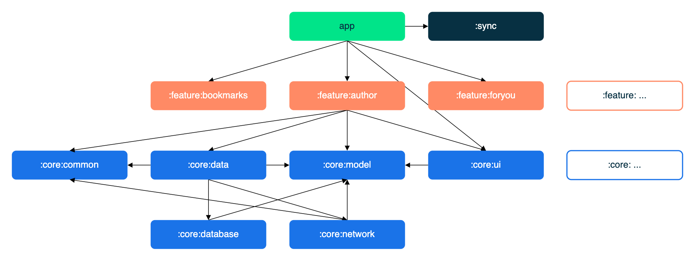

# 架构

[nowinandroid/docs/ArchitectureLearningJourney.md at main · android/nowinandroid (github.com)](https://github.com/android/nowinandroid/blob/main/docs/ArchitectureLearningJourney.md)

# 模块化

[nowinandroid/docs/ModularizationLearningJourney](https://github.com/android/nowinandroid/blob/main/docs/ModularizationLearningJourney.md)

[Android 官方项目是怎么做模块化的？快来学习下 - 掘金 (juejin.cn)](https://juejin.cn/post/7128069998978793509)

## 概述

模块化是将单一模块代码结构分为高内聚低耦合的多模块的一种编码实践

## 模块化的好处

可扩展性、支持并行工作、封装、减少构建时间、动态交付、可重用性

## 模块化的误区

太多模块、没有足够的模块、太复杂

## 模块化策略

没有单一的模块化方案，但是可以遵循一般准则，尽可能享受其好处并规避其缺点。

## Now in Android 的模块类型

注：模块依赖图（如下）可以在模块化初期用于可视化各个模块之间的依赖关系。

Now in Android 项目中有以下几种类型的模块：

- app 模块： 包含绑定其余代码库的应用程序级和脚手架类，`app`例如和应用程序级受控导航。一个很好的例子是通过导航设置和底部导航栏设置。该模块依赖于所有模块和必需的模块。
- `feature-` 模块： 功能特定的模块，其范围可以处理应用程序中的单一职责。这些模块可以在需要时被任何应用程序重用，包括测试或其他风格的应用程序，同时仍然保持分离和隔离。如果一个类只有一个`feature`模块需要，它应该保留在该模块中。如果不是，则应将其提取到适当的`core`模块中。一个`feature`模块不应依赖于其他功能模块。他们只依赖于`core`他们需要的模块。
- `core-`模块：包含辅助代码和特定依赖项的公共库模块，需要在应用程序中的其他模块之间共享。这些模块可以依赖于其他核心模块，但它们不应依赖于功能模块或应用程序模块。
- 其他模块 - 例如和模块`sync`、`benchmark`、 `test`以及 `app-nia-catalog`用于快速显示我们的设计系统的目录应用程序。

## 项目中的主要模块

基于以上模块化方案，Now in Android 应用程序包含以下模块：

| 模块名                       | 职责                                                         | 关键类及核心示例                                             |
| ---------------------------- | ------------------------------------------------------------ | ------------------------------------------------------------ |
| `app`                        | 将应用程序正常运行所需的所有内容整合在一起。这包括 UI 脚手架和导航。 | `NiaApp, MainActivity` 应用级控制导航通过 `NiaNavHost, NiaTopLevelNavigation` |
| `feature-1,` `feature-2` ... | 与特定功能或用户相关的功能。通常包含从其他模块读取数据的 UI 组件和 ViewModel。如：`feature-author`在 AuthorScreen 上显示有关作者的信息。`feature-foryou`它在“For You” tab 页显示用户的新闻提要和首次运行期间的入职。 | `AuthorScreen` `AuthorViewModel`                             |
| `core-data`                  | 保存多个特性模块中的数据。                                   | `TopicsRepository` `AuthorsRepository`                       |
| `core-ui`                    | 不同功能使用的 UI 组件、可组合项和资源，例如图标。           | `NiaIcons` `NewsResourceCardExpanded`                        |
| `core-common`                | 模块之间共享的公共类。                                       | `NiaDispatchers` `Result`                                    |
| `core-network`               | 发出网络请求并处理对应的结果。                               | `RetrofitNiANetworkApi`                                      |
| `core-testing`               | 测试依赖项、存储库和实用程序类。                             | `NiaTestRunner` `TestDispatcherRule`                         |
| `core-datastore`             | 使用 DataStore 存储持久数据。                                | `NiaPreferences` `UserPreferencesSerializer`                 |
| `core-database`              | 使用 Room 的本地数据库存储。                                 | `NiADatabase` `DatabaseMigrations` `Dao` classes             |
| `core-model`                 | 整个应用程序中使用的模型类。                                 | `Author` `Episode` `NewsResource`                            |
| `core-navigation`            | 导航依赖项和共享导航类。                                     | `NiaNavigationDestination`                                   |

## Now in Android 的模块化

模块化 App 有很多方法和方法，没有唯一的灵丹妙药。这就需要在模块化之前考虑清楚目标、要解决的问题已经对后续工作的影响，这些特定的情况会决定模块化的具体方案。可以绘制出模块依赖关系图，以便帮助更好地分析和规划。