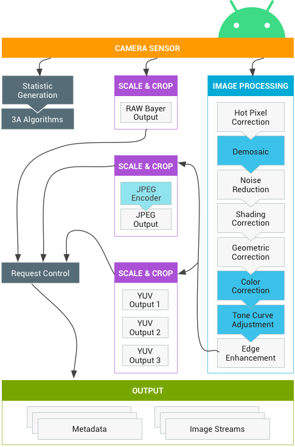
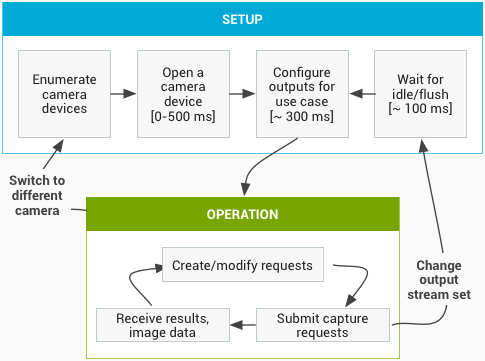
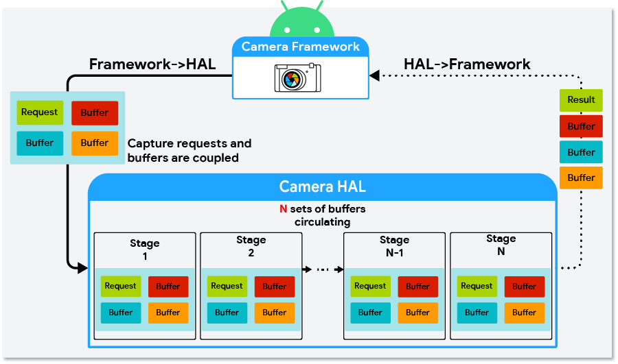
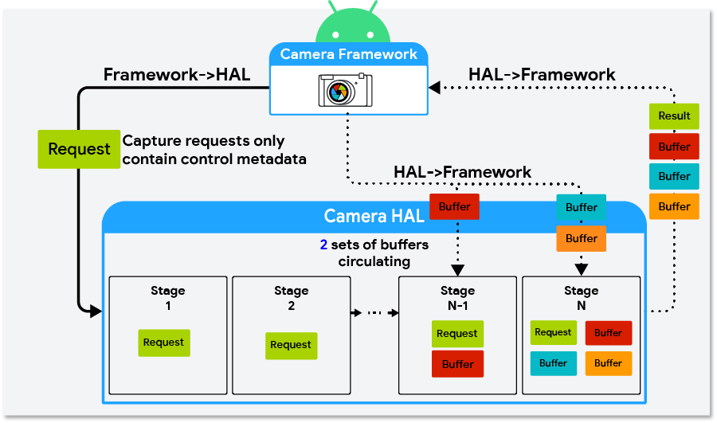
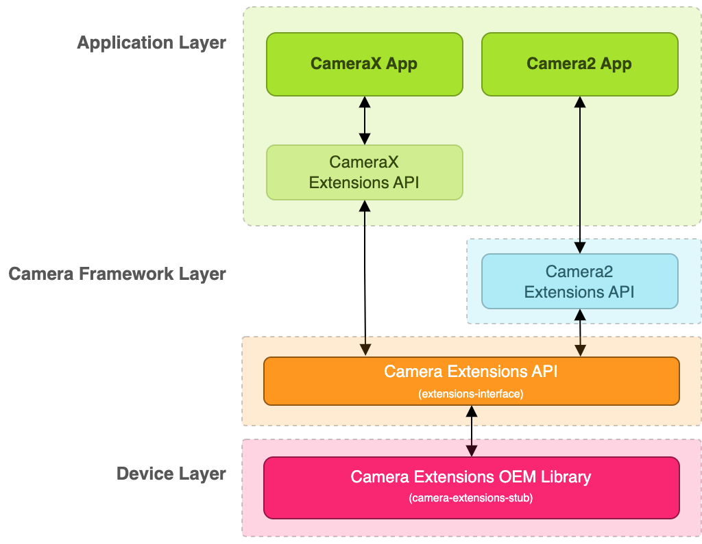

# 概览

Android 的相机硬件抽象层 (HAL) 可将 [Camera 2](http://developer.android.com/reference/android/hardware/package-summary.html?hl=zh-cn) 中较高层级的相机框架 API 连接到底层的相机驱动程序和硬件。相机子系统包括相机管道组件的实现，而相机 HAL 可提供用于实现您的这些组件版本的接口。


- 应用框架

  应用代码位于应用框架级别，它使用 [Camera 2](https://developer.android.com/reference/android/hardware/camera2/package-summary?hl=zh-cn) API 与相机硬件进行互动。在内部，此代码会调用相应的 [Binder](https://developer.android.com/reference/android/os/Binder.html?hl=zh-cn) 接口，以访问与相机互动的原生代码。

- AIDL

  与 `CameraService` 关联的 binder 接口可在 [frameworks/av/camera/aidl/android/hardware](https://android.googlesource.com/platform/frameworks/av/+/master/camera/aidl/android/hardware/ICameraService.aidl) 中找到。生成的代码会调用较低级别的原生代码以获取对实体相机的访问权限，并返回用于在框架级别创建 [`CameraDevice`](https://developer.android.com/reference/android/hardware/camera2/CameraDevice?hl=zh-cn) 并最终创建 [`CameraCaptureSession`](https://developer.android.com/reference/android/hardware/camera2/CameraCaptureSession.html?hl=zh-cn) 对象的数据。

- 原生框架

  此框架位于 `frameworks/av/` 中，并提供相当于 [`CameraDevice`](https://developer.android.com/reference/android/hardware/camera2/CameraDevice?hl=zh-cn) 和 [`CameraCaptureSession`](https://developer.android.com/reference/android/hardware/camera2/CameraCaptureSession?hl=zh-cn) 类的原生类。另请参阅 [NDK camera2 参考](https://developer.android.com/ndk/reference/group/camera?hl=zh-cn)。

- binder IPC 接口

  IPC binder 接口用于实现跨越进程边界的通信。调用相机服务的若干个相机 binder 类位于 `frameworks/av/camera/camera/aidl/android/hardware` 目录中。[`ICameraService`](https://android.googlesource.com/platform/frameworks/av/+/master/camera/aidl/android/hardware/ICameraService.aidl) 是相机服务的接口；[`ICameraDeviceUser`](https://android.googlesource.com/platform/frameworks/av/+/master/camera/aidl/android/hardware/camera2/ICameraDeviceUser.aidl) 是已打开的特定相机设备的接口；[`ICameraServiceListener`](https://android.googlesource.com/platform/frameworks/av/+/master/camera/aidl/android/hardware/ICameraServiceListener.aidl) 和 [`ICameraDeviceCallbacks`](https://android.googlesource.com/platform/frameworks/av/+/master/camera/aidl/android/hardware/camera2/ICameraDeviceCallbacks.aidl) 分别是对应用框架的 `CameraService` 和 `CameraDevice` 回调。

- 相机服务

  位于 `frameworks/av/services/camera/libcameraservice/CameraService.cpp` 下的相机服务是与 HAL 进行互动的实际代码。

- HAL

  硬件抽象层定义了由相机服务调用、且您必须实现以确保相机硬件正常运行的标准接口。

## 实现 HAL

HAL 位于相机驱动程序和更高级别的 Android 框架之间，它定义您必须实现的接口，以便应用可以正确地操作相机硬件。相机 HAL 的 [HIDL](https://source.android.com/docs/core/architecture/hidl?hl=zh-cn) 接口在 [hardware/interfaces/camera](https://android.googlesource.com/platform/hardware/interfaces/+/master/camera/) 中定义。

典型的绑定式 HAL 必须实现以下 HIDL 接口：

- [`ICameraProvider`](https://android.googlesource.com/platform/hardware/interfaces/+/refs/heads/master/camera/provider/2.4/ICameraProvider.hal)：用于枚举单个设备并管理其状态。
- [`ICameraDevice`](https://android.googlesource.com/platform/hardware/interfaces/+/refs/heads/master/camera/device/3.2/ICameraDevice.hal)：相机设备接口。
- [`ICameraDeviceSession`](https://android.googlesource.com/platform/hardware/interfaces/+/refs/heads/master/camera/device/3.2/ICameraDeviceSession.hal)：活跃的相机设备会话接口。

参考 HIDL 实现适用于 [`CameraProvider.cpp`](https://android.googlesource.com/platform/hardware/interfaces/+/master/camera/provider/2.4/default/CameraProvider_2_4.cpp)、[`CameraDevice.cpp`](https://android.googlesource.com/platform/hardware/interfaces/+/master/camera/device/3.2/default/CameraDevice.cpp) 和 [`CameraDeviceSession.cpp`](https://android.googlesource.com/platform/hardware/interfaces/+/master/camera/device/3.2/default/CameraDeviceSession.cpp)。该实现封装了仍在使用[旧版 API](https://android.googlesource.com/platform/hardware/libhardware/+/master/include/hardware/camera3.h) 的旧 HAL。从 Android 8.0 开始，相机 HAL 实现必须使用 HIDL API；不支持使用旧版接口。

**输入验证**

由于 HAL 可以访问与相机服务不同的资源，因此两者之间的边界被视为安全性边界。这意味着，从相机服务传递的参数被视为不可信且未经过排错。为防止出现使攻击者能够升级其权限或访问其不应有权访问的数据的安全漏洞，相机 HAL 必须验证从相机服务传递到 HAL 的参数。这包括检查缓冲区长度值是否在允许的范围内，并在使用参数以及将参数传递给硬件或内核驱动程序之前对参数进行排错。


# 架构

## Camera HAL

Android 的相机硬件抽象层 (HAL) 可将 [android.hardware.camera2](https://developer.android.com/reference/android/hardware/camera2/package-summary?hl=zh-cn) 中较高级别的相机框架 API 连接到底层的相机驱动程序和硬件。从 Android 13 开始，相机 HAL 接口使用 [AIDL](https://source.android.com/docs/core/camera/camera3?hl=zh-cn#aidl-camera-hal) 进行开发。


### AIDL camera HAL

Android 13 及以上设备，相机框架包含对 AIDL 相机 HAL 的支持。该相机框架还支持 HIDL 相机 HAL，不过，在 Android 13 或更高版本中添加的相机功能只能通过 AIDL 相机 HAL 接口使用。如需在升级到 Android 13 或更高版本的设备上实现此类功能，设备制造商必须将其 HAL 进程从使用 HIDL 相机接口迁移到使用 AIDL 相机接口。

如需了解 AIDL 的优势，请参阅[使用 AIDL 实现 HAL](https://source.android.com/docs/core/architecture/aidl/aidl-hals?hl=zh-cn#motivation)。


**实现 AIDL camera HAL**

AIDL camera HAL 实现, see [`hardware/google/camera/common/hal/aidl_service/`](https://cs.android.com/android/platform/superproject/+/main:hardware/google/camera/common/hal/aidl_service/).

The AIDL camera HAL specifications are in the following locations:

- Camera provider: [`hardware/interfaces/camera/provider/aidl/`](https://cs.android.com/android/platform/superproject/+/main:hardware/interfaces/camera/provider/aidl/)
- Camera device: [`hardware/interfaces/camera/device/aidl/`](https://cs.android.com/android/platform/superproject/+/main:hardware/interfaces/camera/device/aidl/)
- Camera metadata: [`hardware/interfaces/camera/metadata/aidl/`](https://cs.android.com/android/platform/superproject/+/main:hardware/interfaces/camera/metadata/aidl/)
- Common data types: [`hardware/interfaces/camera/common/aidl/`](https://cs.android.com/android/platform/superproject/+/main:hardware/interfaces/camera/common/aidl/)

对于迁移到 AIDL 的设备，设备制造商可能需要修改 [Android SELinux 政策 (sepolicy)](https://cs.android.com/android/platform/superproject/+/master:system/sepolicy/?hl=zh-cn) 和 RC 文件，具体取决于代码结构。


**验证 AIDL cameraHAL**

如需测试 AIDL 相机 HAL 实现，请确保设备已通过所有 CTS 和 VTS 测试。Android 13 引入了 AIDL VTS 测试 [`VtsAidlHalCameraProvider_TargetTest.cpp`](https://cs.android.com/android/platform/superproject/+/master:hardware/interfaces/camera/provider/aidl/vts/VtsAidlHalCameraProvider_TargetTest.cpp?hl=zh-cn)。


### Camera HAL3 features

重新设计 Android Camera API 目的在于提高应用对于 Android 设备上的相机子系统的控制能力，同时重新组织 API，提高其效率和可维护性。借助额外的控制能力，您可以轻松地在 Android 上构建高品质的相机应用，同时尽可能使用设备专用算法来最大限度提升质量和性能。

相机子系统将多个运行模式整合为一个统一的视图，您可以使用这种视图实现之前的任何模式以及一些其他模式，例如连拍模式。这样一来，便可以提高用户对聚焦、曝光以及更多后期处理（例如降噪、对比度和锐化）效果的控制能力。此外，这种简化的视图还能够使应用开发者更轻松地使用相机的各种功能。

API 将相机子系统塑造为一个管道，该管道可按照 1:1 的基准将传入的帧捕获请求转化为帧。这些请求包含有关帧的捕获和处理的所有配置信息，其中包括分辨率和像素格式；手动传感器、镜头和闪光灯控件；3A 操作模式；RAW 到 YUV 处理控制；统计信息生成等等。

简单来说，应用框架从相机子系统请求帧，然后相机子系统将结果返回到输出流。此外，系统还会针对每组结果生成包含色彩空间和镜头遮蔽等信息的元数据。您可以将相机版本 3 看作相机版本 1 的单向流管道。它会将每个捕获请求转化为传感器捕获的一张图像，这张图像将被处理成：

- 包含有关捕获的元数据的 Result 对象。
- 图像数据的 1 到 N 个缓冲区，每个缓冲区会进入自己的目标 Surface。

可能的输出 Surface 组经过预配置：

- 每个 Surface 都是一个固定分辨率的图像缓冲区数据流的目标位置。
- 一次只能将少量 Surface 配置为输出（约 3 个）。

一个请求中包含所需的全部捕获设置，以及要针对该请求将图像缓冲区（从总配置组）推送到其中的输出 Surface 的列表。请求可以只发生一次（使用 `capture()`），也可以无限重复（使用 `setRepeatingRequest()`）。捕获的优先级高于重复请求的优先级。


## HAL Subsystem

### Request

应用框架针对捕获的结果向相机子系统发出请求。一个请求对应一组结果。请求包含有关捕获和处理这些结果的所有配置信息。其中包括分辨率和像素格式；手动传感器、镜头和闪光灯控件；3A 操作模式；RAW 到 YUV 处理控件；以及统计信息的生成等。这样一来，便可更好地控制结果的输出和处理。一次可发起多个请求，而且提交请求时不会出现阻塞。请求始终按照接收的顺序进行处理。


### HAL and camera subsystem

相机子系统包括相机管道中组件的实现，例如 3A 算法和处理控件。相机 HAL 为您提供了用于实现您的这些组件版本的接口。为了保持多个设备制造商和图像信号处理器（ISP，也称为相机传感器）供应商之间的跨平台兼容性，相机管道模型是虚拟的，且不直接对应于任何真正的 ISP。不过，它与真正的处理管道足够相似，因此您可以有效地将其映射到硬件。此外，它足够抽象，可支持多种不同的算法和运算顺序，而不会影响质量、效率或跨设备兼容性。

相机管道还支持应用框架可以启动来开启自动对焦等功能的触发器。它还会将通知发送回应用框架，以通知应用自动对焦锁定或错误等事件。



请注意，上图所示的一些图像处理块在初始版本中没有明确定义。相机管道做出以下假设：

- RAW Bayer 输出在 ISP 内部不经过任何处理。
- 统计信息根据原始传感器数据生成。
- 将原始传感器数据转换为 YUV 的各种处理块按任意顺序排列。
- 当显示多个刻度和剪裁单元时，所有缩放器单元共享输出区域控件（数字缩放）。不过，每个单元都可能具有不同的输出分辨率和像素格式。

**API 用途摘要**
下面简要介绍了使用 Android Camera API 的步骤。如需查看这些步骤（包括 API 调用）的详细说明，请参阅“启动和预期操作顺序”部分。

1. 监听和枚举相机设备。
2. 打开设备并连接监听器。
3. 配置目标使用情形的输出（如静态捕获、录制等）。
4. 为目标使用情形创建请求。
5. 捕获/重复请求和连拍。
6. 接收结果元数据和图片数据。
7. 切换使用情形时，返回到第 3 步。

**HAL 操作摘要**

- 捕获的异步请求来自于框架。
- HAL 设备必须按顺序处理请求。对于每个请求，均生成输出结果元数据以及一个或多个输出图像缓冲区。
- 请求和结果以及后续请求引用的信息流遵守先进先出规则。
- 指定请求的所有输出的时间戳必须完全相同，以便框架可以根据需要将它们匹配在一起。
- 所有捕获配置和状态（不包括 3A 例程）都包含在请求和结果中。


### 启动和预期操作顺序

本部分详细说明了使用 Camera API 时应遵循的步骤。有关 HIDL 接口的定义，请参阅 [platform/hardware/interfaces/camera/](https://android.googlesource.com/platform/hardware/interfaces/+/master/camera/)。

**枚举、打开相机设备并创建有效会话**

1. 初始化后，框架开始监听实现 `ICameraProvider` 接口的任何现有相机提供程序。如果存在一个或多个此类提供程序，框架将尝试建立连接。
2. 框架通过 `ICameraProvider::getCameraIdList()` 枚举相机设备。
3. 框架通过调用相应的 `ICameraProvider::getCameraDeviceInterface_VX_X()` 来实例化一个新的 `ICameraDevice`。
4. 框架调用 `ICameraDevice::open()` 来创建一个新的有效捕获会话 ICameraDeviceSession。


**使用有效相机会话**

1. 框架调用 `ICameraDeviceSession::configureStreams()` 并传入到 HAL 设备的输入/输出流列表。
2. 框架通过调用 `ICameraDeviceSession::constructDefaultRequestSettings()` 为某些用例请求默认设置。这可能会在 `ICameraDevice::open` 创建 `ICameraDeviceSession` 之后的任何时间发生。
3. 框架通过基于某一组默认设置的设置以及框架之前注册的至少一个输出流来构造第一个捕获请求并将其发送到 HAL。此请求通过 `ICameraDeviceSession::processCaptureRequest()` 发送到 HAL。HAL 必须阻止此调用返回，直到准备好发送下一个请求为止。
4. 框架继续提交请求并根据需要调用 `ICameraDeviceSession::constructDefaultRequestSettings()` 以获取其他用例的默认设置缓冲区。
5. 当请求捕获开始（传感器开始曝光以进行捕获）时，HAL 会调用 `ICameraDeviceCallback::notify()` 并显示 SHUTTER 消息，包括帧号和开始曝光的时间戳。此通知回调不必在对请求第一次调用 `processCaptureResult()` 之前发生，但直到针对相应的捕获调用 `notify()` 之后，才会向应用提供有关该捕获的结果。
6. 经过一定的流水线延迟后，HAL 开始使用 `ICameraDeviceCallback::processCaptureResult()` 将完成的捕获返回到框架。这些捕获按照与提交请求相同的顺序返回。一次可发起多个请求，具体取决于相机 HAL 设备的管道深度。

一段时间后，会出现以下某种情况：

- 框架可能会停止提交新的请求，等待现有捕获完成（所有缓冲区都已填充，所有结果都已返回），然后再次调用 `ICameraDeviceSession::configureStreams()`。这会重置相机硬件和管道，以获得一组新的输入/输出流。可重复使用先前配置中的部分信息流。如果至少还有一个已注册的输出流，框架就会从发送到 HAL 的第一个捕获请求继续。（否则，需要先调用 `ICameraDeviceSession::configureStreams()`。）
- 框架可能会调用 `ICameraDeviceSession::close()` 以结束相机会话。当框架中没有其他处于有效状态的调用时，可能随时会调用此函数；不过，在所有发起的捕获完成（所有结果都已返回，所有缓冲区都已填充）之前，调用可能会阻塞。`close()` 调用返回后，不允许再从 HAL 对 `ICameraDeviceCallback` 进行调用。一旦进行 `close()` 调用，框架便不能再调用其他任何 HAL 设备函数。
- 在发生错误或其他异步事件时，HAL 必须调用 `ICameraDeviceCallback::notify()` 并返回相应的错误/事件消息。从严重的设备范围错误通知返回后，HAL 的行为方式应像对其调用了 `close()` 一样。但是，HAL 必须在调用 `notify()` 之前取消或完成所有待处理的捕获，以便在调用 `notify()` 并返回严重错误时，框架不会收到来自设备的更多回调。在 `notify()` 方法从严重错误消息返回后，`close()` 之外的方法应返回 -ENODEV 或 NULL。



### 硬件级别

相机设备可以根据其功能实现多个硬件级别。如需了解详情，请参阅[支持的硬件级别](https://developer.android.com/reference/android/hardware/camera2/CameraCharacteristics?hl=zh-cn#INFO_SUPPORTED_HARDWARE_LEVEL)。

### 应用捕获请求、3A 控件和处理管道之间的交互

根据 3A 控件块中的设置，相机管道会忽略应用捕获请求中的某些参数，而改用 3A 控件例程提供的值。例如，启用自动曝光后，传感器的曝光时间、帧时长和感光度参数由平台 3A 算法控制，所有应用指定的值都会被忽略。必须在输出元数据中报告由 3A 例程为帧选择的值。下表描述了 3A 控件块的不同模式以及由这些模式控制的属性。有关这些属性的定义，请参阅 [platform/system/media/camera/docs/docs.html](https://android.googlesource.com/platform/system/media/+/master/camera/docs/docs.html) 文件。

| 参数                               | 状态                  | 受控制的属性                                                 |
| :--------------------------------- | :-------------------- | :----------------------------------------------------------- |
| android.control.aeMode             | OFF                   | 无                                                           |
|                                    | ON                    | android.sensor.exposureTime android.sensor.frameDuration android.sensor.sensitivity android.lens.aperture（如果支持的话） android.lens.filterDensity（如果支持的话） |
|                                    | ON_AUTO_FLASH         | 均已开启，还有 android.flash.firingPower、android.flash.firingTime 和 android.flash.mode |
|                                    | ON_ALWAYS_FLASH       | 与 ON_AUTO_FLASH 相同                                        |
|                                    | ON_AUTO_FLASH_RED_EYE | 与 ON_AUTO_FLASH 相同                                        |
| android.control.awbMode            | OFF                   | 无                                                           |
|                                    | WHITE_BALANCE_*       | android.colorCorrection.transform。如果 android.colorCorrection.mode 为 FAST 或 HIGH_QUALITY，则进行特定于平台的调整。 |
| android.control.afMode             | OFF                   | 无                                                           |
|                                    | FOCUS_MODE_*          | android.lens.focusDistance                                   |
| android.control.videoStabilization | OFF                   | 无                                                           |
|                                    | ON                    | 可调整 android.scaler.cropRegion 来实现视频防抖              |
| android.control.mode               | OFF                   | AE、AWB 和 AF 处于停用状态                                   |
|                                    | AUTO                  | 单独使用 AE、AWB 和 AF 设置                                  |
|                                    | SCENE_MODE_*          | 可替换上述所有参数。各个 3A 控件均处于停用状态。             |

在图 2 中，图像处理块中的控件都以类似的原理操作，并且每个块一般都具有 3 种模式：

- OFF：该处理块处于停用状态。无法停用去马赛克、色彩校正和色调曲线调整块。
- FAST：与 OFF 模式相比，在这种模式下，处理块可能不会降低输出帧速率，但是考虑到限制条件，它应该会产生能够产生的最优质输出。通常，该模式会用于预览或视频录制模式，或用于连拍静态图像。在一些设备上，该模式可能等同于 OFF 模式（进行任何处理都会降低帧速率）；而在另外一些设备上，该模式可能等同于 HIGH_QUALITY 模式（最佳质量仍不会降低帧速率）。
- HIGH_QUALITY：在这种模式下，处理块应尽可能产生最优质结果，根据需要降低输出帧速率。通常，该模式会用于拍摄优质静态图像。一些块包括可以被选中的手动控件（而非 FAST 或 HIGH_QUALITY）。例如，色彩校正块支持颜色变换矩阵，而色调曲线调整支持任意的全局色调映射曲线。

相机子系统可以支持的最大帧速率受到多种因素的影响：

- 所请求的输出图像流的分辨率
- 成像器上像素组合/跳过模式的可用性
- 成像器接口的带宽
- 各种 ISP 处理块的带宽

由于这些因素在不同的 ISP 和传感器之间可能有很大差异，因此相机 HAL 接口会设法将带宽限制抽象为尽可能简单的模型。显示的模型具有以下特性：

- 考虑到应用的请求输出流大小，图像传感器始终配置为输出尽可能最小的分辨率。最小分辨率定义为至少与请求的最大输出流一样大。
- 因为任何请求都可能使用当前配置的任意或所有输出流，所以传感器和 ISP 必须配置为支持将单个捕获同时扩展到所有信息流。
- 对于不包含 JPEG 流的请求，JPEG 流表现得像经过处理的 YUV 流一样；在直接引用它们的请求中，它们用作 JPEG 流。
- JPEG 处理器可以并行运行到相机管道的剩余部分，但不能一次处理多个捕获。


# 核心概念

## 3A Modes and State

实际的 3A 算法取决于 HAL 实现，但高级状态机描述由 HAL 接口定义，以支持 HAL 设备和框架就 3A 的当前状态进行通信并触发 3A 事件。

设备开启时，所有单独的 3A 状态都必须为 STATE_INACTIVE。流配置不会重置 3A。例如，在整个 `configure()` 调用期间必须保持焦点锁定。

若要触发 3A 操作，只需在下一个请求的设置中设置相关触发条目，以指示触发开始即可。例如，若要触发自动对焦扫描的启动操作，只需将相应请求的 ANDROID_CONTROL_AF_TRIGGER 条目设为 ANDROID_CONTROL_AF_TRIGGER_START 即可；若要触发自动对焦扫描的取消操作，只需将 ANDROID_CONTROL_AF_TRIGGER 设为 ANDROID_CONTRL_AF_TRIGGER_CANCEL 即可。


3A 由 ANDROID_CONTROL_MODE 设置控制。该设置选项包括关闭 3A (ANDROID_CONTROL_MODE_OFF)、正常自动 (AUTO) 模式 (ANDROID_CONTROL_MODE_AUTO)，以及使用取景模式设置 (ANDROID_CONTROL_USE_SCENE_MODE)：

- 在 OFF 模式下，单个的自动对焦 (AF)、自动曝光 (AE) 和自动白平衡 (AWB) 模式都会有效地关闭，且任何捕获控制都不会被 3A 例程覆盖。
- 在 AUTO 模式下，AF、AE 和 AWB 模式都会运行各自的独立算法，且具有自己的模式、状态和触发元数据条目，具体如下一节所示。
- 在 USE_SCENE_MODE 下，必须使用 ANDROID_CONTROL_SCENE_MODE 条目的值来确定 3A 例程的行为。在除 FACE_PRIORITY 以外的 SCENE_MODE 下，HAL 必须将 ANDROID_CONTROL_AE/AWB/AF_MODE 的值替换为它倾向于让所选的 SCENE_MODE 使用的模式。例如，HAL 可能倾向于在 SCENE_MODE_NIGHT 下使用 CONTINUOUS_FOCUS AF 模式。当必须忽略这些取景模式下的场景时，用户可随意选择 AE/AWB/AF_MODE。
- 对于 SCENE_MODE_FACE_PRIORITY，AE/AWB/AFMODE 控件的工作方式与在 ANDROID_CONTROL_MODE_AUTO 模式下相同，但 3A 例程必须偏向测光，并对焦到场景中任何已检测到的人脸上。


自动对焦设置和结果条目

自动曝光

自动白平衡


## Camera Debugging

watch


dumpsys

`dumpsys` 命令提供相机服务的一系列调试信息。以下命令可通过相机服务捕获整个调试转储：

```
adb shell dumpsys media.camera
```


## Errors and Streams

## Metadata and Controls


## Output and Cropping

### Output streams

相机子系统仅在基于 ANativeWindow 的管道上运行，适用于所有分辨率和输出格式。可以一次配置多个流，以将单个帧发送到许多目标，例如 GPU、视频编码器、RenderScript 或应用程序可见缓冲区（RAW Bayer、处理后的 YUV 缓冲区或 JPEG 编码缓冲区）。

出于优化的目的，这些输出流必须提前配置，而且只有有限的输出流可同时存在。这样一来，就可以预先分配内存缓冲区并配置相机硬件，以便在列出多个或者不同输出管道的情况下提交请求时，不会出现请求延迟执行的情况。


### Cropping


### Reprocessing

对原始图片文件提供额外的支持功能，即支持对 RAW Bayer 数据进行重新处理。该支持功能允许相机管道处理之前捕获的 RAW 缓冲区和元数据（之前记录的整个帧），以生成新渲染的 YUV 或 JPEG 输出。


### Zoom

## Request Creation

## Stream Configuration


# 性能

## Camera HAL3 Buffer Management APIs

Android 10 引入了可选的[相机 HAL3](https://source.android.com/devices/camera/camera3?hl=zh-cn) 缓冲区管理 API，使您能够实现缓冲区管理逻辑，以便在相机 HAL 实现中达成不同的内存和拍摄延迟折衷权衡。

相机 HAL 需要 N 个请求（其中 N 等于[管道深度](https://developer.android.com/reference/android/hardware/camera2/CaptureResult.html?hl=zh-cn#REQUEST_PIPELINE_DEPTH)）在其管道中排队，但通常不需要同时使用所有 N 组输出缓冲区。

例如，在 HAL 管道中排队的请求可能有 8 个，但 HAL 只需使用管道最后阶段的 2 个请求的输出缓冲区。在 Android 9 及更低的设备上，当请求在 HAL 中排队时，相机框架会分配缓冲区，从而使 HAL 中有 6 组未使用的缓冲区。在 Android 10 中，相机 HAL3 缓冲区管理 API 允许分离输出缓冲区，从而释放 6 组缓冲区的空间。高端设备可以节省数百兆的内存，而对于低内存设备，也非常有用。

图 1 为搭载 Android 9 及更低版本的设备的相机 HAL 接口示意图。



图 2 显示的是已实现相机 HAL3 缓冲区管理 API 的 Android 10 中的相机 HAL 接口。




### 实现缓冲区管理 API

**requestStreamBuffers**

通过 `requestStreamBuffers` 方法，调用方可以在一次调用中从多个输出流请求多个缓冲区，从而减少 HIDL IPC 调用的次数。不过，如果同时请求的缓冲区增加，调用所需的时间也会增加，这可能会导致从请求到结果的总延迟时间增加。此外，由于 `requestStreamBuffers` 调用已在相机服务中序列化，因此建议相机 HAL 使用专用的高优先级线程来请求缓冲区。

如果缓冲区请求失败，相机 HAL 必须能够妥善处理非严重错误。缓冲区请求失败的常见原因以及相机 HAL 应如何处理这些失败。

- **应用与输出流断开连接**：这种情况属于非严重错误。相机 HAL 应针对任何以已断开连接的输出流为目标的拍摄请求发送 [`ERROR_REQUEST`](https://android.googlesource.com/platform/hardware/interfaces/+/master/camera/device/3.2/types.hal#583)，并做好正常处理后续请求的准备。
- **超时**：如果应用在忙于执行密集型处理操作，同时保留某些缓冲区，则可能会发生超时情况。相机 HAL 应针对因超时错误而无法完成的拍摄请求发送 [`ERROR_REQUEST`](https://android.googlesource.com/platform/hardware/interfaces/+/master/camera/device/3.2/types.hal#583)，并做好正常处理后续请求的准备。
- **相机框架正在准备新的输出流配置**：相机 HAL 应等到下一次 [`configureStreams`](https://android.googlesource.com/platform/hardware/interfaces/+/master/camera/device/3.2/ICameraDeviceSession.hal#167) 调用完成后，再重新调用 `requestStreamBuffers`。
- **相机 HAL 已达到其[缓冲区限制](https://android.googlesource.com/platform/hardware/interfaces/+/master/camera/device/3.2/types.hal#382)（`maxBuffers` 字段）**：相机 HAL 应等到返回输出流的至少一个缓冲区后，再重新调用 `requestStreamBuffers`。


**returnStreamBuffers**

**signalStreamFlush**


### 实现缓冲区管理 API 的行为变更

使用缓冲区管理 API 去实现缓冲区管理逻辑时，请考虑相机和相机 HAL 实现可能会发生的行为变更：

- **拍摄请求到达相机 HAL 的速度更快、频率更高**：如果不使用缓冲区管理 API，相机框架会先为每个拍摄请求请求输出缓冲区，然后再向相机 HAL 发送拍摄请求。而使用缓冲区管理 API 后，相机框架无需再等待缓冲区请求完成，因此可以更早地向相机 HAL 发送拍摄请求。

  此外，如果不使用缓冲区管理 API，当拍摄请求的其中一个输出流达到 HAL 一次可容纳的最大缓冲区数（此值由相机 HAL 在 `configureStreams` 调用的返回值中的 `HalStream::maxBuffers` 字段中指定）时，相机框架会停止发送拍摄请求。如果使用缓冲区管理 API，此限制行为不再存在，而且如果 HAL 中排队的拍摄请求过多，相机 HAL 实现不得接受 `processCaptureRequest` 调用。

- **`requestStreamBuffers` 调用延迟变化显著**：导致 `requestStreamBuffers` 调用所需时间超过平均时间的原因有很多。例如：

  - 对于新建输出流的前几个缓冲区而言，调用所需时间可能较长，因为设备需要分配内存。
  - 预期延迟时间会按每次调用时请求的缓冲区数成比例增加。
  - 应用正在保留缓冲区并忙于处理操作。这可能会导致缓冲区请求因缓冲区不足或 CPU 繁忙而降速或超时。


### 缓冲区管理策略

缓冲区管理 API 支持实现各种类型的缓冲区管理策略。以下是一些示例：

- **向后兼容**：HAL 在调用 `processCaptureRequest` 期间为拍摄请求请求缓冲区。此策略不会节省任何内存，但可用作缓冲区管理 API 的第一个实现，几乎不需要更改现有相机 HAL 的代码。
- **最大限度地节省内存**：相机 HAL 仅在需要填充缓冲区之前立即请求输出缓冲区。此策略可最大限度地节省内存。此策略的潜在弊端是，当完成缓冲区请求所需的时间过长时，相机管道会出现更多卡顿。
- **已缓存**：相机 HAL 缓存少许缓冲区，以降低缓冲区请求速度偶尔较慢时受到影响的可能性。

相机 HAL 可针对特定使用情形采用不同的策略，例如，对于使用大量内存的使用情形采用“最大限度地节省内存”策略，对于其他使用情形则采用“向后兼容”策略。


## Session Parameters

## Single Producer, Multiple Consumer


# 相机功能

## 10-Bit Camera Output

设备要有 10-bit 或更高的 camera sensor 和对应的 ISP 支持。


**验证**

三个阶段的验证。

- [测试 API 功能正确性](https://source.android.com/docs/core/camera/10-bit-camera-output?hl=zh-cn#test-api-functional-correctness)
- [比较原生相机和第三方应用](https://source.android.com/docs/core/camera/10-bit-camera-output?hl=zh-cn#compare-native-third-party-app)
- [比较标准动态范围和高动态范围](https://source.android.com/docs/core/camera/10-bit-camera-output?hl=zh-cn#compare-sdr-hdr)


## Camera Bokeh


## Concurrent Camera Streaming

Android 允许设备支持摄像头设备的并发流式传输。例如，这可以让设备同时运行前置摄像头和后置摄像头。


**资源分配问题**

如果相机 HAL 宣传支持相机设备的并发操作，它们可能会遇到资源分配问题，特别是在手机上有足够的图像信号处理器 (ISP) 资源来同时传输前置和后置（或其他）相机的情况下，但没有充分发挥其能力。在这种情况下，相机HAL必须为每个相机设备分配有限的硬件资源。

示例问题场景：

- 摄像头 ID `0` 是一个由广角摄像头和超广角摄像头组成的逻辑摄像头，其中每个摄像头都占用一个 ISP 资源。
- 摄像头 ID `1` 是占用一个 ISP 资源的摄像头。

设备（手机）有两个 ISP。如果打开摄像头 ID `0` 并配置会话，则相机 HAL 可能会预留两个 ISP 来满足同时使用超广角和广角摄像头的情况。

如果是这种情况，前置摄像头 (ID `1`) 就无法配置任何数据流，因为两个 ISP 都正在使用中。


为了解决此问题，相机框架需要在配置会话之前将摄像头 ID `0` 和 `1` 都打开，以便向相机 HAL 提供有关如何分配资源的提示（因为它现在要求执行并发操作）。 但是，这可能会导致功能受限，例如，缩放功能可能无法处理完整的缩放范围比例（因为切换实体摄像头 ID 可能会带来问题）。

- 要求在执行并发摄像头操作时，相机框架必须先打开摄像头设备 (`@3.2::ICameraDevice::open`)，然后再配置摄像头设备上的任何会话。这将使相机提供程序能够相应地分配资源。
- 为了解决无法处理完整缩放范围比例的问题，请确保在同时使用摄像头时，相机应用只能将 `ZOOM_RATIO` 控制设置为 1 倍至 `MAX_DIGITAL_ZOOM`，而不是完整的 `ZOOM_RATIO_RANGE`（这样可以防止因内部切换实体摄像头而需要更多 ISP）。


## Camera Extension

设备制造商可以通过 OEM 供应商库提供的相机扩展接口向第三方开发者提供焦外成像、夜间模式和 HDR 等扩展。开发者可以使用 [Camera2 Extensions API](https://developer.android.com/training/camera2/extensions-api?hl=zh-cn) 和 [CameraX Extensions API](https://developer.android.com/training/camerax/extensions-api?hl=zh-cn) 访问在 OEM 供应商库中实现的扩展。




## Camera Preview Stabilization


## External USB Cameras

## High Dynamic Range Modes

## HEIF Imaging

## Monochrome Cameras

## Motion Tracking

## Multi-Camera Support

## Torch Strength Control

Android 13 或更高版本的设备，Android 框架针对手电筒强度提供了多级控制。


## Ultra HDR

[Ultra HDR 图片拍摄实现示例](https://github.com/android/platform-samples/pull/56)


## Wide Gamut Capture

Android 14 或更高版本的设备，Android 支持 Display P3 广色域拍摄。设备可以使用 `ImageReader` 类拍摄 JPEG 格式的广色域色彩图片，而无需使用 [10 位 HDR](https://source.android.com/docs/core/camera/10-bit-camera-output?hl=zh-cn)。借助此功能，设备可以通过 `SessionConfiguration` 中的 [`setColorSpace`](https://developer.android.com/reference/android/hardware/camera2/params/SessionConfiguration?hl=zh-cn#setColorSpace(android.graphics.ColorSpace.Named)) 参数请求向 Camera2 框架请求广色域空间中的相机拍摄。


