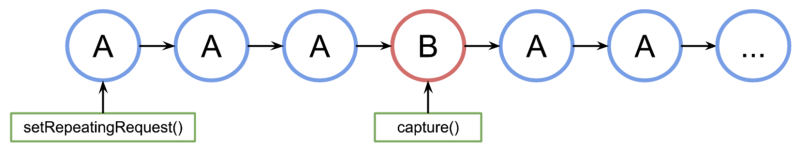

[Camera2](https://developer.android.com/media/camera/choose-camera-library)

[camera2 API](https://developer.android.com/reference/android/hardware/camera2/package-summary)

[android/camera-samples](https://github.com/android/camera-samples)


# Camera2

## 1. 相机捕获会话和请求

Camera capture sessions and requests

一台设备可有多个摄像头。每颗摄像头都是一个  [`CameraDevice`](https://developer.android.com/reference/android/hardware/camera2/CameraDevice?hl=zh-cn)，并且 `CameraDevice` 可以同时输出多个数据流。

这样做的一个原因是，可以针对特定任务（如显示取景器）优化一个流（来自 CameraDevice 的连续相机帧），而其他流（stream）可用于拍摄照片或录制视频。这些数据流充当并行流水线（pipeline），处理来自相机的原始帧，一次处理一帧：


并行处理性能限制取决于 CPU、GPU 或其他处理器的可用处理能力。如果 pipeline 处理跟不上传入的帧，就会开始丢弃帧。

每个 pipeline 都有自己的输出格式。传入的 raw data 通过和每个 pipeline 关联的隐式逻辑自动转换成对应的输出格式。

可以使用 `CameraDevice` 创建一个特定于该 `CameraDevice` 的 [`CameraCaptureSession`](https://developer.android.com/reference/android/hardware/camera2/CameraCaptureSession?hl=zh-cn)。`CameraDevice` 必须使用 `CameraCaptureSession` 接收每个 raw 帧的帧配置。该配置用于指定相机属性，如自动对焦、光圈、效果和曝光。硬件限制，在任何时间，摄像头传感器中只有一个配置处于活跃状态，称“活跃”配置。

`CameraCaptureSession` 描述了绑定到 `CameraDevice` 的所有可能的 pipeline。创建会话后，您无法添加或移除 pipeline。`CameraCaptureSession` 会维护一个 [`CaptureRequest`](https://developer.android.com/reference/android/hardware/camera2/CaptureRequest?hl=zh-cn) s的队列，该队列为活跃配置。

`CaptureRequest` 会将配置添加到队列中，并选择一条、多个或所有可用 pipeline 从 `CameraDevice` 接收帧。您可以在一个 capture session 的生命周期内发送多个拍摄请求。每个请求都可以更改活跃配置和接收raw image的一组输出 pipeline。


### 使用 Stream Use Cases 提高性能

[`setStreamUseCase`](https://developer.android.com/reference/android/hardware/camera2/params/OutputConfiguration?hl=zh-cn#setStreamUseCase(long))

Stream Use Cases 是提高 Camera2 capture session 性能的一种方法。它为设备提供更多信息来调整参数，从而为特定任务提供更好的相机体验。摄像头设备可以根据每个数据流的用户场景来优化相机硬件和软件流水线。

除了在 `CameraDevice.createCaptureRequest()` 中设置模板之外，在数据流用例中，还可以更详细地指定如何使用特定相机数据流。这样，相机硬件就可以根据适合特定用例的质量或延迟权衡来优化参数，例如微调、传感器模式或相机传感器设置。

stream use case 和 capture intent 的主要区别在于，前者让 camera device 根据每个 stream 的用户使用场景优化相机软硬件 pipeline，而后者主要是提示相机决定适用于整个 session 的最佳 3A 策略。摄像机设备根据 stream’s use cases 进行配置，如选择调整参数、选择传感器模式和构建图像处理流水线。捕捉意图随后用于微调 3A 行为，如调整 AE/AF 融合速度，捕捉意图在会话期间可能会发生变化。例如，对于具有 PREVIEW_VIDEO_STILL 用例流和 STILL_CAPTURE 用例流的会话，捕捉意图可能是 PREVIEW（具有快速 3A 融合速度和自动控制闪光测光功能，用于实时预览）、STILL_CAPTURE（具有最佳 3A 参数，用于静态照片捕捉）或 VIDEO_RECORD（具有较慢的 3A 融合速度，用于更好的视频回放体验）。

数据流用例包括：

- `DEFAULT`：涵盖所有现有应用行为。这相当于不设置任何数据流用例。
- `PREVIEW`：建议用于取景器或应用内图像分析。
- `STILL_CAPTURE`：针对高品质高分辨率拍摄进行了优化，不需要保持类似预览的帧速率。
- `VIDEO_RECORD`：已针对高品质视频拍摄（包括高品质图像防抖）进行了优化（如果设备支持并由应用启用）。此选项可能会生成与实时相差极大的输出帧，以实现最高质量的防抖或其他处理。
- `VIDEO_CALL`：建议用于容易耗电的长时间运行摄像头。
- `PREVIEW_VIDEO_STILL`：建议用于社交媒体应用或单流用例。这是一种多用途的视频流
- `VENDOR_START`：用于 OEM 定义的用例。


### 创建 CameraCaptureSession

创建 camera session，需要提供一个或多个你的应用可以写入输出帧的输出缓冲区。每个缓冲区表示一个 pipeline。必须在开始使用 camera 之前执行此操作，让 framework 可以配置设备的内部流水线，并为将帧发送到所需的输出目标分配内存缓冲区。

代码段展示了如何准备具有两个输出缓冲区（一个属于 [`SurfaceView`](https://developer.android.com/reference/android/view/SurfaceView?hl=zh-cn)，另一个属于 [`ImageReader`](https://developer.android.com/reference/android/media/ImageReader?hl=zh-cn)）的相机会话。将 [`PREVIEW`](https://developer.android.com/training/camerax/preview?hl=zh-cn#scale-type) 数据流用例添加到 `previewSurface` 并将 [`STILL_CAPTURE`](https://developer.android.com/training/camerax/take-photo?hl=zh-cn#set-up-image-capture) 数据流用例添加到 `imReaderSurface`，可让设备进一步优化这些数据流。

```kotlin
// Retrieve the target surfaces, which might be coming from a number of places:
// 1. SurfaceView, if you want to display the image directly to the user
// 2. ImageReader, if you want to read each frame or perform frame-by-frame
// analysis
// 3. OpenGL Texture or TextureView, although discouraged for maintainability
      reasons
// 4. RenderScript.Allocation, if you want to do parallel processing
val surfaceView = findViewById<SurfaceView>(...)
val imageReader = ImageReader.newInstance(...)

// Remember to call this only *after* SurfaceHolder.Callback.surfaceCreated()
val previewSurface = surfaceView.holder.surface
val imReaderSurface = imageReader.surface
val targets = listOf(previewSurface, imReaderSurface)

// Create a capture session using the predefined targets; this also involves
// defining the session state callback to be notified of when the session is
// ready
// Setup Stream Use Case while setting up your Output Configuration.
@RequiresApi(Build.VERSION_CODES.TIRAMISU)
fun configureSession(device: CameraDevice, targets: List
```

此时还未定义相机的 active configuration。会话配置后，可以创建并分发 capture requests 来执行此操作。

在将输入写入其缓冲区时，应用于输入的转换由每个目标的类型决定，该类型必须是 [`Surface`](https://developer.android.com/reference/android/view/Surface?hl=zh-cn)。Android 框架知道如何将活动配置中的原始图像转换为适合每个目标的格式。转换由特定 `Surface` 的像素格式和大小控制。

 [`createCaptureSession()`](https://developer.android.com/reference/android/hardware/camera2/CameraDevice#createCaptureSession(android.hardware.camera2.params.SessionConfiguration)) 


### Single CaptureRequest

每帧所用的配置编码在 CaptureRequest 中，发送到 camera。要创建一个 capture request，可以使用 预定义的 [templates](https://developer.android.com/reference/android/hardware/camera2/CameraDevice#constants_1) ，也可以使用 `TEMPLATE_MANUAL` 进行完全控制。选择模板时，需要提供一个或多个要用于请求的输出缓冲区。您只能使用已在要使用的捕获会话上定义的缓冲区。

捕获请求使用  [builder pattern](https://developer.android.com/reference/android/hardware/camera2/CaptureRequest.Builder)，开发者可以设置[许多不同的选项](https://developer.android.com/reference/android/hardware/camera2/CaptureRequest?hl=zh-cn#fields_1)，包括[自动曝光](https://developer.android.com/reference/android/hardware/camera2/CaptureRequest?hl=zh-cn#CONTROL_AE_MODE)、[自动对焦](https://developer.android.com/reference/android/hardware/camera2/CaptureRequest?hl=zh-cn#CONTROL_AF_MODE)和[镜头光圈](https://developer.android.com/reference/android/hardware/camera2/CaptureRequest?hl=zh-cn#LENS_APERTURE)。设置字段之前，确保特定选项可用于设备，调用[`CameraCharacteristics.getAvailableCaptureRequestKeys()`](https://developer.android.com/reference/android/hardware/camera2/CameraCharacteristics?hl=zh-cn#getAvailableCaptureRequestKeys())，并通过检查相应的相机特性（例如[可用的自动曝光模式](https://developer.android.com/reference/android/hardware/camera2/CameraCharacteristics?hl=zh-cn#CONTROL_AE_AVAILABLE_MODES)）支持所需的值。

使用预览模板创建 `SurfaceView` 的拍摄请求，使用 [`CameraDevice.TEMPLATE_PREVIEW`](https://developer.android.com/reference/android/hardware/camera2/CameraDevice?hl=zh-cn#TEMPLATE_PREVIEW)

```kotlin
val session: CameraCaptureSession = ...  // from CameraCaptureSession.StateCallback
val captureRequest = session.device.createCaptureRequest(CameraDevice.TEMPLATE_PREVIEW)
captureRequest.addTarget(previewSurface)
```

定义拍摄请求后，您现在可以将其[分派](https://developer.android.com/reference/android/hardware/camera2/CameraCaptureSession?hl=zh-cn#capture(android.hardware.camera2.CaptureRequest, android.hardware.camera2.CameraCaptureSession.CaptureCallback, android.os.Handler))到相机会话：

```kotlin
val session: CameraCaptureSession = ...  // from CameraCaptureSession.StateCallback
val captureRequest: CaptureRequest = ...  // from CameraDevice.createCaptureRequest()

// The first null argument corresponds to the capture callback, which you
// provide if you want to retrieve frame metadata or keep track of failed capture
// requests that can indicate dropped frames; the second null argument
// corresponds to the Handler used by the asynchronous callback, which falls
// back to the current thread's looper if null
session.capture(captureRequest.build(), null, null)
```

当某个输出帧被放入特定缓冲区时，会触发[捕获回调](https://developer.android.com/reference/android/hardware/camera2/CameraCaptureSession.CaptureCallback?hl=zh-cn)。在许多情况下，处理包含的帧时会触发其他回调（例如 [`ImageReader.OnImageAvailableListener`](https://developer.android.com/reference/android/media/ImageReader.OnImageAvailableListener?hl=zh-cn)）。此时，您可以从指定的缓冲区检索图像数据。


### Repeat CaptureRequests

Single CaptureRequest 不适用于显示实时预览和视频。这些场景下，你需要接受连续的 frame stream。

```kotlin
val session: CameraCaptureSession = ...  // from CameraCaptureSession.StateCallback
val captureRequest: CaptureRequest = ...  // from CameraDevice.createCaptureRequest()

// This keeps sending the capture request as frequently as possible until the
// session is torn down or session.stopRepeating() is called
// session.setRepeatingRequest(captureRequest.build(), null, null)
```

Repeat CaptureRequest 会让设备使用提供的  `CaptureRequest` 中的设置持续拍摄图片。Camera2 API 还允许用户通过发送重复 `CaptureRequests` 从相机拍摄视频，如 GitHub 上的此 [Camera2 示例](https://github.com/android/camera-samples/tree/master/Camera2Video)代码库所示。它还可以通过使用重复连拍 `CaptureRequests` 捕获高速（慢动作）视频来渲染慢动作视频，如 GitHub 上的 [Camera2 慢动作视频示例应用](https://github.com/android/camera-samples/tree/master/Camera2SlowMotion)中所示。


### Interleave CaptureRequests

如需在 Repeat CaptureRequest 处于活跃状态时发送第二个 CaptureRequest，例如显示取景器并允许用户拍摄照片，你无需停止正在进行的 Repeat CaptureRequest。相反，可以在 repeating request 运行时发出 non-repeating capture request。

首次创建会话时，需要将使用的任何输出缓冲区配置为相机会话的一部分。重复请求的优先级低于单帧或burst request：

```kotlin
val session: CameraCaptureSession = ...  // from CameraCaptureSession.StateCallback

// Create the repeating request and dispatch it
val repeatingRequest = session.device.createCaptureRequest(CameraDevice.TEMPLATE_PREVIEW)
repeatingRequest.addTarget(previewSurface)
session.setRepeatingRequest(repeatingRequest.build(), null, null)

// Some time later...

// Create the single request and dispatch it
// NOTE: This can disrupt the ongoing repeating request momentarily
val singleRequest = session.device.createCaptureRequest(CameraDevice.TEMPLATE_STILL_CAPTURE)
singleRequest.addTarget(imReaderSurface)
session.capture(singleRequest.build(), null, null)
```

该方法缺点是：无法确切知道 single request 何时发生。A是重复捕获请求，B是单帧捕获请求，会话处理请求队列如下：



无法保证请求 B 激活之前 A 发出的最后一个重复请求与下次再次使用 A 之间的延迟，因此可能会遇到一些跳帧。改善措施：

- 将请求 A 的输出目标添加到请求 B。这样，当 B 的帧准备就绪时，它就会被复制到 A 的输出目标中。例如，在进行视频快照以保持稳定的帧速率时，这一点至关重要。前面代码中，在构建请求之前添加 `singleRequest.addTarget(previewSurface)` 。
- 使用专为该特定场景设计的模板组合，例如零快门延迟。


## 2. 相机镜头和功能

Camera lenses and capabilities

如何列出相机镜头及其功能，以便您在应用中决定在给定情况下使用哪种镜头。以下代码段会检索所有相机的列表：

```kotlin
try {
    val cameraIdList = cameraManager.cameraIdList // may be empty

    // iterate over available camera devices
    for (cameraId in cameraIdList) {
        val characteristics = cameraManager.getCameraCharacteristics(cameraId)
        val cameraLensFacing = characteristics.get(CameraCharacteristics.LENS_FACING)
        val cameraCapabilities = characteristics.get(CameraCharacteristics.REQUEST_AVAILABLE_CAPABILITIES)

        // check if the selected camera device supports basic features
        // ensures backward compatibility with the original Camera API
        val isBackwardCompatible = cameraCapabilities?.contains(
            CameraMetadata.REQUEST_AVAILABLE_CAPABILITIES_BACKWARD_COMPATIBLE) ?: false
        ...
    }
} catch (e: CameraAccessException) {
    e.message?.let { Log.e(TAG, it) }
    ...
}
```

 `cameraLensFacing` 描述相机相对于设备屏幕朝向的方向，并具有以下值之一：[`CameraMetadata.LENS_FACING_FRONT`](https://developer.android.com/reference/android/hardware/camera2/CameraMetadata?hl=zh-cn#LENS_FACING_FRONT)、[`CameraMetadata.LENS_FACING_BACK`](https://developer.android.com/reference/android/hardware/camera2/CameraMetadata?hl=zh-cn#LENS_FACING_BACK)、[`CameraMetadata.LENS_FACING_EXTERNAL`](https://developer.android.com/reference/android/hardware/camera2/CameraMetadata?hl=zh-cn#LENS_FACING_EXTERNAL)


### 选择合理的默认配置

默认打开特定摄像头（如果可用）。例如，自拍应用可能会打开前置摄像头，而增强现实应用可能会从后置摄像头启动。以下函数会返回面向指定方向的第一个镜头：

```kotlin
fun getFirstCameraIdFacing(cameraManager: CameraManager,
                           facing: Int = CameraMetadata.LENS_FACING_BACK): String? {
    try {
        // Get list of all compatible cameras
        val cameraIds = cameraManager.cameraIdList.filter {
            val characteristics = cameraManager.getCameraCharacteristics(it)
            val capabilities = characteristics.get(CameraCharacteristics.REQUEST_AVAILABLE_CAPABILITIES)
            capabilities?.contains(
                    CameraMetadata.REQUEST_AVAILABLE_CAPABILITIES_BACKWARD_COMPATIBLE) ?: false
        }

        // Iterate over the list of cameras and return the first one matching desired
        // lens-facing configuration
        cameraIds.forEach {
            val characteristics = cameraManager.getCameraCharacteristics(it)
            if (characteristics.get(CameraCharacteristics.LENS_FACING) == facing) {
                return it
            }
        }

        // If no camera matched desired orientation, return the first one from the list
        return cameraIds.firstOrNull()
    } catch (e: CameraAccessException) {
        e.message?.let { Log.e(TAG, it) }
    }
}
```


### 切换摄像头

许多设备有多个朝同一方向的摄像头。有些甚至配有外接 USB 摄像头。如需为用户提供一个界面，使其能够在不同的朝向摄像头之间切换，请针对每种可能的镜头朝向配置选择第一个可用的摄像头。

虽然没有用于选择下一个摄像头的通用逻辑，但以下代码适用于大多数用例：

```kotlin
fun filterCompatibleCameras(cameraIds: Array<String>,
                            cameraManager: CameraManager): List<String> {
    return cameraIds.filter {
        val characteristics = cameraManager.getCameraCharacteristics(it)
        characteristics.get(CameraCharacteristics.REQUEST_AVAILABLE_CAPABILITIES)?.contains(
                CameraMetadata.REQUEST_AVAILABLE_CAPABILITIES_BACKWARD_COMPATIBLE) ?: false
    }
}

fun filterCameraIdsFacing(cameraIds: List<String>, cameraManager: CameraManager,
                          facing: Int): List<String> {
    return cameraIds.filter {
        val characteristics = cameraManager.getCameraCharacteristics(it)
        characteristics.get(CameraCharacteristics.LENS_FACING) == facing
    }
}

fun getNextCameraId(cameraManager: CameraManager, currCameraId: String? = null): String? {
    // Get all front, back and external cameras in 3 separate lists
    val cameraIds = filterCompatibleCameras(cameraManager.cameraIdList, cameraManager)
    val backCameras = filterCameraIdsFacing(
            cameraIds, cameraManager, CameraMetadata.LENS_FACING_BACK)
    val frontCameras = filterCameraIdsFacing(
            cameraIds, cameraManager, CameraMetadata.LENS_FACING_FRONT)
    val externalCameras = filterCameraIdsFacing(
            cameraIds, cameraManager, CameraMetadata.LENS_FACING_EXTERNAL)

    // The recommended order of iteration is: all external, first back, first front
    val allCameras = (externalCameras + listOf(
            backCameras.firstOrNull(), frontCameras.firstOrNull())).filterNotNull()

    // Get the index of the currently selected camera in the list
    val cameraIndex = allCameras.indexOf(currCameraId)

    // The selected camera may not be in the list, for example it could be an
    // external camera that has been removed by the user
    return if (cameraIndex == -1) {
        // Return the first camera from the list
        allCameras.getOrNull(0)
    } else {
        // Return the next camera from the list, wrap around if necessary
        allCameras.getOrNull((cameraIndex + 1) % allCameras.size)
    }
}
```

极端情况，请参阅 [`CameraMetadata.REQUEST_AVAILABLE_CAPABILITIES_LOGICAL_MULTI_CAMERA`](https://developer.android.com/reference/android/hardware/camera2/CameraMetadata?hl=zh-cn#REQUEST_AVAILABLE_CAPABILITIES_LOGICAL_MULTI_CAMERA)。


## 3. 同时使用多个 camera streams

Multiple camera streams simultaneously

相机可以同时使用多个 frame stream。某些情况下，不同 stream 需要不同的 frame resolution 或 pixel format。典型场景：

- **视频录制**：一个流用于预览，另一个流进行编码并保存至文件中。
- **条形码扫描**：一个流用于预览，另一个流用于条形码检测。
- **计算摄影**：一个用于预览的流，另一个用于人脸/场景检测。

处理帧时会产生非常重要的性能成本，而在执行并行流或流水线处理时，成本会成倍增加。

CPU、GPU 和 DSP 等资源或许能够利用框架的 [reprocessing](https://developer.android.com/reference/android/hardware/camera2/CameraCaptureSession?hl=zh-cn#setRepeatingRequest(android.hardware.camera2.CaptureRequest, android.hardware.camera2.CameraCaptureSession.CaptureCallback, android.os.Handler)) 功能，但内存等资源将线性增长。


### Multiple targets per request

可以将多个摄像头视频流合并到单个 [`CameraCaptureRequest`](https://developer.android.com/reference/android/hardware/camera2/CaptureRequest?hl=zh-cn) 中。以下代码说明了如何设置相机会话，其中包含一个用于相机预览的数据流和另一个用于图像处理的数据流：

```kotlin
val session: CameraCaptureSession = ...  // from CameraCaptureSession.StateCallback

// You will use the preview capture template for the combined streams
// because it is optimized for low latency; for high-quality images, use
// TEMPLATE_STILL_CAPTURE, and for a steady frame rate use TEMPLATE_RECORD
val requestTemplate = CameraDevice.TEMPLATE_PREVIEW
val combinedRequest = session.device.createCaptureRequest(requestTemplate)

// Link the Surface targets with the combined request
combinedRequest.addTarget(previewSurface)
combinedRequest.addTarget(imReaderSurface)

// In this simple case, the SurfaceView gets updated automatically. ImageReader
// has its own callback that you have to listen to in order to retrieve the
// frames so there is no need to set up a callback for the capture request
session.setRepeatingRequest(combinedRequest.build(), null, null)
```

正确配置目标 surface，此代码将仅生成达到由 [`StreamComfigurationMap.GetOutputMinFrameDuration(int, Size)`](https://developer.android.com/reference/android/hardware/camera2/params/StreamConfigurationMap?hl=zh-cn#getOutputMinFrameDuration(int, android.util.Size)) 和 [`StreamComfigurationMap.GetOutputStallDuration(int, Size)`](https://developer.android.com/reference/android/hardware/camera2/params/StreamConfigurationMap?hl=zh-cn#getOutputStallDuration(int, android.util.Size)) 确定的最低 FPS 的数据流。 实际性能因设备而异，但 Android 根据以下三个变量提供一些支持特定组合的保证：*输出类型*、*输出大小*和*硬件级别*。

使用不受支持的变量组合可能会以较低的帧速率工作；如果无法做到这点，则会触发某个失败回调。[`createCaptureSession`](https://developer.android.com/reference/android/hardware/camera2/CameraDevice?hl=zh-cn#createCaptureSession(java.util.List, android.hardware.camera2.CameraCaptureSession.StateCallback, android.os.Handler)) 文档介绍了保证能正常运行的机制。


### Output type、Output size

*输出类型*是指帧的编码格式。值包括 PRIV、YUV、JPEG 和 RAW。[format](https://developer.android.com/reference/android/hardware/camera2/CameraDevice#createCaptureSession(android.hardware.camera2.params.SessionConfiguration))

选择应用的输出类型时，如果目标是最大限度提高兼容性，则使用 [`ImageFormat.YUV_420_888`](https://developer.android.com/reference/android/graphics/ImageFormat?hl=zh-cn#YUV_420_888) 进行帧分析，使用 [`ImageFormat.JPEG`](https://developer.android.com/reference/android/graphics/ImageFormat?hl=zh-cn#JPEG) 进行静态图片。对于预览和录制场景，可能会使用 [`SurfaceView`](https://developer.android.com/reference/android/view/SurfaceView?hl=zh-cn)、[`TextureView`](https://developer.android.com/reference/android/view/TextureView?hl=zh-cn)、[`MediaRecorder`](https://developer.android.com/reference/android/media/MediaRecorder?hl=zh-cn)、[`MediaCodec`](https://developer.android.com/reference/android/media/MediaCodec?hl=zh-cn) 或 [`RenderScript.Allocation`](https://developer.android.com/reference/android/renderscript/Allocation?hl=zh-cn)。在这种情况下，不要指定图片格式。为了确保兼容性，无论内部使用的格式如何，它都将计为 [`ImageFormat.PRIVATE`](https://developer.android.com/reference/android/graphics/ImageFormat?hl=zh-cn#PRIVATE)。如需在给定设备的 [`CameraCharacteristics`](https://developer.android.com/reference/android/hardware/camera2/CameraCharacteristics?hl=zh-cn) 查询设备支持的格式，使用以下代码：

```kotlin
val characteristics: CameraCharacteristics = ...
val supportedFormats = characteristics.get(
    CameraCharacteristics.SCALER_STREAM_CONFIGURATION_MAP).outputFormats
```


[`StreamConfigurationMap.getOutputSizes()`](https://developer.android.com/reference/android/hardware/camera2/params/StreamConfigurationMap?hl=zh-cn#getOutputSizes(int)) 列出所有可用的*输出大小*，只有其中两种大小与兼容性相关：`PREVIEW` 和 `MAXIMUM`。尺寸即为上限。如果大小为 `PREVIEW` 的内容有效，则小于 `PREVIEW` 的内容也有效。`MAXIMUM` 也是如此。[`CameraDevice`](https://developer.android.com/reference/android/hardware/camera2/CameraDevice?hl=zh-cn) 

可用的输出大小取决于所选的格式。查询可用的输出大小

```kotlin
val characteristics: CameraCharacteristics = ...
val outputFormat: Int = ...  // such as ImageFormat.JPEG
val sizes = characteristics.get(
    CameraCharacteristics.SCALER_STREAM_CONFIGURATION_MAP)
    .getOutputSizes(outputFormat)
```

在相机预览和录制用例中，使用目标类确定支持的尺寸。格式将由相机框架本身处理：

```kotlin
val characteristics: CameraCharacteristics = ...
val targetClass: Class <T> = ...  // such as SurfaceView::class.java
val sizes = characteristics.get(
    CameraCharacteristics.SCALER_STREAM_CONFIGURATION_MAP)
    .getOutputSizes(targetClass)
```

`PREVIEW` 是指与设备的屏幕分辨率或 1080p (1920x1080)（以较低者为准）匹配的最佳尺寸。宽高比可能与屏幕的宽高比不完全一致，因此可能需要对视频流应用遮幅式黑边或剪裁，以便在全屏模式下显示视频流。为了获得合适的预览大小，请将可用的输出大小与显示大小进行比较，同时考虑到显示画面可能会旋转。


### Summary

通过输出类型、输出大小和硬件级别，可以确定哪些流组合是有效的。 `LEGACY` 硬件级别的 `CameraDevice` 支持的配置：


`LEGACY` 是可能的最低硬件级别。每台支持 Camera2 的设备使用正确的配置，以及没有过多的开销限制性能（内存、CPU 或散热限制）的情况下，可以使用最多三个同时输出流。

应用还需要配置目标输出缓冲区。例如，如需以硬件级别为 `LEGACY` 的设备为目标，您可以设置两个目标输出 surface，一个使用 `ImageFormat.PRIVATE`，另一个使用 `ImageFormat.YUV_420_888`。这是使用 `PREVIEW` 尺寸时受支持的组合。获取相机 ID 所需的预览尺寸需要以下代码：

```kotlin
val characteristics: CameraCharacteristics = ...
val context = this as Context  // assuming you are inside of an activity

val surfaceViewSize = getPreviewOutputSize(
    context, characteristics, SurfaceView::class.java)
val imageReaderSize = getPreviewOutputSize(
    context, characteristics, ImageReader::class.java, format = ImageFormat.YUV_420_888)
```

需要使用提供的回调等到 `SurfaceView` 准备就绪：

```kotlin
val surfaceView = findViewById <SurfaceView>(...)
surfaceView.holder.addCallback(object : SurfaceHolder.Callback {
  override fun surfaceCreated(holder: SurfaceHolder) {
    // You do not need to specify image format, and it will be considered of type PRIV
    // Surface is now ready and you could use it as an output target for CameraSession
  }
  ...
})
```

通过调用 [`SurfaceHolder.setFixedSize()`](https://developer.android.com/reference/android/view/SurfaceHolder?hl=zh-cn#setFixedSize(int, int)) 来强制 `SurfaceView` 与相机输出大小保持一致，也可以采用与 GitHub 上相机示例[通用模块](https://github.com/android/camera-samples/tree/3d1a254eb018a51ff39ae78d39a9e9e7942a027b/Common)中的 [`AutoFitSurfaceView`](https://github.com/android/camera-samples/blob/3d1a254eb018a51ff39ae78d39a9e9e7942a027b/Common/src/main/java/com/example/android/camera2/common/AutoFitSurfaceView.kt) 类似的方法，该方法设置绝对尺寸，考虑宽高比和可用空间，同时在触发 activity 更改时自动调整。

使用所需格式设置 [`ImageReader`](https://developer.android.com/reference/android/media/ImageReader?hl=zh-cn) 中的另一个 Surface 会更加容易，因为没有需要等待的回调：

```kotlin
val frameBufferCount = 3  // just an example, depends on your usage of ImageReader
val imageReader = ImageReader.newInstance(
    imageReaderSize.width, imageReaderSize.height, ImageFormat.YUV_420_888,
    frameBufferCount)
```

使用 `ImageReader` 等阻塞目标缓冲区时，请在使用帧后将其舍弃：

```kotlin
imageReader.setOnImageAvailableListener({
  val frame =  it.acquireNextImage()
  // Do something with "frame" here
  it.close()
}, null)
```

`LEGACY` 硬件级别针对的是最低通用的设备。您可以为具有 `LIMITED` 硬件级别的设备中的其中一个输出目标 Surface 添加条件分支并使用 `RECORD` 大小，甚至可以将其增加到 `MAXIMUM` 大小（对于具有 `FULL` 硬件级别的设备）


## 4. 相机预览

Camera preview

Android 设备上的相机和相机预览并不总是相同的方向。摄像头都位于设备上的固定位置。当设备屏幕方向发生变化时，相机屏幕方向也会随之改变。

相机应用通常假定设备的屏幕方向与相机预览的宽高比之间存在固定关系。当手机处于竖屏模式时，系统会假定相机预览的高度大于宽度。当手机（和相机）旋转为横向时，相机预览的宽度预计会大于高度。

新外形规格（如[可折叠设备](https://developer.android.com/guide/topics/large-screens/learn-about-foldables?hl=zh-cn)）和显示模式（如[多窗口模式](https://developer.android.com/guide/topics/ui/multi-window?hl=zh-cn)和[多屏幕](https://developer.android.com/guide/topics/large-screens/multi-window-support?hl=zh-cn#multi-display_support)）对这些假设提出了挑战。可折叠设备在不改变方向的情况下更改显示屏尺寸和宽高比。多窗口模式会将相机应用限制为在屏幕的一部分显示，且无论设备屏幕方向如何，均会缩放相机预览。多屏幕模式支持使用辅助屏幕，而辅助屏幕的方向可能与主屏幕的方向不同。


### 摄像头方向

[Android 兼容性定义](https://source.android.com/compatibility/cdd?hl=zh-cn)中规定，摄像头图像传感器“必须朝向正确方向，以便摄像头的长度方向与屏幕的长度方向对齐。也就是说，当设备处于横向时，摄像头必须横向拍摄。无论设备的自然方向为何，此规则都适用；也就是说，它适用于以横屏为主的设备以及以竖屏为主的设备。

相机与屏幕的排列方式可最大限度地扩大相机应用中相机取景器的显示区域。此外，图像传感器通常以横向宽高比输出其数据，4:3 是最常见的。


摄像头传感器的自然屏幕方向为横向。在图 1 中，前置摄像头（摄像头与显示屏指向同一方向）的传感器相对于手机旋转了 270 度，以符合 Android 兼容性定义。

为了向应用公开传感器旋转，[camera2](https://developer.android.com/reference/android/hardware/camera2/package-summary?hl=zh-cn) API 包含一个 [`SENSOR_ORIENTATION`](https://developer.android.com/reference/android/hardware/camera2/CameraCharacteristics?hl=zh-cn#SENSOR_ORIENTATION) 常量。对于大多数手机和平板电脑，对于前置摄像头，设备报告的传感器方向为 270 度；对于后置摄像头，设备报告的传感器方向为 90 度（设备背面的视角），这使得传感器的长边与设备的长边对齐。笔记本电脑摄像头报告的传感器方向通常为 0 度或 180 度。

图中的前置摄像头，摄像头传感器生成的图像缓冲区如下所示：


图片必须逆时针旋转 270 度，以便预览的方向与设备的屏幕方向一致：


后置摄像头将生成方向与上述缓冲区相同的图像缓冲区，但 `SENSOR_ORIENTATION` 为 90 度。因此，缓冲区会顺时针旋转 90 度。


### 设备旋转

设备旋转度是指设备从其自然方向旋转的角度数。例如，手机处于横屏模式时，设备会旋转 90 度或 270 度，具体取决于旋转方向。

除了传感器方向的角度之外，相机传感器图像缓冲区还必须与设备旋转的角度相同，才能使相机预览垂直显示。


### 方向计算

相机预览的正确屏幕方向会将传感器方向和设备旋转考虑在内。


### 宽高比

当设备屏幕方向发生变化时，当可折叠设备折叠和展开时、在多窗口环境中调整窗口大小时，以及在辅助显示屏上打开应用时，显示屏宽高比也会发生变化。

当界面会动态改变方向（无论是否设备改变方向）时，相机传感器图像缓冲区必须朝向和缩放，以匹配取景器界面元素的方向和宽高比。

在新外形规格的设备中，或者在多窗口或多显示屏环境中，如果您的应用假定相机预览的屏幕方向与设备相同（纵向或横向），则预览可能会朝向不正确和/或未正确缩放。


### 插入人像模式

不支持多窗口模式 ([`resizeableActivity="false"`](https://developer.android.com/guide/topics/manifest/application-element?hl=zh-cn#resizeableActivity)) 且限制其屏幕方向（[`screenOrientation="portrait"`](https://developer.android.com/guide/topics/manifest/activity-element?hl=zh-cn#screen) 或 [`screenOrientation="landscape"`](https://developer.android.com/guide/topics/manifest/activity-element?hl=zh-cn#screen)）的相机应用可以在大屏设备上以边衬区人像模式放置，以便正确定位相机预览。


### 相机取景器

CameraViewfinder

[CameraViewfinder](https://developer.android.com/reference/androidx/camera/viewfinder/package-summary?hl=zh-cn) 库提供了工具来简化相机预览的创建过程。可以使用 [`CameraViewfinder`](https://developer.android.com/reference/androidx/camera/viewfinder/CameraViewfinder?hl=zh-cn) widget 来显示 Camera2 的摄像头画面，而不是直接使用 [`Surface`](https://developer.android.com/reference/android/view/Surface?hl=zh-cn)。

`CameraViewfinder` 在内部使用 `TextureView` 或 `SurfaceView` 显示相机画面，并对其应用必要的转换以正确显示取景器。这涉及到更正其宽高比、缩放比例和旋转。

从 `CameraViewfinder` 对象请求 Surface，需要创建一个 [`ViewfinderSurfaceRequest`](https://developer.android.com/reference/androidx/camera/viewfinder/ViewfinderSurfaceRequest?hl=zh-cn)。此请求包含对 [`CameraCharacteristics`](https://developer.android.com/reference/kotlin/android/hardware/camera2/CameraCharacteristics?hl=zh-cn) 中的 Surface 分辨率和相机设备信息的要求。

调用 [`requestSurfaceAsync()`](https://developer.android.com/reference/androidx/camera/viewfinder/CameraViewfinder?hl=zh-cn#requestSurfaceAsync(androidx.camera.viewfinder.ViewfinderSurfaceRequest)) 会将请求发送到 surface provider（可以是 `TextureView` 或 `SurfaceView`），并获得 `ListenableFuture` 为 `Surface`。

调用 [`markSurfaceSafeToRelease()`](https://developer.android.com/reference/kotlin/androidx/camera/viewfinder/ViewfinderSurfaceRequest?hl=zh-cn#markSurfaceSafeToRelease()) 会通知 surface provider：不需要 Surface，相关资源可以释放。


### SurfaceView

如果预览不需要处理且不是动画形式，则 [`SurfaceView`](https://developer.android.com/reference/android/view/SurfaceView?hl=zh-cn) 是一种创建相机预览的简单方法。

`SurfaceView` 会根据传感器方向和设备旋转情况，自动旋转相机传感器图像缓冲区以匹配显示屏方向。不过，图片缓冲区会进行缩放以适应 `SurfaceView` 尺寸，而不考虑宽高比。

必须确保图片缓冲区的宽高比与 `SurfaceView` 的宽高比一致，这可以通过在组件的 [`onMeasure()`](https://developer.android.com/reference/android/view/SurfaceView?hl=zh-cn#onMeasure(int, int)) 方法中缩放 `SurfaceView` 的内容来实现：

```java
@Override
void onMeasure(int widthMeasureSpec, int heightMeasureSpec) {
    int width = MeasureSpec.getSize(widthMeasureSpec);
    int height = MeasureSpec.getSize(heightMeasureSpec);

    int relativeRotation = computeRelativeRotation(characteristics, surfaceRotationDegrees);

    if (previewWidth > 0f && previewHeight > 0f) {

        /* Scale factor required to scale the preview to its original size on the x-axis. */
        float scaleX = (relativeRotation % 180 == 0)
                       ? (float) width / previewWidth
                       : (float) width / previewHeight;

        /* Scale factor required to scale the preview to its original size on the y-axis. */
        float scaleY = (relativeRotation % 180 == 0)
                       ? (float) height / previewHeight
                       : (float) height / previewWidth;

        /* Scale factor required to fit the preview to the SurfaceView size. */
        float finalScale = Math.min(scaleX, scaleY);

        setScaleX(1 / scaleX * finalScale);
        setScaleY(1 / scaleY * finalScale);
    }
    setMeasuredDimension(width, height);
}
```


### TextureView

[`TextureView`](https://developer.android.com/reference/android/view/TextureView?hl=zh-cn) 的性能低于 `SurfaceView`，但执行的工作更多，但 `TextureView` 可让您最大限度地控制相机预览。

`TextureView` 根据传感器方向旋转传感器图像缓冲区，但不处理设备旋转或预览缩放。

缩放和旋转可以在[矩阵](https://developer.android.com/reference/android/graphics/Matrix?hl=zh-cn)转换中编码。如需了解如何正确缩放和旋转 `TextureView`，[在相机应用中支持可调整大小的 Surface](https://developer.android.com/codelabs/android-camera2-preview?hl=zh-cn)


### 相对旋转

摄像头传感器的相对旋转角度是指将摄像头传感器输出与设备方向对齐所需的旋转量。

`SurfaceView` 和 `TextureView` 等组件使用相对旋转角度来确定预览图片的 x 和 y 缩放比例。它还可用于指定传感器图像缓冲区的旋转。

您可以使用 [`CameraCharacteristics`](https://developer.android.com/reference/android/hardware/camera2/CameraCharacteristics?hl=zh-cn) 和 [`Surface`](https://developer.android.com/reference/android/view/Surface?hl=zh-cn) 类计算摄像头传感器的相对旋转角度。


### 窗口指标

不应使用屏幕尺寸来确定相机取景器的尺寸；相机应用可能会在屏幕的某一部分运行，在移动设备上处于多窗口模式，或者在 ChromeOS 中处于释放模式。


### 旋转 180 度

设备 180 度旋转（例如，从自然屏幕方向转为自然屏幕方向倒置）不会触发 [`onConfigurationChanged()`](https://developer.android.com/reference/android/app/Activity?hl=zh-cn#onConfigurationChanged(android.content.res.Configuration)) 回调。因此，相机预览可能会上下颠倒。

如需检测 180 度旋转，请实现 [`DisplayListener`](https://developer.android.com/reference/android/hardware/display/DisplayManager.DisplayListener?hl=zh-cn)，并通过在 [`onDisplayChanged()`](https://developer.android.com/reference/android/hardware/display/DisplayManager.DisplayListener?hl=zh-cn#onDisplayChanged(int)) 回调中调用 [`Display#getRotation()`](https://developer.android.com/reference/android/view/Display?hl=zh-cn#getRotation()) 来检查设备旋转。


### 专属资源

在 Android 10 之前，只有多窗口环境中最顶层的可见 activity 处于 `RESUMED` 状态。这会让用户感到困惑，因为系统不会提供关于恢复了哪个 activity 的指示。

Android 10（API 级别 29）引入了多项恢复模式，其中所有可见的 activity 都处于 `RESUMED` 状态。例如，如果透明 activity 位于 activity 之上或该 activity 不可聚焦（例如处于画中画模式），可见的 activity 仍可进入 `PAUSED` 状态（请参阅[画中画支持](https://developer.android.com/guide/topics/ui/picture-in-picture?hl=zh-cn)）。

使用摄像头、麦克风或者 API 级别 29 或更高级别的任何独占资源或单例资源的应用必须支持多项恢复。例如，如果三个已恢复的 activity 想要使用相机，则只有一个可以访问此专属资源。每个 activity 都必须实现 [`onDisconnected()`](https://developer.android.com/reference/android/hardware/camera2/CameraDevice.StateCallback?hl=zh-cn#onDisconnected(android.hardware.camera2.CameraDevice)) 回调，以便随时了解优先级较高的 activity 对相机的抢占访问。

[Multi-resume](https://source.android.com/devices/tech/display/multi_display/multi-resume).


## 5. HDR 视频拍摄

HDR Video capture

与标准动态范围 (SDR) 相比，HDR 提供了更广泛的颜色范围，并增加了亮度分量的动态范围（从当前的 100 cd/m2 增加到 1,000 cd/m2）。这样，视频画质就会更接近现实生活，色彩更丰富，高光更亮，阴影更暗。

HDR 视频拍摄功能的应用， [Camera2Video 示例](https://github.com/android/camera-samples/tree/main/Camera2Video)

### HDR 拍摄架构


当相机设备捕获 HDR 中的帧时，Camera2 框架会分配一个缓冲区来存储处理后的相机传感器输出。如果 HDR 配置文件需要，它还会附加相应的 HDR 元数据。然后，Camera2 框架会针对 [`CaptureRequest`](https://developer.android.com/training/camera2/capture-sessions-requests?hl=zh-cn#repeating-capture-requests) 中引用的输出 surface（例如显示或视频编码器）将填充的缓冲区加入队列。


检查 HDR 支持

### 设置 HDR capture

确保设备支持 HDR 后，设置应用从相机 capture raw HDR video stream。使用 `setDynamicRangeProfile()` 为流的 `OutputConfiguration` 提供设备支持的 HDR 配置文件，然后在创建时将其传递给 `CameraCaptureSession` 。

代码示例中， `setupSessionDynamicRangeProfile()` 首先检查设备是否运行 Android 13。然后，它使用设备支持的 HDR 配置文件将 `CameraCaptureSession` 设置为 `OutputConfiguration`。

```kotlin
  /**
  * Creates a [CameraCaptureSession] with a dynamic range profile.
  */
  private fun setupSessionWithDynamicRangeProfile(
          dynamicRange: Long,
          device: CameraDevice,
          targets: List
```

当您的相机应用程序初始化相机时，它会发送重复的 `CaptureRequest` 来预览录制内容：

```kotlin
session.setRepeatingRequest(previewRequest, null, cameraHandler)
```

开始视频录制：

```kotlin
// Start recording repeating requests, which stops the ongoing preview
//  repeating requests without having to explicitly call
//  `session.stopRepeating`
session.setRepeatingRequest(recordRequest,
        object : CameraCaptureSession.CaptureCallback() {
    override fun onCaptureCompleted(session: CameraCaptureSession,
            request: CaptureRequest, result: TotalCaptureResult) {
        if (currentlyRecording) {
            encoder.frameAvailable()
        }
    }
}, cameraHandler)
```


### HDR camera stream 编码

[`EncoderWrapper.kt`](https://github.com/android/camera-samples/blob/main/Camera2Video/app/src/main/java/com/example/android/camera2/video/EncoderWrapper.kt)

如需对 HDR 相机流进行编码并将文件写入磁盘，请使用 [`MediaCodec`](https://developer.android.com/reference/android/media/MediaCodec?hl=zh-cn#createPersistentInputSurface())。

首先，获取 [`OutputSurface`](https://developer.android.com/reference/kotlin/androidx/camera/core/impl/OutputSurface?hl=zh-cn)，它映射到存储原始视频数据的缓冲区。对于 `MediaCodec`，请使用 [`createInputSurface()`](https://developer.android.com/reference/android/media/MediaCodec?hl=zh-cn#createInputSurface())。

如需初始化 `MediaCodec`，应用必须创建一个 [`MediaFormat`](https://developer.android.com/reference/android/media/MediaFormat?hl=zh-cn)，其中包含指定的编解码器配置文件、颜色空间、颜色范围和传递函数：

```kotlin
val mimeType = when {
    dynamicRange == DynamicRangeProfiles.STANDARD -> MediaFormat.MIMETYPE_VIDEO_AVC
    dynamicRange < DynamicRangeProfiles.PUBLIC_MAX ->
            MediaFormat.MIMETYPE_VIDEO_HEVC
    else -> throw IllegalArgumentException("Unknown dynamic range format")
}

val codecProfile = when {
    dynamicRange == DynamicRangeProfiles.HLG10 ->
            MediaCodecInfo.CodecProfileLevel.HEVCProfileMain10
    dynamicRange == DynamicRangeProfiles.HDR10 ->
            MediaCodecInfo.CodecProfileLevel.HEVCProfileMain10HDR10
    dynamicRange == DynamicRangeProfiles.HDR10_PLUS ->
            MediaCodecInfo.CodecProfileLevel.HEVCProfileMain10HDR10Plus
    else -> -1
}
// Failing to correctly set color transfer causes quality issues
// for example, washout and color clipping
val transferFunction = when (codecProfile) {
    MediaCodecInfo.CodecProfileLevel.HEVCProfileMain10 ->
            MediaFormat.COLOR_TRANSFER_HLG
    MediaCodecInfo.CodecProfileLevel.HEVCProfileMain10HDR10 ->
            MediaFormat.COLOR_TRANSFER_ST2084
    MediaCodecInfo.CodecProfileLevel.HEVCProfileMain10HDR10Plus ->
            MediaFormat.COLOR_TRANSFER_ST2084
    else -> MediaFormat.COLOR_TRANSFER_SDR_VIDEO
}

val format = MediaFormat.createVideoFormat(mimeType, width, height)

// Set some properties.  Failing to specify some of these can cause the MediaCodec
// configure() call to throw an exception.
format.setInteger(MediaFormat.KEY_COLOR_FORMAT,
        MediaCodecInfo.CodecCapabilities.COLOR_FormatSurface)
format.setInteger(MediaFormat.KEY_BIT_RATE, bitRate)
format.setInteger(MediaFormat.KEY_FRAME_RATE, frameRate)
format.setInteger(MediaFormat.KEY_I_FRAME_INTERVAL, IFRAME_INTERVAL)

if (codecProfile != -1) {
    format.setInteger(MediaFormat.KEY_PROFILE, codecProfile)
    format.setInteger(MediaFormat.KEY_COLOR_STANDARD,
            MediaFormat.COLOR_STANDARD_BT2020)
    format.setInteger(MediaFormat.KEY_COLOR_RANGE, MediaFormat.COLOR_RANGE_LIMITED)
    format.setInteger(MediaFormat.KEY_COLOR_TRANSFER, transferFunction)
    format.setFeatureEnabled(MediaCodecInfo.CodecCapabilities.FEATURE_HdrEditing,
            true)
}

mediaCodec.configure(format, null, null, MediaCodec.CONFIGURE_FLAG_ENCODE)
```


### HDR 格式

具有 10-bit 输出功能的相机设备必须支持 HLG10 以进行 HDR 拍摄和[播放](https://source.android.com/devices/tech/display/hdr?hl=zh-cn)。

可用的 HDR 格式及其用于拍摄 HDR 视频的功能。


## 6. Multi-Camera API

多摄像头用例与特定硬件配置紧密相关。

典型用例包括：

- **变焦**：根据剪裁区域或所需焦距切换摄像头。
- **深度**：使用多个摄像头构建深度图。
- **焦外成像**：使用推断的深度信息来模拟类似数码单反相机的窄对焦范围。


### 逻辑摄像头和物理摄像头的区别

解多摄像头 API，还需要了解逻辑摄像头与物理摄像头之间的区别。作为参考，假设有一台配有三个后置摄像头的设备。在此示例中，三个后置摄像头中的每一个都被视为物理摄像头。逻辑摄像头是指由两个或更多个物理摄像头组成的分组。逻辑摄像头的输出可以是来自某个底层物理摄像头的流，也可以是同时来自多个底层物理摄像头的融合流。无论采用哪种方式，数据流都由相机硬件抽象层 (HAL) 进行处理。

*从 Android 9 开始，三方开发者拥有对所有相机设备的完整开发者访问权限*


逻辑摄像头提供的内容完全取决于 OEM 的相机 HAL 实现。例如，Pixel 3 等设备以如下方式实现其逻辑摄像头：根据请求的焦距和剪裁区域选择其中一个物理摄像头。


**multi-camera API**

**Multiple streams simultaneously**


### 使用多个物理摄像头创建 session

在支持多摄像头的设备上使用物理摄像头时，请打开单个 `CameraDevice`（逻辑摄像头），并在单个会话中与其互动。使用 API 级别 28 中的新增 API `CameraDevice.createCaptureSession(SessionConfiguration config)` 创建单个会话。会话配置具有多种输出配置，每种输出配置都有一组输出目标，以及（可选）所需的物理摄像头 ID。


获请求具有与其关联的输出目标。框架根据连接的输出目标确定将请求发送到哪个物理（或逻辑）相机。如果输出目标对应于作为输出配置与物理摄像头 ID 一起发送的某个输出目标，则该物理摄像头会接收并处理请求。


使用一对物理摄像头


### Zoom 用例

将物理摄像机合并到单个流中，用户可以在不同的物理摄像头之间切换以体验不同的视野，从而有效捕获不同的“缩放级别”。

首先选择一对物理摄像头以允许用户在之间进行切换。可以选择提供最小和最大焦距的一对摄像头。

```kotlin
fun findShortLongCameraPair(manager: CameraManager, facing: Int? = null): DualCamera? {

    return findDualCameras(manager, facing).map {
        val characteristics1 = manager.getCameraCharacteristics(it.physicalId1)
        val characteristics2 = manager.getCameraCharacteristics(it.physicalId2)

        // Query the focal lengths advertised by each physical camera
        val focalLengths1 = characteristics1.get(
            CameraCharacteristics.LENS_INFO_AVAILABLE_FOCAL_LENGTHS) ?: floatArrayOf(0F)
        val focalLengths2 = characteristics2.get(
            CameraCharacteristics.LENS_INFO_AVAILABLE_FOCAL_LENGTHS) ?: floatArrayOf(0F)

        // Compute the largest difference between min and max focal lengths between cameras
        val focalLengthsDiff1 = focalLengths2.maxOrNull()!! - focalLengths1.minOrNull()!!
        val focalLengthsDiff2 = focalLengths1.maxOrNull()!! - focalLengths2.minOrNull()!!

        // Return the pair of camera IDs and the difference between min and max focal lengths
        if (focalLengthsDiff1 < focalLengthsDiff2) {
            Pair(DualCamera(it.logicalId, it.physicalId1, it.physicalId2), focalLengthsDiff1)
        } else {
            Pair(DualCamera(it.logicalId, it.physicalId2, it.physicalId1), focalLengthsDiff2)
        }

        // Return only the pair with the largest difference, or null if no pairs are found
    }.maxByOrNull { it.second }?.first
}
```

合理的架构是设置两个 [`SurfaceViews`](https://developer.android.com/reference/android/view/SurfaceView?hl=zh-cn) - 每个数据流各一个。这些 `SurfaceViews` 会根据用户互动进行交换，因此在任何给定时间都只有一个可见。

以下代码展示了如何打开逻辑摄像头、配置摄像头输出、创建摄像头会话以及启动两个预览流：

```kotlin
val cameraManager: CameraManager = ...

// Get the two output targets from the activity / fragment
val surface1 = ...  // from SurfaceView
val surface2 = ...  // from SurfaceView

val dualCamera = findShortLongCameraPair(manager)!!
val outputTargets = DualCameraOutputs(
    null, mutableListOf(surface1), mutableListOf(surface2))

// Here you open the logical camera, configure the outputs and create a session
createDualCameraSession(manager, dualCamera, targets = outputTargets) { session ->

  // Create a single request which has one target for each physical camera
  // NOTE: Each target receive frames from only its associated physical camera
  val requestTemplate = CameraDevice.TEMPLATE_PREVIEW
  val captureRequest = session.device.createCaptureRequest(requestTemplate).apply {
    arrayOf(surface1, surface2).forEach { addTarget(it) }
  }.build()

  // Set the sticky request for the session and you are done
  session.setRepeatingRequest(captureRequest, null, null)
}
```

只需提供一个界面，以便用户在两个 surface 之间切换，例如点按一个按钮或点按两次 `SurfaceView`。您甚至可以执行某种形式的场景分析，并自动在两个数据流之间切换。


### 镜头畸变

所有镜头都会产生失真。可使用 [`CameraCharacteristics.LENS_DISTORTION`](https://developer.android.com/reference/android/hardware/camera2/CameraCharacteristics?hl=zh-cn#LENS_DISTORTION)查询镜头产生的失真率。对于逻辑摄像头，失真很小，并且您的应用可以根据来自摄像头的帧多使用或减少使用帧。对于物理摄像头，其镜头配置可能截然不同，尤其是在广角镜头上。

某些设备可通过 [`CaptureRequest.DISTORTION_CORRECTION_MODE`](https://developer.android.com/reference/android/hardware/camera2/CaptureRequest?hl=zh-cn#DISTORTION_CORRECTION_MODE) 实现自动失真校正。大多数设备，失真校正默认处于开启状态。

此模式下设置拍摄请求可能会影响相机可产生的帧速率。您可以选择仅针对静态图片拍摄设置失真校正。


# Camera extensions

[Camera2](https://developer.android.com/training/camera2?hl=zh-cn) 和 [CameraX](https://developer.android.com/training/camerax?hl=zh-cn) 提供 Extensions API，可让应用访问供应商在 Android 设备实现的以下扩展：

- **Auto：**根据当前场景调整扩展模式。例如，在光线昏暗的场景下，自动切换到“夜间”模式以拍照。对于人像照片，自动应用“脸部照片修复”或“焦外成像”功能。
- **Bokeh：**虚化。锐化前景拍摄正文，并模糊处理背景。 用于拍摄背景柔和失焦的人物肖像。
- **Face Retouch：**美化皮肤纹理、眼下色调等。
- **HDR（High Dynamic Range）**：扩大曝光范围，使照片更加鲜艳。在 HDR 模式下，相机会拍摄多张具有各种曝光值的照片，并将其合并为一张。
- **Night**：在光线较暗的环境中提亮照片。相机会拍摄多张各种曝光值的照片，然后将它们合并为一张。此过程可能需要几秒钟的时间，在相机拍照期间，用户应保持手机静止不动。

Camera2 和 CameraX 扩展仅适用于预览和照片拍摄，不适用于视频拍摄。


## Extensions architecture


应用可以通过 Camera2 API 使用扩展。Camera2 API 提供了查询可用扩展、配置扩展相机会话以及与相机扩展 OEM 库通信的方法。


## CameraExtensionSession

Camera2 Extensions API 创建 [`CameraExtensionSession`](https://developer.android.com/reference/android/hardware/camera2/CameraExtensionSession?hl=zh-cn)，为现有 Camera2 应用使用夜间拍摄模式。

```kotlin
private val captureCallbacks = object : CameraExtensionSession.ExtensionCaptureCallback() {
    // Implement Capture Callbacks
}
private val extensionSessionStateCallback = object : CameraExtensionSession.StateCallback() {
    override fun onConfigured(session: CameraExtensionSession) {
        cameraExtensionSession = session
        try {
            val captureRequest =
                cameraDevice.createCaptureRequest(CameraDevice.TEMPLATE_PREVIEW).apply {
                    addTarget(previewSurface)
                }.build()
            session.setRepeatingRequest(
                captureRequest,
                Dispatchers.IO.asExecutor(),
                captureCallbacks
            )
        } catch (e: CameraAccessException) {
            Snackbar.make(
                previewView,
                "Failed to preview capture request",
                Snackbar.LENGTH_SHORT
            ).show()
            requireActivity().finish()
        }
    }

    override fun onClosed(session: CameraExtensionSession) {
        super.onClosed(session)
        cameraDevice.close()
    }

    override fun onConfigureFailed(session: CameraExtensionSession) {
        Snackbar.make(
            previewView,
            "Failed to start camera extension preview",
            Snackbar.LENGTH_SHORT
        ).show()
        requireActivity().finish()
    }
}

private fun startExtensionSession() {
    val outputConfig = arrayListOf(
        OutputConfiguration(stillImageReader.surface),
        OutputConfiguration(previewSurface)
    )
    val extensionConfiguration = ExtensionSessionConfiguration(
        CameraExtensionCharacteristics.EXTENSION_NIGHT,
        outputConfig,
        Dispatchers.IO.asExecutor(),
        extensionSessionStateCallback
    )
    cameraDevice.createExtensionSession(extensionConfiguration)
}
```

