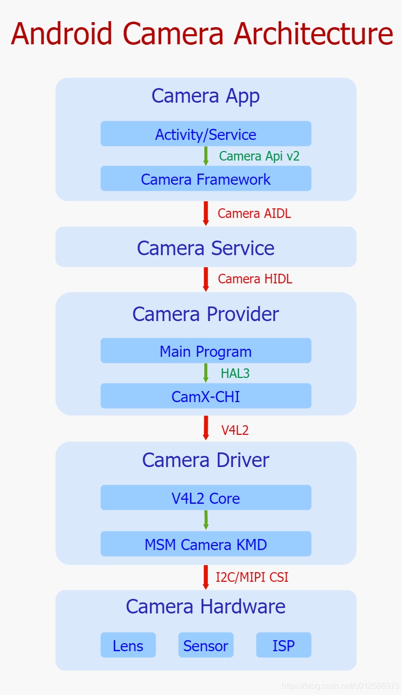
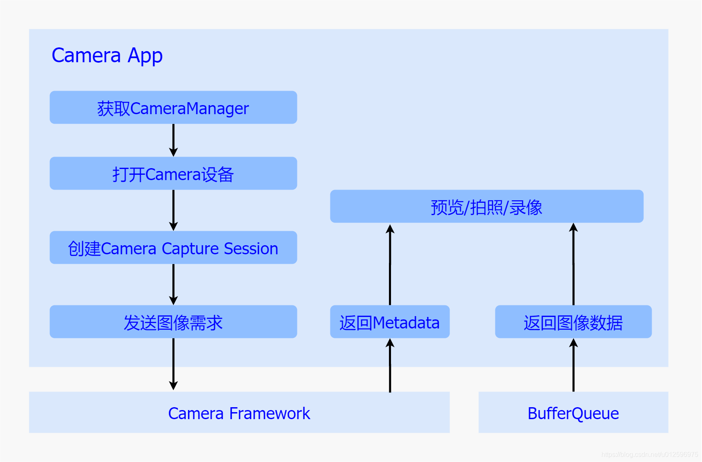
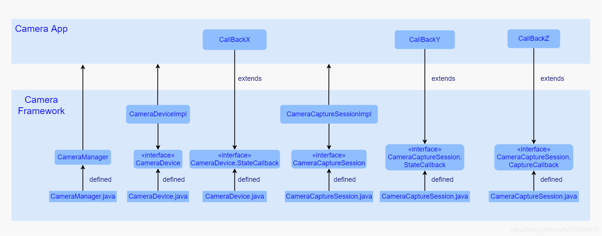
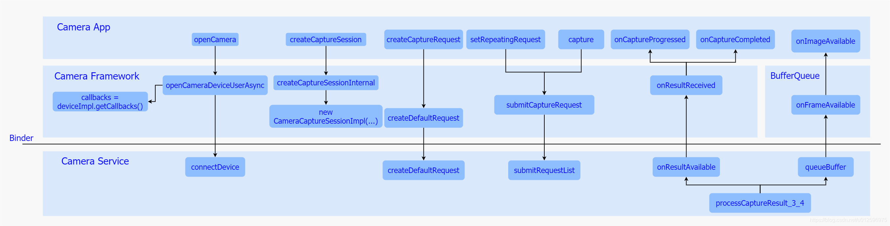

[深入理解Android相机体系结构](https://blog.csdn.net/u012596975/article/details/107135938)

# 一、相机简史

摄影是一门光与影的艺术，通过透镜将光线导入并依靠其折射特性，将光线最终导向到感光器件中，而感光器件在收到光线刺激之后进行一定的转换，进而形成影像，而这一系列的硬件设备的组合统一被称之为相机系统。

早期的相机系统十分简陋，同时成像效果也一直是灰白色调为主，但随着技术的不断革新，具有成像效果好，感光能力强的胶卷一经推出，便彻底提升了相机系统的成像效果。之后又随着CCD感光器件的发明，彻底将相机系统推入了数字成像时代，它直接将光信号转换为电子信号，进而转换为数字信号，最终将数据存储到计算机系统中。之后又在相机系统加入了图像处理模块，依托其强大的运算能力，成功地将成像效果再一次提升了一个维度，因此该时期的相机系统发展迅速，同时也基于技术的不断发展，各大厂商也推陈出新，打造了各式各样的相机系统，比较有代表性的便是单反和傻瓜相机，其中主打成像效果的单反相机，具有成像效果优秀，受到了众多摄像发烧友的追捧，而具有操作简单的傻瓜式相机，更加适合普通人群使用，在普通市场上反响也相当不错。之后随着手机的普及，对于使用手机进行拍照的需求越发强烈，同时随着制造工艺的进一步发展，一种低成本、小体积感光器件CMOS便顺势被推了出来，就这样手机端相机系统便正式登上了历史舞台。

相机系统在手机端起步较晚，初期的手机软件系统并没有对其有很好的支持，无论从开始的WINCE系统、还是塞班系统亦或是而今Android系统，在开始阶段，都只是简单实现了基本相机功能，使其仅仅能够满足简单的预览拍照录像需求，但是手机市场竞争异常激烈，各个厂商也看到了手机相机这块蓝海，便都投入了巨额资金进行研发，以Android系统为例，开始的相机系统功能简单，成像效果一般，并且无法满足用户的诸如高动态范围拍照等需求，但是经过了全球开发者的不懈努力，针对性为相机系统设计出了一套优秀的软件框架，并且借助一系列优秀的图像算法，再依托强大的硬件模块，而今Android相机系统在某些领域完全可以媲美专业相机。

而今的手机相机系统，除了成像效果有着显著的提高外，各大厂商在手机相机的功能性上也做足了功夫，最显著的代表便是单摄到多摄的演化，刚开始的手机系统仅仅采用了一个后置摄像头，但是由于人们对于自拍的需求日益增长，双摄系统便应运而生，一前一后两个相机模组，后者用于日常拍摄，前者用于自拍，之后随着时代的进步，互联网进一步的普及，将更多的专业照片带到了人们面前，由于审美能力的提高，人们对于手机相机系统便有了更高的要求，再加上技术水平的进一步提高，各大厂商便顺势提出了多摄相机系统，针对不同的拍摄场景或者拍摄效果在一部手机终端上集成多个相机模组，极大的满足了用户对于随手一拍便是大片的需求。

纵观整个Android相机系统的发展，从之前的小分辨率，一步步发展到而今的一亿像素，从之前的成像效果差强人意，到而今的完美呈现各种场景光影效果，从之前的单一模组到而今的多摄系统，它克服了一个又一个的技术难题，解决了一个又一个用户痛点问题，而其发展的背后都源于一个简单的目的，那就是让每一个人都能享受到科技带来的乐趣。

# 二、Android 相机架构概览

Android系统利用分层思想，将各层的接口定义与实现分离开来，以接口作为各层的脉络连接整体框架，将具体实现的主导权交由各自有具体实现需求的平台厂商或者Android 开发者，这样既做到把控全局，也给予了众多开发者足够大的创作空间。Google 根据职能不同将Camera框架一共划分成了五层，分别是App、Service、Provider、Driver以及Hardware，下面的Camera的整体架构图很清晰地显示出了其五层架构以及相互的关联接口。

- **Camera App**

  应用层处于整个框架的顶端，承担着于用户直接进行交互的责任，承接来自用户直接或者间接的比如预览/拍照/录像等一系列具体需求，一旦接收到用户相关UI操作，便会通过Camera Api v2标准接口将需求发送至Camera Framework部分，并且等待Camera Framework回传处理结果，其中包括了图像数据以及整体相机系统状态参数，之后将结果以一定方式反馈给用户，达到记录显示种种美好瞬间的目的。

- **Camera Framework**

  该层主要位于Camera App与Camera Service之间，以jar包的形式运行在App进程中，它封装了Camera Api v2接口的实现细节，暴露接口给App进行调用，进而接收来自App的请求，同时维护着请求在内部流转的业务逻辑，最终通过调用Camera AIDL跨进程接口将请求发送至Camera Service中进行处理，紧接着，等待Camera Service结果的回传，进而将最终结果发送至App。

- **Camera Service**

  该层位于Camera Framework与Camera Provider之间，作为一个独立进程存在于Android系统中，在系统启动初期会运行起来，它封装了Camera AIDL跨进程接口，提供给Framework进行调用，进而接收来自Framework的图像请求，同时内部维护着关于请求在该层的处理逻辑，最终通过调用Camera HIDL跨进程接口将请求再次下发到Camera Provider中，并且等待结果的回传，进而将结果上传至Framework中。

- **Camera Provider**

  该层位于Camera Service与Camera Driver之间，作为一个独立的进程存在于Android系统中，同时在系统启动初期被运行，提供Camera HIDL跨进程接口供Camera Service进行调用，封装了该接口的实现细节，接收来自Service的图像请求，并且内部加载了Camera HAL Module，该Module由OEM/ODM实现，遵循谷歌制定的标准Camera HAL3接口，进而通过该接口控制Camera HAL部分，最后等待Camera HAL的结果回传，紧接着Provider通过Camera HIDL接口将结果发送至Camera Service。

- **CamX-CHI(Camera HAL)**

  该部分是高通对谷歌Camera HAL3接口的实现，以so库的形式被加载至Camera Provider中，之前采用的是QCamera & MM-Camera架构，但是为了更好灵活性和可扩展性，而今高通又提出了CamX-CHI架构，该架构提供HAL3接口给Provider进行调用，接收来自Provider的请求，而内部对HAL3接口进行了实现，并且通过V4L2标准框架控制着相机驱动层，将请求下发至驱动部分，并且等待结果回传，进而上报给Camera Provider。

  CamX-CHI架构由CamX和CHI两个部分组成，CamX负责一些基础服务代码的实现，不经常改动，CHI负责实现一些可扩展性和定制化的需求，方便OEM/ODM添加自己的扩展功能。CamX主要包括实现HAL3入口的hal模块，实现与V4L2驱动交互的csl模块，实现硬件node的hwl和实现软件node的swl。CHI通过抽象出Usecase、Feature、Session、Pipeline、Node的概念，使厂商可以通过实现Node接口来接入自己的算法，并通过XML文件灵活配置Usecase、Pipeline、Node的结构关系。

- **Camera Driver**

  Linux为视频采集设备制定了标准的V4L2接口，并在内核中实现了其基础框架V4L2 Core。用户空间进程可以通过V4L2接口调用相关设备功能，而不用考虑其实现细节。V4L2提出了总设备和子设备的概念，并通过media controller机制向用户空间暴露自己的硬件拓扑结构。视频采集设备驱动厂商按照V4L2 Core的要求开发自己的驱动程序，只需要实现相应的结构体和函数接口并调用注册函数注册自己就行。

  在高通平台上，高通对相机驱动部分进行了实现，利用了V4L2框架的可扩展特性，设计出了一套独特的KMD框架。在该框架内部主要包含了三个部分，CRM、Camera Sync以及一系列子设备，首先，作为框架顶层管理者，CRM创建了一个V4L2主设备用来管理所有的子设备，并且暴露设备节点video0给用户空间，同时内部维护着整个底层驱动业务逻辑。其次，Camera Sync创建了一个V4L2主设备，同时暴露了设备节点video1给用户空间，主要用于向用户空间反馈图像数据处理状态。最后，子设备模块被抽象成v4l2_subdev设备，同样也暴露设备节点v4l2-subdev给用户空间进行更精细化的控制。另外，在整个框架初始化的过程中，通过media controller机制，保持了在用户空间进行枚举底层硬件设备的能力。

- **Camera Hardware**

  相机硬件处在整个相机体系的最底层，是相机系统的物理实现部分，该部分包括镜头、感光器、ISP三个最重要的模块，还有对焦马达、闪光灯、滤光片、光圈等辅助模块。镜头的作用是汇聚光线，利用光的折射性把射入的光线汇聚到感光器上。感光器的作用是负责光电转换，通过内部感光元件将接收到的光信号转换为电子信号进而通过数电转换模块转为数字信号，并最后传给ISP。ISP负责对数字图像进行一些算法处理，如白平衡、降噪、去马赛克等。

  通过上面的介绍，我们可以发现，谷歌通过以上五级分层，形成了整个相机框架体系，其中层与层之间通过行业协会、开源社区或者谷歌制订的标准接口进行连接，上层通过调用标准接口下发请求到下层，下层负责对标准接口进行实现，最终将请求再次封装并调用下一层级的对外接口下发到下层。所以总得来说，谷歌使用标准接口作为骨架搭建整体框架，而其具体实现交由各层自己负责，从整体上来看，职责划分明确，界限分明，这样的设计，一来利用标准接口，保持了整个框架业务正常流转，二来极大地降低了各层耦合度，保持了各层的相互独立，最终让整个框架处于一个稳定同时高效的运行状态。

# 三、应用层

## 1、概览

相机应用处于整个框架的上层，在现实生活中，为了满足各式各样的应用场景，会加入很多业务处理逻辑，但是一旦当我们拨开繁杂的业务逻辑，便会发现其核心部分依然是通过调用谷歌制订的一系列Camera Api接口来完成的，而所有的相机行为都包含在该接口中。

起初，相机系统采用的是Camera Api v1接口，它通过一个Camera 类以及该类中的几个标准方法来实现整个相机系统的预览、拍照以及录像功能，控制逻辑比较简单，同时也比较容易理解，但也正是这种简单，导致了它无法逐帧控制底层硬件，无法通过元数据进行修改进而增强帧的表达能力，再加之应用场景的多样化趋势，该接口在新功能的实现上显得些许力不从心。面对该接口难以进一步扩展相机功能这一局面，谷歌在Andorid 5.0(API Level 21)便重新对Camera进行了设计，摒弃了Camera Api v1的设计逻辑，提出了一个全新的API – camera2，引入了Session以及Request概念，将控制逻辑统一成一个视图，因此在使用上更加复杂，同时也支持了更多特性，比如逐帧控制曝光、感光度以及支持Raw格式的输出等。并且由于对控制逻辑的高度抽象化，使得该接口具有很高的灵活性，可以通过简单的操作实现30fps的全高清连拍的功能，总得来说，该接口极大地提高了对于相机框架的控制能力，同时也进一步大幅度提升了其整体性能。

谷歌提出Camera Api v2接口的同时，将其具体实现放入了Camera Framework中来完成，Framework内部负责解析来自App的请求，并且通过AIDL跨进程接口下发到Camera Service中进行处理，并且等待结果的回传。接下来我们首先以Camera Api v2接口为主简单讲解下其逻辑含义，然后详细梳理下Camera Framework对于它的实现，最后以一个简单App Demo为例，来介绍下如何使用该接口来控制整个相机体系。

## 2、Camera Api v2

回顾下Api v1接口的基本逻辑，该接口主要通过一个Camera.java类来定义了所有的控制行为，通过定义诸如open、startPreview、takePicture、AutoFocus等标准的接口来实现打开设备、预览、拍照以及对焦操作的功能，同时通过定义Camera.Parameters来实现了参数的读取与设置，其中包括了帧率、图片格式的控制，另外，通过定义了Camera.CameraInfo来实现了图像元数据的获取。而为了更加细致化地控制相机系统的Camera Api v2接口，相对于Api v1接口而言，复杂了许多，通过不同的接口类以及接口方法定义了复杂的相机系统行为，接下来逐一进行介绍：

**CameraManager**
谷歌将CameraManager定义为一个系统服务，通过Context.getSystemService来获取，主要用于检测以及打开系统相机，其中打开操作通过openCamera方法来完成。除此之外，还定义了getCameraCharacteristics方法来获取当前Camera 设备支持的属性信息，而该属性信息通过CameraCharacteristics来表示，其中包括了图像数据的大小以及帧率等信息。

**CameraDevice**
代表了一个被打开的系统相机，类似于Camera Api v1中的Camera类，用于创建CameraCaptureSession以及对于最后相机资源的释放。

**CameraDevice.StateCallback**
该类定义了一系列的回调方法，其实现交由App来完成，主要用于返回创建Camera设备的结果，一旦创建成功相机框架会通过回调其onOpened方法将CameraDevice实例给到App，如果失败，则调用onError返回错误信息。

**CameraCaptureSession**
该类代表了一个具体的相机会话，建立了与Camera设备的通道，而之后对于Camera 设备的控制都是通过该通道来完成的。当需要进行预览或者拍照时，首先通过该类创建一个Session，并且调用其setRepeatingRequest方法开启预览流程，或者调用capture方法开始一次拍照动作。

**CameraCaptureSession.StateCallback**
该接口类定义了一系列回调方法，其实现交由App完成，主要用于返回创建CameraCaptureSession的结果，成功则通过onConfigured方法返回一个CameraCaptureSession实例，如果失败则通过onConfigureFailed返回错误信息。

**CameraCaptureSession.CaptureCallback**
该接口类定义了一系列回调方法，用于返回来自Camera Framework的数据和事件，其中onCaptureStarted方法在下发图像需求之后立即被调用，告知App此次图像需求已经收到，onCaptureProgressed方法在产生partial meta data的时候回调，onCaptureCompleted方法在图像采集完成，上传meta data数据时被调用。

**CaptureRequest**
该类用于表示一次图像请求，在需要进行预览或者拍照时，都需要创建一个CaptureRequest，并且将针对图片的一系列诸如曝光/对焦设置参数都加入到该Request中，通过CameraCaptureSessin下发到相机系统中。

**TotalCaptureResult**
每当通过CameraDevice完成了一次CaptureRequest之后会生成一个TotalCaptureResult对象，该对象包含了此次抓取动作所产生的所有信息，其中包括关于硬件模块(包括Sensor/lens/flash)的配置信息以及相机设备的状态信息等。

**CaptureResult**
该类代表了某次抓取动作最终生成的图像信息，其中包括了此次关于硬件软件的配置信息以及输出的图像数据，以及显示了当前Camera设备的状态的元数据(meta data)，该类并不保证拥有所有的图像信息。

## 3、Camera Framework

基于接口与实现相分离的基本设计原则，谷歌通过Camera Api 接口的定义，搭建起了App与相机系统的桥梁，而具体实现便是由Camera Framework来负责完成的。在采用Camera Api v1接口的时期，该部分是通过JNI层来进行java到C++的转换，进而到达native层，而在native层会通过实现CameraClient建立与Camera Service的通讯 ，整个过程比较繁琐，使得整体框架略显繁杂，而随着Camera Api v2的提出，在该层便大量使用AIDL机制，直接在Java层建立与Camera Service的通信，进一步简化了整体框架。，接下来我们以几个主要接口为主线，简单梳理下其具体实现。

CameraManager
实现主要在CameraManager.java中，通过CameraManager查询、获取以及打开一个Camera 设备。在该类中还实现了内部类CameraManagerGlobal，该类继承于ICameraServiceListener.Stub，在打开相机设备的时候，在内部会获取到ICameraService远程代理，并且调用ICameraService的addListener方法将自己注册到Camera Service中，一旦Camera Service状态有所变更便会通过其实现的回调方法通知到Camera Manager服务，另外，该类还通过调用ICameraService.connectDevice()方法获取到Camera Service中的CameraDevice远程代理，并且将该代理传入CameraDeviceImpl中，进而与Camera Service建立了连接。

CameraDeviceImpl
该类定义在CameraDeviceImpl.java文件中，继承并实现了CameraDevice接口，代表了一个相机设备，可以完成CameraCaptureSession的创建以及CaptureRequest创建等工作，内部定义了CameraDeviceCallbacks类(该类继承于ICameraDeviceCallbacks.Stub，对应于Camera Service中的 ICameraDeviceCallbacks接口)，用于接收来自Camera Service中的Camera Device的状态回调，并且内部维护着一个Camera Service 的远程ICameraDevice代理，进而可以下发图像请求到Camera Service中。

CameraCaptureSessionImpl
该类定义在CameraCaptureSessionImpl.java文件中，继承并实现了CameraCaptureSession接口，每一个相机设备在一个时间段中，只能创建并存在一个CameraCaptureSession，其中该类包含了两种Session，一种是普通的，适用于一般情况下的会话操作，另一种是用于Reprocess流程的会话操作，该流程主要用于对于现有的图像数据进行再处理的操作。该类维护着来自实例化时传入的Surface列表，这些Surface正是包含了每一个图像请求的数据缓冲区。

除了以上这几个接口，还有几个接口是需要App部分进行实现的，用于返回App所需要的对象或者数据：

CameraDevice.StateCallback
被App端进行继承并实现，用于在调用CameraManager的openCamera方法时，通过参数的形式传入Framework，在Framework中，一旦CameraDeviceImpl创建成功便通过其中的onOpened方法将其返回给App，如果失败，便会通过其他方法返回给App错误信息。

CameraCaptureSession.StateCallback
被App端进行继承并实现，用于在调用CameraDevice的createCaptureSession方法时作为参数传入Framework中，一旦创建成功，Framework便会通过调用该类的onConfigured接口返回一个CameraCaptureSessionImpl的对象，如果失败，Framework会调用其onConfigureFailed方法将错误信息返回至App。

CameraCaptureSession.CaptureCallback
被App端进行继承并实现，App通过调用CameraCaptureSessionImpl的setReaptingRequest或者capture方法是作为参数传入Framework，一旦Framework接收到来自CameraService的数据时，便会通过调用这个回调类将数据发送至App中。

a) openCamera
当用户打开相机应用时，会去调用该方法打开一个相机设备，其中该方法最终经过层层调用会调用到Camera Framework中的openCameraDeviceUserAsync方法，在该方法中主要做了三件事：

首先是获取ICameraService代理，调用其getCameraInfo方法获取当前设备的属性。
其次是实例化了一个CameraDeviceImpl对象，并将来自App的CameraDevice.StateCallback接口存入该对象中，再将CameraDeviceImpl中的内部类CameraDeviceCallback作为参数通过ICameraService的connectDevice方法传入Camera Service去打开并获取一个ICameraDeviceUser代理，并将该代理存入CameraDeviceImpl中进行管理。
最后通过App传入的回调将CameraDeviceImpl返回给App使用，至此整个流程便完成了。
b) createCaptureSession
在打开相机设备之后便需要去创建一个相机会话，用于传输图像请求，其最终实现是调用该方法来进行实现的，而该方法会去调用到Camera Framework中的createCaptureSessionInternal方法，该方法主要做了两件事：

首先调用configureStreamsChecked方法来配置数据流。
其次实例化了一个CameraCaptureImpl对象，并通过传入CameraCaptureSession.StateCallback回调类将该对象发送至至App中。
而在configureStreamsChecked方法中会去调用ICameraDeviceUser代理的一系列方法进行数据流配置，其中调用cancelRequest方法停掉当前的的预览流程，调用deleteStream方法删除之前的数据流，调用createStream创建新的数据流，最后调用endConfigure来进行数据流的配置工作，针对性的配置便在最后这个endConfigure方法中。

c) createCaptureRequest
在创建并获取相机会话之后，便可以开始下发图像请求了，而在此之前，需要通过该方法来创建一个CaptureRequest，一旦调用该方法，最终会调用到Camera Service中ICameraDeviceUser的createDefaultRequest方法来创建一个默认配置的CameraMetadataNative，其次实例化一个CaptureRequest.Builder对象，并将刚才获取的CameraMetadataNative传入其中，之后返回该CaptureRequest.Builder对象，在App中，直接通过调用该Buidler对象的build方法，获取一个CaptureRequest对象。

CaptureRequest对象也创建成功了，接下来需要下发图像请求了，一般常用请求分为两种,一个是预览一个是拍照。

d) setRepeatingRequest
App调用该方法开始预览流程，通过层层调用最终会调用到Framework中的submitCaptureRequest方法，该方法主要做了两件事：

首先调用CameraService层CameraDeviceUser的submitRequestList方法，将此次Request下发到CameraService中。
其次将App通过参数传入的CameraCaptureSession.CaptureCallback对象存到CameraDeviceImpI对象中。
接下来看下拍照请求的处理流程：
e) capture
该方法最终也会调用到Framework中的submitCaptureRequest方法，接下来边和预览流程大致相同，会去调用Camera Service 中的ICameraDeviceUser的submitRequestList方法传入请求，之后将App实现的回调对象存入CameraDeviceImpl对象中。

f) onCaptureProgressed
一旦Request下发到Camera Service之后，当底层生成了Partial Meta Data数据，Camera Service会调用通过调用在打开相机设备时传入的ICameraDeviceCallback代理，通过其onResultReceived方法将数据传回Framework，之后调用App传入的CameraCaptureSession.CaptureCallback中的onCaputreProgressed方法将结果回传至App进行解析以及后处理。

g) onCaptureCompleted
一旦Request下发到Camera Service之后，当底层生成了Meta data数据，Camera Service会调用通过调用在打开相机设备时传入的ICameraDeviceCallback代理，通过其onResultReceived方法将数据传回Framework，之后调用App传入的CameraCaptureSession.CaptureCallback中的onCaputreCompleted方法将结果回传至App进行解析以及后处理。

h) onImageAvailable
之前已经通过两个回调接口onCaptureProgressed以及onCaptureCompleted方法将meta data上传到了App，一般情况下，图像数据会在他们之后上传，而且这个上传过程并不经过Camera Framework，而是通过BufferQueue来进行的，当Camera Service接收到底层传来的图像数据，便会立即调用processCaptureResult_3_4方法，该方法中会去调用BufferQueue中生产者角色的Surface的queueBuffer方法，将数据入队并通知消费者去消费，而此时的消费者正是App端的ImageReader，并经过一层层回调，最终会通过调用ImageReader的onImageAvailable方法，通知ImageReader去将数据取出，并做后期操作。

从上面的梳理不难发现，整个Camera Framework除了是对Camera Api v2的实现外，还承担着与Camera Service跨进程通信的任务，充当了一个位于App与Service之间的中转站的角色。

四、Camera App Demo
经过上面的梳理总结，我们已经对整个Camera Api v2接口以及实现都有了一个较为深入的认识，但是认识暂时仅仅停留在代码层面，为了更好理解其功能，接下来我们以一个简单的相机应用入手来加深下对接口的使用流程的理解：

# 四、服务层

# 五、硬件抽象层

# 六、硬件抽象层实现

驱动层

硬件层

Android 相机架构总结

手机相机的未来发展 