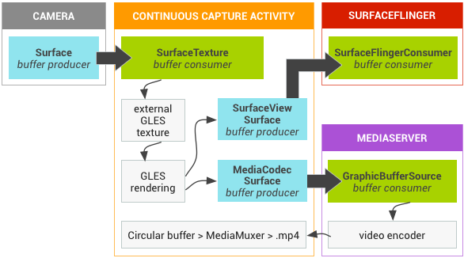

# todo

[google/grafika：Grafika 测试应用 (github.com)](https://github.com/google/grafika/tree/master)

# Graphics

Android framework 提供了2D、3D图形渲染 API，这些 API 和图形驱动程序的制造商实现进行交互。图形硬件抽象层 HAL。

相关术语：

**canvas(generic term), Canvas (API element)**

canvas 是一种 drawing surface，用于处理实际位与 bitmap 或 Surface 对象的合成。canvas 具有位图、线条、圆、矩形、文本等标准计算机绘图方法，并与 bitmap 或 surface 绑定。canvas 是在屏幕上绘制二维对象最简单的方法。

**drawable**

可绘制对象是一种已编译的视觉资源，可用作背景、标题或屏幕的其他部分。可绘制对象通常加载到另一个 UI 元素中，例如作为背景图像。可绘制对象无法接收事件，但会分配各种其他属性（如状态和调度）以启用子类（如动画对象或图像库）。许多可绘制对象都是从可绘制资源文件（描述图像的 XML 或位图文件）加载的。

**layout resource**

**theme**

**view, View**

**view group, ViewGroup**

**widget**

**window, Window**

**nine-patch**

一种可调整大小的位图资源，可用于设备上的背景或其他图像。

**OpenGL ES**

OpenGL ES 是一个跨平台的 API，用于渲染 2D 和 3D 图形。Android 提供了用于硬件加速 3D 渲染的 OpenGL ES 库。对于 2D 渲染，画布是更简单的选择。OpenGL ES 在 Android 原生开发工具包 （NDK） 中提供。

**Vulkan**

Vulkan 是一个用于高性能 3D 图形的低开销跨平台 API。

**surface(generic term), Surface(API element)**

surface 表示合成到屏幕的内存块。A surface holds a canvas for drawing，并提供各种方法来绘制图层和调整 `Surface` 对象大小。一般使用 SurfaceView 类，而不是 Surface 类。

**surface view(generic term), SurfaceView(API element)**

surface view 是封装了用于绘制的 Surface object的 View object，而且公开用于动态指定大小和格式的方法。surface view 提供了一个独立于 UI 线程进行绘制的方法，用于资源密集型操作（如游戏或相机预览），但是会使用额外的内存。surface view 支持 canvas 和 OpenGL ES 图形。 

## Andorid graphics components

无论开发者使用什么渲染 API，一切内容都会渲染到 **Surface** 上。Surface 表示缓冲区队列中的生产方，而缓冲区队列通常会被 SurfaceFlinger 消费。在 Android 上创建的每个窗口都由 Surface 提供支持。所有被渲染的可见 Surface 都被 SurfaceFlinger 合成到屏幕。

**关键组件的工作流程**

### Image stream producers

Image stream producer 可以是生成图形缓冲区以供消费的任何内容。示例包含 OpenGL ES，Canvas 2D 和 mediaserver 视频解码器。

### Image stream comsumers

image stream 最常见的消费者就是 SurfaceFlinger，它是一种 system service，消费当前可见 surface，并使用 Window manager 提供的信息将 surface 合成到屏幕上。SurfaceFlinger 是唯一可以修改显示内容的 service。SurfaceFlinger 使用 OpenGL 和 Hardware Composer 来组合一组 surface。

### Hardware Composer

HWC，display 子系统的硬件抽象。SurfaceFlinger 可以将某些合成工作委托给 Hardware Composer，以分担 OpenGL 和 GPU 上的工作量。SurfaceFlinger 只是充当另一个 OpenGL ES 客户端。因此，在 SurfaceFlinger 将一个或两个缓冲区合成到第三个缓冲区中的过程中，它会使用 OpenGL ES。这会让合成的功耗比通过 GPU 执行所有计算时更低。

[Hardware Composer HAL](https://source.android.com/docs/core/graphics/hwc)  则进行另一半的工作，是所有 Android 图形渲染的中心点。Hardware Composer 必须支持事件，其中之一是 VSYNC（另一个是支持即插即用 HDMI 的热插拔）。

### Gralloc

使用图形内存分配器 (Gralloc) 来分配图像生产方请求的内存。

## Data flow

**Andorid graphics pipeline**

左侧的对象是生成图形缓冲区的渲染器，如主屏幕、状态栏和系统界面。SurfaceFlinger 是合成器，而 HWC是混合渲染器。

### BufferQueue

两个队列，用于调解缓冲区从生产方到消耗方的固定周期。一旦生产方移交其缓冲区，SurfaceFlinger 便会负责将所有内容合成到显示部分。

BufferQueue 的通信过程

BufferQueue 包含将 image stream producers 和 image stream consumers 联系在一起的逻辑。image producers 的示例包括由相机 HAL 或 OpenGL ES 游戏生成的相机预览。image consumers 示例包括 SurfaceFlinger 或显示 OpenGL ES 流的另一个应用，如显示相机取景器的相机应用。

BufferQueue 是将缓冲区池与队列相结合的数据结构，它使用 Binder IPC 在进程之间传递缓冲区。生产方接口，或者您传递给想要生成图形缓冲区的某个人的内容，即是 IGraphicBufferProducer（[SurfaceTexture](http://developer.android.com/reference/android/graphics/SurfaceTexture.html?hl=zh-cn) 的一部分）。BufferQueue 通常用于渲染到 Surface，并且与 GL 消耗方及其他任务一起消费内容。

BufferQueue 可以在三种不同的模式下运行：

类同步模式 - 默认情况下，BufferQueue 在类同步模式下运行，在该模式下，从生产方进入的每个缓冲区都在消耗方那输出。在此模式下不会舍弃任何缓冲区。如果生产方速度太快，创建缓冲区的速度比消耗缓冲区的速度更快，它将阻塞并等待可用的缓冲区。

非阻塞模式 - BufferQueue 还可以在非阻塞模式下运行，在此类情况下，它会生成错误，而不是等待缓冲区。在此模式下也不会舍弃缓冲区。这有助于避免可能不了解图形框架的复杂依赖项的应用软件出现潜在死锁现象。

舍弃模式 - 最后，BufferQueue 可以配置为丢弃旧缓冲区，而不是生成错误或进行等待。例如，如果对纹理视图执行 GL 渲染并尽快绘制，则必须丢弃缓冲区。

为了执行这项工作的大部分环节，SurfaceFlinger 就像另一个 OpenGL ES 客户端一样工作。例如，当 SurfaceFlinger 正在积极地将一个缓冲区或两个缓冲区合成到第三个缓冲区中时，它使用的是 OpenGL ES。

Hardware Composer HAL 执行另一半工作。该 HAL 充当所有 Android 图形渲染的中心点。

# Graphics Architecture

*应该了解的有关 surfaces、SurfaceHolder、EGLSurface、SurfaceView、GLSurfaceView、SurfaceTexture、TextureView、SurfaceFlinger 和 Vulkan 的知识。*

Android system 图形架构的基本元素，framework 和 multimedia system 如何使用这些元素。重点是图形数据缓冲区如何在系统中移动。SurfaceView 和 TextureView 为何会以这种方式运行？surfaces 和 EGLSurface 如何交互？

本文旨在详细介绍渲染帧以输出涉及的重要事件，帮助设计应用时做出明智选择。从基本原理出发，介绍 UI 类的工作方式，而不是其使用方法。

本部分包括多个页面，从背景材料到 HAL 细节再到用例，进行了全面介绍。首先是对 Android 图形缓冲区进行了解释，并说明了合成和显示机制，然后继续介绍为合成器提供数据的更高级别的机制。

按照下列顺序阅读相关页面，而不要直接跳到感兴趣的主题。

**低级别组件**

- [BufferQueue 和 gralloc](https://source.android.com/docs/core/graphics/arch-bq-gralloc?hl=zh-cn)。BufferQueue 将可生成图形数据缓冲区的组件（生产者）连接到接受数据以便进行显示或进一步处理的组件（消费者）。通过供应商专用 HAL 接口实现的 gralloc 内存分配器将用于执行缓冲区分配任务。
- [SurfaceFlinger、Hardware Composer 和虚拟显示屏](https://source.android.com/docs/core/graphics/arch-sf-hwc?hl=zh-cn)。SurfaceFlinger 接受来自多个源的数据缓冲区，然后将它们进行合成并发送到显示屏。Hardware Composer HAL (HWC) 确定使用可用硬件合成缓冲区的最有效的方法，虚拟显示屏使合成输出可在系统内使用（录制屏幕或通过网络发送屏幕）。
- [Surface、Canvas 和 SurfaceHolder](https://source.android.com/docs/core/graphics/arch-sh?hl=zh-cn)。Surface 可生成一个通常由 SurfaceFlinger 使用的缓冲区队列。当渲染到 Surface 上时，结果最终将出现在传送给消费者的缓冲区中。Canvas API 提供一种软件实现方法（支持硬件加速），用于直接在 Surface 上绘图（OpenGL ES 的低级别替代方案）。与视图有关的任何内容均涉及到 SurfaceHolder，其 API 可用于获取和设置 Surface 参数（如大小和格式）。
- [EGLSurface 和 OpenGL ES](https://source.android.com/docs/core/graphics/arch-egl-opengl?hl=zh-cn)。[OpenGL ES (GLES)](https://www.khronos.org/opengles/) 定义了旨在与 [EGL](https://www.khronos.org/egl) 结合使用的图形渲染 API。EGI 是一个通过操作系统创建和访问窗口的库（要绘制纹理多边形，请使用 GLES 调用；要将渲染应用到屏幕上，请使用 EGL 调用）。此页还介绍了 ANativeWindow，它是 Java Surface 类的 C/C++ 等价类，用于通过原生代码创建 EGL 窗口表面。
- [Vulkan](https://source.android.com/docs/core/graphics/arch-vulkan?hl=zh-cn)。Vulkan 是一种用于高性能 3D 图形的低开销、跨平台 API。与 OpenGL ES 一样，Vulkan 提供用于在应用中创建高质量实时图形的工具。Vulkan 的优势包括降低 CPU 开销以及支持 [SPIR-V 二进制中间](https://www.khronos.org/spir)语言。

**高级别组件**

- [SurfaceView 和 GLSurfaceView](https://source.android.com/docs/core/graphics/arch-sv-glsv?hl=zh-cn)。SurfaceView 结合了 Surface 和 View。SurfaceView 的 View 组件由 SurfaceFlinger（而不是应用）合成，从而可以通过单独的线程/进程渲染，并与应用界面渲染隔离。GLSurfaceView 提供了用于管理 EGL 上下文、线程间通信以及与 activity 生命周期的交互的帮助程序类（但不是必须使用 GLES）。
- [SurfaceTexture](https://source.android.com/docs/core/graphics/arch-st?hl=zh-cn)。 SurfaceTexture 将 Surface 和 GLES 纹理相结合来创建 BufferQueue，而您的应用是 BufferQueue 的消费者。当生产者将新的缓冲区排入队列时，它会通知您的应用。您的应用会依次释放先前占用的缓冲区，从队列中获取新缓冲区并执行 EGL 调用，从而使 GLES 可将此缓冲区作为外部纹理使用。Android 7.0 添加了对安全纹理视频播放的支持，以便对受保护的视频内容进行 GPU 后处理。
- [TextureView](https://source.android.com/docs/core/graphics/arch-tv?hl=zh-cn)。 TextureView 结合了 View 和 SurfaceTexture。TextureView 对 SurfaceTexture 进行包装，并负责响应回调以及获取新的缓冲区。在绘图时，TextureView 使用最近收到的缓冲区的内容作为其数据源，根据 View 状态指示，在它应该渲染的任何位置和以它应该采用的任何渲染方式进行渲染。View 合成始终通过 GLES 来执行，这意味着内容更新可能会导致其他 View 元素重绘。

## BufferQueue and Gralloc BufferQueue

BufferQueue 类将可生成图形数据缓冲区的组件（生产方）连接到接受数据以便进行显示或进一步处理的组件（使用方）。几乎所有在系统中移动图形数据缓冲区的内容都依赖于 BufferQueue。

Gralloc 内存分配器会进行缓冲区分配，并通过两个特定于供应商的 HIDL 接口来进行实现（请参阅 `hardware/interfaces/graphics/allocator/` 和 `hardware/interfaces/graphics/mapper/`）。`allocate()` 函数采用预期的参数（宽度、高度、像素格式）以及一组用法标志。

使用方创建并拥有 BufferQueue 数据结构，并且可存在于与其生产方不同的进程中。当生产方需要缓冲区时，它会通过调用 `dequeueBuffer()` 从 BufferQueue 请求一个可用的缓冲区，并指定缓冲区的宽度、高度、像素格式和用法标志。然后，生产方填充缓冲区并通过调用 `queueBuffer()` 将缓冲区返回到队列。接下来，使用方通过 `acquireBuffer()` 获取该缓冲区并使用该缓冲区的内容。当使用方操作完成后，它会通过调用 `releaseBuffer()` 将该缓冲区返回到队列。[同步框架](https://source.android.com/docs/core/graphics/sync?hl=zh-cn)可控制缓冲区在 Android 图形管道中移动的方式。

BufferQueue 的一些特性（例如可以容纳的最大缓冲区数）由生产方和使用方联合决定。但是，BufferQueue 会根据需要分配缓冲区。除非特性发生变化，否则将会保留缓冲区；例如，如果生产方请求具有不同大小的缓冲区，系统会释放旧的缓冲区，并根据需要分配新的缓冲区。

BufferQueue 永远不会复制缓冲区内容，因为移动如此多的数据是非常低效的操作。相反，缓冲区始终通过句柄进行传递。

### Systrace 跟踪 BufferQueue

如需了解图形缓冲区如何移动，请使用 [Systrace](https://developer.android.com/studio/profile/systrace?hl=zh-cn)，它是一款用于记录短期内的设备活动的工具。系统级图形代码经过充分插桩，很多相关的应用框架代码也是如此。

如需使用 Systrace，请启用 `gfx`、`view` 和 `sched` 标记。BufferQueue 对象显示在跟踪记录中。例如，如果您在 [Grafika 的播放视频 (SurfaceView)](https://github.com/google/grafika/blob/master/app/src/main/java/com/android/grafika/PlayMovieSurfaceActivity.java) 正在运行时获取跟踪记录，标有 SurfaceView 的行会告诉您在任何给定时间内加入队列的缓冲区数量。

当应用处于活动状态时，该值会递增，这会触发 MediaCodec 解码器渲染帧。当 SurfaceFlinger 正在工作和使用缓冲区时，该值会递减。当以 30fps 的帧率显示视频时，队列的值从 0 变为 1，因为大约 60fps 的显示速度可以轻松跟上来源的帧率。SurfaceFlinger 仅在有工作要执行时才会被唤醒，而不是每秒将其唤醒 60 次。系统会尝试避免工作，并且如果屏幕没有任何更新，将停用 VSYNC。

如果您切换到 [Grafika 的播放视频 (TextureView)](https://github.com/google/grafika/blob/master/app/src/main/java/com/android/grafika/PlayMovieActivity.java) 并获取新的跟踪记录，您将看到一个标有 `com.android.grafika`&hairsp;/&hairsp;`com.android.grafika.PlayMovieActivity` 的行。这是主界面层，它是另一个 BufferQueue。由于 TextureView 渲染到界面层主线程（而不是单独的层），因此此处将显示所有视频驱动的更新。

### Gralloc

Gralloc 分配器 HAL `hardware/libhardware/include/hardware/gralloc.h` 通过用法标志执行缓冲区分配。用法标志包括以下属性：

- 从软件 (CPU) 访问内存的频率
- 从硬件 (GPU) 访问内存的频率
- 是否将内存用作 OpenGL ES (GLES) 纹理
- 视频编码器是否会使用内存

例如，如果生产方的缓冲区格式指定 `RGBA_8888` 像素，并且生产方指明将从软件访问缓冲区（这意味着应用将在 CPU 上触摸像素），则 Gralloc 将按照 R-G-B-A 的顺序为每个像素创建 4 个字节的缓冲区。如果情况相反，生产方指明仅从硬件访问其缓冲区且缓冲区作为 GLES 纹理，Gralloc 可以执行 GLES 驱动程序所需的任何操作（比如 BGRA 排序、非线性搅和布局和替代颜色格式等）。允许硬件使用其首选格式可以提高性能。

某些值在特定平台上无法组合。例如，视频编码器标志可能需要 YUV 像素，因此将无法添加软件访问权限并指定 `RGBA_8888`。

Gralloc 返回的句柄可以通过 Binder 在进程之间进行传递。

## Implement DMABUF and GPU memory accounting

## Trace window transitions using Winscope

## Surface and SurfaceHolder

Surface 对象使应用能够渲染要在屏幕上显示的图像。通过 SurfaceHolder 接口，应用可以编辑和控制 Surface。

### Surface

[Surface](https://developer.android.com/reference/android/view/Surface.html?hl=zh-cn) 是一个接口，供生产方与消耗方交换缓冲区。

用于显示 Surface 的 BufferQueue 通常配置为三重缓冲。缓冲区是按需分配的，因此，如果生产方足够缓慢地生成缓冲区（例如在 60 fps 的显示屏上以 30 fps 的速度缓冲），队列中可能只有两个分配的缓冲区。按需分配缓冲区有助于最大限度地减少内存消耗。您可以在 `dumpsys SurfaceFlinger` 的输出中看到每个层级关联的缓冲区的摘要。

大多数客户端使用 [OpenGL ES](https://source.android.com/docs/core/graphics/arch-egl-opengl?hl=zh-cn) 或 [Vulkan](https://source.android.com/docs/core/graphics/arch-vulkan?hl=zh-cn) 渲染到 Surface 上。但是，有些客户端使用 canvas 渲染到 Surface 上。

#### Canvas 渲染

Canvas 实现由 [Skia 图形库](https://skia.org/)提供。如果您要绘制一个矩形，可以调用 Canvas API，它会在缓冲区中适当地设置字节。为了确保两个客户端不会同时更新某个缓冲区，或者在该缓冲区正在被显示时写入该缓冲区，请锁定该缓冲区以进行访问。您可以使用以下命令处理画布锁：

- [`lockCanvas()`](https://developer.android.com/reference/android/view/Surface.html?hl=zh-cn#lockCanvas(android.graphics.Rect)) 可锁定缓冲区以在 CPU 上渲染，并返回用于绘图的 canvas 。
- [`unlockCanvasAndPost()`](https://developer.android.com/reference/android/view/Surface.html?hl=zh-cn#unlockCanvasAndPost(android.graphics.Canvas)) 可解锁缓冲区并将其发送到合成器。
- [`lockHardwareCanvas()`](https://developer.android.com/reference/android/view/Surface.html?hl=zh-cn#lockHardwareCanvas()) 可锁定缓冲区以在 GPU 上渲染，并返回用于绘图的 canvas 。

**注意**：当应用通过 `lockCanvas()` 锁定 Surface 时，所获得的 canvas 一概不会获得硬件加速。

如果调用过 `lockCanvas()`，则无法使用 GLES 在 Surface 上绘图或从视频解码器向其发送帧。`lockCanvas()` 会将 CPU 渲染程序连接到 BufferQueue 的生产方，直到 Surface 被销毁时才会断开连接。与大多数生产方（如 GLES 或 Vulkan）不同，基于画布的 CPU 渲染程序无法在断开连接后重新连接到 Surface。

生产方首次从 BufferQueue 请求某个缓冲区时，该缓冲区将被分配并初始化为零。必须进行初始化，以避免意外地在进程之间共享数据。但是，如果您重复使用缓冲区，以前的内容仍会存在。如果您反复调用 `lockCanvas()` 和 `unlockCanvasAndPost()` 而不绘制任何内容，则生产方会在先前渲染的帧之间循环。

Surface 锁定/解锁代码会保留对先前渲染的缓冲区的引用。如果在锁定 Surface 时指定了脏区域，那么它将从以前的缓冲区复制非脏像素。SurfaceFlinger 或 HWC 通常会处理缓冲区；但是由于只需从缓冲区中读取内容，因此无需等待独占访问权。

### SurfaceHolder

[SurfaceHolder](https://developer.android.com/reference/android/view/SurfaceHolder.html?hl=zh-cn) 是系统用于与应用共享 Surface 所有权的接口。与 Surface 配合使用的一些客户端需要 SurfaceHolder，因为用于获取和设置 Surface 参数的 API 是通过 SurfaceHolder 实现的。一个 [SurfaceView](https://source.android.com/docs/core/graphics/arch-sv-glsv?hl=zh-cn) 包含一个 SurfaceHolder。

与 View 交互的大多数组件都涉及到 SurfaceHolder。一些其他 API（如 MediaCodec）将在 Surface 本身上运行。

### SurfaceView and GLSurfaceView

Android UI 基于 View 的对象层次结构。UI 元素都经过一系列测量和布局过程，然后放进矩形区域。然后，所有可见 View 对象都会渲染到一个 Surface（当应用置于前台时，由 WindowManager 进行设置）。应用的界面线程会执行布局并按帧渲染到缓冲区。

#### SurfaceView

SurfaceView 是一个组件，可用于在 View 层次结构中嵌入其他合成层。SurfaceView 使用与其他 View 相同的布局参数，可以像其他 View 一样对其进行操作，但 SurfaceView 的内容是透明的。

当使用外部缓冲区来源（例如 GL 上下文和媒体解码器）进行渲染时，你需要从缓冲区来源复制缓冲区，以便在屏幕上显示这些缓冲区。为此，你可以使用 SurfaceView。

当 SurfaceView 的 View 组件即将变得可见时，框架会要求 SurfaceControl 从 SurfaceFlinger 请求新的 surface。如需在创建或销毁 Surface 时收到回调，请使用 [SurfaceHolder](https://source.android.com/docs/core/graphics/arch-sh?hl=zh-cn#surfaceholder) 接口。默认情况下，新创建的 Surface 放置在应用界面 Surface 的后面。您可以重新默认的 Z 轴顺序，将新的 Surface 放在前面。

在需要渲染到单独的 Surface（例如，使用 Camera API 或 OpenGL ES 上下文进行渲染）时，使用 SurfaceView 进行渲染很有帮助。使用 SurfaceView 进行渲染时，SurfaceFlinger 会直接将缓冲区合成到屏幕上。如果没有 SurfaceView，您需要将缓冲区合成到屏幕外的 Surface，然后该 Surface 会合成到屏幕上，而使用 SurfaceView 进行渲染可以省去额外的工作。使用 SurfaceView 进行渲染后，请使用界面线程与 activity 生命周期相协调，并根据需要调整 View 的大小或位置。然后，硬件混合渲染器会将应用界面与其他层混合在一起。

新的 Surface 是 BufferQueue 的生产方，其使用方是 SurfaceFlinger 层。您可以通过任何可向 BufferQueue 馈送资源的机制更新 Surface，例如，使用提供 Surface 的 Canvas 函数、附加 EGLSurface 并使用 GLES 在 Surface 上绘制，或者配置媒体解码器以写入 Surface。

#### SurfaceView 和 Activity 生命周期

当使用 SurfaceView 时，请使用主界面线程之外的线程渲染 Surface。

对于具有 SurfaceView 的 activity，存在两个单独但相互依赖的状态机：

- 应用 `onCreate`/`onResume`/`onPause`
- 已创建/更改/销毁的 Surface

当 Activity 启动时，您将按以下顺序获得回调：

1. `onCreate()`
2. `onResume()`
3. `surfaceCreated()`
4. `surfaceChanged()`

如果点击“返回”，您会获得：

1. `onPause()`
2. `surfaceDestroyed()`（在 Surface 消失前调用）

如果旋转屏幕，activity 将被销毁并重新创建，而您将获得整个生命周期。您可以通过检查 `isFinishing()` 判断出这是一次快速重启。启动/停止 Activity 的速度可能非常快，以至于 `onPause()` 之后就会发生 `surfaceCreated()`。

如果您点按电源按钮锁屏，只会出现 `onPause()`（没有 `surfaceDestroyed()`）。Surface 仍处于活动状态，并且可以继续渲染。如果您继续请求，则可以持续获得 Choreographer 事件。如果锁屏会强制改变方向，则当设备解锁时，您的 activity 可能会重启。否则，您可以在脱离锁屏状态后使用与之前相同的 Surface。

线程的生命周期可以与 Surface 或 Activity 相关联，具体取决于锁屏时您想要发生的情况。该线程可以在 Activity 启动/停止时或者在 Surface 创建/销毁时启动/停止。

在 Activity 启动/停止时启动/停止线程可与应用生命周期良好配合。您可以在 `onResume()` 中启动渲染程序线程，并在 `onStop()` 中停止渲染程序线程。创建和配置线程时，有时 Surface 已经存在，有时不存在（例如，在使用电源按钮关闭屏幕后，Surface 仍处于活动状态）。您必须先等待 Surface 完成创建，然后再在线程中进行初始化。您不能在 `surfaceCreate()` 回调中初始化，因为如果未重新创建 Surface，它将不会再次触发。您需要改为查询或缓存 Surface 状态，并将其转发到渲染程序线程。

**注意**：在线程之间传递对象时要小心。最好通过处理程序消息传递 Surface 或 SurfaceHolder（而不仅仅是将其填充到线程中），避免多核系统出现问题。如需了解详情，请参阅 [SMP Primer for Android](http://developer.android.com/training/articles/smp.html?hl=zh-cn)。

在创建/销毁 Surface 时启动/停止线程能够实现很好的效果，因为 Surface 和渲染程序在逻辑上互相交织。您可以在创建 Surface 后启动线程，这样能够避免一些线程间通信问题，也可轻松转发 Surface 已创建/更改的消息。为确保在黑屏时停止渲染，并在解除黑屏时恢复渲染，请告知 Choreographer 停止调用帧绘制回调。如果渲染程序线程正在运行，`onResume()` 会恢复回调。但是，如果您根据帧之间的间隔时间添加动画效果，在下一个事件到来前可能有很大的空白；使用明确的暂停/恢复消息可以解决该问题。

**注意**：有关在创建/销毁 Surface 时启动/停止线程的示例，请参阅 [Grafika 的 HardwareScalerActivity](https://github.com/google/grafika/blob/master/app/src/main/java/com/android/grafika/HardwareScalerActivity.java)。

这两个选项（无论线程的生命周期是与 activity 关联还是与 Surface 关联）都主要关注如何配置渲染程序线程以及该线程是否正在执行。一个相关问题是，终止 Activity 时（在 `onStop()` 或 `onSaveInstanceState()` 中）从线程中提取状态；在这种情况下，将线程的生命周期与 Activity 关联在一起效果最好，因为在渲染程序线程加入后，无需使用同步基元就可以访问经过渲染的线程的状态。

#### GLSurfaceView

[GLSurfaceView](https://developer.android.com/reference/android/opengl/GLSurfaceView?hl=zh-CN) 类提供了用于管理 EGL 上下文、在线程间通信以及与 activity 生命周期交互的辅助程序类。您无需使用 GLSurfaceView 即可使用 GLES。

例如，GLSurfaceView 会创建一个渲染线程，并在线程上配置 EGL 上下文。当 Activity 暂停时，状态将自动清除。大多数应用无需了解有关 EGL 的任何信息即可通过 GLSurfaceView 来使用GLES。

在大多数情况下，GLSurfaceView 可简化 GLES 的使用。但在某些情况下，却会造成妨碍。

### SurfaceTexture

`SurfaceTexture` 是 Surface 和 [OpenGL ES (GLES)](https://www.khronos.org/opengles/) 纹理的组合。`SurfaceTexture` 实例用于提供输出到 GLES 纹理的接口。

`SurfaceTexture` 包含一个以应用为使用方的 `BufferQueue` 实例。当生产方将新的缓冲区排入队列时，`onFrameAvailable()` 回调会通知应用。然后，应用调用 `updateTexImage()`。此时会释放先前占用的缓冲区，从队列中获取新缓冲区并执行 [EGL](https://www.khronos.org/egl) 调用，从而使 GLES 可将此缓冲区作为外部纹理使用。

**外部 GLES 纹理**

外部 GLES 纹理 (`GL_TEXTURE_EXTERNAL_OES`) 与传统 GLES 纹理 (`GL_TEXTURE_2D`) 的区别如下：

- 外部纹理直接使用从 `BufferQueue` 接收的数据渲染纹理多边形。
- 外部纹理渲染程序的配置与传统的 GLES 纹理渲染程序不同。
- 外部纹理不一定可以执行所有传统的 GLES 纹理活动。

外部纹理的主要优势是它们能够直接使用 `BufferQueue` 数据进行渲染。`SurfaceTexture` 实例在为外部纹理创建 `BufferQueue` 实例时将使用方用法标志设置为 `GRALLOC_USAGE_HW_TEXTURE`，以确保 GLES 可以识别该缓冲区中的数据。

由于 `SurfaceTexture` 实例会与 EGL 上下文交互，所以当拥有纹理的 EGL 上下文当前在发起调用的线程上时，应用只能调用其自己的方法。如需了解详情，请参阅 [`SurfaceTexture`](https://developer.android.com/reference/android/graphics/SurfaceTexture?hl=zh-cn) 类文档。

**时间戳和转换**

`SurfaceTexture` 实例包含用于检索时间戳的 `getTimeStamp()` 方法和用于检索转换矩阵的 `getTransformMatrix()` 方法。调用 `updateTexImage()` 可设置时间戳和转换矩阵。`BufferQueue` 传递的每个缓冲区都包含转换参数和时间戳。

转换参数有利于提升效率。在某些情况下，源数据可能以错误的方向传递给使用方。我们可以按照数据的方向发送数据并使用转换对其进行更正，而不是在将数据发送到使用方之前对其进行旋转。在使用数据时，转换矩阵可以与其他转换合并，从而最大限度降低开销。

时间戳对于与时间相关的缓冲区来源非常有用。例如，当 `setPreviewTexture()` 将生产方接口连接到相机的输出端时，可以使用相机的帧来创建视频。每一帧都需要根据截取帧的时间（而不是应用收到帧的时间）来设置演示时间戳。相机代码可设置随缓冲区提供的时间戳，从而获得一系列更一致的时间戳。

**案例研究：Grafika 的连续拍摄**

[Grafika 的连续拍摄](https://github.com/google/grafika/blob/master/app/src/main/java/com/android/grafika/ContinuousCaptureActivity.java)涉及从设备相机录制帧并在屏幕上显示这些帧。要录制帧，请使用 [MediaCodec](https://www.google.com/url?sa=D&q=https%3A%2F%2Fdeveloper.android.com%2Freference%2Fandroid%2Fmedia%2FMediaCodec&hl=zh-cn) 类的 `createInputSurface()` 方法创建 Surface，并将该 Surface 传递给相机。要显示帧，请创建 `SurfaceView` 的实例并将 Surface 传递给 `setPreviewDisplay()`。请注意，在录制帧的同时进行显示是一个更复杂的过程。

在录制视频时，连续拍摄 activity 会显示相机录制的视频。在这种情况下，已编码的视频将写入内存中的环形缓冲区，该缓冲区中的内容可随时保存到磁盘。

此流程涉及三个缓冲区队列：

- `App` - 该应用使用 `SurfaceTexture` 实例从相机接收帧，并将其转换为外部 GLES 纹理。
- `SurfaceFlinger` - 应用声明用来显示帧的 `SurfaceView` 实例。
- `MediaServer` - 您可以使用输入 Surface 配置 `MediaCodec` 编码器，以创建视频。

在上图中，箭头指示相机的数据传输路径。 `BufferQueue` 实例则用颜色标示（生产方为青色，使用方为绿色）。

已编码的 H.264 视频在应用进程中进入 RAM 中的环形缓冲区。 当用户按下录像按钮时，`MediaMuxer` 类会将已编码的视频写入到磁盘上的 MP4 文件中。

所有 `BufferQueue` 实例都在应用中通过单个 EGL 上下文处理，而 GLES 操作在界面线程上执行。对已编码数据的处理（管理环形缓冲区并将其写入磁盘）是在单独的线程上进行的。

**警告**：如果视频编码器锁定并阻止将缓冲区移出队列，应用将停止响应。

**注意**：不推荐在界面线程上执行 `SurfaceView` 渲染，但为了简单起见，本案例研究中依然使用了这种做法。更复杂的渲染应使用专用线程来隔离 GLES 上下文，并最大限度地减少对另一应用的界面渲染的干扰。

使用 `SurfaceView` 类时，`surfaceCreated()` 回调会为屏幕和视频编码器创建 `EGLContext` 和 `EGLSurface` 实例。当新帧到达时，`SurfaceTexture` 将执行四项 activity：

1. 获取框架。
2. 使框架能够作为 GLES 纹理提供。
3. 使用 GLES 命令渲染帧。
4. 转发 `EGLSurface` 的每个实例的转换和时间戳。

然后，编码器线程从 `MediaCodec` 提取编码的输出内容，并将其存储在内存中。

**安全纹理视频播放**

Android 支持对受保护的视频内容进行 GPU 后处理。这使得应用可以将 GPU 用于复杂的非线性视频效果（例如扭曲），将受保护的视频内容映射到纹理，以用于常规图形场景（例如，使用 GLES）和虚拟现实 (VR)。

### TextureView

[TextureView](https://developer.android.com/reference/android/view/TextureView?hl=zh-CN) 类是一个结合了 View 和 SurfaceTexture 的 View 对象。

**使用 OpenGL ES 呈现**

TextureView 对象会对 SurfaceTexture 进行包装，从而响应回调以及获取新的缓冲区。在 TextureView 获取新的缓冲区时，TextureView 会发出 View 失效请求，并使用最新缓冲区的内容作为数据源进行绘图，根据 View 状态的指示，以相应的方式在相应的位置进行呈现。

[OpenGL ES (GLES)](https://www.khronos.org/opengles/) 可以将 SurfaceTexture 传递到 EGL 创建调用，从而在 TextureView 上呈现内容，但这样会引发问题。当 GLES 在 TextureView 上呈现内容时，BufferQueue 生产方和使用方位于同一线程中，这可能导致缓冲区交换调用暂停或失败。例如，如果生产方以快速连续的方式从界面线程提交多个缓冲区，则 EGL 缓冲区交换调用需要使一个缓冲区从 BufferQueue 出列。不过，由于使用方和生产方位于同一线程中，因此不存在任何可用的缓冲区，而且交换调用会挂起或失败。

为了确保缓冲区交换不会停止，BufferQueue 始终需要有一个可用的缓冲区能够出列。为了实现这一点，BufferQueue 在新缓冲区加入队列时舍弃之前加入队列的缓冲区的内容，并对最小缓冲区计数和最大缓冲区计数施加限制，以防使用方一次性消耗所有缓冲区。

**选择 SurfaceView 或 TextureView**

**注意**：在 API 24 及更高版本中，建议实现 SurfaceView 而不是 TextureView。

SurfaceView 和 TextureView 扮演的角色类似，且都是视图层次结构的组成部分。不过，SurfaceView 和 TextureView 拥有截然不同的实现。SurfaceView 采用与其他 View 相同的参数，但 SurfaceView 内容在呈现时是透明的。

与 SurfaceView 相比，TextureView 具有更出色的 Alpha 和旋转处理能力，但在视频上以分层方式合成界面元素时，SurfaceView 具有性能方面的优势。当客户端使用 SurfaceView 呈现内容时，SurfaceView 会为客户端提供单独的合成层。如果设备支持，SurfaceFlinger 会将单独的层合成为硬件叠加层。当客户端使用 TextureView 呈现内容时，界面工具包会使用 GPU 将 TextureView 的内容合成到视图层次结构中。对内容进行的更新可能会导致其他 View 元素重绘，例如，在其他 View 被置于 TextureView 顶部时。View 呈现完成后，SurfaceFlinger 会合成应用界面层和所有其他层，以便每个可见像素合成两次。

**注意**：受 DRM 保护的视频只能在叠加平面上呈现。支持受保护内容的视频播放器必须使用 SurfaceView 实现。

**案例研究：Grafika 的视频播放**

[Grafika 的视频播放](https://github.com/google/grafika/blob/master/app/src/main/java/com/android/grafika/PlayMovieActivity.java)包括一对视频播放器，一个用 TextureView 实现，另一个用 SurfaceView 实现。对于 TextureView 和 SurfaceView 而言，activity 的视频解码部分会将帧从 MediaCodec 发送到 Surface。这两种实现之间最大的区别是呈现正确宽高比所需的步骤。

缩放 SurfaceView 需要 FrameLayout 的自定义实现。 WindowManager 需要向 SurfaceFlinger 发送新的窗口位置和尺寸值。缩放 TextureView 的 SurfaceTexture 需要使用 `TextureView#setTransform()` 配置转换矩阵。

在呈现正确的宽高比之后，两种实现均遵循相同的模式。当 SurfaceView/TextureView 创建 Surface 时，应用代码会启用播放。当用户点按**播放**时，系统会启动视频解码线程，并将 Surface 作为输出目标。之后，应用代码不需要执行任何操作，SurfaceFlinger（适用于 SurfaceView）或 TextureView 会处理合成和显示。

**案例研究：Grafika 的双重解码**

[Grafika 的双重解码](https://github.com/google/grafika/blob/master/app/src/main/java/com/android/grafika/DoubleDecodeActivity.java)演示了在 TextureView 中对 SurfaceTexture 的操控。

Grafika 的双重解码会使用一对 TextureView 对象显示两个并排播放的视频，模拟视频会议应用。当屏幕方向发生变化且 Activity 重启时，MediaCodec 解码器不会停止，而是模拟实时视频串流的播放。为了提高效率，客户端应该确保 Surface 保持活动状态。Surface 是 SurfaceTexture 的 BufferQueue 中生产方接口的句柄。由于 TextureView 管理着 SurfaceTexture，因此客户端需要使 SurfaceTexture 保持活动状态，才能使 Surface 保持活动状态。

为了使 SurfaceTexture 保持活动状态，Grafika 的双重解码会从 TextureView 对象中获取对 SurfaceTexture 的引用，并会将它们保存在静态字段中。 然后，Grafika 的双重解码会从 `TextureView.SurfaceTextureListener#onSurfaceTextureDestroyed()` 返回 `false`，以防 SurfaceTexture 遭到破坏。然后，TextureView 会将 SurfaceTexture 传递到可以在 Activity 配置更改期间保持不变的 `onSurfaceTextureDestroyed()`，而客户端通过 `setSurfaceTexture()` 将其传递到新的 TextureView。

单独的线程驱动各个视频解码器。Mediaserver 将具有解码输出的缓冲区发送给 BufferQueue 使用方，即 SurfaceTexture。TextureView 对象执行呈现，并在界面线程上执行。

在实现 Grafika 的双重解码方面，使用 SurfaceView 比使用 TextureView 更难，因为 SurfaceView 对象会在方向发生变化时破坏 Surface。此外，使用 SurfaceView 对象会添加两个层，这并不理想，因为硬件上可用叠加层的数量存在限制。

## SurfaceFlinger and WindowManager

SurfaceFlinger 接受缓冲区，对它们进行合成，然后发送到屏幕。WindowManager 为 SurfaceFlinger 提供缓冲区和窗口元数据，而 SurfaceFlinger 可使用这些信息将 Surface 合成到屏幕。

**SurfaceFlinger**

SurfaceFlinger 可通过两种方式接受缓冲区：通过 BufferQueue 和 SurfaceControl，或通过 ASurfaceControl。

SurfaceFlinger 接受缓冲区的一种方式是通过 BufferQueue 和 SurfaceControl。当应用进入前台时，它会从 [WindowManager](https://developer.android.com/reference/android/view/WindowManager.html?hl=zh-cn) 请求缓冲区。然后，WindowManager 会从 SurfaceFlinger 请求层。层是 [surface](https://source.android.com/docs/core/graphics/arch-sh?hl=zh-cn)（包含 BufferQueue）和 [SurfaceControl](https://developer.android.com/reference/android/view/SurfaceControl?hl=zh-cn)（包含显示框架等层元数据）的组合。SurfaceFlinger 创建层并将其发送至 WindowManager。然后，WindowManager 将 Surface 发送至应用，但会保留 SurfaceControl 来操控应用在屏幕上的外观。

Android 10 新增了 ASurfaceControl，这是 SurfaceFlinger 接受缓冲区的另一种方式。ASurfaceControl 将 Surface 和 SurfaceControl 组合到一个事务包中，该包会被发送至 SurfaceFlinger。ASurfaceControl 与层相关联，应用可通过 ASurfaceTransactions 更新该层。然后，应用可通过回调（用于传递包含锁定时间、获取时间等信息的 ASurfaceTransactionStats）获取有关 ASurfaceTransactions 的信息。

| 组件                     | 说明                                                         |
| :----------------------- | :----------------------------------------------------------- |
| ASurfaceControl          | 对 SurfaceControl 进行封装，并让应用能够创建与屏幕上的各层相对应的 SurfaceControl。  可作为 ANativeWindow 的一个子级或者另一个 ASurfaceControl 的子级创建。 |
| ASurfaceTransaction      | 对事务进行包装，以使客户端能够修改层的描述性属性（比如几何图形），并将经过更新的缓冲区发送至 SurfaceFlinger。 |
| ASurfaceTransactionStats | 通过预先注册的回调将有关已显示事务的信息（比如锁定时间、获取时间和上一个释放栅栏）发送至应用。 |

虽然应用可以随时提交缓冲区，但 SurfaceFlinger 仅能在屏幕处于两次刷新之间时唤醒，以接受缓冲区，这会因设备而异。这样可以最大限度地减少内存使用量，并避免屏幕上出现可见的撕裂现象（如果显示内容在刷新期间更新，则会出现此现象）。

在屏幕处于两次刷新之间时，屏幕会向 SurfaceFlinger 发送 VSYNC 信号。VSYNC 信号表明可对屏幕进行刷新而不会产生撕裂。当 SurfaceFlinger 接收到 VSYNC 信号后，SurfaceFlinger 会遍历其层列表，以查找新的缓冲区。如果 SurfaceFlinger 找到新的缓冲区，SurfaceFlinger 会获取缓冲区；否则，SurfaceFlinger 会继续使用上一次获取的那个缓冲区。SurfaceFlinger 必须始终显示内容，因此它会保留一个缓冲区。如果在某个层上没有提交缓冲区，则该层会被忽略。

SurfaceFlinger 在收集可见层的所有缓冲区之后，便会询问硬件混合渲染器 (HWC) 应如何进行合成。如果 HWC 将层合成类型标记为客户端合成，则 SurfaceFlinger 将合成这些层。然后，SurfaceFlinger 会将输出缓冲区传递给 [HWC](https://source.android.com/docs/core/graphics/implement-hwc?hl=zh-cn)。

**WindowManager**

WindowManager 会控制 [window](https://developer.android.com/reference/android/view/Window?hl=zh-cn) 对象，它们是用于容纳 [view](https://developer.android.com/reference/android/view/View?hl=zh-cn) 对象的容器。window 对象始终由 surface 对象提供支持。WindowManager 会监督生命周期、输入和聚焦事件、屏幕方向、转换、动画、位置、变形、Z 轴顺序以及窗口的许多其他方面。WindowManager 会将所有窗口元数据发送到 SurfaceFlinger，以便 SurfaceFlinger 可以使用这些数据在屏幕上合成 Surface。

预旋转

许多硬件叠加层不支持旋转（即使支持，也需要耗用处理能力）；解决方案就是在缓冲区到达 SurfaceFlinger 之前对其进行转换。Android 在 `ANativeWindow` 中支持查询提示 (`NATIVE_WINDOW_TRANSFORM_HINT`)，以表示最有可能由 SurfaceFlinger 应用于缓冲区的转换。GL 驱动程序可以使用此提示在缓冲区到达 SurfaceFlinger 之前对其进行预转换，以便在缓冲区到达时能对其进行正确的转换。

## Hardware Composer HAL

Hardware Composer (HWC) HAL 用于确定通过可用硬件来合成缓冲区的最有效方法。作为 HAL，其实现是特定于设备的，而且通常由显示硬件原始设备制造商 (OEM) 完成。

当您考虑使用叠加平面时，很容易发现这种方法的好处，它会在显示硬件（而不是 GPU）中合成多个缓冲区。例如，假设有一部普通 Android 手机，其屏幕方向为纵向，状态栏在顶部，导航栏在底部，其他区域显示应用内容。每个层的内容都在单独的缓冲区中。您可以使用以下任一方法处理合成：

- 将应用内容渲染到暂存缓冲区中，然后在其上渲染状态栏，再在其上渲染导航栏，最后将暂存缓冲区传送到显示硬件。
- 将三个缓冲区全部传送到显示硬件，并指示它从不同的缓冲区读取屏幕不同部分的数据。

后一种方法可以显著提高效率。

显示处理器功能差异很大。叠加层的数量（无论层是否可以旋转或混合）以及对定位和重叠的限制很难通过 API 表达。为了适应这些选项，HWC 会执行以下计算：

1. SurfaceFlinger 向 HWC 提供一个完整的层列表，并询问“您希望如何处理这些层？”
2. HWC 的响应方式是将每个层标记为设备或客户端合成。
3. SurfaceFlinger 会处理所有客户端，将输出缓冲区传送到 HWC，并让 HWC 处理其余部分。

由于硬件供应商可以定制决策代码，因此可以在每台设备上实现最佳性能。

当屏幕上的内容没有变化时，叠加平面的效率可能会低于 GL 合成。当叠加层内容具有透明像素且叠加层混合在一起时，尤其如此。在此类情况下，HWC 可以为部分或全部层请求 GLES 合成，并保留合成的缓冲区。如果 SurfaceFlinger 要求合成同一组缓冲区，HWC 可以显示先前合成的暂存缓冲区。这可以延长闲置设备的电池续航时间。

Android 设备通常支持 4 个叠加平面。尝试合成的层数多于叠加层数会导致系统对其中一些层使用 GLES 合成，这意味着应用使用的层数会对能耗和性能产生重大影响。

### Implement HWC HAL

硬件混合渲染器 (HWC) HAL 用于合成从 SurfaceFlinger 接收的图层，从而减少 OpenGL ES (GLES) 和 GPU 执行的合成量。

HWC 可以抽象出叠加层和 2D 位块传送器等对象来合成 Surface，并与专门的窗口合成硬件进行通信以合成窗口。使用 HWC 来合成窗口，而不是让 SurfaceFlinger 与 GPU 进行合成。大多数 GPU 都未针对合成进行过优化，当 GPU 合成来自 SurfaceFlinger 的图层时，应用就无法使用 GPU 进行自我渲染。

HWC 实现应该支持：

- 至少 4 个叠加层：状态栏、系统栏、应用、壁纸/背景
- 大于屏幕的图层（例如壁纸）
- 同时预乘的每像素 Alpha 混合和每平面 Alpha 混合
- 受保护视频播放的硬件路径
- RGBA 打包顺序、YUV 格式以及平铺、重排和步幅属性

要实现 HWC，请执行以下操作：

1. 实现非运行的 HWC，并将所有合成工作发送到 GLES。
2. 实现一种算法，以逐步将合成委托给 HWC。例如，仅将前 3 个或前 4 个 Surface 委托给 HWC 的叠加硬件。
3. 优化 HWC。这可能包括以下操作：
   - 选择可以最大限度提高从 GPU 移除的负载的 Surface，并将其发送到 HWC。
   - 检测屏幕是否正在更新。如果不是，则将合成委托给 GLES 而不是 HWC，以节省电量。当屏幕再次更新时，继续将合成分载到 HWC。
   - 为常见用例做准备，例如：主屏幕，包括状态栏、系统栏、应用窗口和动态壁纸

**注意**：用例应针对常规可预测的用途而不是边缘用例，以便最大限度地提高优化益处。

**HWC primitives**

HWC 提供了两个基元（[图层](https://source.android.com/devices/graphics/arch-layers-display?hl=zh-cn#layers)和[屏幕](https://source.android.com/devices/graphics/arch-layers-display?hl=zh-cn#display)）来表示合成工作及其与屏幕硬件的交互。此外，HWC 还提供对 [VSYNC](https://source.android.com/devices/graphics/implement-vsync?hl=zh-cn) 的控制，以及对 SurfaceFlinger 的回调，用于通知它何时发生 VSYNC 事件。

**HIDL 接口**

Android 8.0 及更高版本使用一个名为混合渲染器 HAL 的 [HIDL](https://source.android.com/devices/architecture/hidl?hl=zh-cn) 接口，用于在 HWC 和 SurfaceFlinger 之间绑定 IPC。混合渲染器 HAL 取代了旧版 `hwcomposer2.h` 接口。如果供应商提供 HWC 的混合渲染器 HAL 实现，则混合渲染器 HAL 将直接接受来自 SurfaceFlinger 的 HIDL 调用。

HWC 提供相应函数来确定给定屏幕的属性；在不同的屏幕配置（例如 4k 或 1080p 分辨率）和颜色模式（例如原生颜色或真正的 sRGB）之间切换；以及打开、关闭屏幕或将其切换到低功率模式（如果支持）。

**函数指针**

如果供应商直接实现混合渲染器 HAL，则 SurfaceFlinger 会通过 HIDL IPC 调用其函数。例如，要创建图层，SurfaceFlinger 会在混合渲染器 HAL 上调用 `createLayer()`。

如果供应商实现 `hwcomposer2.h` 接口，则混合渲染器 HAL 会调用 `hwcomposer2.h` 函数指针。在 `hwcomposer2.h` 注释中，HWC 接口函数由 lowerCamelCase 名称引用，这些名称并未作为命名的字段存在于接口中。几乎每个函数都是通过使用 `hwc2_device_t` 提供的 `getFunction` 请求函数指针来进行加载。例如，函数 `createLayer` 是一个 `HWC2_PFN_CREATE_LAYER` 类型的函数指针，当枚举值 `HWC2_FUNCTION_CREATE_LAYER` 传递到 `getFunction` 中时便会返回该指针。

**图层和屏幕句柄**

图层和屏幕由 HWC 生成的句柄操纵。这些句柄对 SurfaceFlinger 而言是不透明的。

当 SurfaceFlinger 要创建新图层时，它会调用 `createLayer`，该函数会针对直接实现返回 `Layer` 类型，或者针对直通式实现返回 `hwc2_layer_t` 类型。当 SurfaceFlinger 要修改该图层的属性时，它会将该 `hwc2_layer_t` 值以及进行修改所需的任何其他信息传递给相应的修改函数。`hwc2_layer_t` 类型的大小足以容纳一个指针或一个索引。

物理屏幕是通过热插拔创建的。在热插拔物理屏幕时，HWC 会创建一个句柄并通过热插拔回调将该句柄传递给 SurfaceFlinger。虚拟屏幕是由通过调用 `createVirtualDisplay()` 来请求屏幕的 SurfaceFlinger 创建的。如果 HWC 支持虚拟屏幕合成，则会返回一个句柄。然后，SurfaceFlinger 将屏幕的合成工作委托给 HWC。如果 HWC 不支持虚拟屏幕合成，则 SurfaceFlinger 会创建句柄并合成屏幕。

**屏幕合成操作**

如果 SurfaceFlinger 具有可合成的新内容，则会唤醒，且每个 VSYNC 唤醒一次。该新内容可以是来自应用的新图像缓冲区，也可以是一个或多个图层的属性更改。当 SurfaceFlinger 唤醒时，它将执行以下步骤：

1. 处理事务（如果存在）。
2. 如果存在新的图形缓冲区，则将其锁定。
3. 如果步骤 1 或 2 导致显示内容更改，则执行新的合成。

为了执行新的合成，SurfaceFlinger 会创建和销毁图层或修改图层状态（如适用）。它还会使用 `setLayerBuffer` 或 `setLayerColor` 等调用，用图层的当前内容来更新图层。更新所有图层之后，SurfaceFlinger 会调用 `validateDisplay`，以告诉 HWC 检查各个图层的状态，并确定如何进行合成。尽管在某些情况下，SurfaceFlinger 会通过 GPU 回退来合成图层，但在默认情况下，SurfaceFlinger 会尝试配置每个图层，以使相应图层由 HWC 进行合成。

在调用 `validateDisplay` 之后，SurfaceFlinger 会调用 `getChangedCompositionTypes`，以查看 HWC 是否需要在执行合成之前更改任何图层的合成类型。要接受这些更改，SurfaceFlinger 需要调用 `acceptDisplayChanges`。

如果已将任何图层标记为进行 SurfaceFlinger 合成，SurfaceFlinger 会将这些图层合成到目标缓冲区中。然后，SurfaceFlinger 通过调用 `setClientTarget` 将该缓冲区提供给屏幕，以便缓冲区可以在屏幕上显示，或者进一步与未标记为进行 SurfaceFlinger 合成的图层合成。如果没有将任何图层标记为进行 SurfaceFlinger 合成，则 SurfaceFlinger 会跳过合成步骤。

最后，SurfaceFlinger 会调用 `presentDisplay`，以告知 HWC 完成合成过程并显示最终结果。

**虚拟屏幕合成**

虚拟屏幕合成与外部屏幕合成类似。虚拟屏幕合成与物理屏幕合成之间的区别在于，虚拟屏幕将输出发送到 Gralloc 缓冲区，而不是发送到屏幕。硬件混合渲染器 (HWC) 将输出内容写入缓冲区，提供完成栅栏信号，并将缓冲区发送给使用方（例如视频编码器、GPU、CPU 等）。如果显示通道写入内存，虚拟屏幕便可使用 2D/位块传送器或叠加层。

**模式**

在 SurfaceFlinger 调用 `validateDisplay()` HWC 方法之后，每个帧处于以下三种模式之一：

- **GLES** - GPU 合成所有图层，直接写入输出缓冲区。HWC 不参与合成。
- **MIXED** - GPU 将一些图层合成到帧缓冲区，由 HWC 合成帧缓冲区和剩余的图层，直接写入输出缓冲区。
- **HWC** - HWC 合成所有图层并直接写入输出缓冲区。

**输出格式**

虚拟屏幕的缓冲区输出格式取决于其模式：

- **GLES 模式** - EGL 驱动程序在 `dequeueBuffer()` 中设置输出缓冲区格式，通常为 `RGBA_8888`。使用方必须能够接受该驱动程序设置的输出格式，否则便无法读取缓冲区。
- **MIXED 和 HWC 模式** - 如果使用方需要 CPU 访问权限，则由使用方设置格式。否则，格式将为 `IMPLEMENTATION_DEFINED`，Gralloc 会根据使用标记设置最佳格式。例如，如果使用方是视频编码器，则 Gralloc 会设置 YCbCr 格式，而 HWC 可以高效地写入该格式。

**注意**：Android 10 取消了有关 `eglSwapBuffers()` 在渲染开始后将缓冲区移出队列的要求。缓冲区可能会立即退出队列。

**同步栅栏**

同步栅栏是 Android 图形系统的关键部分。栅栏允许 CPU 工作与并行的 GPU 工作相互独立进行，仅在存在真正的依赖关系时才会阻塞。

例如，当应用提交在 GPU 上生成的缓冲区时，它还将提交一个同步栅栏对象。当 GPU 完成写入缓冲区的操作时，该栅栏会变为有信号状态。

HWC 要求 GPU 在显示缓冲区之前完成写入缓冲区的操作。同步栅栏通过包含缓冲区的图形管道传递，并在缓冲区写入完成时发出信号。在显示缓冲区之前，HWC 会检查同步栅栏是否已发出信号，如果有，则显示缓冲区。

如需详细了解同步栅栏，请参阅[硬件混合渲染器集成](https://source.android.com/docs/core/graphics/devices/graphics/sync?hl=zh-cn#hardware_composer_integration)。

### Hotplug handling

### AIDL for Hardware Composer HAL

### Client framebuffer management

### Reduce graphics memory consumption

在图形堆栈中，每层缓冲区高速缓存位于 Composer HAL 和 SurfaceFlinger 之间，以减少与通过 IPC 发送文件描述符相关的开销。在 Android 14 之前，当[`GraphicBufferProducer`](https://android.googlesource.com/platform/frameworks/native/+/main/libs/gui/include/gui/IGraphicBufferProducer.h)与 SurfaceFlinger [`GraphicBufferConsumer`](https://android.googlesource.com/platform/frameworks/native/+/main/libs/gui/include/gui/IGraphicBufferConsumer.h)断开连接时，例如当 MediaCodec 与 SurfaceView 断开连接时，不会清除此缓冲区缓存。从 Android 14 开始，您可以强制清除此缓冲区缓存以减少图形内存消耗。

**注意：**当用户在具有高分辨率显示屏和有限内存的设备（例如电视）上的应用程序中启动和停止视频时，此功能的好处最为明显。

## Layers and displays

层和屏幕是两个基元，用于表示合成工作以及与屏幕硬件的交互。

**Layers** 

层是合成的最重要单元。层是 [Surface](https://source.android.com/docs/core/graphics/arch-sh?hl=zh-cn) 和 [`SurfaceControl`](https://developer.android.com/reference/android/view/SurfaceControl?hl=zh-cn) 实例的组合。每个层都有一组属性，用于定义它与其他层的交互方式。层属性如下表所述。

| 属性         | 说明                                                         |
| :----------- | :----------------------------------------------------------- |
| Positional   | 定义层在其屏幕上的显示位置。包括层边缘的位置及其相对于其他层的 Z 顺序（指示该层在其他层之前还是之后）等信息。 |
| Content      | 定义应如何在定位属性定义的边界内呈现层上显示的内容。包括诸如剪裁（用来扩展内容的一部分以填充层的边界）和转换（用来显示旋转或翻转的内容）等信息。 |
| Composition  | 定义层应如何与其他层合成。包括混合模式和用于 [Alpha 合成](https://en.wikipedia.org/wiki/Alpha_compositing#Alpha_blending)的全层 Alpha 值等信息。 |
| Optimization | 提供对于正确合成层并非绝对必要但可由硬件混合渲染器 (HWC) 设备用来优化合成执行方式的信息。包括层的可见区域以及层的哪个部分自上一帧以来已经更新等信息。 |

**displays**

屏幕是合成的另一个重要单元。系统可以具有多个屏幕，并且在正常系统操作期间可以添加或移除屏幕。屏幕应 HWC 或框架的请求添加/移除。 在外部屏幕与设备连接或断开连接时（称为热插拔），HWC 设备请求添加或移除屏幕。客户端请求虚拟屏幕，其内容会渲染到离屏缓冲区（而不是实体屏幕）。

**virtual displays**

[SurfaceFlinger](https://source.android.com/docs/core/graphics/arch-sf-hwc?hl=zh-cn#surfaceflinger) 支持一个内部屏幕（内置于手机或平板电脑中的屏幕）、一个外部屏幕（如通过 HDMI 连接的电视）以及一个或多个令合成的输出在系统中可用的虚拟屏幕。虚拟屏幕可用于记录屏幕信息或通过网络发送屏幕信息。为虚拟屏幕生成的帧会写入 BufferQueue。

虚拟屏幕可以与主屏幕共享相同的一组层（层堆叠），也可拥有自己的一组层。虚拟屏幕没有 VSYNC，因此内部屏幕的 VSYNC 可为所有屏幕触发合成。

在支持虚拟屏幕的 HWC 实现中，虚拟屏幕可以与 OpenGL ES (GLES)、HWC 或者 GLES 及 HWC 合成在一起。在不支持虚拟屏幕的实现中，虚拟屏幕始终使用 GLES 进行合成。

案例研究：screenrecord

[`screenrecord` 命令](https://android.googlesource.com/platform/frameworks/av/+/master/cmds/screenrecord/)可让用户将屏幕上显示的所有内容作为一个 `.mp4` 文件记录在磁盘上。为此，系统从 SurfaceFlinger 接收合成的帧，将它们写入视频编码器，然后将已编码的视频数据写入一个文件。视频编解码器由单独的进程 (`mediaserver`) 进行管理，因此我们必须在系统中移动大量图形缓冲区。为了使其更具挑战性，我们的目标是以全分辨率录制 60 fps 的视频。高效完成这项工作的关键是 BufferQueue。

`MediaCodec` 类允许应用以缓冲区中的原始字节形式或通过 Surface 来提供数据。当 `screenrecord` 请求访问视频编码器时，`mediaserver` 进程会创建一个 BufferQueue，将其自身连接到使用方端，然后将生产方端作为 Surface 传回到 `screenrecord`。

然后，`screenrecord` 实用程序会要求 SurfaceFlinger 创建一个镜像主屏幕的虚拟屏幕（即它与主屏幕具有完全相同的层），并指示它将输出发送到来自 `mediaserver` 进程的 Surface。在这种情况下，SurfaceFlinger 是缓冲区的生产方，而不是使用方。

配置完成后，`screenrecord` 会在编码数据显示时触发。在应用绘制时，其缓冲区会前往 SurfaceFlinger，SurfaceFlinger 将它们合成为单个缓冲区，然后直接发送到 `mediaserver` 进程中的视频编码器。`screenrecord` 进程从未出现完整的帧。在内部，`mediaserver` 进程具有自己的移动缓冲区的方式，这种方式还通过句柄传递数据，从而最大限度地降低开销。

## VSYNC

VSYNC 信号可同步 display pipeline。显示流水线由应用渲染、SurfaceFlinger 合成以及用于在屏幕上显示图像的硬件混合渲染器 (HWC) 组成。VSYNC 可同步应用唤醒以开始渲染的时间、SurfaceFlinger 唤醒以合成屏幕的时间以及屏幕刷新周期。这种同步可以消除卡顿，并提升图形的视觉表现。

HWC 可生成 VSYNC 事件并通过回调将事件发送到 SurfaceFlinger：

SurfaceFlinger 通过调用 `setVsyncEnabled` 来控制 HWC 是否生成 VSYNC 事件。SurfaceFlinger 使 `setVsyncEnabled` 能够生成 VSYNC 事件，因此它可以与屏幕的刷新周期同步。当 SurfaceFlinger 同步到屏幕刷新周期时，SurfaceFlinger 会停用 `setVsyncEnabled` 以阻止 HWC 生成 VSYNC 事件。如果 SurfaceFlinger 检测到实际 VSYNC 与它先前建立的 VSYNC 之间存在差异，则 SurfaceFlinger 会重新启动 VSYNC 事件生成过程。

**VSYNC 偏移**

同步应用和 SurfaceFlinger 渲染循环应同步到硬件 VSYNC。在 VSYNC 事件中，屏幕开始显示帧 N，而 SurfaceFlinger 开始为帧 N+1 合成窗口。应用处理等待的输入并生成帧 N+2。

与 VSYNC 同步会实现一致的延迟时间。它可以减少应用和 SurfaceFlinger 中的错误，并最大限度减小相位内外屏幕之间的偏移。这要假定应用和 SurfaceFlinger 的每帧时间没有很大变化。延迟至少为两帧。

为了解决此问题，您可以通过使应用和合成信号与硬件 VSYNC 相关，从而利用 VSYNC 偏移减少输入设备到屏幕的延迟。这是有可能的，因为应用加合成通常需要不到 33 毫秒的时间。

VSYNC 偏移的结果是具有相同周期和偏移相位的三个信号：

- `HW_VSYNC_0` - 屏幕开始显示下一帧。
- `VSYNC` - 应用读取输入内容并生成下一帧。
- `SF_VSYNC` - SurfaceFlinger 开始为下一帧进行合成。

通过 VSYNC 偏移，SurfaceFlinger 接收缓冲区并合成帧，而应用同时处理输入内容并渲染帧。

**注意**：VSYNC 偏移会缩短可用于应用和合成的时间，因此增加了出错几率。

**DispSync**

DispSync 维护屏幕基于硬件的周期性 VSYNC 事件的模型，并使用该模型在硬件 VSYNC 事件的特定相位偏移处执行回调。

DispSync 是一个软件锁相回路 (PLL)，它可以生成由 Choreographer 和 SurfaceFlinger 使用的 VSYNC 和 SF_VSYNC 信号，即使没有来自硬件 VSYNC 的偏移也是如此。

**VSYNC/退出偏移**

退出栅栏的有信号状态时间戳必须与 HW VSYNC 相符，即使在不使用偏移相位的设备上也是如此。否则，实际造成的错误会更加严重。智能面板通常有一个增量：退出栅栏是对显示内存进行直接内存访问 (DMA) 的终点，但是实际的显示切换和 HW VSYNC 会晚一段时间。

## Frame pacing

Android Frame Pacing 库（也称为 Swappy）是 [Android Game SDK](https://android.googlesource.com/platform/frameworks/opt/gamesdk/) 的一部分。它可帮助 [OpenGL](https://source.android.com/docs/core/graphics/arch-egl-opengl?hl=zh-cn) 和 [Vulkan](https://source.android.com/docs/core/graphics/arch-vulkan?hl=zh-cn) 游戏在 Android 上实现流畅的渲染和正确的帧同步。

帧同步是指游戏的逻辑和渲染循环与操作系统的显示子系统和底层显示硬件之间的同步。Android 显示子系统旨在避免某些视觉伪影，例如画面撕裂。显示子系统可通过执行以下操作避免画面撕裂：

- 在内部缓冲之前的帧
- 检测延迟帧的提交情况
- 当检测到延迟帧时继续显示当前帧

帧展示时间不一致是因为游戏渲染循环的运行速率与本机显示硬件支持的速率不同。如果底层显示硬件的游戏渲染循环运行速度过慢，会产生问题，导致展示时间不一致。例如，当运行速度为 30 FPS 的游戏尝试在原生支持 60 FPS 的设备上渲染时，游戏的渲染循环会导致同一帧在屏幕上又重复显示 16 毫秒。这种类型的中断会导致帧时间严重不一致，例如帧时间可能为 33 ms、16 ms、49 ms 等。过于复杂的场景会让该问题更复杂，因为它们会导致丢帧。

Frame Pacing 库可执行以下任务：

- 补偿由于游戏帧较短而出现的卡顿现象。
  - 添加呈现时间戳，以便按时呈现帧，而不是提前呈现。
  - 使用呈现时间戳扩展 [`EGL_ANDROID_presentation_time`](https://www.khronos.org/registry/EGL/extensions/ANDROID/EGL_ANDROID_presentation_time.txt) 和 [`VK_GOOGLE_display_timing`](https://www.khronos.org/registry/vulkan/specs/1.1-extensions/man/html/VK_GOOGLE_display_timing.html)。
- 对导致卡顿和延迟的长帧使用同步栅栏。
  - 将 wait 注入应用，让显示管道能够跟上进度，而不会积累背压。
  - 使用同步栅栏（[`EGL_KHR_fence_sync`](https://www.khronos.org/registry/EGL/extensions/KHR/EGL_KHR_fence_sync.txt) 和 [`VkFence`](https://www.khronos.org/registry/vulkan/specs/1.1-extensions/man/html/VkFence.html)）。
- 如果设备支持多个刷新频率，会选择其中一个以便提供灵活流畅的呈现效果。
- 基于[帧统计信息](https://developer.android.com/games/sdk/frame-pacing/?hl=zh-cn#frame_stats)提供用于调试和性能分析的统计信息。

## Multiple refresh rate

## EGLSurface and OpenGL ES

Android 使用 [OpenGL ES (GLES)](https://www.khronos.org/opengles/) API 渲染图形。为了创建 GLES 上下文并为 GLES 渲染提供窗口系统，Android 使用 [EGL 库](https://www.khronos.org/egl)。GLES 调用用于渲染纹理多边形，而 EGL 调用用于将渲染放到屏幕上。

在使用 GLES 进行绘制之前，您需要创建 GL 上下文。在 EGL 中，这意味着要创建一个 EGLContext 和一个 EGLSurface。 GLES 操作适用于当前上下文，该上下文通过线程局部存储访问，而不是作为参数进行传递。渲染代码应该在当前 GLES 线程（而不是界面线程）上执行。

## Vulkan

## Synchronization framework

## Unsignaled buffer latching with AutoSingleLayer

## Add new pixel formats to Android

