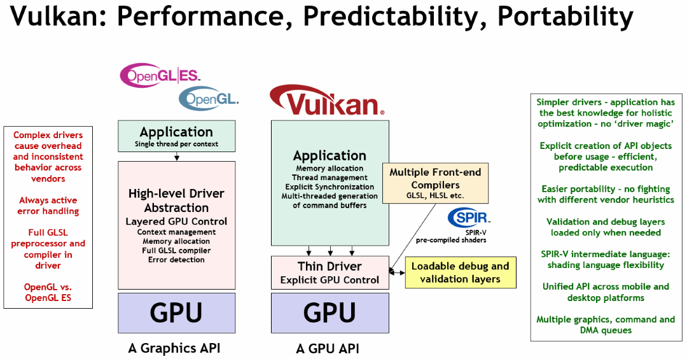

[vulkan_basics](https://github.com/KhronosGroup/Vulkan-Samples/blob/main/samples/vulkan_basics.adoc)

[Vulkan Documentation Project](https://docs.vulkan.org/guide/latest/index.html)

Vulkan 是 3D 渲染 API。它是一个低级别 API，旨在通过设备驱动程序提供的最小抽象级别向应用程序开发人员公开 GPU。这使 Vulkan 应用程序具有更低的 CPU 开销、更低的内存占用和更高的性能稳定性。与 OpenGL ES 相比，抽象级别降低将更多的责任推给了应用程序开发人员。

Graphics 硬件加速图形应用、Compute 并行计算、Ray Tracing 光线追踪、Video 硬件加速解码、Machine Learning